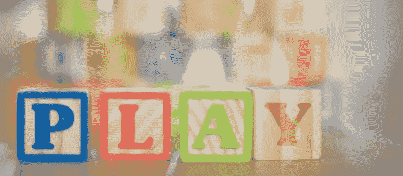
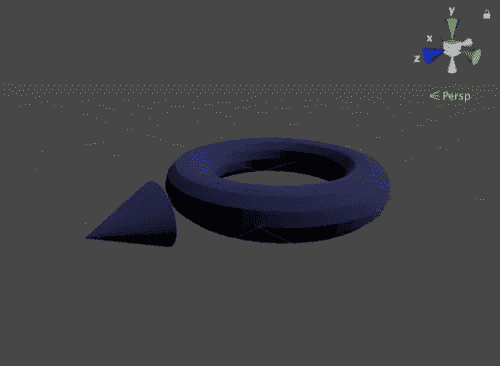
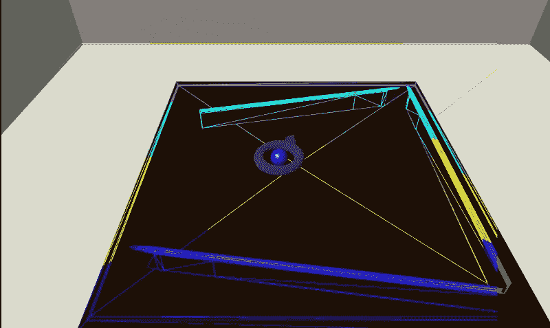
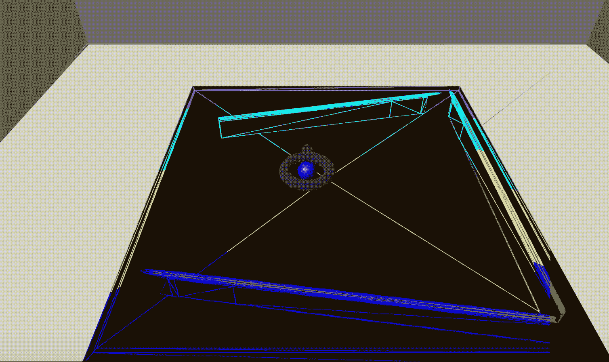

# 我的第一个“真正的”Magic Leap 项目:第 5 部分

> 原文：<https://medium.com/coinmonks/my-first-real-magic-leap-project-part-5-c65f137e7f61?source=collection_archive---------5----------------------->

我们实现*目标*和*动作*模式；一路重构语句。

本文是从 [*开始的系列文章的一部分，我的第一个“真正的”Magic Leap 项目:第 1 部分*](/@johntucker_48673/my-first-real-magic-leap-project-part-1-de047aeaa65) 。

本文的完整应用程序可以从 bounce 存储库的 [*part5*](https://github.com/larkintuckerllc/bounce/tree/part5) 分支下载。

**重新重构**

在上一篇文章中，我们通过在 *MLSpatialMapper2* 中创建对 *MeshingZone* 的引用，避免了对快速变化的值使用全局状态，例如*meshing zone*的位置/比例。

当我第二次使用这种模式时，已经感觉我要以 spagetti 代码结束了。因此，我转而使用类*全局*的静态属性来共享全局状态(一个简化的全局状态)。这是针对不需要观察者模式的全局状态，即不需要主动更新。对于需要主动更新的全局状态，我继续使用类似 *Redux* 的模式，例如*模式*。

*资产/商店/全球. cs*

然后我们使用简化的全局状态:

*Assets/Table/mlspatialmapper 2 . cs*

**3D 建模工具(Blender)**

当我去构建游戏目标来瞄准球时，我决定我需要一个比 Unity 更复杂的形状。这是我了解 3D 工具，尤其是 [*Blender*](https://www.blender.org/) 的时候。

虽然 *Blender* 有自己陡峭的学习曲线，但 I fairy 很快建立了一个模型，我将其导入到 *Unity* 中，作为瞄准的游戏对象。

**注意**:当颜色正确时；我没有得到匹配现有游戏对象的平滑度；可能会花更多的时间来得到这个正确的。

**目标和动作**

在 *Aim* 模式下，用户使用控制器上的触摸板(左右)旋转 *Aim* 游戏对象以指示稍后发射球的方向。

将 *touchX* 重构为简化的全局状态后，控制 *Aim* 游戏对象的方向变得相当容易。同时，我们使用可观察的模式来触发*模式*的更新。

*资产/表格/目标. cs*

瞄准球后，用户用右手做 *Ok* 手势，向选定的方向发射球。

观察结果:

*   正如预期的那样，球从从块映射的第一个网格反弹
*   但是..球穿过从块映射的第二个网格；我的假设是，这是因为我们没有“绕着桌子走”来网格化所有的面。就像一个基本的*统一* *平面*游戏对象一样，网格对象不会在它们的背面碰撞。

**下一步**

我们总结了这个系列，重点是构建用户界面(UI)元素(得分等)。)在下一篇文章中: [*我的第一个“真正的”魔法飞跃计划:第 6 部分*](/@johntucker_48673/my-first-real-magic-leap-project-part-6-7efd62b7a6e5) 。