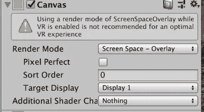
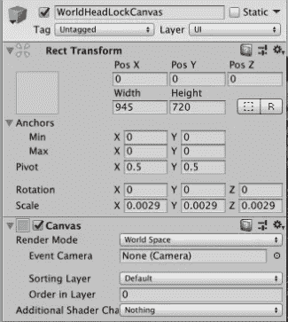

# 我的第一个“真正的”Magic Leap 项目:第 6 部分

> 原文：<https://medium.com/coinmonks/my-first-real-magic-leap-project-part-6-7efd62b7a6e5?source=collection_archive---------5----------------------->

## 我们通过构建一个显示模式和乐谱的锁头用户界面来结束这个系列。

本文是从我的第一个“真正的”Magic Leap 项目开始的系列文章的一部分:第一部分 。

本文完成的应用程序可以从 bounce 资源库的 [*part6*](https://github.com/larkintuckerllc/bounce/tree/part6) 分支下载。

**头锁内容(硬)**

与我们如何使用用户的头部姿势(相机位置和方向)将球放在桌子上类似，我们将类似地定位用户界面元素(当前模式和分数)。

**注**:这里的方法大致是受 *Magic Leap* 文章、 [*与头锁内容 Unity Edition*](https://creator.magicleap.com/learn/tutorials/interacting-with-head-locked-content-unity-r-version) 交互的启发。

需要注意的是 *Magic Leap* 不支持相对于屏幕渲染 *UI 画布*，正如你从警告中看到的。

相反，我们把它渲染到*世界空间*。

对于在用户前方放置 *UI 画布*的最佳距离，我根据车辆平视显示器上的文章猜测是 2.5 米。

通过反复试验(使用模拟器和一个立方体)，我得出结论，一个 2.5 米的物体的最大可见尺寸是 2.3 米乘以 1.7 米。说明了许多人评论的视场(FOV)限制。

至于 *UI 画布*的像素分辨率，我做了一些*互联网*的研究，得出的结论是 *Magic Leap* 硬件的最大分辨率为 720p(或 1280×720 像素)。

通过计算和反复试验，我们将使用的分辨率为 945×720 像素，比例为 0.0029。

考虑到这一点，我们用以下设置创建了 *UI 画布*:

用下面的脚本。

*资产/表格/ WorldHeadLockCanvas.cs*

使用这种配置， *UI 画布*立即跟踪头部姿态(摄像机位置和旋转)。

**头锁内容(软)**

大量借鉴了 *Magic Leap* 的文章，我们更新了脚本，让 *UI 画布*平滑地跟随头部姿势。

*Assets/Table/worldheadlockcanvas . cs*

观察结果:

*   使用*扳手*(而不是*移向*或*扳手*)使位置和旋转容易进出(震动较小)
*   图示的头部运动不真实；使用模拟器有其局限性

**模式**

用当前模式更新文本游戏对象很简单。

*资产/表格/模式界面. cs*

**得分**

类似地，我们可以将一个新的全局分数连接到一个文本游戏对象中。然后我们可以增加球上碰撞的分数。

*Assets / Table / Ball.cs*

观察结果:

*   一个有趣的问题是，由于网格由许多三角形组成，看似简单的块碰撞会导致大量的碰撞报告

**总结**

虽然我们最终没有开发出令人兴奋的酷炫应用，但我们确实在 Unity 中编写 Magic Leap 应用时遇到并解决了许多实际问题。

希望这对你有帮助。