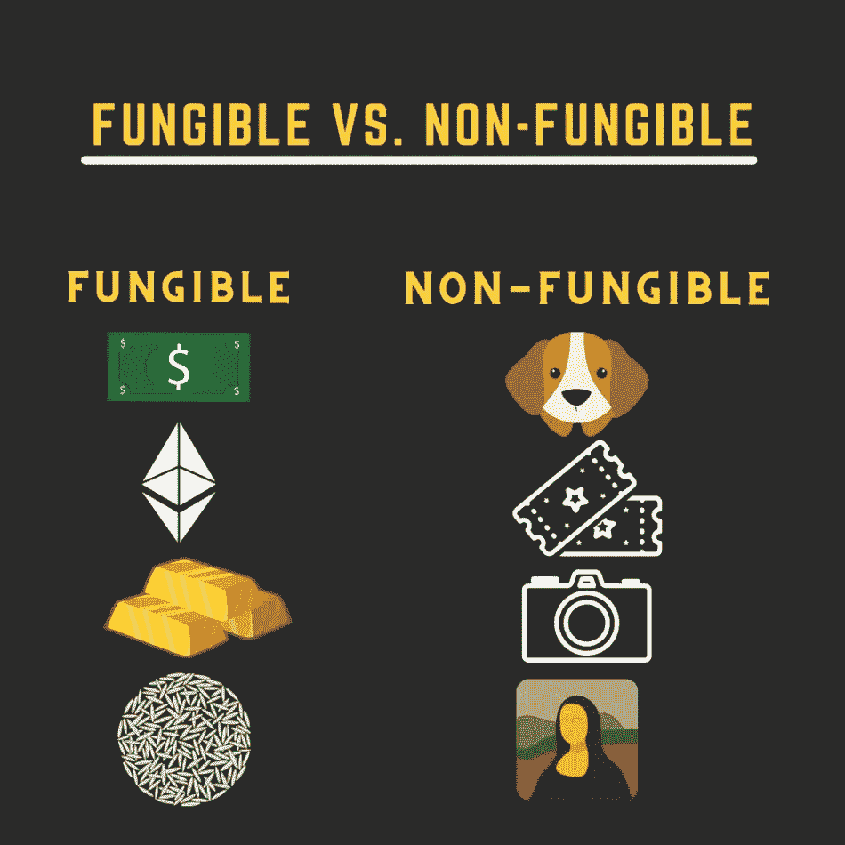
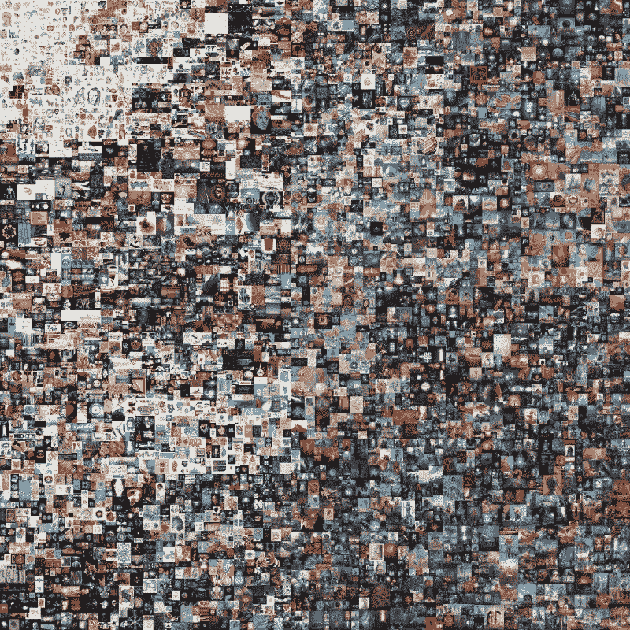

# 我的朋友们一开始不理解 NFTs，但后来我告诉他们这个…

> 原文：<https://medium.com/coinmonks/my-friends-didnt-understand-nfts-at-first-but-then-i-told-them-this-2d7351326b2d?source=collection_archive---------5----------------------->

我将尽可能用最基本的术语来描述什么是 NFT。

NFT 代表不可替代的令牌。

可替换的意思是某物可以被交换或替代，并且价值不变。它可以像美元、黄金、赌场筹码、比特币、以太坊或常旅客忠诚度积分一样互换。

如果我借给你 10 美元现金，你还我两张 5 美元的钞票，我不会介意，因为尽管它们不同，但它们的总价值是一样的。

因此，不可替代性显然意味着它是一种不可替代的资产。它有独特的属性，使其不同于同一资产类别中的其他东西。比如一幅画、一张电影票、一栋房子、一个视频游戏皮肤、一个商标或一只 CryptoKitty，这是 2017 年在区块链以太坊上起飞的第一个真实用例。

这些资产有些是有形的，有些是数字的，有些是无形的。所以 NFT 是不可替代的令牌。“令牌”是指存储在称为区块链的安全分布式数据库中的数字证书。NFT 是数字资产。在区块链上认证的可公开验证的知识产权。

目前浏览各种 NFT 的一个热门地方是在[https://opensea . io](http://opensea.io)，【https://rarible.com/】T5，[https://solsea.io/](https://solsea.io/)

那么，哪些是有史以来卖的最贵的？让我们找出答案。

## ****1。前 5000 天——6900 万美元****

**[第一个 5000 天](https://onlineonly.christies.com/s/beeple-first-5000-days/overview/2020?sc_lang=en)是由资深数字艺术家和平面设计师 Mike Winkelmann(又名 Beeple)制作的数字艺术拼贴画。温克尔曼从 2007 年 5 月开始创作拼贴画，13 年来每天都在不断地张贴艺术作品。**

****

## ****2。CryptoPunk # 3100——758 万美元****

**密码朋克是由被称为朋克的人形角色的 8 位图像组成的收藏品；每个都有独特的特征。CryptoPunks 系列是以太坊区块链有史以来最早的收藏品系列之一，它甚至启发了 ERC-721 标准的发展，该标准今天被大多数 NFT 广泛使用。朋克#3100 是一件极其罕见的作品，因为它是“外星人”类型之一，在 10000 个密码朋克中只有 9 个。这个角色罕见的另一个原因是它的发带，因为只有 405 个其他朋克佩戴这个饰品。**

****

## ****3。CryptoPunk # 7804——757 万美元****

**[朋克#7804](https://twitter.com/cryptopunksbot/status/1369812648288804865) 是 CryptoPunk 系列的另一款 NFT，几乎与#3100 在 2021 年 3 月同时售出。又是一个外星朋克，极其罕见。此外，它还佩戴了 3 个配件，包括烟斗、帽子和太阳镜。注意，只有 378 个朋克使用烟斗，只有 254 个戴帽子，只有 317 个戴小墨镜。**

**这件收藏品的价格约为 4，200 埃特，当时价值 7，566，173.88 美元。**

****

**感谢您的关注！**

> **加入 Coinmonks [电报频道](https://t.me/coincodecap)和 [Youtube 频道](https://www.youtube.com/c/coinmonks/videos)了解加密交易和投资**

## **也阅读**

** [## 杠杆代币[多头代币]终极指南

### 杠杆化令牌是具有杠杆化风险敞口的 ERC20 令牌，不考虑保证金、要求、管理…

medium.com](/coinmonks/leveraged-token-3f5257808b22)  [## 最佳加密交易所| 2021 年十大加密货币交易所

### 编辑描述

blog.coincodecap.com](https://blog.coincodecap.com/crypto-exchange)  [## 2021 年最佳加密借贷平台| 6 大比特币借贷平台

### 获得比特币和其他加密货币的最佳贷款利率

medium.com](/coinmonks/top-5-crypto-lending-platforms-in-2020-that-you-need-to-know-a1b675cec3fa)  [## 2021 年最佳免费加密交易机器人

### 2021 年币安、比特币基地、库币和其他密码交易所的最佳密码交易机器人。四进制，位间隙…

medium.com](/coinmonks/crypto-trading-bot-c2ffce8acb2a)  [## 最佳 4 个加密交易信号电报通道

### 这是乏味的找到正确的加密交易信号提供商。因此，在本文中，我们将讨论最好的…

medium.com](/coinmonks/best-crypto-signals-telegram-5785cdbc4b2b)  [## 5 个最佳社交交易平台[2021] | CoinCodeCap

### 编辑描述

blog.coincodecap.com](https://blog.coincodecap.com/best-social-trading-platforms)  [## BlockFi 评论 2021:利弊和利率| CoinCodeCap

### 编辑描述

blog.coincodecap.com](https://blog.coincodecap.com/blockfi-review)  [## 如何在印度购买比特币？2021 年购买比特币的 7 款最佳应用[手机版]

### 如何使用移动应用程序购买比特币印度

medium.com](/coinmonks/buy-bitcoin-in-india-feb50ddfef94)  [## 加密税务软件——五大最佳比特币税务计算器[2021]

### 不管你是刚接触加密还是已经在这个领域呆了一段时间，你都需要交税。

medium.com](/coinmonks/best-crypto-tax-tool-for-my-money-72d4b430816b)  [## 存储比特币的最佳加密硬件钱包[2021] | CoinCodeCap

### 编辑描述

blog.coincodecap.com](https://blog.coincodecap.com/best-hardware-wallet-bitcoin)  [## Pionex 评论 2021 |免费加密交易机器人和交换

### Pionex 是为交易自动化提供工具的后起之秀。Pionex 上提供了 9 个加密交易机器人…

medium.com](/coinmonks/pionex-review-exchange-with-crypto-trading-bot-1e459d0191ea)**