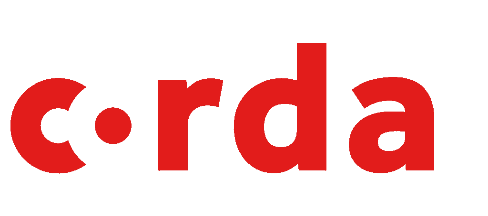

# 我的 Corda 区块链之旅

> 原文：<https://medium.com/coinmonks/my-journey-with-the-corda-blockchain-366269c52ce1?source=collection_archive---------0----------------------->

[Image source](https://www.corda.net)

最近，有人问我是否可以帮助实现一个基于区块链技术的原型。其想法是构建一种新型的文档管理系统(DMS ),可用于在公司或业务部门之间安全地共享法律文档。我以前从未听说过 Corda 平台，并对此持怀疑态度。所以我钻研它，试图理解[的关键概念](https://vimeo.com/album/4555732)，然后开始编码。现在，我想分享一下我在这一过程中的一些感悟:

## Corda 是一种分布式分类帐技术

在比特币这样的区块链中，所有分类账条目都是公开的，因此任何有权访问分布式分类账的人都可以随时对其进行验证。使用了加密功能，因此分类账不能被篡改。

Corda 和区块链都基于分布式账本技术(DLT)，但有一个微妙的区别:在 Corda 中，你只能看到那些你作为参与者需要知道的账本条目。这增加了隐私，因为即使区块链的参与者是匿名的，仍然有可能使用大数据分析或机器学习算法来获得某些信息。严格地说，Corda 不是区块链，尽管它有许多共性。

## Corda 有智能合同

以太坊中的智能合约由状态和行为组成。因此，它们类似于面向对象编程中的对象。Corda 中的合同则不同，它们主要验证交易是否有效，因此可以提交到 Corda 分类账中。Corda 契约是无状态的验证函数。

## Corda 是开源的，用 Kotlin 实现

我突然想到:在 Apache 2 许可下，Corda 平台[可以在 GitHub](https://github.com/corda/corda) 获得。该项目正在积极开发中，并有相当的社区。Corda 背后的驱动公司是 R3，这是一个有许多顶级金融机构支持的国际财团。瓦特？

现在他们选择了 Java 平台和 Kotlin 作为他们的主要编程语言。Gradle 作为构建工具，IntelliJ IDEA 作为 IDE。哇，我从没见过这么大规模的项目是这样设置的！

Corda 中的解决方案实现为 Corda apps，简称 CorDapps。也有许多[示例 cordapp](https://www.corda.net/samples)存在。他们真的帮助实现了我自己的 CorDapp。

还有许多[开发文档](https://docs.corda.net)存在，它们对 [Slack](https://cordaledger.slack.com) 有很好的支持。

## Corda 不是轻量级的，需要进一步优化

主要的不利因素是 Corda 目前是相当重量级的。这让我想起了具有巨大周转时间的大型遗留 Java EE 应用服务器。

Corda 团队的意图是好的:该平台由一系列复杂的技术组成，如应用服务器功能、消息引擎、工作流管理器和数据库，这些都是从开发人员那里抽象出来的，以便获得良好的开发人员体验，正如这篇[博客文章](https://www.r3.com/blog/2017/12/04/corda-is-the-future-of-enterprise-software/)中所指出的。

然而，有好的抽象和坏的抽象。我对嵌入式网络服务器不满意。我不能正确地实现我的用例，不得不用另一个用例替换它，这花了我相当多的时间。幸运的是，还有一个来自 R3 开发团队的[样本](https://github.com/joeldudleyr3/spring-observable-stream)。我的选择是 Spring Boot，因为这些人真的做得非常出色:他们在保持灵活性的同时获得了正确的抽象。

总之，我能够展示 Corda 平台可以用来实现我被要求原型化的用例。然而, [ThoughtWorks Tech Radar](https://www.thoughtworks.com/de/radar/platforms/corda) 也指出了开发者体验可以改善。我还想知道他们为什么不利用 Spring 平台，因为 Spring 是非常模块化的，具有正确的集成抽象，并且具有优秀的 Kotlin 支持。

> [直接在您的收件箱中获得最佳软件交易](https://coincodecap.com/?utm_source=coinmonks)

Corda 作为一个平台很有前途，它在未来会如何发展还有待观察。

Click to read more stories on Corda