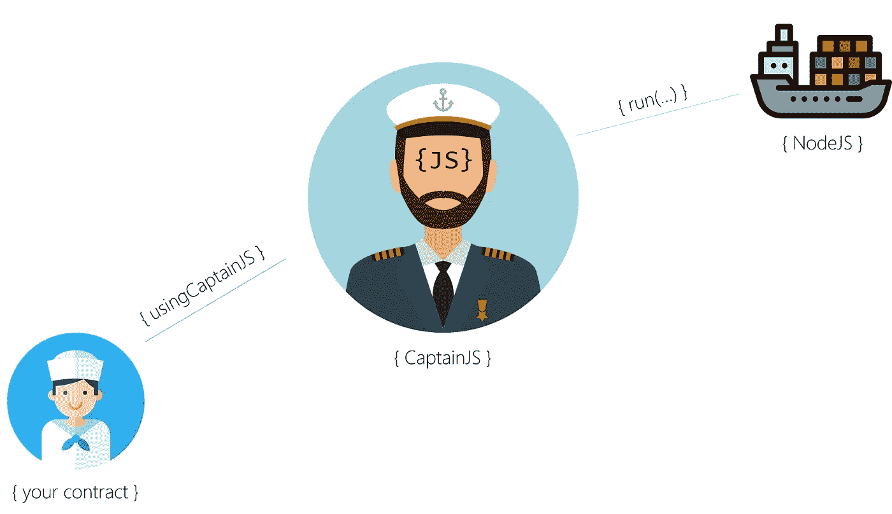

# 我用以太坊写的智能合约异步交易模式

> 原文：<https://medium.com/coinmonks/my-pattern-for-async-transactions-of-smart-contracts-written-in-ethereums-solidity-8b44008fe708?source=collection_archive---------5----------------------->

许多在开发 Solidity 之前实现了 Java、Go、Python…的开发人员感觉像是开着 DeLorean 回到了 80 年代末。坚固是坚固的，但非常有限。神谕长大了，永远留了下来。因此，异步可靠性合同是真实的。这是我的模式…

我将使用名为#ScriptIt 的 [**船长节点 oracle 用于以下用例:**](https://link.medium.com/Ff82rMqCcT)

*   新用户获得 256 分
*   对于每个新的呼叫，用户的点数将减少 log2



the captain will run your NodeJS calls directly from Solidity in a Docker container and return the result back to your contract

# 智能合同

异步联系人将从包含异步调用和回调功能的`usingCaptainJS`派生。

为了在回调发生时记住异步调用，你需要一个`JobCounter`和一个`mapping`的任务 id 和发送者的地址:

```
uint JobCounter = 0;
mapping (uint => address) JobToSenderMap;
```

# 这些事件

以太坊中的 a 同步交易是*待定*，然后*失败*或*成功* (ful)。异步事务需要发出事件来通知用户事务是挂起、成功还是失败。

因此，您定义了三个这样的事件，每个事件至少应该包含发件人的地址:

```
event **GetPoints_Success**(address Sender, uint Points);
event **GetPoints_Pending**(address Sender);
event **GetPoints_Failed**(address Sender, string ErrorMsg);
```

# 该功能

以太坊的默认模式是每个用户调用一个契约函数，并支付在一个同步事务上下文中执行代码所需的费用。

但是现在我们有了异步事务上下文。这意味着在同步功能调用终止后将需要额外的气体。

因此，您的功能必须是`payable`，并且您的第一项检查必须是验证用户转移了足够的额外气体:

```
uint GasRequired = DEFAULT_GAS_UNITS * tx.gasprice + 70 szabo;require(**msg.value >= GasRequired**, "please send some extra gas...");
```

在这个演示用例中，我们将需要在`usingCaptainJS`中定义的默认天然气单位乘以当前交易天然气价格，再加上 70 Szabo 的交易费(船长需要向执行 mathjs 调用的集装箱船支付这笔费用)。

一旦确定用户已经转移了足够的气体，你可以根据 GitHub 上船长的描述调用 mathjs 的 log2 函数:

```
**Run**(
  JobCounter,      
  **concat**("math:log2(",**uintToString**(PointsPerUser[msg.sender]), ")"),
  "", "", 1, DEFAULT_GAS_UNITS, tx.gasprice
);emit **GetPoints_Pending**(msg.sender);
```

在调用`Run(...)`之后，您必须`emit`处理*未决的*事件。如果调用`Run(...)`失败，同步调用将失败。

# 复试

一旦队长计算出用户积分的 log2 值，他将通过调用`CaptainsResult`函数将结果发送回您的合同。通过添加`onlyCaptainsOrdersAllowed`确保只有机长在调用该功能。

确保`emit`功能结束时的*成功*事件。

```
function **CaptainsResult**(uint JobCounter, string Log2Result) external onlyCaptainsOrdersAllowed {
  *// the return of the async call* address sender = JobToSenderMap[JobCounter];
  uint Points = **StringToUint**(Log2Result); PointsPerUser[sender] = Points;
  emit **GetPoints_Success**(sender, Points);
}
```

如果队长无法调用您提交的代码(可能您的 JavaScript 代码中有一个错别字)，他将通过调用您合同中的`CaptainsError`函数来通知您。

确保在函数结束时`emit`*失败*事件。

```
function **CaptainsError**(uint JobCounter, string ErrorMsg) external onlyCaptainsOrdersAllowed {
   *// the return of the async call* address sender = JobToSenderMap[JobCounter];
   emit **GetPoints_Failed**(sender, ErrorMsg);
}
```

就是这样。

更新@[https://twitter.com/captainjs_v2](https://twitter.com/captainjs_v2)

坚固性代码@[https://github.com/CaptainJavaScript/Solidity](https://github.com/CaptainJavaScript/Solidity)

客户端测试代码@[https://github.com/CaptainJavaScript/Seaman-Client](https://github.com/CaptainJavaScript/Seaman-Client)

下面是完整的代码:

```
pragma solidity ^0.4.25;import "./usingCaptainJS_v2.sol";contract **AsyncPattern** is usingCaptainJS {*// to identify async calls* uint JobCounter = 0;
mapping (uint => address) JobToSenderMap;*// demo use case: points per sender* mapping (address => uint) PointsPerUser; event **GetPoints_Success**(address Sender, uint Points);
event **GetPoints_Pending**(address Sender);
event **GetPoints_Failed**(address Sender, string ErrorMsg);function **GetPoints**() public payable {
 *// make sure to have enough gas for the async callback* uint GasRequired = DEFAULT_GAS_UNITS * tx.gasprice + 70 szabo;
 require(msg.value >= GasRequired, "please send some extra gas..."); *// remember this call* JobToSenderMap[++JobCounter] = msg.sender;
 *// now do the math - but mix async + async...
 // every user has 256 points at the beginning and with every next
 // call it is log2 of his points* if(PointsPerUser[msg.sender] == 0) {
   *// first call!* PointsPerUser[msg.sender] = 256;
   emit **GetPoints_Success**(msg.sender, 256);
 }
 else {
   *// every other call* **Run**(
    JobCounter, **concat**("math:log2(", **uintToString**(PointsPerUser[msg.sender]), ")"),
    "", "", 1, DEFAULT_GAS_UNITS, tx.gasprice
   ); emit **GetPoints_Pending**(msg.sender);
  }
 } function **CaptainsResult**(uint JobCounter, string Log2Result) external onlyCaptainsOrdersAllowed {
  *// the return of the async call* address sender = JobToSenderMap[JobCounter];
  uint Points = **StringToUint**(Log2Result);
  PointsPerUser[sender] = Points;
  emit **GetPoints_Success**(sender, Points);
 } function **CaptainsError**(uint JobCounter, string ErrorMsg) external onlyCaptainsOrdersAllowed {
  *// the return of the async call* address sender = JobToSenderMap[JobCounter];
  emit **GetPoints_Failed**(sender, ErrorMsg);
 }}
```

> [直接在您的收件箱中获得最佳软件交易](https://coincodecap.com/?utm_source=coinmonks)

[](https://coincodecap.com/?utm_source=coinmonks)