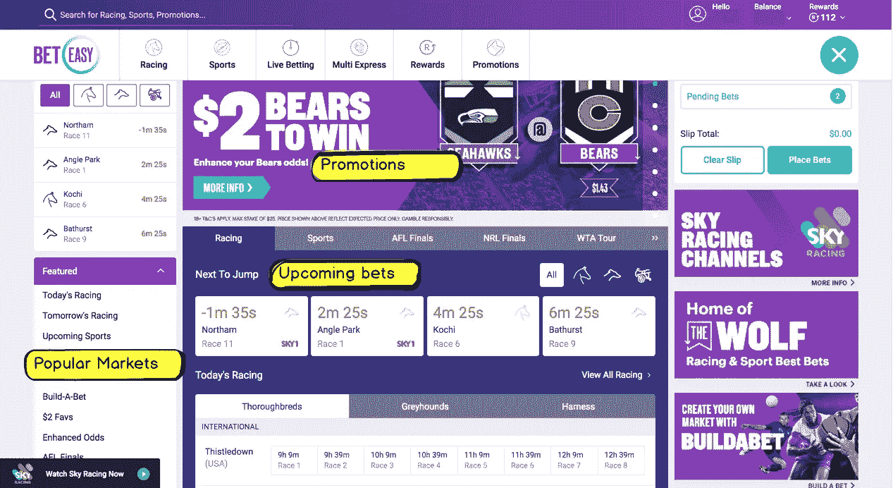
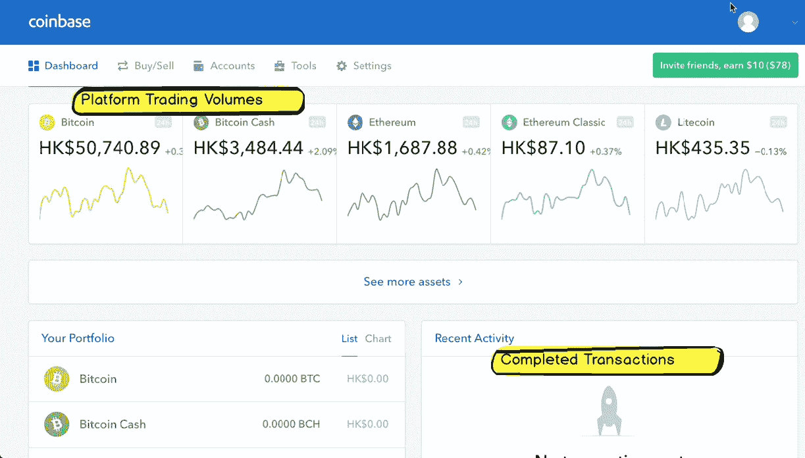
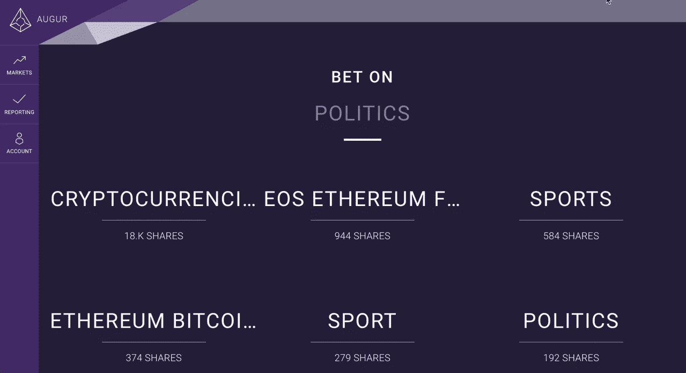
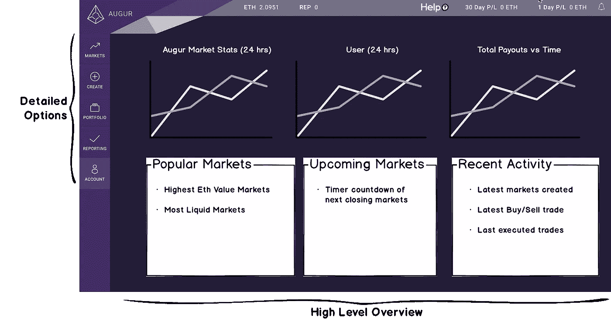
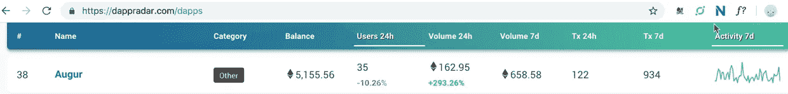

# 我的简单预言 UI 改进

> 原文：<https://medium.com/coinmonks/my-simple-augur-ui-improvements-51e0339d51c1?source=collection_archive---------4----------------------->

## 让我们在 Augur 上获得更多的用户！

几周前，我写了一篇关于为什么人们不使用占卜的文章，并获得了相当多的关注。我决定继续查看一下 Augur 平台，看看有哪些小的改进。

在花了一些时间阅读说明和观看 youtube 教程后，我终于能够在占卜上进行我的第一次下注/交易。

Augur 是一个预测平台，结合了**下注**和**交易的概念。**因为卜筮是同类中的第一个，这个平台可能会相当混乱。简单来说，我认为占卜的概念可以概括为:

> Augur 是一个允许创建任何类型的市场的平台。**市场**必须提出一个问题，这个问题可以用**是或否**来回答。然而，是和否都有概率分配给它们，以保证结果发生的可能性。
> 
> 关于预兆 a **是=买入**和**否=卖出**

举个例子，我在市场上打赌:

*乙醚(ETH)的价格在 2018 年第三季度(9/30)收盘时是否会超过 300 美元*

我相信答案是否定的，有 80%的可能性会发生。因此我不得不把交易的

*限价出售= 0.8*

奇怪的是，同样的交易可以表示为**有 20%的可能性发生。**意为贸易可以看起来像:

*是，限价= 0.2*

让事情更加混乱的是，我的赌注/交易甚至还没有执行。我刚把它放在**订单簿里。必须有其他人来接受我的提议，让它得以执行。之后的结果将于 2018 年 9 月 30 日揭晓。在那之前我的以太是托管的。**

我毫不惭愧地说，我花了 1 个多小时才达到这个用户体验水平，我仍然对这个平台没有信心。然而，我仍将坚持下去。

# 与类似平台的比较

我看了看我用来赌博和交易的一些平台。因为我只想完成一个简单的练习，所以我只查看了每个平台的主页。

# 博彩平台

main page of beteasy.com.au

第一次登录博彩平台时，他们都倾向于显示一些常见项目:

*   **特别促销**
*   **即将到来的赌注**
*   **热门市场**

目的是让人们在热门市场上快速下注变得更有吸引力、更容易。

# 交易平台

Coinbase main page

加密货币交易所在其主页上也有共同的项目:

*   **一段时间内平台交易量**
*   **最近完成的交易**

就像赌博平台一样，你可以通过显示的数据快速判断出哪些是热门市场。人们倾向于坚持流行的东西，所以让人们容易看到最具流动性的市场。

# 可能的变化预示着

我相信有一些简单的变化，可以作出的占卜主页，可能会鼓励更多的投注发生在平台上。通过整合传统**博彩**和**交易**平台的功能。

## 当前预测器设计

占卜主页有一个简单干净的设计，但也许它太简单了。

很难看到各种各样的可用市场。该网站也没有响应。

## 我对占卜的标记

我在主页上做了一些改动，我相信很多人已经熟悉了。

**详细选项—** 左手边的菜单很好，因为我知道我可以通过选择这里的各种项目来扩展选项。

一个问题是，你首先需要进入**账户**并连接到钱包。我认为这一步可能是登录过程的一部分。

**高级概述—** 主页其余部分的房地产应致力于呈现各种市场数据，以鼓励用户在市场上进行交易。

**帮助** —一个链接，将用户指向各种关于如何使用该平台的在线教程。这个平台不是很直观，所以在这里放置一个链接可能是大多数用户所期望的。我首先寻找的是一个帮助部分。

**预测市场统计-** 该平台通过智能合约在以太坊上运行，因此所有的使用统计数据都已经公开。dappsradar 网站已经很好地展示了所有 dapp 的分类。相同的数据可以在占卜中显示。

stats of Augur from dappradar

**用户**——向用户保证其他人也在使用这个平台。可以细分为过去 24 小时内有多少用户在 Augur 上交易。

**总支出-** 有效吗？有多少人真的通过赌占卜赚了钱？把总支出数字显示出来。

**热门市场-** 哪些市场流动性最强，哪些市场收益最高？我更有可能押注于这些，而不是试图在众多市场中导航。

即将到来的市场- 我可能不想等这么久才看到结果。哪些市场很快就要结束了，这样我就可以最快得到回报，而不会耽搁太久。

**近期活动-** 别人在赌什么可能不是我打算赌的。我可能会受其他人的选择影响，下更多的赌注。

第三方网站，如 https://predictions.global 有所有这些有用的数据，但它们可以很容易地集成到主 augur UI 中。当使用官方的 Augur 接口时，会有一定程度的信任。

# 最后的想法

Dapp 的开发仍处于早期，Augur 已经有了一个更复杂的 Dapp。很难成为这个领域的先行者，我们应该感谢奥格团队走到了这一步。

我确信，预测市场平台的未来将与它们目前的形式大不相同。只有通过用户的使用和反馈，我们才能看到 Dapps 的进一步发展。

如果你投资以太，那么你就是以太坊的众多拥有者之一。Dapps 的成功和广泛采用会直接影响您的投资。可以通过使用 Augur 等平台来帮助。

> [在您的收件箱中直接获得最佳软件交易](https://coincodecap.com/?utm_source=coinmonks)

