# 我的智能冒险:8 个月的研究和有利可图的投资

> 原文：<https://medium.com/coinmonks/my-smartbch-adventure-8-months-of-research-profitable-investments-40673f3e1285?source=collection_archive---------4----------------------->

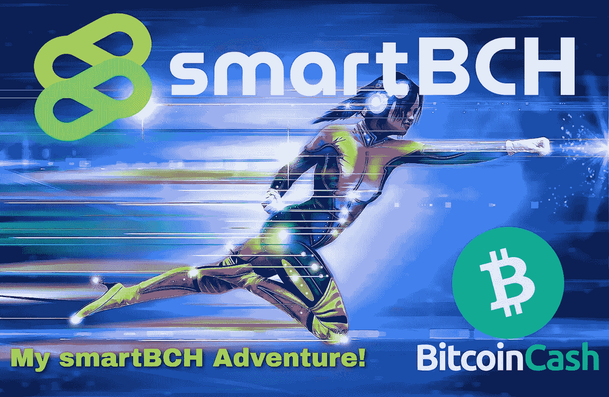

*Image from:* [*Pixabay*](https://pixabay.com/tr/illustrations/s%c3%bcper-kahraman-k%c4%b1z-h%c4%b1z-ko%c5%9fucu-534120/)*, modified*

SmartBCH 最近越来越红了！这是为数不多的具有巨大潜力的智能合同网络之一。

比特币现金生态系统的巨大飞跃，为智能合约领域和加密经济领域(如 NFTs、Dapps 和 DeFi)带来了新的机遇。

70，000 名 BCH 目前被锁定在 smartBCH，随着新项目、投资者、开发商和艺术家的加入，这个数字肯定会增加。

在网络上线的几个月里，开发人员正在构建基础设施、服务和项目，社区正在快速发展。SmartBCH 包含所有加密领域，提供低费用和高交易速度，增加了比特币现金的整体网络效应。

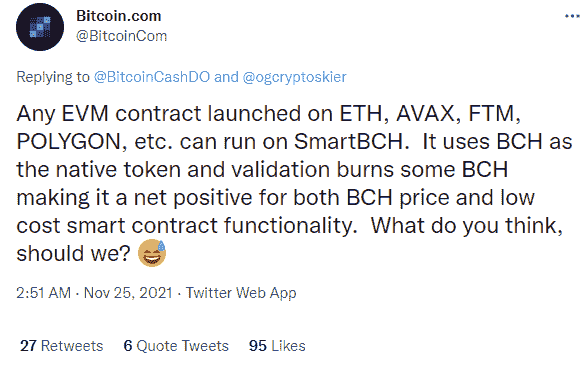

[*Twitter*](https://twitter.com/BitcoinCom/status/1463671637501374465)

与其他以太坊侧链不同，SmartBCH 不使用本地令牌，而是使用**比特币现金**。发现 smartBCH 潜力但不想加入 DeFi/NFT 生态系统的投资者在 BCH 建仓。

# 智能宇宙的起源

[*Pexels*](https://www.pexels.com/photo/photo-of-woman-wearing-turtleneck-top-2777898/) *(modified)*

我与 smartBCH 的冒险始于 2021 年 3 月，当时我第一次读到 Moeing Chain，这是在改用 smartBCH 之前的一个临时名称。它立即引起了我的注意，因为我以前使用过各种兼容 EVM 的区块链，从那以后我开始密切关注它的发展。

这个消息已经让比特币现金社区兴奋不已。

两个星期后，我写了一篇文章( [***)关于比特币现金的定义就在这里！***](https://read.cash/@Pantera/defi-on-bitcoin-cash-is-here-e748db64)*2021 年 3 月 22 日)*看了 Marc DeMesel 的一段直播后。聊天中的一些问题提到了比特币现金生态系统中智能合约和 DeFi 的不可用性，并认为需要做出回应。

> [**smart BCH**](https://smartbch.org/#community)**是比特币现金的侧链，兼容 EVM(以太坊虚拟机)和 Web3 API，同时利用 BCH 进行 gas，旨在提供与以太坊 2.0 完全开发后类似的好处。**
> 
> [*——比特币现金上的 DeFi 来了！*](https://read.cash/@Pantera/defi-on-bitcoin-cash-is-here-e748db64)

似乎 smartBCH 的好处甚至在它发布之前就已经存在，每个人都在满怀期待地等待着。

我一直在研究 smartBCH 侧链，跟踪新闻和发展，比如 testnet 阶段和讨论。

我创建了两个指南，准备初学者和有经验的用户，不习惯以太坊和 Metamask。我在各种网络上发表了两篇文章，结果都很棒。它们甚至在谷歌搜索上成为趋势，无论我在哪个平台重新发布(read.cash，Medium，Hive)。

元掩码初学者教程描述了设置元掩码和包括网络的整个过程。当宣布 smartBCH 的设置时，我也添加了它们。

*   [***如何设置元遮罩并添加网络:币安(BSC)、多边形(Matic)、OKEx、SmartBCH —教程***](https://read.cash/@Pantera/how-to-set-up-metamask-and-add-networks-binance-bsc-polygon-matic-okex-smartbch-tutorial-7265e1c4)*(2021 年 7 月 7 日)*

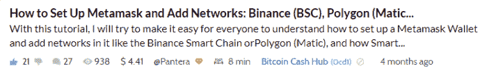

9 月，当 smartBCH 的元掩码设置公布时，我们终于可以将元掩码钱包连接到 smartBCH。一天后，我专门为 SmartBCH 制作了本教程:

*   [***【smart BCH meta mask 教程—连接网络、转移 BCH、添加代币并进行代币交易***](https://read.cash/@Pantera/smartbch-metamask-tutorial-connect-to-network-transfer-bch-add-tokens-and-trade-on-dexs-601f4b17)*(2021 年 9 月 8 日)*

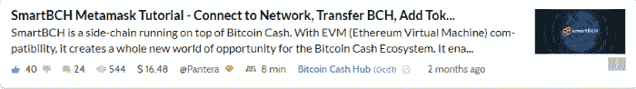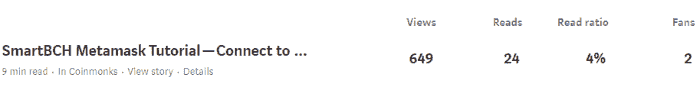

SmartBCH mainnet 于 7 月 30 日推出，元掩码连接的规范在一个月后正式公布。

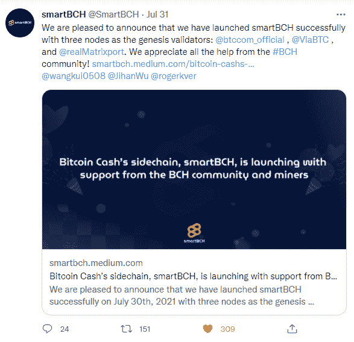

[*Twitter*](https://twitter.com/SmartBCH/status/1421416311037435906)

# 第一个指标和令牌出现了！

SmartBCH 上的令牌化开始了，并且立即出现了第一批令牌！

BenSwap 是第一个 DEX，提供 DeFi 产量农业和赌注，新的代币立即出现并获得领先。**错配**，紧随其后的也是高收益和相当数量的 BCH 被锁定。

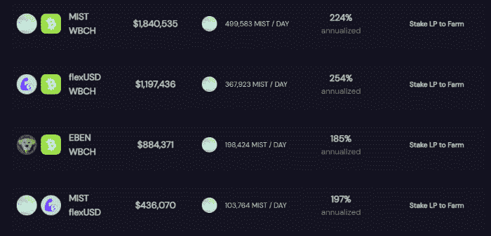

[*MistSwap*](https://app.mistswap.fi/farm)

同样积极的是，大多数这些令牌都是由社区驱动的，并在此开放阶段提供了急需的支持。

[**cashmats**](https://cashcats.org/)是 SmartBCH 上的首批代币之一，并立即受到欢迎，通过各种空投和竞赛向社区成员分发大量代币。现金现金，一个迷因硬币，有了最新的发展，在绿洲市场找到了一个很好的用例。

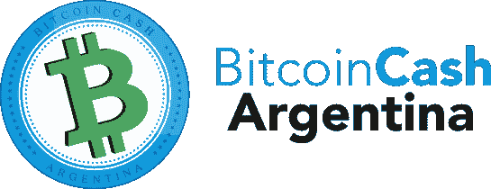

[**比特币现金阿根廷**](https://bitcoincashargentina.com/en/) 和 [**克努特**](https://kth.cash/) ，这两个比特币现金拉丁美洲社区成员的项目，创建了他们的代币( [**ARG**](https://t.me/BCHArgentina) 和 **KTH** )，并开始通过空投的方式分享给社区。在这个阶段，由经验丰富的社区成员开发代币至关重要，比特币现金阿根廷和 Knuth 的新 DEX、[**tango swap**](https://read.cash/@Pantera/my-smartbch-adventure-8-months-of-research-profitable-investments-9fc5d306#bad-link)***的开发值得祝贺。***

DeFi 开始行动，现在我们有五个 dex 在 smartBCH 上提供分散融资，还有两三个正在开发中！

> [***Ben swap***](https://read.cash/@Pantera/my-smartbch-adventure-8-months-of-research-profitable-investments-9fc5d306#bad-link)
> 
> [***错换***](https://read.cash/@Pantera/my-smartbch-adventure-8-months-of-research-profitable-investments-9fc5d306#bad-link)
> 
> 
> 
> *[***TangoSwap***](https://read.cash/@Pantera/my-smartbch-adventure-8-months-of-research-profitable-investments-9fc5d306#bad-link)*
> 
> **

**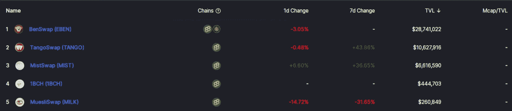**

**[*DeFi Llama*](https://defillama.com/chain/smartBCH)**

****smart BCH DeFi 中的 TVL** (锁定的总价值)也在快速增加，自一个月前以来已经翻了三倍。**

**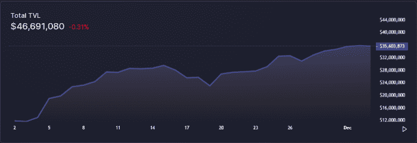**

**[*DeFi Llama*](https://defillama.com/chain/smartBCH)**

**smartBCH 的 DeFi 部分正在经历健康的增长，投机和有机采用有限。用户群的增长正在迅速扩大，我们现在有望获得加密货币市场和投资者的认可。**

**低廉的网络费用是 smartBCH 进一步普及的催化剂。**

****

# **智能 NFT 热潮！**

**NFTs 随后出现在 smartBCH 上，并立即被社区所接受。**

****法律朋克**，一个类似以太坊朋克 NFTs 的项目，是 smartBCH 上的第一个集合。连同 [**池畔河豚**](https://read.cash/@Pantera/poolside-puffers-a-smartbch-nft-art-project-with-a-good-purpose-93fc2ee5) 和**现金猫 NFTs** 目前最受欢迎。**

**法律朋克市场的交易量一直很大，前两个 NFT 以 35BCH 和 33BCH 的 [**创纪录价格**](https://read.cash/@Pantera/lawpunks-nft-sold-for-record-33-bch-smartbch-volumes-spike-0b3ac253) 易手。**

**NFT 销量一直表现突出，锁定在 smartBCH 网络中的 BCH 总量也是如此。**

**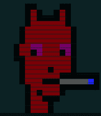**

**法律朋克 NFTs 在价值上迅速增加，目前自铸造阶段以来给出了 1200%的最低回报。**

**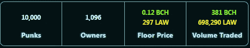**

**OASIS，第一个 smartBCH NFT 本地市场也上线了！**

**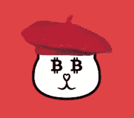**

**也许我们会在河豚 NFT 和 CashCats 上看到类似的行动和交易量。OASIS 将包含所有的 NFT，并且很快将增加排序功能和更多的特性。**

# **它正在发生！**

**我借此机会向 Hive 和 Medium 观众解释了 SmartBCH，并在 Leo Finance 和 PoB 社区发表或转载了我的各种 SmartBCH 帖子。这是我专门为 Hive 写的关于 SmartBCH 的第一批帖子之一:( [SmartBCH:这是关于什么的，为什么我们应该关心？](https://leofinance.io/@pantera1/smartbch-what-is-this-about-and-why-we-should-care))。**

****

**[*Celery*](https://t.me/celeryToken)**

**在我的文章中，我展示了一些不太受欢迎但有潜力的项目。**

**到目前为止，我探索了所有的 dex，我参加了打桩和耕作。我持有各种 SEP-20 代币，但我不想把任何人推入复制交易的境地。我不宣布我的交易的原因之一就是这个。**

**我也尝试过报道有足够潜力的 smartBCH 项目，但没有得到足够的宣传。我觉得至少应该对它们进行彻底的研究和审查。**

****

# **最后**

**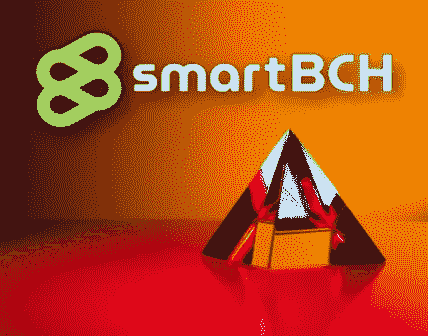**

**[*Source*](https://unsplash.com/photos/ir5gC4hlqT0)**

**SmartBCH 将成为厌倦了高昂以太坊费用和各种区块链无法扩展的开发者和投资者的希望灯塔。**

**投资 smartBCH 提供了超出我预期的投资回报率。**

**然而，我们再一次见证了主流加密媒体对任何与比特币现金相关的事情视而不见，审查发展，以及 [**忽视**](https://read.cash/@Pantera/crypto-news-websites-massive-manipulation-propaganda-censorship-of-bitcoin-cash-071010ae) SmartBCH。**

**也许这暂时也有帮助，但任何领域的先进技术都不可能永远被忽视。**

**随着新项目的出现，我们都试图小心翼翼地进行，因为我们已经有了一些地毯，意识也有所提高。**

****

**Writing at the following websites: ● [ReadCash](https://read.cash/@Pantera) ● [NoiseCash](https://noise.cash/u/Pantera99) ● [Medium](/@panterabch) ● [Hive](https://hive.blog/@pantera1) ● [Steemit](https://steemit.com/@pantera1) ●[Vocal](https://vocal.media/authors/pantera) ● [Minds](https://www.minds.com/pantera99/) ● [Twitter](https://twitter.com/Panterabch) ● [LinkedIn](https://www.linkedin.com/in/panterabch/) ● [email](https://read.cash/@Pantera/localcryptos-p2p-exchange-is-now-offering-bitcoin-cash-trading-06637230#bad-link)**

> ****免责声明**:本内容发布的所有材料均用于娱乐和教育目的，并符合**公平使用准则**。无意侵犯版权。如果您是或代表本文所用材料的版权所有者，并且对所述材料的使用有疑问，请发送 [**电子邮件**](https://read.cash/@Pantera/cryptouknowns-battlegrounds-the-crypto-battle-royal-part-i-0ca762da#bad-link) 。**
> 
> **没有财务建议的意图。DYOR**

*****支持内容创作者。*****

**如果你喜欢这个故事，就订阅吧！**

***最初发布于*[*https://read . cash*](https://read.cash/@Pantera/my-smartbch-adventure-8-months-of-research-profitable-investments-9fc5d306)*。***

****