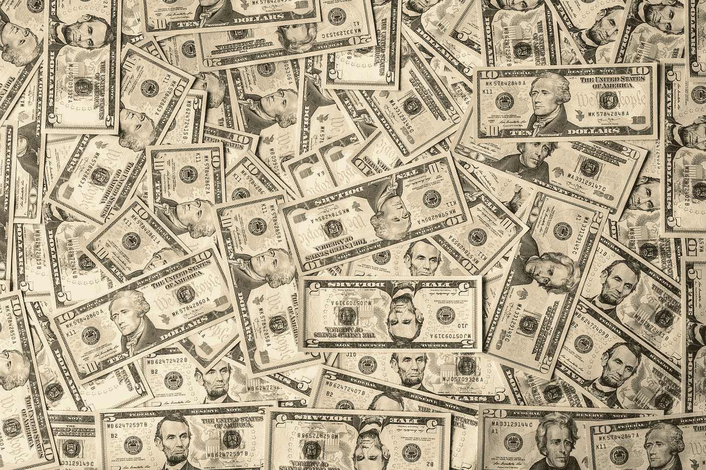

# 我的空房间每月产生 350€

> 原文：<https://medium.com/coinmonks/my-spare-room-generates-350-every-month-c11635cffaa0?source=collection_archive---------3----------------------->

## 以下是你的方法

Photo by [Alexander Schimmeck](https://unsplash.com/@alschim?utm_source=medium&utm_medium=referral) on [Unsplash](https://unsplash.com?utm_source=medium&utm_medium=referral)

我很幸运有自己的房子，还有一间空房。

空间和时间一样，是可以货币化的。例如，我可以把它租出去。但那意味着要和别人分享我的空间。在我生活的大部分时间里，我都住在合租的房子里，这是我再也不想做的事情。我想要我的空间。但是我想把它货币化…