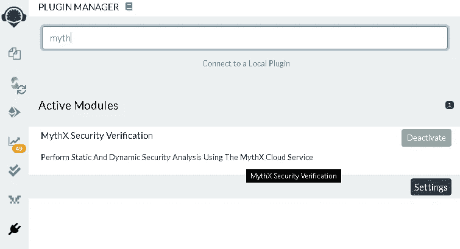
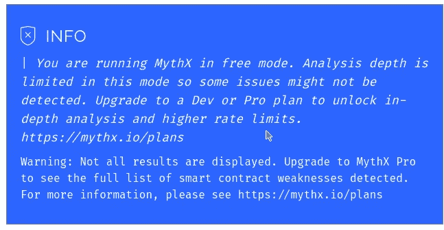

# MythX(Bug 的影子)智能合约分析的符号执行。—工具比较。

> 原文：<https://medium.com/coinmonks/mythx-the-bugs-shadow-symbolic-execution-for-smart-contracts-analysis-tool-comparison-dba2a6841553?source=collection_archive---------3----------------------->

说到智能合约，你不会喜欢用你的代码“玩游戏”。事实上，它将您的业务逻辑置于风险之中。

我们对一些最新工具进行了分析，以帮助您在[符号执行](https://en.wikipedia.org/wiki/Symbolic_execution) &其他技术下增强智能合约的安全性。我们发现 MythX 是智能合约安全的领先选择，因为它快速、直观，并且您可以以各种不同的方式运行它。为您的智能合约提供高风险级别的安全分析性能。


MythX Smart Contracts Analyzer

我们使用“博彩公平游戏”智能合约，因为我们无疑认为这种合约需要高度的安全性，用户总是会争论是否**公平**或**不公平**来“玩”这种特定类型的游戏，因为区块链增加了用户的信任度。我们认为这对我们的分析很重要。这个[契约](https://github.com/molecula451/contracts/blob/master/Dice2Win.sol)免费使用，开源。


Third-Party Fair Games under Ethereum, Can we trust it without analyzing?

我们还使用了一个简单的测试智能契约**(猜测数字)**，我们认为它很有趣，并显示了 MythX 检测智能契约漏洞的准确性。

## **MythX 简易设置:**

选择您的风格开始，您将在不到 30 分钟的时间内运行您的智能合同分析:

**Remix MythX 插件**(最快设置！)
**MythX CLI**(tasty-CLI)
**松露插件**(松露爱好者轻松安装)
**VSCODE Remix Code** (全在一处)

## **可扩展易用语言库:**

*   [**MythXJS**](https://github.com/ConsenSys/mythxjs)**—MythX JavaScript 库。**
*   **[**Python x**](https://github.com/dmuhs/PythX)—MythX 平台的 Python 库。**

**一眨眼就把**myxx 混搭上了**。**

****

**Plugin Manager on Remix**

****

**MythX Security Module on Remix**

## **Remix MythX 插件变魔术:**

**我们发现了一个 [SWC-104 未检查的调用返回值](https://swcregistry.io/docs/SWC-104)，在我们的智能合约测试审计中，该合约被设计为使用必要的回退，但未实现异常处理。可能会导致智能合约出现故障。**

****

**分析可以通过 MythX 仪表板/视图分析部分完全可视化。**

********

**Analysis fully view-able on Dashboard interface.**

**Remix MythX 插件**猜数字:****

**发现一个 [SWC-105](https://swcregistry.io/docs/SWC-105) 无保护乙醚撤出**

**在这个测试中，MythX 发现了一个非常严重的错误，任何人都可以通过执行以下命令从智能合约中耗尽资金:**

```
msg.sender.transfer(ether amount);
```

****

**Analysis report under MythX for Remix**

## **MythX CLI 分析:**

**爱 **MythX CLI** 并与其他工具做了比较，使用此工具安装和使用简单、快捷。**

**我最喜欢使用 **MythX CLI** 的事实是:**

> **“MythX CLI 允许您为单个分析作业(由作业的 UUID 表示)或整个分析组生成 HTML 或 Markdown 报告。对于每个分析，当前状态、输入和检测到的问题的报告都被提取并呈现在模板上。”**

**我们喜欢 HTML，我们喜欢用 HTML 或 Markdown 输出东西！**

**有时候不需要花里胡哨。只需要简单就好！让你的报告采用高质量的 HTML 或 Markdown 格式是最好的方式。**

****

****VSCode MythX 插件**分析:**

**只要转到 VSCode 界面上的扩展面板就足够了。**

****

**Extension panel VSCode**

**在搜索框中输入“MythX”将会找到 VSCode 的官方 **MythX 插件****

****

**Official MythX VSCode Plugin**

## ****MythX 松露:****

**在松露中运行 MythX**

****

**Contract Buildings for Analysis in progress**

**在分析了 MythX 关于块菌产量的报告日志之后。其中包括到仪表板面板和报告 ID 的链接**

****

**Output Analysis using Truffle**

**到目前为止，您已经体验了不同的 MythX 风格，可以准确地分析和调试您的智能契约。虽然。对于不同类型的用户，MythX 有不同的计划版本。选择:**

****免费、开发、专业或企业**计划。每个计划包含不同的功能。请随意选择一个适合您需求的。**

****

**MythX Plan Versioning**

****

**Chainsecurity.com**

**Chainsecurity 在瑞士成立公司。他们为智能合同提供“正式的”审计服务。**

**他们为您提供了一份“正式”表格，以便与他们的一些专家一起审核您的智能合同。**

****

**因此，他们也有一些工具来审计你的合同。**

****

**Securify**

**由智能合同审计顶级提供商 [**ICE center**](http://ice.ethz.ch/) 、瑞士联邦理工学院[**chain security AG**](https://chainsecurity.com/)联合打造。**

**你可以通过他们的 [webapp](https://securify.chainsecurity.com/) 运行 **Securify** 。**

****

**Securify auditing.**

**完成代码审核后，系统会在 UI 上输出一些信息，以及一个链接，供您共享已审核的智能合约。**

****

**Security Security Report**

*   **到目前为止，Securify 仅支持 38 个漏洞。**
*   **您将只能分析大于或等于可靠度 **0.5.8** 的智能合约**
*   ****Securify** 可以通过 Docker 运行**

****VerX**by**链保****

****

**VerX Smart Contract Verifier**

****Chainsecurity** 通过其 [webapp](https://verx.ch/) 为你提供一个小型的 VerX 测试**

****

**VerX by Chainsecurity Test Sample**

**他们有一个标准的 ERC20 令牌合约样本，以及该令牌智能合约的众筹销售和完整概述。**

**你可以运行“验证”，它会在同一个应用程序上输出一个友好的报告。**

****

**VerX Sample results**

**如果我们想要分析我们自己的智能合同，我们需要转到: [**VerX Docs**](http://verx.ch/docs/)**

**他们为你提供了一个 python 客户端，让你分析想要的智能合约。**

**运行 [**VerX 客户端**](http://verx.ch/docs/client.html#usage) :**

**按照他们文档上的说明，您应该能够在很短的时间内运行客户端:**

****

****VerX CLI 工具**返回 JSON 数据分析
**VerX CLI 工具**需要手动部署脚本来预先执行智能合约分析。**

*   **Chainsecurity **没有**提供 Remix 插件。**
*   **Chainsecurity **不**提供 VSCode 插件。**

****

**Manticore Smart Contract Analysis Tool.**

**蝎狮智能合同审计工具设计用于在传统计算环境((x86/64，ARM)以及以太网虚拟机上运行。**

****蝎狮**支持的是 Linux 下的开发者状态。这意味着所有的更新和支持都应该在这个系统下。**

****蝎狮**也为你提供了完整的 Python API 来定制分析脚本**

## **在 Docker 上运行蝎狮 CLI:**

****

**Manticore on Docker**

*   **你可以通过 Docker 运行蝎狮(非常快)。**
*   **蝎狮**没有**提供混音插件。**
*   **蝎狮**不**提供 VSCode 插件。**
*   **蝎狮扩展了对 Linux 脚本的分析支持。**

## ****蝎狮象征性执行契约分析测试:****

****

**Manticore Example EVM Analysis**

****蝎狮**默认输出报告为 **mcore_** ，这是一个文件夹，它包含一个不同的特定报告，例如每个**测试用例。****

********

**Oyente Smart Contract Tool**

**Oyente 是我们与 MythX 相比较的另一个智能合同分析工具。这是最新的也是高度竞争的，它在操场上显示出大多数积极的反馈。**

****版本依赖:****

****

**You’d need certain dependencies versioning to run Oyente.**

# **远程合同评估**

**您可以通过提供使用 Oyente 工具的链接来分析远程合同(如合同链接),只要它是一个可靠的合同，只需简单运行:**

****python oyente.py -ru【合同链接】****

****分析外部远程合同:****

****码头上的欧恩特(简单):****

****

**到目前为止，你可以用 Oyente 做的事情之一是使用 Docker 玩它，这是少数几个让这个应用程序极具竞争力的原因之一，因为它的简单性。**

****

**Oyente Analysis**

****‘谜题’**是默认测试 Oyente 的合同**

**到目前为止，分析结果如下:**

```
remote_contract.sol:2:1: Warning: Integer Underflow.
remote_contract.sol:20:4: Warning: Callstack Depth Attack Vulnerability.
remote_contract.sol:27:6: Warning: Transaction-Ordering Dependency. 
```

****

**Oyente Test Analysis**

**运行测试分析，我们可以发现 Oyente 通过相同的默认控制台向我们输出它的分析。让事情变得简单。**

*   **Oyente **在 Docker 下运行****
*   **Oyente **没有**提供一个混音插件。**
*   **Oyente **不**提供 VSCode 插件。**
*   **Oyente 目前支持编译 0.4.19。**
*   **Oyente 可以在 JSON 中输出报告。**

## **Oyente 可检测到的一些已知漏洞:**

*   **整数下溢**
*   **整数溢出**
*   **Callstack(不推荐使用，因为新 EVM 没有这种功能)**
*   **金钱并行**
*   **时间依赖性**
*   **可重入**

## **结论:**

**与其他智能合约安全工具相比， **MythX** 的主要优势之一是，您可以通过 **MythX Remix 插件运行分析。**快了 10 倍！轻松输出您的智能合同分析，并通过 MythX 仪表板界面为那些混音 IDE 爱好者提供高质量的报告。 [**Consensys**](https://consensys.net) 它正在被积极开发和维护。**

> **[直接在您的收件箱中获得最佳软件交易](https://coincodecap.com/?utm_source=coinmonks)**

**[](https://coincodecap.com/?utm_source=coinmonks)**