# Dogecoin 是什么？用简单的语言解释(2021 年终极指南)

> 原文：<https://medium.com/coinmonks/n-what-is-dogecoin-explained-in-simple-words-ultimate-2021-guide-87070e4043fb?source=collection_archive---------0----------------------->

## 秘密党员

## 关于这个流行的迷因硬币，你需要知道的一切

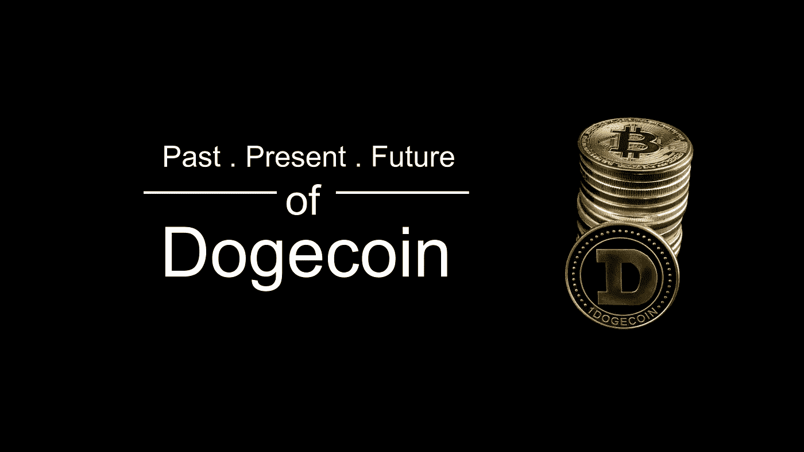

Photo by [Armaan](/@hi-armaan/) based on the [photo](https://commons.wikimedia.org/wiki/File:Dogecoin_and_bitcoin.jpg) by [SHIBA MINT](https://commons.wikimedia.org/wiki/File:Dogecoin_and_bitcoin.jpg) via [Wikimedia Commons](https://commons.wikimedia.org/wiki/Main_Page), [CC BY-SA 4.0](https://creativecommons.org/licenses/by-sa/4.0)

# 什么是 Dogecoin🤔

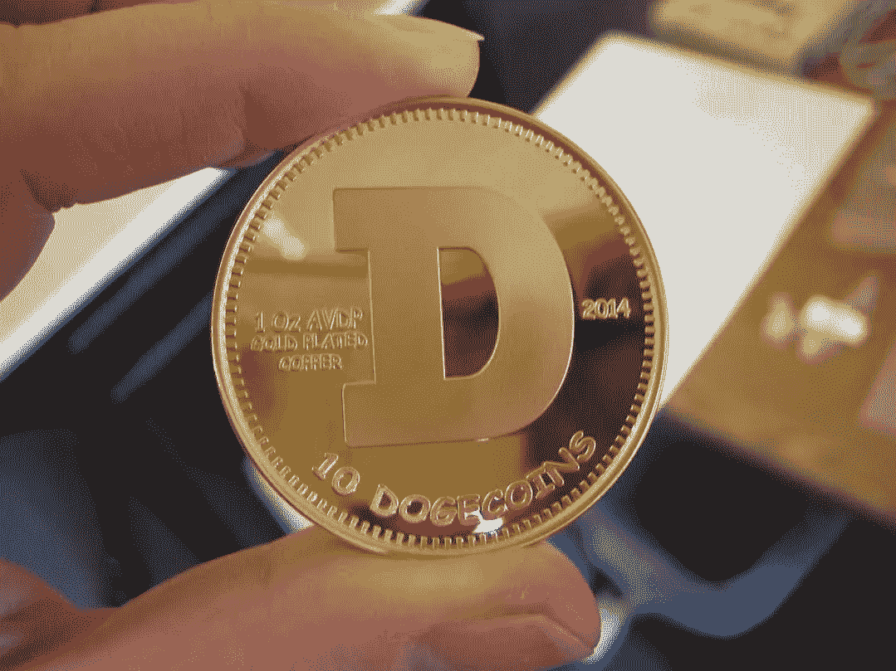

Photo by [SHIBA MIN](https://commons.wikimedia.org/wiki/File:GoldDSide.jpg)T via [Wikimedia Commons](https://commons.wikimedia.org/wiki/Main_Page), [CC BY-SA 4.0](https://creativecommons.org/licenses/by-sa/4.0)

根据 Dogecoin 的官方网站- **Dogecoin** 是一种有趣、新颖、发展迅速的数字货币形式。这种形式的数字货币被称为“加密货币”；一种数字货币。加密货币是完全匿名的、去中心化的、极其安全的。Dogecoin 又名**【DOGE】**，其符号为**【π】。**

简单来说，Dogecoin 几乎类似于比特币你可以像买卖比特币一样买卖它。你可以挖掘它(下面会有更多)，就像你可以挖掘比特币一样，你可以用它做几乎所有的事情，你可以用比特币做任何事情。

# 谁创造了它🧐

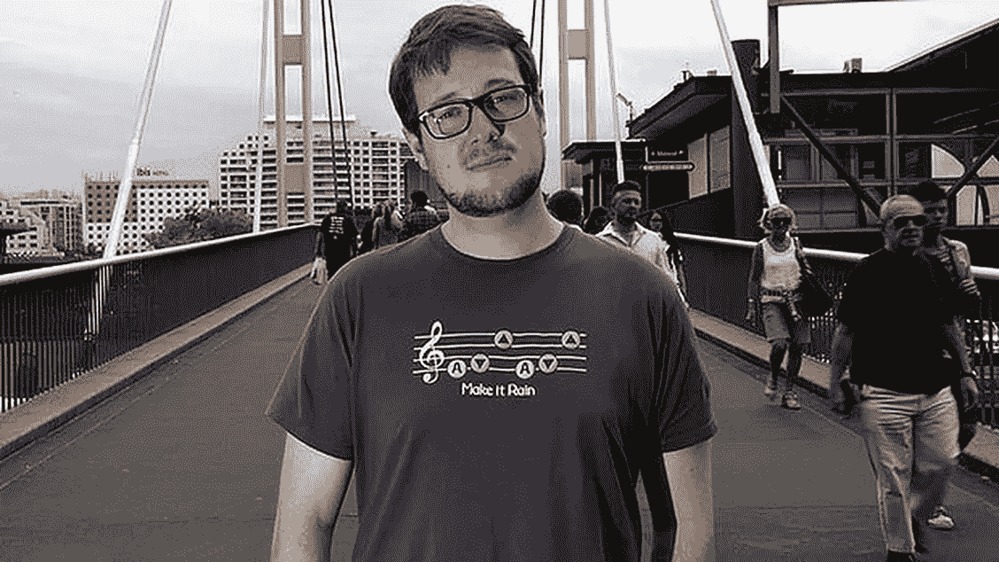

Co-founders of Dogecoin Billy Markus (left) and Jackson Palmer (right), Photo via [Everipedia](https://everipedia.org/)

最初是一个笑话，灵感来自 2013 年流行的“Doge”迷因。Dogecoin 由 Adobe 软件工程师**杰克逊·帕尔默**和 IBM 软件工程师[**比利·马库斯**](https://twitter.com/BillyM2k) 【中本聪】)创建。

# 这一切是如何开始的🤨

Photo by [Dayne Topkin](https://unsplash.com/@dtopkin1?utm_source=medium&utm_medium=referral) on [Unsplash](https://unsplash.com?utm_source=medium&utm_medium=referral)

在比特币取得成功后，大量的替代币(比特币的替代加密货币)开始涌现，杰克逊·帕尔默无法相信每天在市场上出现的大量替代币，所以他开玩笑地在推特上说，他正在投资一种基于迷因的假币来嘲笑加密行业，但每个人都认真对待它，很快围绕它形成了一个强大的社区，比帕尔默想象的更进一步。

然后，帕默决定与比利·马库斯合作，在现实中创造一只狗。Dogecoin 采用了日本柴犬品种的脸作为它的名字和标志。

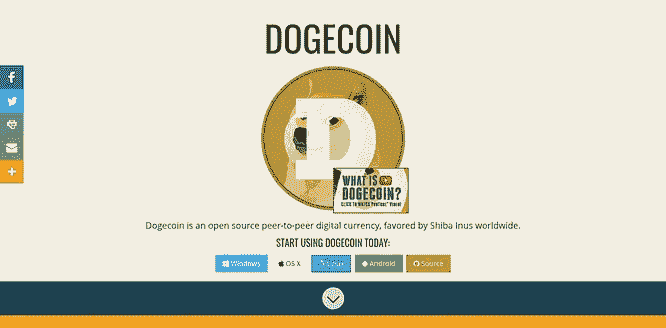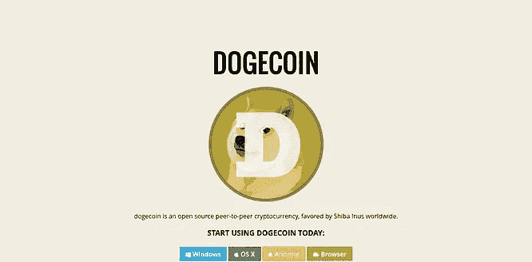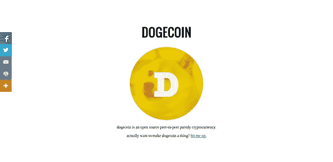

Snapshots of Dogecoin.com- Current (left), after 30 days from launch(middle) and one day after launch (right)

创造一种受迷因启发的加密货币背后的想法是，创始人希望创造一种可以覆盖比比特币更广泛的人群，并且使用起来“有趣”的加密技术。

2013 年 12 月 6 日，创始人正式推出 Dogecoin，30 天之内，Dogecoin.com**的访客超过百万。**

# **如何使用它😐**

**Dogecoin 类似于纸币，你可以像使用真钱一样使用它。你可以在线上和线下商店使用它(如果他们接受的话)。使用 Dogecoin，你几乎可以买到从杂货到电子产品的任何东西。**

**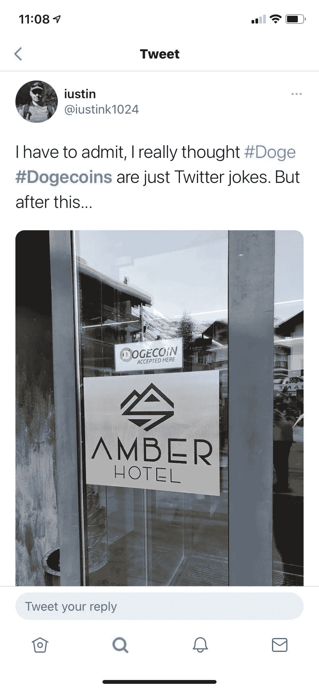**

**Dogecoin 在其官方网站上提到的最受欢迎的用途之一是给创作或分享优秀内容的网民“小费”。把它想象成一个更有意义的“赞”或 upvote，具有真正的价值，可以在整个互联网上使用。**

# **如何获得 Dogecoin？🤩**

**有几种方法可以得到 Dogecoin，你可以:-**

*   ****买下来**💵**
*   ****开采它们** ⛏**
*   ****使用 Dogecoin 水龙头****
*   ****参加 Dogecoin 社区**获得**

****注意:-** *如果你是 Dogecoin 新手，那么无论你如何获得硬币，你都需要一个钱包来存放它们，你可以使用你最喜欢的第三方钱包，也可以从* [***这里***](https://dogecoin.com/) *下载官方钱包。***

## **如何购买 Dogecoin**

****

**Photo by [rupixen.com](https://unsplash.com/@rupixen?utm_source=medium&utm_medium=referral) on [Unsplash](https://unsplash.com?utm_source=medium&utm_medium=referral)**

**这是最容易得到 DOGE 的方法。从交易所购买 DOGE 或任何其他密码几乎和从亚马逊购买一样简单。一些可以买到 DOGE 的交易所是-**

*   **[BitTrex](https://global.bittrex.com/)**
*   **波洛涅克斯**
*   **[币安](https://www.binance.com/en)**
*   **[Tidex](https://tidex.com/)**
*   **[北海巨妖](https://www.kraken.com/)**

**注意:- *为了您自身的安全，请始终通过值得信赖和可靠的密码交易所买卖 Dogecoin(或任何其他密码)。对于初学者来说，最好使用流行的交流方式(如-币安)。不要与任何人共享您的 pin、密码、OTP 和其他类似信息。***

## **如何挖掘 Dogecoin**

**挖掘 Dogecoin 不像比特币那么难(但也不像你想象的那么容易)你可以在你的笔记本电脑或电脑上挖掘它，但这不会有太多的利润，但如果你有强大的硬件，如专用的 ASIC Dogecoin 矿工，那么你可以尝试挖掘它，你可以使用在线计算器，如 [**CoinWarz**](https://www.coinwarz.com/) 和[**whatomine**](https://whattomine.com/)**来计算采矿将为你带来多少利润，因为它取决于各种因素，如电力成本、硬件****

****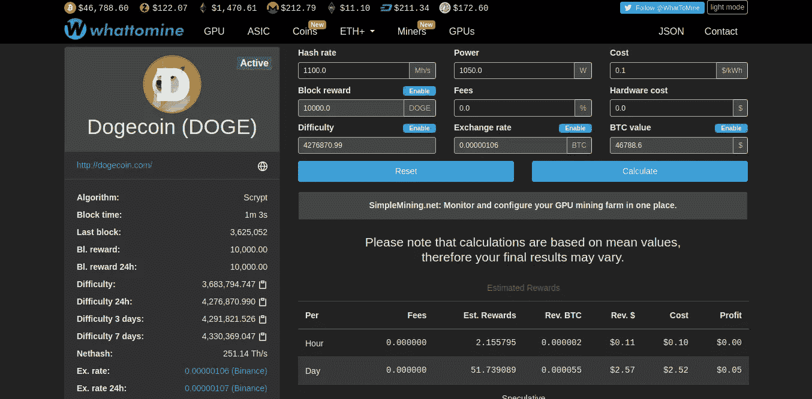****

****Screenshot of mining profitability calculator WhatToMine****

****如果你有(真正)强大的硬件，你可以单飞采矿狗或者加入像[**Prohashing**](https://prohashing.com/)**这样的采矿池。******

****要了解更多关于采矿和如何采矿的知识，请查阅这些令人惊叹的文章****

*   ****[**如何挖掘 Dogecoin:最简单的方法**](https://www.exodus.com/blog/how-to-mine-dogecoin/) | Exodus 博客****
*   ****[**如何挖掘 Dogecoin**](https://howtomine.com/dogecoin/)**| HowToMine.com******
*   ******[**如何挖掘 Dogecoin:初学者完全指南**](https://u.today/guides/crypto-mining/how-to-mine-dogecoin-complete-guide-for-beginners) |今日 U******
*   ****[**Dogecoin 挖掘:如何挖掘 Dogecoin —初学者指南**](https://www.bitdegree.org/crypto/tutorials/dogecoin-mining) | BitDegree****
*   ****[**【石贝学堂 101 —第一课:挖掘~尽可能简单地解释加密货币**](https://www.reddit.com/r/dogecoin/comments/ljz89k/shibe_school_101_lesson_1_mining_explaining/)**】|作者 Dogecoin 创造者比利·马库斯******

## ******Dogecoin 水龙头******

******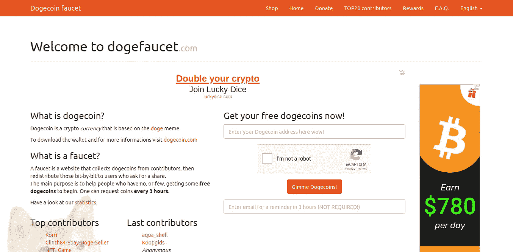******

******Homepage of Doge Faucet******

******一个**龙头**是一个网站，它会给你免费的 DOGE，但只有少量的 DOGE，只是为了向你介绍 Dogecoin，在加密世界里，龙头的目的是通过给你少量的特定加密，向你介绍一种加密货币，这样你就可以在购买之前无风险地尝试一种新的加密货币。 [**Dogefaucet**](https://www.dogefaucet.com/en) 是一个水龙头，你可以用它来获得一些免费的 DOGE。******

# ****Dogecoin vs 比特币(技术对比)****

********

****Photo by [André François McKenzie](https://unsplash.com/@silverhousehd?utm_source=medium&utm_medium=referral) on [Unsplash](https://unsplash.com?utm_source=medium&utm_medium=referral)****

****如今比特币的价值如此之高，以至于我们大多数人甚至买不起比特币，我们只能在梦中想象成为一个**比特币亿万富翁**，而 Dogecoin 作为加密世界中一种年轻且相对较新的货币，价格非常低廉，事实上，只需 1 美元就可以购买 18.22916097 个 doge coin，而 1 美元只能获得 0.00001744 BTC(在撰写本文时，未来可能会更少或更多)。****

> ****在比特币早期赌上一把的早期用户现在已经成为世界上最富有的人当中的亿万富翁****

****与其他流行和主流的密码相比，Dogecoin 的当前价格非常低，以至于许多人甚至不考虑尝试它，但比特币的价格在早期也非常低，那些早期在比特币上赌博的早期采用者现在是世界上最富有的人当中的亿万富翁。投资永远是一场冒险的游戏你不知道会发生什么。****

****比特币有 21，000，000 的有限供应限制，Dogecoin 有无限供应。Dogecoin 的协议主要基于**莱特币**，其**哈希函数**(算法)基于 **Scrypt** ，这意味着你不能用你现有的比特币挖掘设备(如果你有)来挖掘 Dogecoin，因为比特币的哈希函数基于 **SHA-256。******

****比特币的封锁时间是 10 分钟，而 Dogecoin 只有一分钟，这仅仅意味着比特币比 Dogecoin 更难挖掘，如果成功，那么你将获得**封锁奖励**(矿工在成功挖掘后获得的奖励)，Dogecoin 为 1 万英镑，比特币为 7.19 英镑。****

# ****社区****

****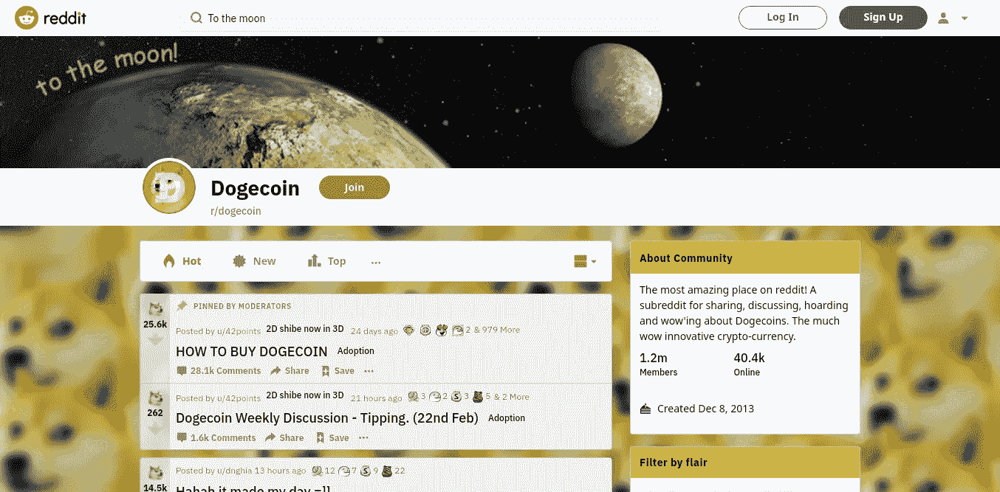****

****Dogecoin community subreddit- r/dogecoin on Reddit****

****Dogecoin 有一个非常强大和友好的社区。Dogecoin 社区在 subreddit r/dogecoin 上有大约 120 万成员(在撰写本文时)。****

****众所周知，Dogecoin 社区支持各种慈善工作，例如:-****

## ****冬季奥林匹克运动会****

****当牙买加雪橇队入选 2014 年冬季奥运会，但无法负担参赛费用时，Dogecoin 社区向该队捐赠了价值超过 25，000 美元的 Dogecoins。****

## ****狗 4 水****

****Dogecoin 基金会在**慈善机构:water** 的帮助下捐赠了约**3 万美元**为那些无法获得清洁饮用水的人提供清洁饮用水更多详情点击[此处](https://www.charitywater.org/dogecoin-foundation#impact)。****

## ****全国运动汽车竞赛协会****

****社区筹集了大约 55，000 美元来赞助纳斯卡车手乔希·怀斯。****

****如果你有兴趣，你可以加入这个社区，这里是 reddit 上的 subreddit r/dogecoin，因为它对每个人都开放。****

# ****Dogecoin 埃隆马斯克是不是最喜欢的货币？****

****在我说任何事情之前，看看马斯克在他的官方推特账户上发布的这些推文-****

****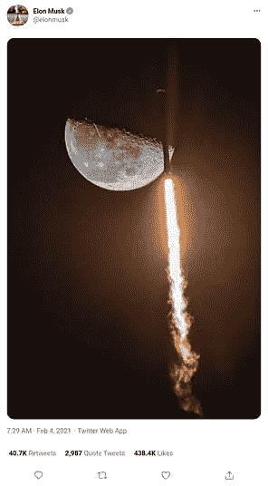********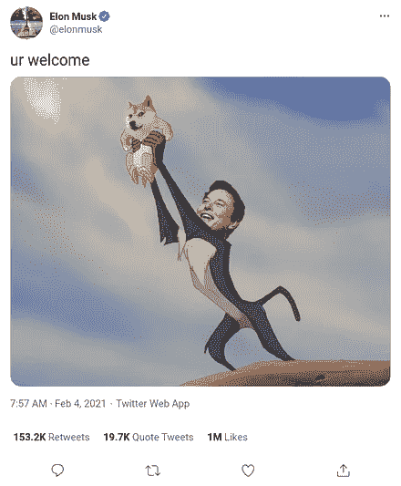********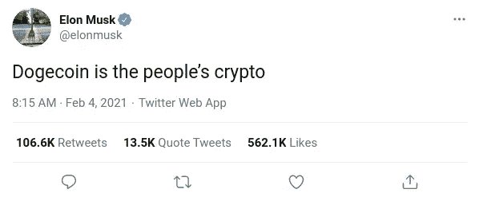********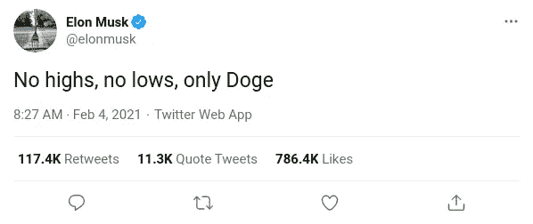********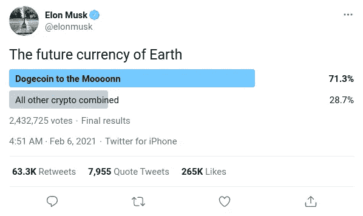********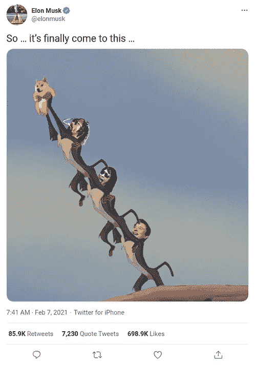************

****一切都是为了 Dogecoin，埃隆马斯克在宣布退出 Twitter 后不久，就开始在 Twitter 上发布关于 DOGE 的消息，导致其价格创下历史新高。如果你看一下 DOGE 的价格图，那么你会注意到每次马斯克发布关于它的推文时，它的价格都会上涨，专家将这种现象称为**“马斯克效应】**。****

****尽管当他开始发关于 DOGE 的微博时，他是为了好玩才发微博的(这是他通常在 Twitter 上做的事)。我认为他并不像推特用户认为的那样严肃，他只是按照他在推特上发微博的常规行事。但是作为一个在 Twitter 上拥有近 5000 万粉丝的天才亿万富翁 CEO，他拥有撼动市场的力量。****

****不能说 DOGE 是不是马斯克最喜欢的加密工具，但他支持加密货币，也投资了加密货币。他还在推特上说，他甚至给他的儿子买了一些 DOGE。****

********

****各种事情共同导致了 DOGE 价格的飙升，比如各种活动和(当然)迷因，但正是埃隆·马斯克将这个秘密公之于众，在此之前，它几乎不为人知，只有极客知道它，但对于普通人(包括我)来说，它是不存在的。在马斯克开始在推特上发布它之后，它吸引了所有人的注意，这个秘密正在发生一些事情，不久之后，几乎每个主要的媒体出版物，网站和有影响力的人都在谈论它。****

****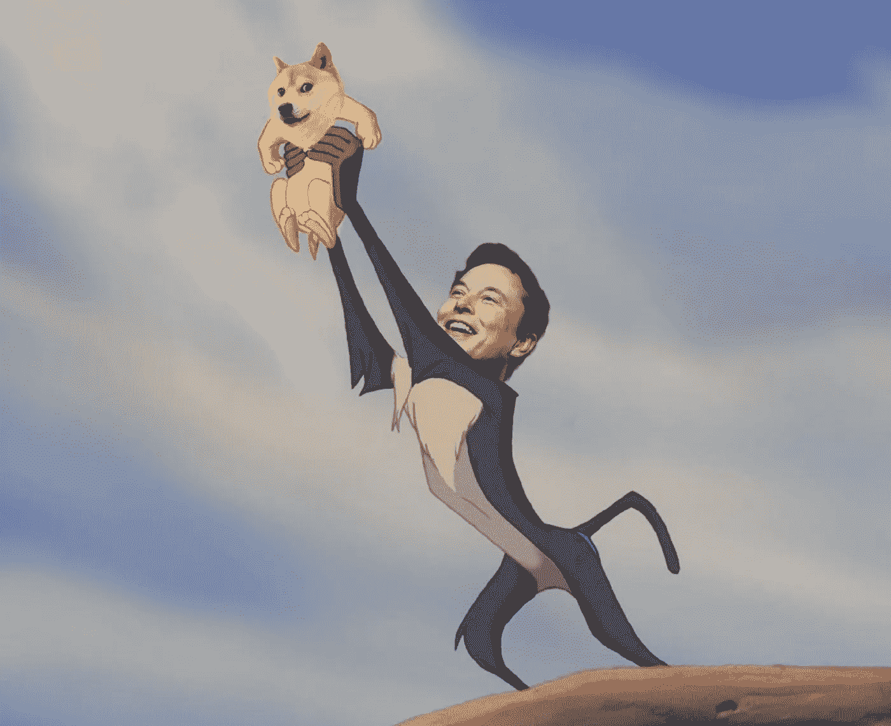****

# ****结论****

****Dogecoin 不像比特币、以太坊、莱特币和其他货币那样是严肃的加密技术。它的创始人创建它不是为了盈利，而是为了娱乐，它有一个充满热情和强大的社区，对它充满信心，它是一个年轻的加密技术，在过去几个月里变得非常受欢迎，在加密之前，它是一个迷因，所有这一切使它成为加密世界中的一枚不同的硬币，也许加密不是我们要求的，而是我们需要的。****

****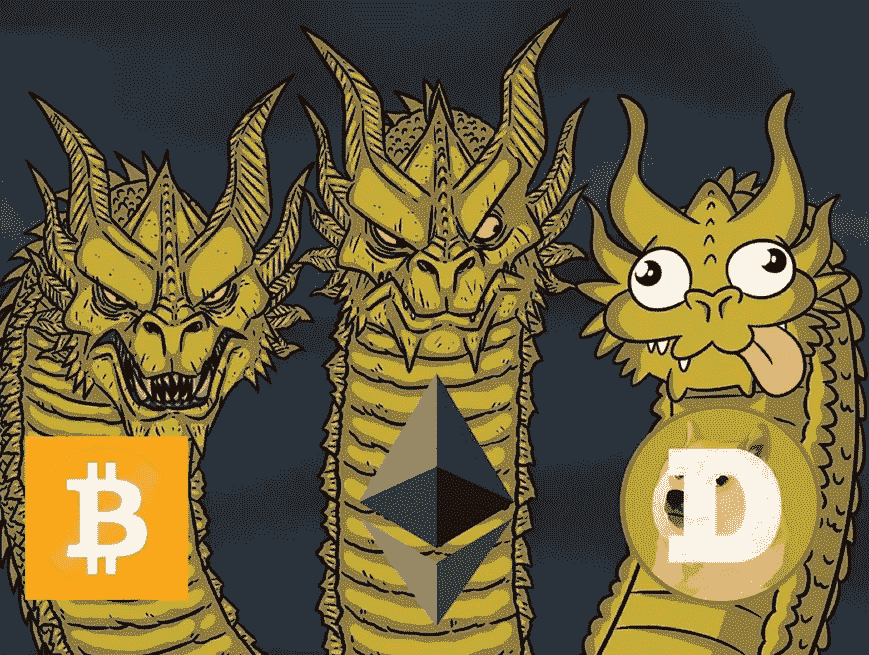****

****它的价值可能没有比特币高，但它仍然是独一无二的，非常受欢迎的加密技术，正如专家和其社区成员预测的那样，前景光明。如果你不认为这是一个很好的投资选择，那么你可以用它来探索密码世界，尤其是如果你是所有这些的新手。DOGE 是一种非常安全的货币，在深入加密货币的海洋之前，你可以使用 DOGE 来了解它，探索它，然后在 DOGE 或任何其他加密货币上进行认真的押注。****

*******免责声明:*** *我不是理财顾问，本文给出的建议不是任何形式的投资、交易或理财建议。你总是自担风险进行交易和投资。这篇文章只是为了教育你。如果你在金融投资方面需要帮助，一定要咨询注册金融顾问。*****

> ****加入 Coinmonks [电报频道](https://t.me/coincodecap)和 [Youtube 频道](https://www.youtube.com/c/coinmonks/videos)获取每日[加密新闻](http://coincodecap.com/)****

## ****另外，阅读****

*   ****[复制交易](/coinmonks/top-10-crypto-copy-trading-platforms-for-beginners-d0c37c7d698c) | [加密税务软件](/coinmonks/crypto-tax-software-ed4b4810e338)****
*   ****[网格交易](https://coincodecap.com/grid-trading) | [加密硬件钱包](/coinmonks/the-best-cryptocurrency-hardware-wallets-of-2020-e28b1c124069)****
*   ****[密码电报信号](http://Top 4 Telegram Channels for Crypto Traders) | [密码交易机器人](/coinmonks/crypto-trading-bot-c2ffce8acb2a)****
*   ****[最佳加密交易所](/coinmonks/crypto-exchange-dd2f9d6f3769) | [印度最佳加密交易所](/coinmonks/bitcoin-exchange-in-india-7f1fe79715c9)****
*   ****[面向开发人员的最佳加密 API](/coinmonks/best-crypto-apis-for-developers-5efe3a597a9f)****
*   ****最佳[密码借贷平台](/coinmonks/top-5-crypto-lending-platforms-in-2020-that-you-need-to-know-a1b675cec3fa)****
*   ****杠杆代币的终极指南****