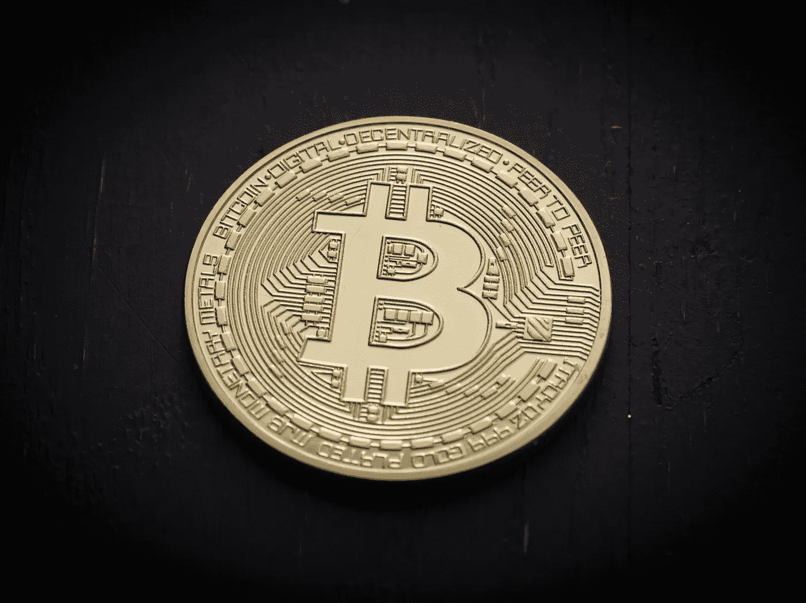
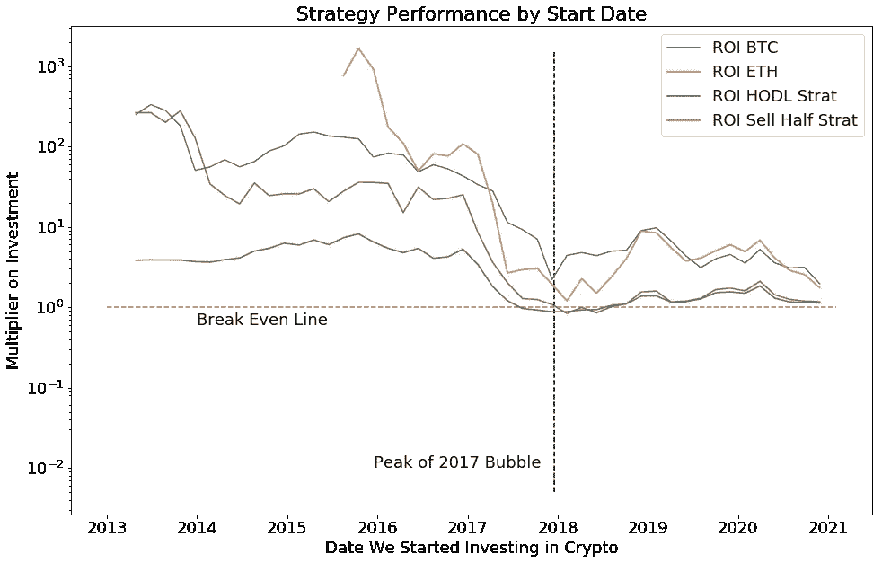
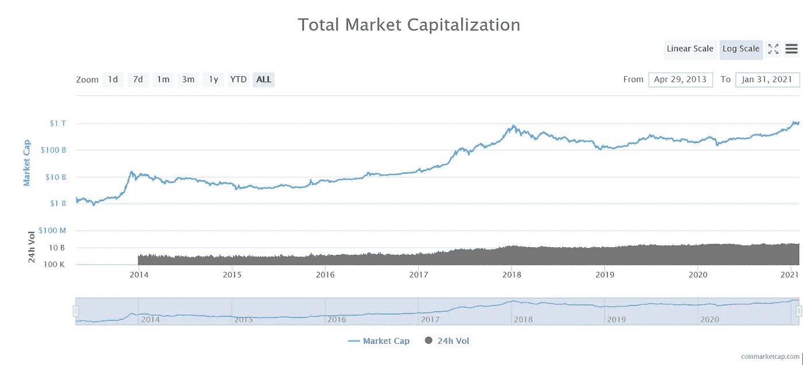

# 朴素的加密货币投资策略

> 原文：<https://medium.com/coinmonks/naive-cryptocurrency-investment-strategies-636a4fd5381d?source=collection_archive---------9----------------------->

## 他们工作得怎么样？

Photo by [Thought Catalog](https://unsplash.com/@thoughtcatalog?utm_source=unsplash&utm_medium=referral&utm_content=creditCopyText) on [Unsplash](https://unsplash.com/s/photos/cryptocurrency?utm_source=unsplash&utm_medium=referral&utm_content=creditCopyText)

假设我想投资一些钱到 crypto(嘿，这听起来像是一项可以改变世界的技术！)，但我不想花太多时间研究项目。或者对我来说，区分好项目和坏项目太难了。所以，如果我只是每种硬币都买一点点，并试图通过分散风险来赚钱，那又怎么样呢？为了弄清楚这个想法到底有多好(或多坏)，我收集了一些数据并进行了一些计算。但首先，让我给你介绍一下我评估过的策略。

# 策略

## 什么都买一点，HODL

第一个策略非常简单:每天我看着 coinmarketcap.com 排名前 200 的硬币，用 1000 美元买下我还不拥有的任何东西。我把这些硬币放在某个安全的钱包里，只是被动地看着我的投资组合，从不卖出。

## 拿一些利润然后 HODL

业余交易者的另一个流行策略是买一些硬币，如果价格翻倍，卖出一半。这将把你的原始资本返还给你，并允许你把它投资到另一个硬币上。此外，它允许你利用早期泵的价值，后来可能会消失。当然，不利的一面是，你可能会丢掉最赚钱的硬币。

## 最大化策略

加密货币爱好者只持有比特币(BTC)或以太坊(ETH)也很常见。当然，回想起来，这两个项目都非常成功，所以我们可以把这看作是我们投资策略成功的上限。我们实施这一策略的方法是，假设我们在某一特定日期一次性购买了这两种硬币中的任何一种，并一直持有到今天。

# 方法学

为了进行这项分析，我剔除了 coinmarketcap.com 数据，得出了 2013 年 4 月 28 日至 2020 年 11 月 27 日的历史价格和市值。这仅给出了前 200 个硬币的价格，但是假设如果这个列表中的一个硬币价值翻倍，当这种情况发生时，它不会从列表中掉出。

此外，为了获得我们假设投资组合的当前价值，我收集了 2021 年 1 月 3 日 coinmarketcap 上的所有价格。不可否认，我们当时正处于比特币主导的泡沫中，因此在当前牛市结束后重复这一分析会很有趣。

# 结果

这张图表显示了在给定的起始日期，按照我们的策略，我们会赚(或亏)多少钱。例如，如果我们是早期以太坊投资者(看看橙色线开始和突破 10 的地方)，我们的钱会乘以 1000，如果我们在 2015 年投资比特币，我们的钱会乘以 1000(10)。如果我们在 2017 年加密货币炒作的高峰期开始追求多元化战略，我们将刚刚实现投资组合的收支平衡。🙃

Original Research :)

## 其他需要注意的事项

1.  尽管早期以太坊投资者比 BTC 投资者多赚了将近 10 倍，但在这段时间里，以太坊和 BTC 的策略表现几乎一样。
2.  我们的“卖出一半”策略开始时的表现和 BTC 一样好，这可能是因为早期的加密货币项目开始时非常便宜。
3.  在 2017 年见顶后，这两种多元化战略之间的差异消失了，这可能是因为有价值的较小项目减少了。
4.  比较这些策略有点不公平，因为 BTC 和瑞士联邦理工学院的策略可以提前投入所有资金，而多样化策略需要不可预测的资金。

# 那么我们能从中学到什么呢？

好吧，看起来 YOLO 为了利润购买每一枚硬币的辉煌时代已经过去了。自 2018 年以来，我们从我们的多元化购买策略中看到基本持平的回报，尽管随着 alt-coins 的增加，我们有希望在这个市场周期的晚些时候获得更多利润。

那么，我们应该如何投资我们的钱在密码市场？对这些结果的一种解读是，如果我们想实现回报最大化，就应该坚持使用比特币和以太坊，尽管这可能有一些后见之明的偏差，因为我们选择这些硬币是因为它们是目前最大的两个加密项目。更合理的方法可能是估算整个加密货币市场的表现，这样我们就不会面临比特币或以太坊等个别货币失去相关性的风险。所以我的建议是什么？和股票一样，如果你不愿意出去做研究，就买指数基金吧！我很好奇是否有值得信赖的基金做这种事情，所以如果你知道任何，请在下面的评论中告诉我！

Retrieved from [https://coinmarketcap.com/charts/](https://coinmarketcap.com/charts/) on 2021–01–31

# 数据源

历史数据的示例 URL:[https://coinmarketcap.com/historical/20180428/](https://coinmarketcap.com/historical/20180428/)

当前价格数据的示例 URL:【https://coinmarketcap.com/2/ 

# 密码

为混乱的代码道歉，但是有脏代码总比没有好，amirite？【https://github.com/zscore/crypto-buying-article/upload 

## 也阅读

 [## 最佳免费加密交易机器人——前 16 名比特币交易机器人[2021]

### 2021 年币安、比特币基地、库币和其他密码交易所的最佳密码交易机器人。四进制，位间隙…

medium.com](/coinmonks/crypto-trading-bot-c2ffce8acb2a)  [## 最佳 6 个加密交易信号电报通道

### 这是乏味的找到正确的加密交易信号提供商。因此，在本文中，我们将讨论最好的…

medium.com](/coinmonks/best-crypto-signals-telegram-5785cdbc4b2b)  [## BlockFi 评论 2021 —通过您的加密获得 8.6%的利率

### 让你的密码发挥作用，获得比特币和其他加密货币的最佳利率

medium.com](/coinmonks/blockfi-review-53096053c097)