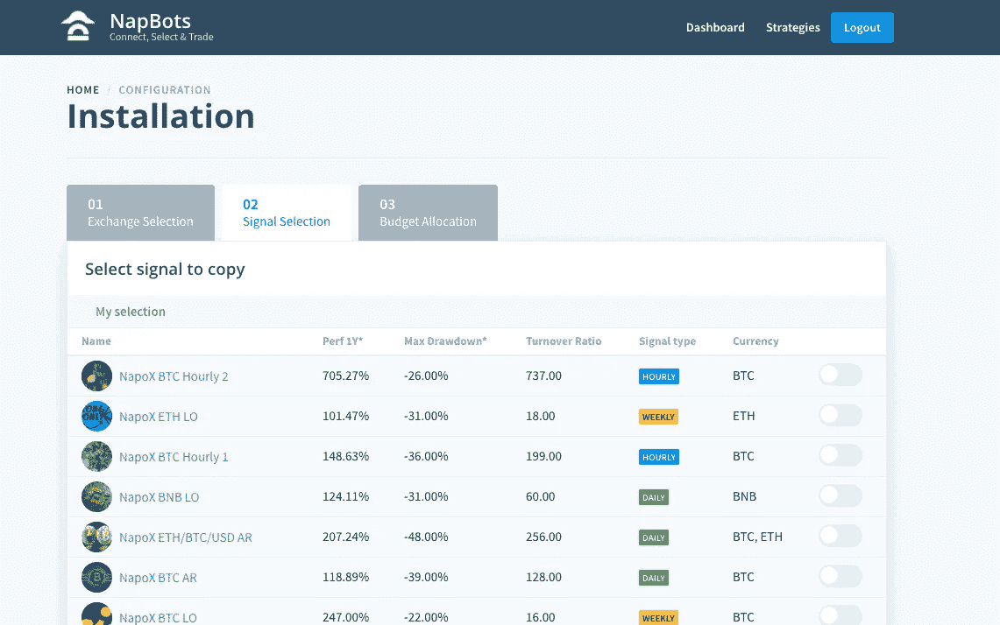

# Napbots 评论——提高加密回报的简单方法

> 原文：<https://medium.com/coinmonks/napbots-review-simple-way-to-increase-your-crypto-returns-f05a6113124e?source=collection_archive---------0----------------------->

今天我们将回顾一下基于云计算的加密资产自动交易解决方案**。Napbots 提供精心设计的交易策略，以增加您的投资回报。**

# **摘要**

*   **预先设计的量化策略来增加利润**
*   **使用历史市场数据测试策略**
*   **简单的设置和直观的界面**
*   **与顶级加密交易所集成**
*   **安全，因为您的资金永远不会离开您的钱包**
*   **基于交易量的定价**

> **另请阅读:[最佳加密交易机器人](/coinmonks/whats-the-best-crypto-trading-bot-in-2020-top-8-bitcoin-trading-bot-c16adeb13317)**

# **什么是 Napbots？**

**Napbots 由 Napoleon Group 创立，这家金融科技公司 20 多年来一直在为传统和加密资产设计量化策略。**

**Napbots 寻求加密资产的量化投资民主化，重点是最具流动性的资产(BTC、瑞士联邦理工学院、BCH、XRP、EOS、BNB 和 LTC)。目前，它在一个易于使用且非常安全的环境中提供了 [15 种具体的工作策略](https://napbots.com/strategies?utm_source=coincodecap_blog)，并具有不同的时间跨度。**

**最早的策略已有两年多的历史，尽管最近出现了动荡，但大多数策略都创下了历史新高。**

**有了[nap bot](https://blog.coincodecap.com/go/napbots)，只需一个阶段，你就能构建自己的策略组合，让你管理自己的储蓄。Napbots 服务将根据您的偏好自动执行特定的组合。**

**你将能够通过手机追踪你的投资结果，并完全独立地改变你的投资配置。**

# **Napbots 提供的交易策略**

**[**Napbots**](https://blog.coincodecap.com/go/napbots) 三年前开始设计量化密码策略，2018 年 4 月，该团队向其观众展示了第一个策略。**

**从那以后，该团队又引进了 14 种策略。Napbots 的策略将价格作为主要的知识来源。该团队提供不同时间范围(每周、每天和每小时)的趋势跟踪和均值反转方法。**

**此外，该团队已经建立了模型组，可以在几个 cryptos 上重复进行测试。每种技术都有其定义，并且在您选择它们之前，它还包括一些重要的 KPI。**

****

# **与其他产品的比较**

**如果你将[**nap bot**](https://blog.coincodecap.com/go/napbots)与其他大型竞争对手如 [3commas](https://blog.coincodecap.com/go/3commas) 、 [tradesanta](https://tradesanta.com/en/site/set-referral-cookie?referral_id=177722) 和 [cryptohopper](https://www.cryptohopper.com/?atid=15596) 进行比较；NapBots 提供的简单性和特殊方法标志着这种差异。**

**NapBots 通过使用自己测试过的交易策略，提供完整的[交易自动化解决方案](https://coincodecap.com/category/trading-automation)；向公众提供以前只为对冲基金保留的量化交易策略。**

**此外，NapBots 的设置和安装非常简单，即使是非专业人士也能做到。口号是连接、选择和交易；完全准确。**

**您可能还会对以下内容感兴趣:**

*   **[五款最佳加密交易机器人](https://blog.coincodecap.com/five-best-crypto-trading-bots/)**
*   **[不同类型的加密交易机器人](https://blog.coincodecap.com/different-types-of-crypto-trading-bots/)**
*   **[了解加密货币交易机器人](https://blog.coincodecap.com/a-guide-to-cryptocurrency-trading-bots/)**

# **兼容哪些交易所？**

**[**Napbots**](https://blog.coincodecap.com/go/napbots) 兼容五大交易所:币安、Bitfinex、Bitmex、北海巨妖、Bitstamp。不久又来了奥克克斯和霍比。这 5 个交易所提供了所有必要的加密交易配对。**

**一些被选中是因为他们表现出的保护，另一些是因为他们的流动性，这是一个重要的交易功能。将 Napbots 连接到 exchange 只需一个简单的动作。**

**在选定的交易所，你只需要直接从你的账户创建一个 API 密匙，并在 Napbots 的网站上填写。**

****

# **我的钱安全吗？**

**你的钱永远不会离开你的钱包。因此，没有比这更安全的了。为了工作，Napbots 只需要一个 API 密钥，该密钥将用于根据首选策略组合交付交易订单，并从您的帐户请求交易执行的更新。**

**您必须自己设置 API 密匙，这样您就很清楚您所赋予的相关权限。Napbots 只有代表你交易的权利，没有取钱的权利。**

**[NapBots](https://blog.coincodecap.com/go/napbots) 已经证明了它的性能，它最古老的策略是 [BTC LO](https://napbots.com/strategyDetails/STRAT_BTC_USD_D_3?utm_source=coincodecap_blog) 自 2017 年以来一直在其平台 napoleonx.ai(这一个发布信号用于手动交易，现在可以用 NapBots 软件实现自动化)上运行；它即将抵达新 ATH。**

**此外，旗舰策略[BTC/ETH/美元 AR](https://napbots.com/strategyDetails/STRAT_BTC_ETH_USD_D_1?utm_source=coincodecap_blog) 于 2018 年推出，如今 12 个月的表现超出基础 205%。这种策略更具侵略性，因为它有做空的可能性。你必须小心，因为过去的表现并不能保证未来的结果。**

**此外，全新的小时策略非常有前途，在最近的史诗般的崩溃期间反应非常好，让我们看看他们在这一年将如何表现。**

# **如何安装 Napbots？**

*   ****在 Napbots 中开户****

****

*   ****从您的 Exchange 帐户创建 API 密钥****

****

*   ****从 Napbots 的库中选择你自己的策略组合****

****

*   ****设置您的预算分配****

****

*   ****选择一个 Napbots 报价****

****

# **Napbots 的用户友好程度如何？**

**像专业人士一样交易从来没有这么容易。有了 Napbots，只需 4 个简单的步骤，您就可以访问按照最高标准构建的执行策略。**

**Napbots 提供了过去 12 个月行为技术的详细信息和每个策略的 KPI。如果你确定你只需要链接你的 [Napbots](https://blog.coincodecap.com/go/napbots) 账户你最喜欢的方法。**

**然后你可以高枕无忧，享受它的交易引擎为你工作。当你更有创造力的时候，你可能会构建自己的混合体，并利用一些影响力来改变一些东西。**

# **NapBots 定价**

**这个[自动交易软件](https://coincodecap.com/category/trading-automation)将根据交易金额收取认购费用。比如你选择 1000 欧的白银认购进行交易，如今有每月 7 欧的促销。**

**如果你和其他交易软件相比，价格也差不多。然而，如果你想购买白金卡，价格是 99 欧元，交易金额高达 5000 欧元。您可以在此链接查看所有[价格。](https://napbots.com/pricing)**

****

# **Napbots 的利弊**

## **赞成的意见**

*   **超级容易设置和简单的界面**
*   **家用信号市场**
*   **支持顶级加密货币兑换**
*   **完全控制你的资金**
*   **全天候支持**
*   **基于云的**
*   **支持性社区**
*   **由经验丰富的交易员团队创建**
*   **你可以混合所有的策略，创造你自己的分配**

## **骗局**

*   **新平台**
*   **没有免费试用，只有模拟器模式**
*   **只有高达 1.5 倍的利用率**

# **常见问题**

****问****nap bot 合法还是安全？****

****答:**为了工作，Napbots 只需要一个 API 密钥，该密钥将用于根据首选策略组合交付交易订单，并从您的帐户请求交易执行的更新。你的钱不会离开你的钱包。因此，没有比这更安全的了。**

****问:Napbots 有手机应用吗？****

****答:** Napbots 目前没有适用于 iOS 或 Android 设备的移动应用。但是，Napbots 有一个完全响应的网站，你可以在移动浏览器上查看。**

****问:交易费用是多少？****

****答:** Napbots 的认购起价低至 7 美元，你可以在交易策略中分配 1000 美元。**

****问:哪些交易所兼容 Napbots？****

**答:Napbots 兼容七大交易所:币安、Bitfinex、Bitmex、北海巨妖、Bitstamp、OKEX 和 Huobi。此外，该团队计划在未来支持更多的交流。**

# **Napbots 替代品**

1.  **[Quadency](https://blog.coincodecap.com/go/quadency) ，2018 年推出的密码交易自动化平台。它给你带来了一个更聪明的方式来交易和管理你的密码。阅读我们的[季度回顾](https://blog.coincodecap.com/quadency-review-a-crypto-trading-automation-platform)。**
2.  **[Bitsgap](https://blog.coincodecap.com/go/bitsgap) ，满足您所有交易需求的一站式加密交易平台。它允许用户将他们所有的密码交易账户放在同一个屋檐下，通过一个集成的界面进行交易。另外，请阅读我们的 [Bitsgap 评论](https://blog.coincodecap.com/bitsgap-review)。**
3.  **HaasOnline 是最古老、最有声望的密码自动交易公司之一。他们的卓越声誉来自于他们的[交易自动化软件](https://coincodecap.com/category/trading-automation)，该软件自 2014 年以来一直为加密交易员执行交易策略。另外，请阅读我们的[哈森在线评论](/coinmonks/haasonline-review-d8d1a3400419)。**

## **另外，阅读**

*   **最佳加密交易机器人**
*   **最好的比特币[硬件钱包](/coinmonks/the-best-cryptocurrency-hardware-wallets-of-2020-e28b1c124069?source=friends_link&sk=324dd9ff8556ab578d71e7ad7658ad7c)**
*   **最好的[加密税务软件](/coinmonks/best-crypto-tax-tool-for-my-money-72d4b430816b)**
*   **[最佳加密交易平台](/coinmonks/the-best-crypto-trading-platforms-in-2020-the-definitive-guide-updated-c72f8b874555)**
*   **[unis WAP 最佳钱包](/coinmonks/best-wallets-to-use-uniswap-e91a6385d9e8)**
*   **最佳[密码借贷平台](/coinmonks/top-5-crypto-lending-platforms-in-2020-that-you-need-to-know-a1b675cec3fa)**
*   **[bits gap review](https://blog.coincodecap.com/bitsgap-review)——一个轻松赚钱的加密交易机器人**
*   **为专业人士设计的加密交易机器人**
*   **[3commas Review](https://blog.coincodecap.com/3commas-review-an-excellent-crypto-trading-bot) |一款优秀的密码交易机器人**
*   **[3Commas vs Cryptohopper](/coinmonks/cryptohopper-vs-3commas-vs-shrimpy-a2c16095b8fe)**
*   **Bitmex 保证金交易的白痴指南**
*   **加密摇摆交易的权威指南**
*   **[Bitmex 高级保证金交易指南](/coinmonks/bitmex-advanced-margin-trading-guide-2270c195ce25?source=friends_link&sk=1d986cca731f5084b9a2db4a4bc4a7ad)**
*   **开发人员的最佳加密 API**
*   **[加密套利](/coinmonks/crypto-arbitrage-guide-how-to-make-money-as-a-beginner-62bfe5c868f6)指南:新手如何赚钱**
*   **顶级[比特币节点](https://blog.coincodecap.com/bitcoin-node-solutions)提供商**
*   **最佳[加密制图工具](/coinmonks/what-are-the-best-charting-platforms-for-cryptocurrency-trading-85aade584d80)**

> **[在您的收件箱中直接获得最佳软件交易](https://coincodecap.com?utm_source=coinmonks)**

****

***原载于 2020 年 4 月 8 日*[*【https://blog.coincodecap.com】*](https://blog.coincodecap.com/napbots-review-crypto-trading-on-autopilot)*。***