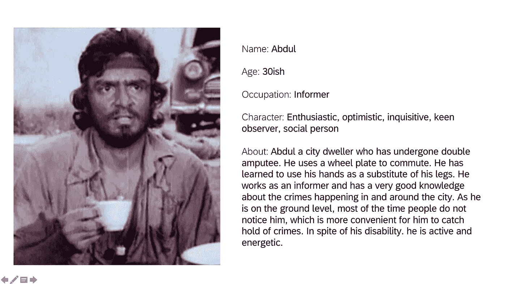
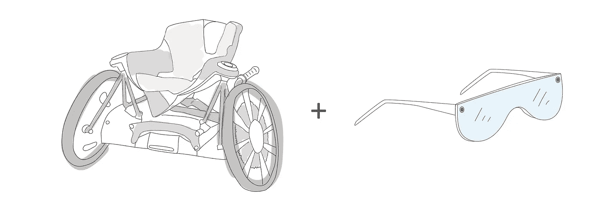
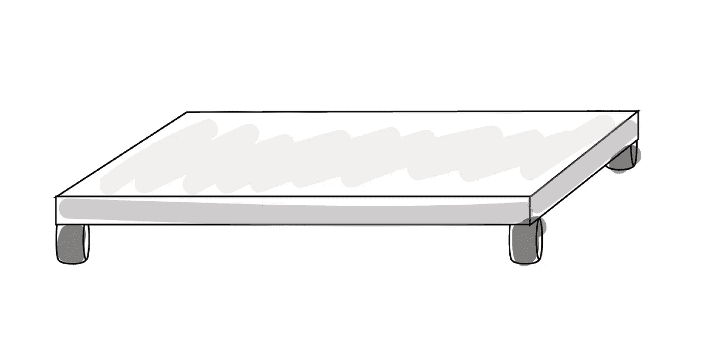
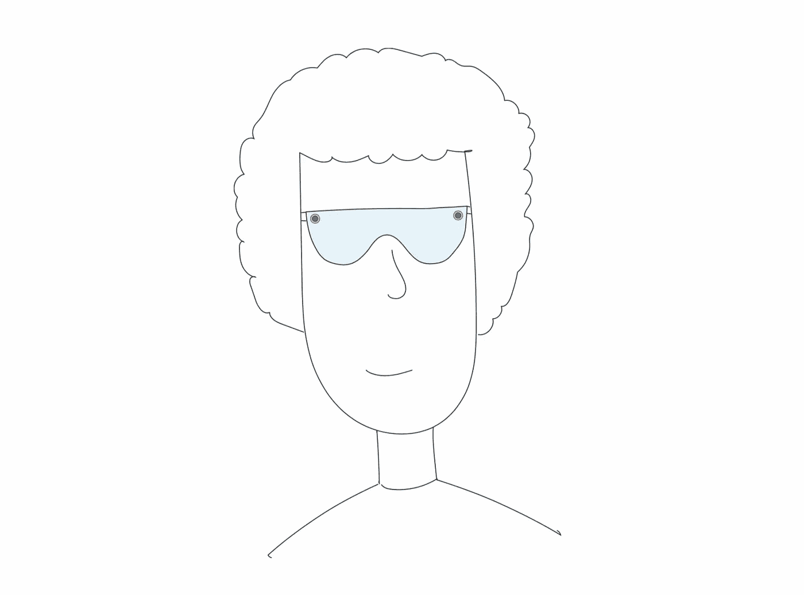
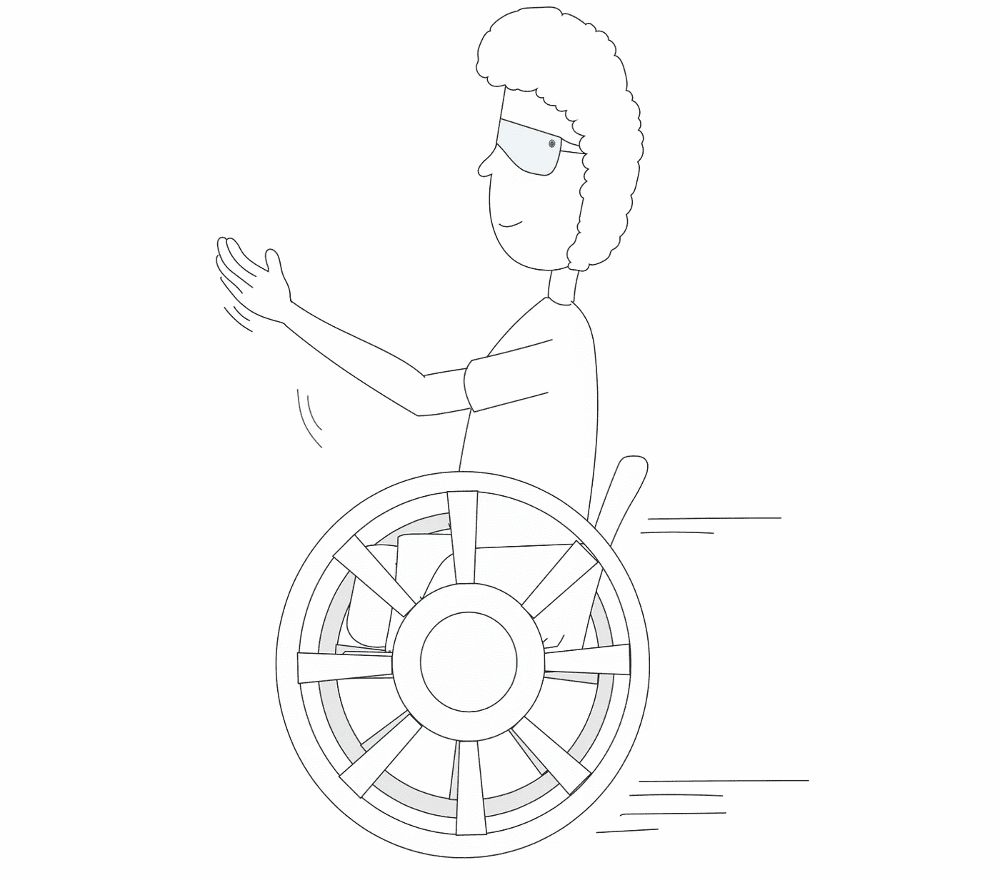
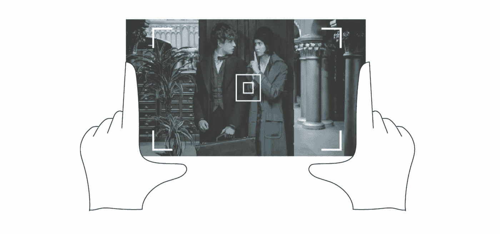
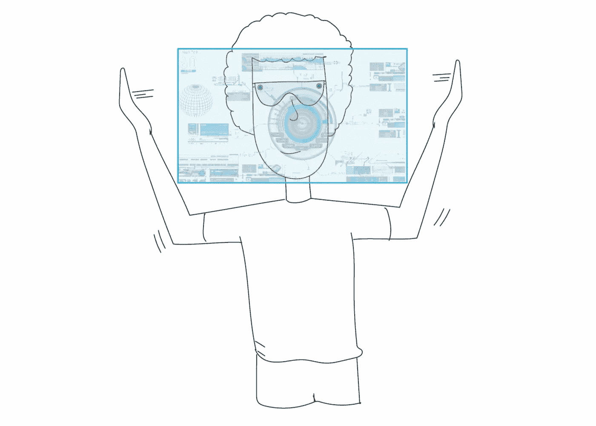

# 为不同能力的用户提供自然的用户界面

> 原文：<https://medium.com/coinmonks/natural-user-interface-for-differently-abled-d43e2a35e54e?source=collection_archive---------10----------------------->

多年来，人类一直着迷于消除我们的身体和技术之间的障碍的想法，现在有一种日益增长的趋势，即人们在精神和身体上与技术进行互动。它可能涉及到使用你的整个身体，而不仅仅是你的手和眼睛来帮助设计结果。

具身互动是认知科学和心灵哲学中的一个观点，强调人体在塑造心灵中的作用。

*   作为人类，我们拒绝改变，因为它占用了大脑中的大量能量，而这些能量可以用于更紧急和直接的任务
*   即使我们发现技术是有益的，我们也不准备为了优化和生产力而放弃我们多年来已经掌握的行为。

自然用户界面(NUI)能够以直观的方式与虚拟世界进行交互，而不必学习如何使用复杂的界面或抽象的控件集。当我们想到自然且易于使用的用户界面时，我们想到的是与我们“自然”行为直接互动的用户界面。NUIs 的优点是用户交互感觉有趣、容易和自然，因为与更传统的图形用户界面交互相比，用户可以使用更广泛的基本技能。

必须为身体残疾的人设计一些东西，专注于他们如何在社会背景下通过身体参与他们的一天，我从 1980 年上映的宝莱坞电影《沙恩》中挑选了一个角色，阿卜杜勒，由马札尔·汗扮演。

阿卜杜勒在电影中的角色是，他是一个经历了双腿截肢的城市居民

(失去全部或部分手臂、手、腿等的人。,).为维贾伊库马尔(阿米特巴·巴强)做秘密线人。

看了这部电影，我能够理解阿卜杜勒的性格，他是如何在社会环境中通过他的身体参与他的一天的。在此基础上，我创造了他的人格。

由于确切的问题可能不明显，我不得不笼统地陈述他因残疾而在日常生活中面临的所有可能的问题。

*   依靠轮板，他将不得不付出额外的努力，他的日常通勤。
*   使用轮板，他不能爬楼梯或在糟糕的道路上通勤。
*   他用手代替了需要大量肌肉能量才能行走的腿。
*   依赖他人，无法自理。
*   难以体验体育、旅游等正常事物。
*   可能会发现一心多用很困难。

这对他来说是一个优势，不被世人注意，这有助于成为一个秘密线人。

牢记这一点，我必须想出一个主意，可以消除身体，技术和解决上述问题之间的障碍。

# 想法

将混合现实(MR)体验与电动轮椅相结合，用户将能够通过手势控制椅子，并利用 MR 眼镜通过手势和全息显示来记录、记录和共享信息。

电动轮椅自动工作，用户不必推动轮子。在操纵杆和其他选项的帮助下，用户能够控制椅子和轮子。

阿卜杜勒的身高对他来说是一个巨大的财富，可以不被人注意，并作为一名间谍工作。考虑到这一点，轮椅也可以有腿的高度，座位的高度和倾斜能力，这可以帮助阿卜杜勒轻松地爬上椅子或下来。它不一定是轮椅，也可以是一个转盘，用户可以使用 MR 眼镜来控制它。

MR 眼镜两侧各有一个摄像头，具有双目视觉和追踪物体三维空间的能力。这使得眼镜能够捕捉用户的手势。数字对象和元素可以被添加到数字和物理对象可以共存的真实环境中。

MR 眼镜可以捕捉用户的手部动作、手势，并理解用户的命令。他们把信息发送给轮椅，轮椅相应地行动。

举个例子，

*   当使用者举起手指向正前方时，椅子就会向前移动。
*   当他指向正确的方向时，轮子就会向右转。
*   当用户握拳时，轮椅施加制动。

摄像机是告密者和间谍的基本要求。在 Abdul 的情况下，他很难随身携带它，但在 MR 的情况下，他将能够与真实环境互动并捕捉信息。

例如，当 Abdul 通过眼镜先生查看真实世界并想要记录或捕捉任何情况时，他可以做出如图所示的手势。这将捕捉并保存这一时刻。

作为一个告密者，他应该能够很容易地分享信息和数据。MR glass 将数字对象和元素添加到现实环境中，数字对象和物理对象在现实环境中共存。例如，当 Abdul wide 张开双手时，眼镜先生可以理解手势并打开全息界面，在那里他可以看到自己的信息或将其分享给自己工作的机构。

考虑到 Abdul 的独特性，我提出了一个解决方案，可以解决他目前面临的以下问题:

*   由于轮椅是基于手势工作的，他不必花很多精力推或拉轮子，换向对他来说将成为一项容易的任务。
*   有了电动轮椅，上坡、下坡、在糟糕的道路上行驶都不是问题。
*   有了 MR 眼镜，记录重要情况、收集证据变得容易多了。
*   阅读和分享信息不再是负担。
*   在眼镜先生的帮助下，他将能有效地完成他的工作。

像阿卜杜勒这样的人就在我们身边。可能不是间谍但能力不同？是的。我只希望我上面提出的想法能帮助他们过上和我们一样正常的生活。

> [在您的收件箱中直接获得最佳软件交易](https://coincodecap.com/?utm_source=coinmonks)

