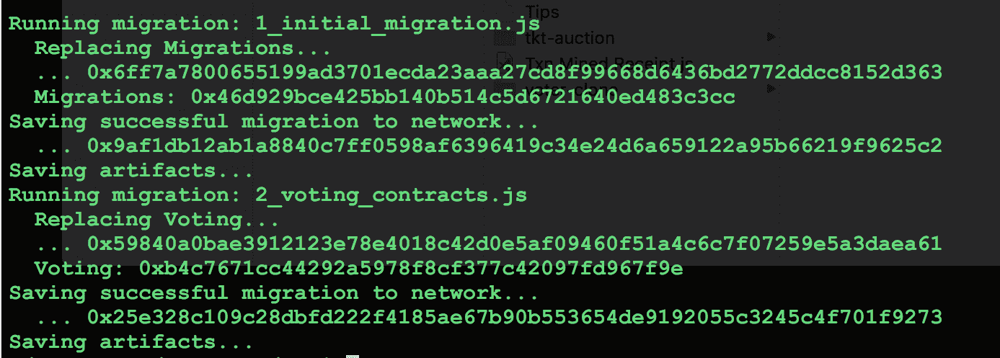
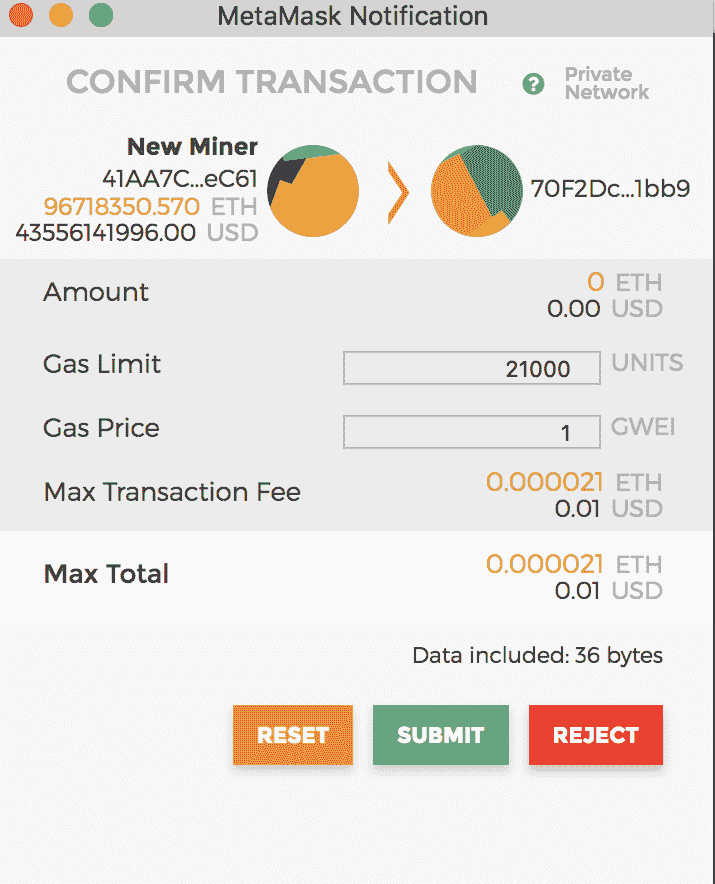
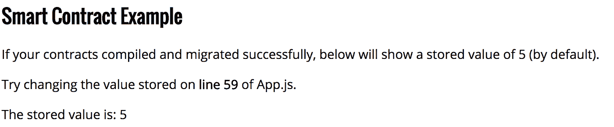

# 导航以太坊—第三部分

> 原文：<https://medium.com/coinmonks/navigating-ethereum-part-3-e057f07d1c66?source=collection_archive---------9----------------------->

## 对松露有反应

在[第一部分](/@soni.shashikant/navigating-ethereum-part-1-efc23e6e495a)中设置以太坊和配置一个私有区块链，并在[第二部分](/@soni.shashikant/navigating-ethereum-part-2-b0e00bce0c85)中学习如何编写一些基本的智能契约之后。现在，我们在区块链上部署之前创建的合同，并构建一个 web 应用程序来与合同进行交互。app 部分需要一些 React 和 JS 函数式编程的工作知识。

应用程序和合同的完整代码可从 github [这里](https://github.com/shashiks/eth-tutorial)获得。Truffle 框架帮助你以一种优雅的方式管理以太坊智能合约的生命周期。它为你编译、部署和版本管理你的东西。仅使用配置即可轻松部署到不同的网络(生产、测试、私有)。最好的部分是 dApp(分布式应用)开发的简易性。当然，如果你知道如何在没有块菌的情况下做事情，这并没有什么坏处，但这是建立 dApps 最简单快捷的方法。因此，让我们下载一个可重用的 React 包并开始吧。

创建一个名为“mydApp”的目录。从目录内部运行以下命令

```
> npm install -g truffle> truffle unbox react
```

它下载了一个“松露盒子”，里面包含了与智能合约交互和启动 React 应用程序所需的所有样板代码。在松露地点还有许多其他的“盒子”。

我们需要让这个应用程序工作的下一个重要工具是 [MetaMask](https://metamask.io/) 。继续将插件安装到您的浏览器上。这是一个钱包软件，它为你安全地存储你的帐户。安装完成后，我们只需做一些配置更改，就可以连接到我们的本地区块链，并使用我们之前创建的帐户。点击左上角的“主网络”并选择“自定义 RPC”。在文本字段中输入“ [http://localhost:9090](http://localhost:9090) ”并保存。现在，在右上角单击并选择“导入帐户”。对于类型选择“JSON 文件”,并选择我们在区块链上创建的用户的帐户 id 文件。该文件应该位于“<chain-data-dir>/keystore”中。您可以导入任意数量的帐户。

让我们试着启动应用程序。转到你的松露应用程序的主目录。在文本编辑器*中打开名为 *truffle.js* 的文件。*并修改如下:

```
module.exports = {
   networks: {
     development: {
       host: “localhost”, 
       port: 9090,
       network_id: “15”, // Match our chain’s network id
       from: ‘<MINER_ACCOUNT_ID>’
     }
   }
};
```

这个配置告诉 Truffle 应该在哪个网络上部署智能合约。在' *networks* '下可以有多个部分来表示测试、生产等。将 miner 地址更新为您的第一个帐户的地址。它可以是您要部署到的链上的任何帐户，但现在我们将使用我们的矿工帐户。使用以下代码编译代码:

```
> truffle compile
```

接下来解锁我们在 truffle.js 中指定的帐户，以部署合同。

```
> personal.unlockAccount(‘<MINER_ACCOUNT_ID>’);
```

确保您的区块链节点正在运行，同时启动矿工。现在部署来自松露的合同:

```
> truffle migrate
```

让我们看看我们刚刚做了什么。我们编译了样本合同，它是下载包的一部分。然后解锁帐户，因为我们将在区块链部署合同。代码的部署也是一个交易，它花费汽油/金钱，所以我们需要解锁我们用于部署的帐户。如果一切顺利，几秒钟后你会看到每个合同的一些地址和散列。



接下来，我们启动应用程序。

```
> npm run start
```

这将自动在 localhost:3000 为您打开一个新的浏览器窗口。将会有一个新的弹出窗口等待您批准交易。如下图所示:



这就是我们之前安装的 MetaMask 的神奇之处。

幕后发生的事情是，我们启动的 web 应用程序已经使用我们导入的帐户连接到我们的区块链。它试图向我们刚刚安装在区块链上的示例合同发送一个事务。如你所知，现在任何交易都要花费汽油/金钱，而你作为钱包的主人需要批准交易。

你需要明白，仅仅是运行这个简单的应用程序就涉及到许多复杂和困难的概念。所以如果你现在觉得很奇怪，没关系。坚持下去，我们将很快部署我们自己的合同，我们早些时候创建的，也许这将清除许多事情。

一旦你点击 MetaMask 上的“提交”按钮。页面末尾的值应该更新为‘5’而不是 0，如上面的消息所示。最终屏幕应该如下所示:



The output from sample code

要开始部署我们的代码，请将我们之前在 Remix IDE 中编写的合同复制到应用程序的*‘合同*’文件夹下，命名为 *BallotData.sol* 和 *Voting.sol* 。使用*块菌编译*来编译它们。我们要做的下一件事是使用 Truffle 提供的部署和合同管理特性。转到应用程序根目录下名为' *migrations* '的目录。您将在那里找到 2 个文件，分别以 1_xxx 和 2_xxx 开头。创建一个名为" *3_deploy_contract.js"* 的新文件，并对其进行编辑，使其包含以下内容:

```
var Voting = artifacts.require(“./Voting.sol”);
module.exports = function(deployer) {
   deployer.deploy(Voting);
};
```

注意，我们只提到了一个合同*投票*。由于这扩展/导入了 *BallotData* ，我们不需要单独部署它。我们也可以将它们一起写入一个文件。但是将它们分开只是一个好的编码实践——与可靠性无关！好了现在运行“*块菌迁移*”。您会注意到它只部署了投票契约，而没有再次重新部署旧的契约。这就是松露合约管理的优势。要查看所有合同部署在何处，您可以使用

```
> truffle networks
```

或者强制重新部署所有合同

```
> truffle migrate --reset
```

既然我们的投票契约已经部署好了，我们就可以开始编写与之交互的代码了。将' *src'* 文件夹下的现有 App.js 重命名为其他名称，并创建一个新的 App.js 文件。从下面的代码框架开始编辑它

```
import React, { Component } from ‘react’;
import contract from ‘truffle-contract’;
import votingContract from ‘../build/contracts/Voting.json’;
import VoteOption from ‘./VoteOption.js’;
import Web3 from ‘web3’;
import ‘./css/pure-min.css’
import ‘./App.css’var voting = contract(votingContract);
var me = null;var web3 = window.web3;class App extends Component {}export default App;
```

Web3 是以太坊提供的客户端 JS 库，用于与部署的智能合约进行交互。我们将 json 格式的已编译合同(实际上是一个 ABI-应用程序二进制接口)作为' *votingContract'* 导入，并使用“truffle-contract”库对其进行初始化。从这里开始事情变得棘手，因为您将在这个组件的最终版本中看到许多 React 代码。因此，为了简单起见，我将描述与区块链交互相关的部分，并将 React 代码的其余部分留给您来解决:)开始吧:

正如我提到的，web3 库帮助我们连接到我们的区块链。但仅此而已(至少在本教程的范围内)。为了调用契约方法，我们将使用刚刚创建的契约二进制文件的实例。

```
....
class App extends Component {
   componentDidMount() {
     web3 = new Web3(web3.currentProvider)
     voting.setProvider(web3.currentProvider);
   }
}
...
```

这是一个标准的 React 方法，在这里我们初始化我们的对象。我们使用当前的 web3 提供者来完成这项工作——或者简单地说，使用由 MetaMask 作为全局变量提供的 web3 实例连接到我们的区块链。还记得我们已经配置了元掩码来指向我们的节点。是的小菜一碟！！！

我们编写了一个方法来从我们的契约中获取选项列表。

```
initOptionList = () => {
   var tmpNames = [];
   voting.deployed().then(function(instance) {

   });
}
```

该方法查找该协定的已部署实例。记住这些是 truffle contract 为我们提供的默认方法和 API。接下来，我们使用' *optionsCount* '从我们的契约中获得可供投票的选项数量，这是为我们的变量自动生成的方法，因为它是公共的。因为契约中的方法是“read”并且不修改状态，所以我们将使用“ *call()* ”来调用它。让我们更新上面的代码

```
...
  voting.deployed().then(function(instance) {
   instance.optionsCount.call().then( function(optCount) {
  });
});
...
```

返回值是一个" *uintXX* "返回一个 JS 中的 BigDecimal 对象，该对象有多个属性。我们可以使用“*toString”*来获得字符串形式的实际值。当我们查找每个选项并将其存储在本地数组中时，事情变得有趣了:

```
...instance.optionsCount.call().then( function(optCount) {
  for(let i = 0 ; i < optCount; i++) {    
     **instance.getOptionAt.call(i).then(function(optInfo) {** tmpNames.push( i+ “,” + optInfo);
        if(i == (optCount-1)){
           me.setState({isOptData: true});
           me.setState({optNames: tmpNames});
        }
     });
   }
});...
```

方法" *getOptionAt"* 返回两个值，选项的名称和分数。所以返回值是一个数组，我们将它存储为字符串，以便以后显示。

在任何其他语言中，这都是一种糟糕的方法。为数组中的每一项调用服务器。Well Solidity 不返回字符串数组，因为字符串也是一个字节数组。尽管如此，还是有解决办法的。你可以用不同的方法来优化它，但是现在我们将使用这个简单的方法。值得庆幸的是，因为这是一个读取交易，所以你不需要用汽油来支付。

*注意:*在生产中使用这种方法不是一个好主意

我们现在将创建另一个方法来添加一个新的选项到列表中。

```
addOption = () => {
    **let currUser = window.web3.eth.defaultAccount;**
    let option = this.refs.optName.value;
      try {
        voting.deployed().then(function(instance) {
          **instance.addOption.sendTransaction(option, {gas:3000000,from: currUser})**.**then(function(txnHash)** {
           me.setState({txnId : “Transaction Id : “ + txnHash});
         });
        });
      } catch (err) {
        console.error(“Err loading options count “+ err);
        //indicate this to user too
         return;
      }
}
```

这类似于另一种禁止高亮显示行的方法。为了从元掩码中获取当前选择的帐户 id，我们使用' *web.eth.defaultAccount* '。添加一个新选项会导致新数据被存储在区块链上，因此是一个被挖掘的交易，并且对发送者来说是要花钱的。因此，我们需要使用'*send transaction*，而不是'*call()*，来表示我们准备在存储的数据上花费的气体量。返回值是一个事务散列，我们可以从我们的块浏览器中查找。散列并不表示交易被接受或被挖掘。这只是一个身份证。
*注意:*在提交事务之前，记得从控制台启动 miner。
送气太少会导致交易永远不被开采。但是，如果您通过超过所需的气体，未使用的气体余额将被退还。理解天然气及其对交易的影响非常重要。这里给出了很好的解释

另一种方法是让用户为其中一个选项投票。

```
vote = () => {
    let optId = this.state.selectedOpt;
    let currUser = window.web3.eth.defaultAccount;
    voting.deployed().then(function(instance) {
      try {
        instance.vote.sendTransaction(optId, {gas:3000000, from: 
        currUser}).then( function(txnHash) {
          me.setState({txnId : “Transaction Id : “ + txnHash});
        });
      } catch (err) {
        console.error(“Err voting “+ err);
        return;
      }
     });
}
```

我们做的最后一个实现是让 dApp 对用户更加友好。你不能期望一个终端用户运行一个块浏览器，并使用我们抛出的事务散列来检查她的事务状态。😊所以让我们解决这个问题。

为此，我们创建了一个实用方法，该方法根据事务的散列 id 查找事务的状态。

```
getReceipt = () => { var v = this.refs.txnRefId.value;
   **web3.eth.getTransactionReceipt(v, function(err, receipt){** var txnMsg = "Status : ";
   if(receipt.status === "0x1") { //success
     txnMsg = "Sucess </br>";
   } if(receipt.status === "0x0") { //failure
     txnMsg = "Failure </br>";
   }
   if(!receipt.status) { //unknown
      txnMsg = "Unknown Failure </br>";
   }

   txnMsg += "Block Id : " + receipt.blockHash + "</br>";
   txnMsg += "Total gas used : " + receipt.cumulativeGasUsed; me.setState({resultMsg: txnMsg});

  });}
```

eth 提供的方法 *getTransactionReceipt* 返回一个名为“ *receipt* 的对象，该对象包含交易被挖掘时的所有信息。收据包含许多字段，但“状态”是最重要的，它指示交易是否成功。其中 1 =成功，0 =失败。即使交易在契约层失败，它也将被挖掘。

如果在调用该方法时没有挖掘出交易，收据将为空。

任何区块链交易都需要时间来挖掘(从几分钟到几小时甚至更长)。因此，用户需要在一段时间后检查自己的交易状态。一旦生产 dApp 能够检索收据或任何对最终用户来说更简单的替代方法，它就可以通过应用程序的推送消息来实现这一点。

该应用和合同的完整代码可从 github [这里](https://github.com/shashiks/eth-tutorial)获得。

> 那都是乡亲们！！！

希望你对所有的部分都很感兴趣。一定要让我知道你的观点！

[第一部](/@soni.shashikant/navigating-ethereum-part-1-efc23e6e495a)和[第二部](/@soni.shashikant/navigating-ethereum-part-2-b0e00bce0c85)