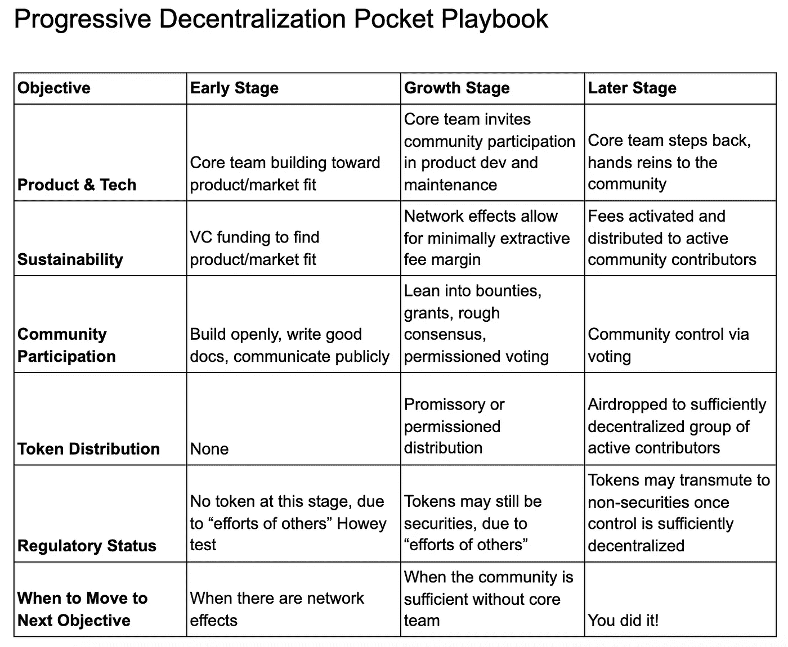
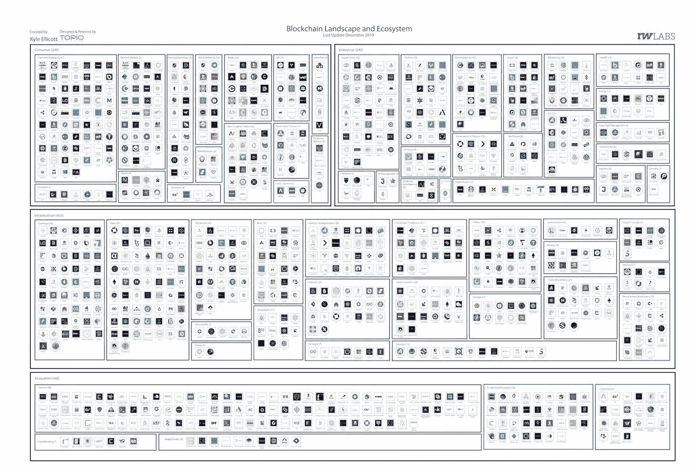

# NBA Contracts Tokenized / Illinois Legalizes Blockchain Contracts / Playbook for Building DApps

> 原文：<https://medium.com/coinmonks/nba-contracts-tokenized-illinois-legalizes-blockchain-contracts-playbook-for-building-dapps-75fbeead8979?source=collection_archive---------2----------------------->

Photo by [Austin Chan](https://unsplash.com/@austinchan?utm_source=unsplash&utm_medium=referral&utm_content=creditCopyText) on [Unsplash](https://unsplash.com/s/photos/inspirational?utm_source=unsplash&utm_medium=referral&utm_content=creditCopyText)

*January 15, 2020*

*The landscape is shaking and moving fast this week! No time to waste, so let’s dive right in on all the recent happenings of the blockchain, DApps & DLT landscapes.* ***NBA*** *Player Spencer Dinwiddie tokenized his player contract. Chinese* ***President Xi Jinping*** *stated in a televised speech that blockchain technology would be officially recognized and supported by the government.* ***Illinois*** *became the latest state to recognize smart contracts and other blockchain-based records as legal instruments.* ***JP Morgan’s*** *blockchain offshoot* ***Kadena*** *launched its public blockchain, adding interoperable smart contract support between the public chain and its private chain counterparts.* ***Ant Financial*** *to launch its enterprise blockchain platform.* ***Telefonica*** *piloting blockchain access to 8,000 Spanish firms.* ***Blockchain*** *tops the list of most in-demand tech skills for 2020\. Scott Kupor of* ***Andreessen Horowitz*** *gives us a playbook for building crypto/DApps, plus the latest in-depth industry thesis from* ***Pantera Capital*** *and much more.*

*我们甚至在大量的研究中找到了临时抱佛脚的余地(* [*Q4 2019 区块链景观*](https://www.topionetworks.com/markets/blockchain-landscape-5bf43854b9abe4633c1f87da)*&*[*DApps 景观*](https://www.topionetworks.com/markets/dapps-stack-landscape-5de8d07eb9abe453e04203f8) *) &书籍(关于* [*数字资产*](https://www.scribd.com/document/430637579/Current-Market-Overview-of-Digital-Assets)*&*[*企业区块链*](https://www.amazon.com/dp/B07Z3LJCHW/ref=cm_sw_r_tw_dp_U_x_C6iSDbACJJN2Z) *)连同对风险投资(新基金+ M)的见解！)、基础设施、DApps、比特币、经济学、交易所和 Stablecoins。为了了解更多信息，让你跟上时代的步伐，这里有一张本周业内热门新闻的快照。*

## 🏀 [NBA 球员的合同令牌化计划可以推进:报道](https://www.coindesk.com/nba-players-contract-tokenization-plan-can-move-forward-reports)

NBA 球员斯宾塞·丁翁迪将可以象征性地签订合同。丁威迪将从 1 月 13 日开始发行与他的合同相关的股票，几个月前，NBA 推迟了他为艺人创造一个基于他们未来收入发行债务工具的象征化平台的计划。丁威迪去年宣布，他将在以太坊区块链剧院象征性地签订一份为期三年、价值 3450 万美元的合同，希望第一年能筹集 1350 万美元……[阅读更多信息](https://www.coindesk.com/nba-players-contract-tokenization-plan-can-move-forward-reports)

## 🇨🇳 [中国和区块链](https://thedailychain.com/chinas-new-stablecoin/)

Recently Chinese President Xi Jinping stated in a televised speech that blockchain technology would be officially recognized and supported by the government. This announcement came as a surprise, considering China’s indecisive stance on cryptocurrencies in the past. However, this represents a significant step forward in creating a healthy environment for state-sponsored blockchain projects within China. This move by the Chinese government may be the push needed for Chinese blockchain and cryptocurrency projects to begin maturing. Since 2015 China has banned, and then un-banned, Bitcoin trading, mining, and usage, resulting in substantial price swings…[read more](https://thedailychain.com/chinas-new-stablecoin/)

## 📈 [Illinois Legalizes Blockchain Contracts](https://www.coindesk.com/illinois-legalizes-blockchain-contracts)

According to The state’s “Blockchain Technology Act,” Illinois became the latest state to recognize smart contracts and other blockchain-based records as legal instruments. A smart contract, a record or signature may not be denied legal effect or enforceability solely because a blockchain was used to create, store, or verify the smart contract, record, or signature…[read more](https://www.coindesk.com/illinois-legalizes-blockchain-contracts)

## 📈 [JP Morgan blockchain offshoot Kadena now fully operational](https://decrypt.co/16687/jp-morgan-blockchain-offshoot-kadena-now-fully-operational)

Crypto startup Kadena’s [public blockchain](https://www.kadena.io/) launched Wednesday, adding interoperable smart contract support between the public chain and its private chain counterparts. The Brooklyn-based offshoot of JPMorgan’s blockchain center announced the launch marks another step in its effort to develop scalable, secure proof-of-work alternatives to the current leading cryptocurrencies ethereum and bitcoin. As part of its efforts in interoperability, [Kadena](https://medium.com/kadena-io) is also integrating its wallet Chainweaver with the [Cosmos Network](https://medium.com/u/e8cb21d22b0b?source=post_page-----75fbeead8979--------------------------------), allowing different blockchains to interact…[read more](https://decrypt.co/16687/jp-morgan-blockchain-offshoot-kadena-now-fully-operational) and [further details here](https://messari.io/article/kadena-launches-full-network-equipped-with-smart-contracts-and-sets-eyes-on-cosmos-integration).

## 🐦 [Twitter 正在考虑一项小费功能:报道](https://www.theblockcrypto.com/linked/52919/twitter-is-considering-a-tipping-feature-report)

据报道，Twitter 正在研究一种新的推文提示选项，改进对巨魔的识别，调整列表等。这项功能将允许用户从他们的推文中互相提示。然而，Twitter 的一位发言人表示，该公司目前并没有开发小费功能……[阅读更多](https://www.theblockcrypto.com/linked/52919/twitter-is-considering-a-tipping-feature-report)

## 📖[区块链的‘幻灭低谷’实际上是‘部署的战壕’](https://www.forbes.com/sites/richardgendalbrown/2020/01/09/blockchains-troughs-of-disillusionment-are-really-the-trenches-of-deployment/)

据区块链和加密行业作家 Richard Gendal Brown 在文章中称，2019 年，许多世界上最大的银行和保险公司安装并调试了他们的企业区块链节点，并使用 Corda 防火墙等功能，通过公共互联网与同行公司进行安全通信。但是公共区块链的主要突破——抗审查的数字现金——从根本上不同于同样的底层技术可以为商业解决的问题，即需要转变整个市场的经济和运作，就像第一次信息技术革命改变了单个公司一样… [阅读更多](https://www.forbes.com/sites/richardgendalbrown/2020/01/09/blockchains-troughs-of-disillusionment-are-really-the-trenches-of-deployment/)

## 🇨🇳 [中国覆盖全国的区块链网络 BSN 将于 2020 年 4 月推出](https://cointelegraph.com/news/chinas-nationwide-blockchain-network-bsn-will-launch-in-april-2020)

中国全国性的区块链网络，基于区块链的服务网络，将于 2020 年 4 月推出。据该高管称，在 2019 年 10 月首次发布网络进行内部测试后，BSN 将于 4 月正式启动商业运营。据 coin telegraph 1 月 6 日报道，中国人民银行开发政府支持的数字货币进展顺利……[阅读更多](https://cointelegraph.com/news/chinas-nationwide-blockchain-network-bsn-will-launch-in-april-2020)

## 📖[美国基金经理向加密发展，智慧树考虑新的稳定币](https://www.coindesk.com/wisdomtree-mulls-new-stablecoin-as-us-money-manager-drives-toward-crypto)

资产管理公司 WisdomTree 计划成为首家向客户提供数字资产和稳定账户的美国金融公司。在一份声明中，公司战略总监 William Peck 表示，我们在现有的加密原生社区中看到了一个市场，今天交易数字资产，从长远来看，这将使我们成为“快速发展的加密市场中的领导者……[阅读更多信息](https://www.coindesk.com/wisdomtree-mulls-new-stablecoin-as-us-money-manager-drives-toward-crypto)

# 本周阅读的研究:

🔥最近，我有机会听到[潘迪拉资本](https://medium.com/u/d25fb22875fb?source=post_page-----75fbeead8979--------------------------------)的[乔伊·克鲁格](https://medium.com/u/ddeb63aca616?source=post_page-----75fbeead8979--------------------------------)在发表了他最新的[论文](/@PanteraCapital/a-crypto-thesis-47eaacf861ca)后，讲述了他对不断发展的行业的想法和见解。虽然深入，并需要一些基本知识，这是一个值得在该行业的任何人广泛阅读。

> “加密是罕见的，因为它将计算机科学和经济学非常紧密地结合在一起，如果你不能两者都正确(即，激励兼容)，那么你的系统将无法工作，或者更糟的是，可能会因攻击而灾难性地失败。”
> 
> “创建分散式应用程序有两种方法。一种是从第一天开始就完全去中心化，另一种是从相对中心化开始，随着时间的推移逐渐变得更加去中心化。”

你可以在这里找到[全文](/@PanteraCapital/a-crypto-thesis-47eaacf861ca)。

# 本周的更多内容:

📖[电信巨头 Telefonica 在 8，000 家西班牙公司试行区块链接入](https://cointelegraph.com/news/telecom-giant-telefonica-pilots-blockchain-access-on-8-000-spanish-firms)

📖[区块链位列 2020 年最受欢迎的技术技能之首](https://news.bitcoin.com/blockchain-tops-the-list-of-most-in-demand-tech-skills-for-2020/)

📖[蚂蚁金服计划在本月推出其企业区块链平台](https://cointelegraph.com/news/ant-financial-aims-to-launch-its-enterprise-blockchain-platform-this-month)

📖[碟网申请基于区块链的防盗版系统专利](https://www.coindesk.com/dish-network-files-patent-for-blockchain-based-anti-piracy-system)

📖[企业以太坊联盟启动区块链互操作试验场](https://www.coindesk.com/enterprise-ethereum-alliance-launches-testing-ground-for-blockchain-interoperability)

📖[将密码经济协议建模为复杂系统](https://thegraph.com/blog/modeling-cryptoeconomic-protocols-as-complex-systems-part-1) [Brandon Ramirez](https://medium.com/u/76484371ee41?source=post_page-----75fbeead8979--------------------------------)

💰 [2019 比特币回顾](/@FidelityDigitalAssets/2019-bitcoin-retrospective-4acad69460d9)由[富达数字资产](https://medium.com/u/3a8b739a08d1?source=post_page-----75fbeead8979--------------------------------)

💰[为什么 2020 年是金融科技和区块链的收购年](https://decrypt.co/16593/why-2020-year-fintech-blockchain-acquistions)

💰 [Coin Metrics 的网络状态](https://coinmetrics.substack.com/p/coin-metrics-state-of-the-network-e70)

💰[中国去年见证了 114 亿美元的秘密资本外逃](https://news.bitcoin.com/china-saw-11-4-billion-in-crypto-based-capital-flight-last-year/)

# 分散式应用程序手表

## 📖[渐进分散化:构建加密应用的剧本](https://a16z.com/2020/01/09/progressive-decentralization-crypto-product-management/)

[Source](https://a16z.com/2020/01/09/progressive-decentralization-crypto-product-management/)

安德里森·霍洛维茨律师事务所(Andreessen Horowitz)的管理合伙人斯科特·库波尔(Scott Kupor)此前曾写道，代币通常会被定性为证券。然而，如果网络足够分散，网络启动后；令牌的性质可以从安全变为非安全，因为令牌的持有者不再依赖他人的努力。本文还揭示了在区块链计算机上运行的任何成功的应用程序将如何具有这三个组件。产品/市场匹配、社区参与和充分的分散化(社区所有权)……[阅读更多](https://a16z.com/2020/01/09/progressive-decentralization-crypto-product-management/)

## 📖[清算者:帮助 DeFi 功能的秘密鲸鱼](/dragonfly-research/liquidators-the-secret-whales-helping-defi-function-acf132fbea5e)

清算人是 DeFi 领域中未被充分审查的参与者，他们像矿工和验证者一样，在幕后工作，以保持整个系统的运转，并因此获得丰厚的回报。然而，与采矿者和验证者不同的是，清算者实际上不需要前期资本投资，他们创造了一个由专业人士组成的生态系统，这些专业人士可能在世界上的任何地方工作，完全匿名，获得报酬以保持市场的偿付能力……[阅读更多](/dragonfly-research/liquidators-the-secret-whales-helping-defi-function-acf132fbea5e)和更多由[汤姆·施密特](https://medium.com/u/b7b7c70688fb?source=post_page-----75fbeead8979--------------------------------)

## 📖[2019 年游戏使用量超过 dApp，但 DeFi 创造了更多价值](https://cryptobriefing.com/gaming-top-dapp-2019-defi-value/)

根据 DappRadar 的 2019 年行业评论，与竞争智能合约平台相比， [DappRadar](https://medium.com/u/b355b203c3dd?source=post_page-----75fbeead8979--------------------------------) 报告了以太坊区块链上的 DeFi、交易所、赌博和游戏领域的广泛用户活动。DeFi 和交易所创造了最大的价值，游戏和赌博行业的用户活动也更高……[阅读更多信息](https://cryptobriefing.com/gaming-top-dapp-2019-defi-value/)

## 📖[三星区块链手机将搭载埃尔隆德项目的游戏应用](https://www.theblockcrypto.com/post/52590/samsung-blockchain-phones-set-to-feature-elrond-projects-gaming-app)

根据 Block 的消息，总部位于欧洲的[埃尔隆德网络](https://medium.com/u/6fa1f4ff263b?source=post_page-----75fbeead8979--------------------------------)证实其游戏应用程序计划于今年通过三星 Galaxy Store 在 Q1 推出。埃尔隆德之战是一款手机多人游戏应用，玩家可以通过击败敌人获得 ERD，埃尔隆德的创始人兼首席执行官 [Beniamin Mincu](https://medium.com/u/7c35fe94b25?source=post_page-----75fbeead8979--------------------------------) 说……[阅读更多](https://www.theblockcrypto.com/post/52590/samsung-blockchain-phones-set-to-feature-elrond-projects-gaming-app)

📖[勇敢者的鸿运之年，以及为什么 2020 年有望更好](https://decrypt.co/15749/braves-bonanza-year-and-why-2020-promises-to-be-better-still)

📖 [Polkadot 的消息传递方案](/web3foundation/polkadots-messaging-scheme-b1ec560908b7)由 [Web3 基金会团队](https://medium.com/u/d6954f1a46d9?source=post_page-----75fbeead8979--------------------------------)

📖[叙事手表:狩猎为 Crypto 的黑仔应用](https://www.coindesk.com/narrative-watch-the-hunt-for-cryptos-killer-app)作者[纳撒尼尔·惠特莫尔](https://medium.com/u/1b4838316374?source=post_page-----75fbeead8979--------------------------------)

# 📺收听:

这个星期，我为你的聆听耳朵准备了一个双重镜头。首先，帮你自己一个忙，每天从纳撒尼尔·惠特莫尔的每日 T2 播客开始。在你看完第一集《崩溃》之后，请排队观看《危机边缘》中的最新一集 [**和《城堡岛》**](https://podcasts.apple.com/us/podcast/ryan-selkis-messari-ep-33/id1480586463?i=1000462346016) ，其中有[梅萨里](https://medium.com/u/7cf93d3c3400?source=post_page-----75fbeead8979--------------------------------)的[瑞安·塞尔基斯](https://medium.com/u/6ea4a7e0c022?source=post_page-----75fbeead8979--------------------------------)。尽情享受吧！

> *👉下载新版* [*区块链为基础设施景观*](https://www.topionetworks.com/events/5d79268b78e00230faba6f77) *Q4 2019 版&* [*DApps“栈”景观*](https://www.topionetworks.com/markets/dapps-stack-landscape-5de8d07eb9abe453e04203f8)

**Q4 2019 Edition** of the Blockchain for Infrastructure & Ecosystem Landscape

不想等到下周，[现在就订阅](http://click1.m.readwritelabs.com/xsdqkbbrgsdtqkmntpjlstcnkytvpvphsnhsqlvbrhhd_yfqbfcmslnskglmckvqv.html?source=post_page---------------------------)📥有关区块链、DApps 等的实时行业见解！

Coinmonks

> [直接在您的收件箱中获得最佳软件交易](https://coincodecap.com/?utm_source=coinmonks)

