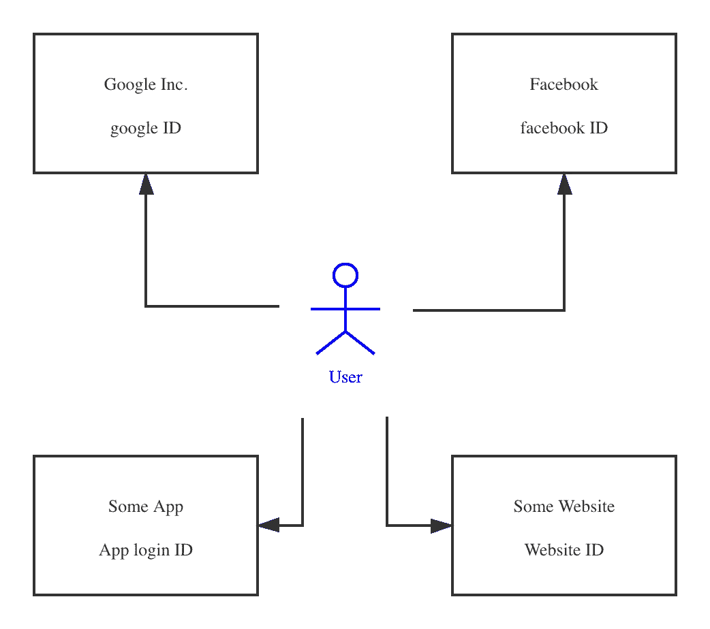
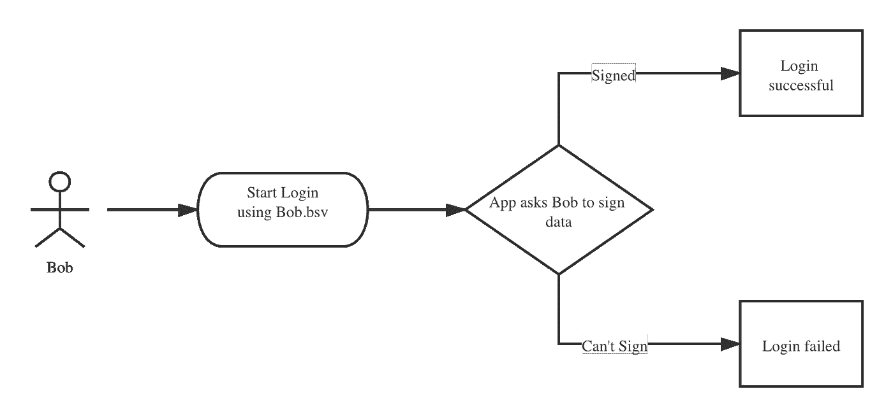

# NBdomain:您拥有的全局 ID

> 原文：<https://medium.com/coinmonks/nbdomain-a-global-id-owned-by-you-26539e05245?source=collection_archive---------0----------------------->

在 NBdomain 的[介绍帖](/@NBdomain/nbdomain-blockchain-domains-for-a-better-internet-bcd07213ef5c)中，我们提到 NBdomain 不仅可以修复传统领域系统存在的问题，还可以提供令人兴奋的新功能。NBdomain 的扩展用途之一是创建一个由用户拥有的全局 ID。

# 我们真的拥有自己的身份证吗？

Current ID system

我们有很多 id，从谷歌账户到某个已被遗忘的网站的账户。但是如果我们问自己，我们真的拥有这些身份证吗？答案是否定的。id 归创建它们的公司/实体所有。该 ID 可以很容易地被禁用/删除或转移，无需用户同意。

不拥有你的 ID 意味着你可能会失去由那个 ID 创造的一切，这每天都在发生。如果相应的 ID 被公司禁用或删除，人们就会失去他们的博客、推文、联系、照片。

不拥有您的 ID 也意味着您没有办法证明由 ID 创建的任何活动/IP 的所有权。这就是为什么在某些情况下需要 KYC，但代价是失去人们的隐私。

拥有一个用户自己拥有的 ID 是连接下一代互联网的一个非常重要的环节。

# NBdomain 提供了一个解决方案

在 NBdomain 系统中，每个用户的所有权都记录在区块链上，这可以通过他/她的私钥/公钥对来进行数学证明。

假设一个用户 Bob 在 NBdomain 上注册了一个域名 Bob.bsv。我们可以肯定的说，域名 Bob.bsv 是用户 Bob 所有的。并且 Bob 可以通过他的私钥来验证他的所有权。

因此，Bob 可以使用 Bob.bsv 作为他的全局 ID。

可以构建一个应用程序来接受 Bob.bsv 作为登录名，并要求 Bob 签署一份数据来证明他的所有权。如果他可以证明，他将能够登录到应用程序。

Brief login flow using NBdomain

通过使用 Bob.bsv 作为他的全局 ID，Bob 现在拥有了一个属于他自己而不是其他公司的 ID。没有人可以修改或删除他的 ID，因为它永远保存在区块链。随着越来越多的应用程序支持这种登录方法，Bob 可以不必记住不同应用程序的不同 id，从而感到轻松。

# 为什么应用程序应该支持 NBdomain 作为 ID？

从应用程序的角度来看，接受 NBdomain 作为 ID 系统有很多好处。

1.  性价比高:如果使用 NBdomain 作为 ID 系统，app 可以节省大量时间，避免开发一个账号系统，可能会耗费一些时间和金钱。尤其是创业公司，一分钱一分货。更不用说维护这样的系统还会有持续的成本。
2.  高安全性:NBdomain 建立在区块链之上，其安全级别远远高于中小型公司在 T2 建立和维护的 T3。
3.  吸引更多用户:对于现有的 NBdomain 用户，他们可以登录应用程序**，而根本不需要注册**。众所周知，注册是吸引用户的一大障碍。通过取消注册阶段，该应用程序可以吸引多达 50%的用户。
    所有启用了 NBdomain ID 的应用都将拥有一个共同的用户群，随着生态系统中更多应用的出现，这个用户群将与日俱增。

# 摘要

NBdomain 可用作全球 ID，归用户所有，而非公司所有。这不仅可以让用户省去记住不同 id 的麻烦，还可以帮助应用程序扩大用户群，降低成本。

阿尔法测试现在开始，请[加入我们](https://t.me/nbdomain)。

> [直接在您的收件箱中获得最佳软件交易](https://coincodecap.com/?utm_source=coinmonks)

