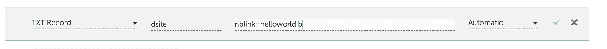
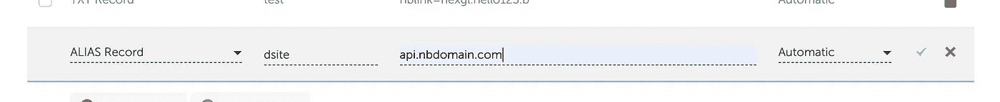
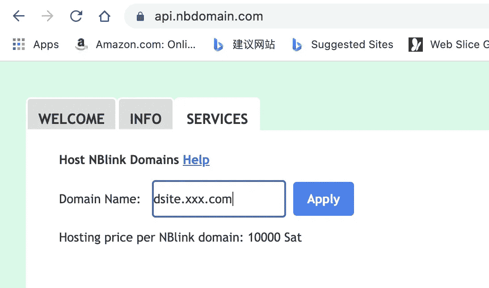

# NBlink:将任何域链接到分散式网络

> 原文：<https://medium.com/coinmonks/nblink-link-any-domain-to-the-decentralized-web-5beea0621afc?source=collection_archive---------6----------------------->

去中心化的网络——又名 **Web3** 即将到来。多亏了 NBdomain，建立一个去中心化的站点从来没有[这么容易](/coinmonks/build-decentralized-web-with-nbdomain-b1f7c6980d82)。

但是，仍然有一个不便之处。要访问 NBdomain 支持的网站，人们要么需要使用特定的浏览器——[傲游浏览器](http://www.maxthon.com)，为谷歌 Chrome 安装[插件](https://chrome.google.com/webstore/detail/nbdomain/pblhkipfpdimkeddffljpkjgpgeigmik)，要么使用类似[https://api.nbdomain.com](https://api.nbdomain.com)的网关服务。

在本文中，我们将介绍一种新技术——NBlink，它能够将任何域链接到分散的 web。意味着用户可以使用任何传统域和任何浏览器访问 NBdomain 支持的网站。

以下是如何:

1.  请确保分散站点已启动并运行。[检查此](/coinmonks/build-decentralized-web-with-nbdomain-b1f7c6980d82)了解详情。让我们假设使用的 NBdomain 是 **helloworld.b**
2.  决定你想要链接到分散站点的域，例如:**dsite.xxx.com**。
3.  转到 xxx.com 的 DNS 管理面板。
    为 **xxx.com 添加新的 TXT 记录:** 子域:dsite
    值:nblink=helloworld.b

4.为 **xxx.com 添加新的别名记录:** 子域:dsite
值:api.nbdomain.com
注意:如果你的 DNS 后端不支持别名记录，可以添加一条 A 记录，使用**api.nbdomain.com**的 IP 地址

5.打开[https://api.nbdomain.com](https://api.nbdomain.com)(或任何其他 NBnode 服务器)并转到**服务**

输入**dsite.xxx.com**并点击应用。将收取少量费用以避免滥用服务。

6.等待 1 或 2 分钟。

7.打开[https://dsite.xxx.com](https://dsite.xxx.com)，你将能够看到你的分散站点。

# NBlink 供电网站的优势:

1.  **成本极低:**
    NBdomain 成本:0(如果使用免费域)
    托管成本:0(如果在自己的机器上托管 IPFS 节点或者使用免费服务)
2.  **灵活:** 你随时可以零成本更新网站内容。
3.  **可访问且抗审查:** 由于 NBnode 是去中心化的，如果一个节点宕机或运行缓慢，你随时可以用另一个节点替换。
4.  **快速:** NBnode 会自动检测并使用最快的连接。

有什么问题吗？请加入我们的电报组[https://t.me/nbdomain](https://t.me/nbdomain)或社区论坛[https://c.nbdomain.com](https://c.nbdomain.com)