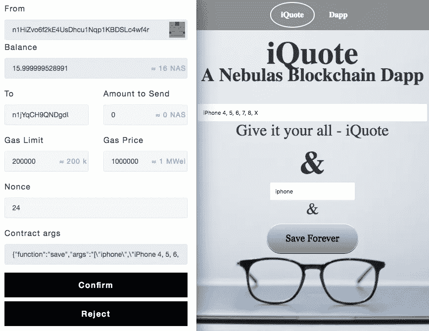
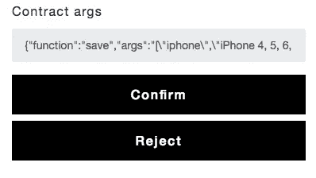
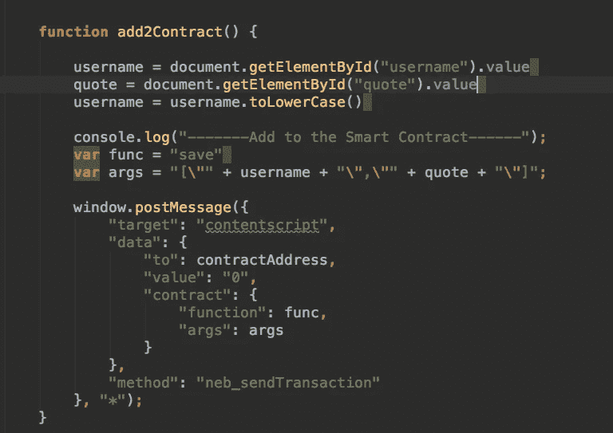
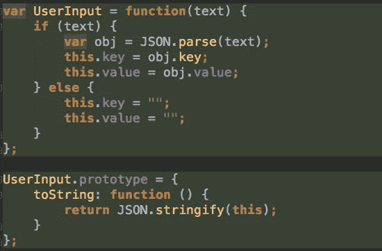
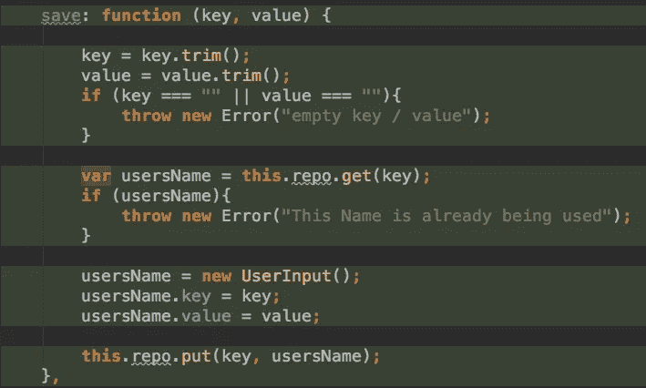
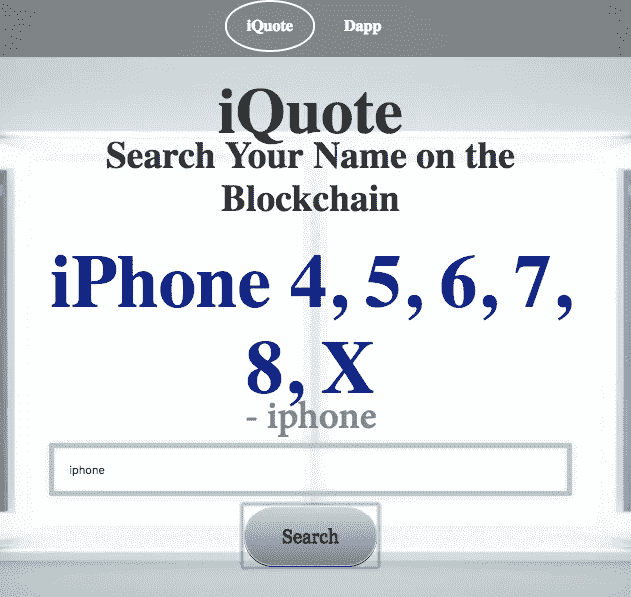
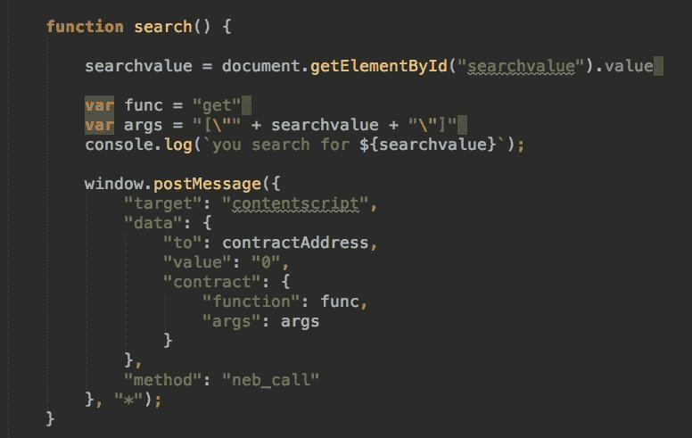
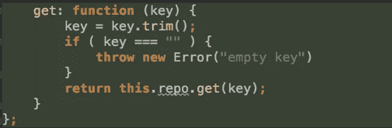
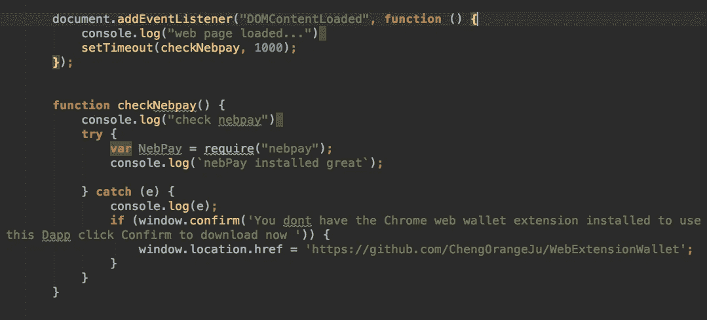

# 星云 Dapps —第二部分

> 原文：<https://medium.com/coinmonks/nebulas-dapps-part-2-51d109242d5f?source=collection_archive---------5----------------------->

## 第二部分:在星云上建造 Dapps。续自 Dapps**P**[art 1](/@ottokafka/dapp-tutorial-72f0ae39f538)。

Nebulas 有一个 Dapp 的钱送人。开发一个 Dapp，提交，得到 100 个 NAS。[链接](https://incentive.nebulas.io/signup.html?invite=vQ9hs)

让我们继续学习如何构建这些 Dapps。

[代码源](https://github.com/ottokafka/iQuote)和 [Dapp](https://ottokafka.github.io/iQuote/)

iQuote [Dapp Here](https://ottokafka.github.io/iQuote/)

为了将应用程序标记为 Dapp，它必须与智能合约通信。

例如:我们添加 iPhone 作为名称，iPhone 4，5，6，7，8，X 作为报价。之后，我们点击**永久保存**按钮，这将打开您在图片左侧看到的网络钱包扩展。让我们检查下图中的合同参数。

**合约参数:**这里我们看到**函数保存**的名称为— iPhone，报价为 iPhone 4，5，6。**功能保存**是一个智能合同功能，用于保存我们的文本。

分解与智能合约交互的前端 JavaScript。

**add 2 contact**功能:

**add2Contract** 函数将在 **window.postMessage** 的帮助下，通过与智能合约交互，向区块链添加名称和消息

**window.postMessage** 与下面的智能合约通信

**保存**功能

这里的**保存**功能允许我们将键和值保存到区块链。基本上，**保存**函数接受一个键和值字符串。它检查这个键以前是否被使用过，如果没有，就把这个键和值放到区块链中。

下面的智能合同

**搜索**功能

**搜索**功能与 Nebulas 智能合约交互。尝试搜索 iphone。

该功能允许您搜索在区块链 Nebulas 上输入的姓名。下面是用于与智能合约通信的前端代码。

下面的代码是智能契约的一部分，它允许用户搜索名称。**键**为名称。

下面的函数检查页面是否被加载，然后运行 **checkNebPay**

**checknebbay**检查你是否安装了**网络钱包扩展**如果没有，给出警告和下载链接。

Web app +智能合约= Dapp

有了这些知识，你可以很容易地建立一个简单的游戏，并保存用户的分数+名称到区块链。这是获得 NAS 的简单方法。你甚至可以不加修改地使用我的智能合同。