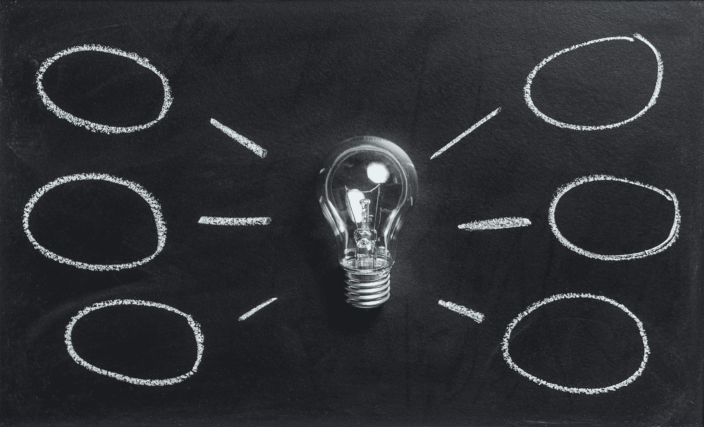
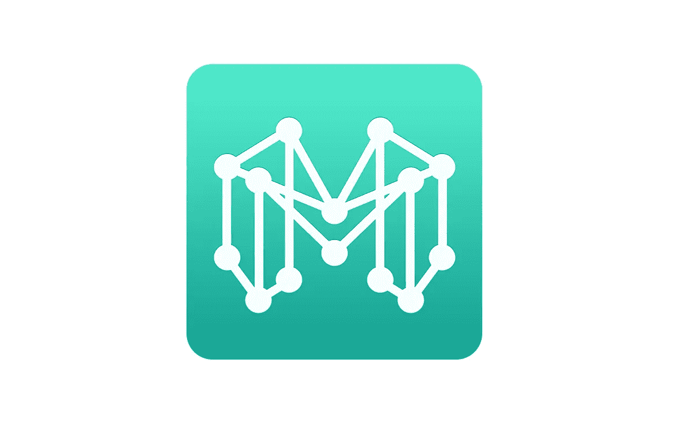
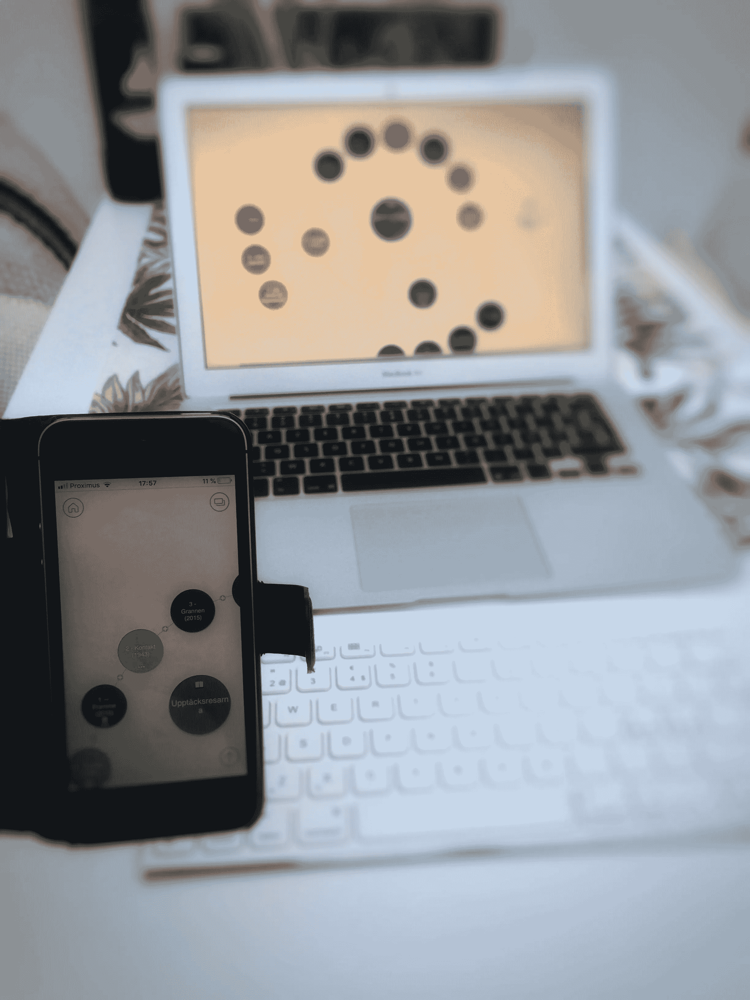

# 需要一个很棒的思维导图应用程序——不要再搜索了！

> 原文：<https://medium.com/coinmonks/need-a-great-mind-mapping-application-search-no-more-d951fc47e2ae?source=collection_archive---------4----------------------->

## …以及我们如何有效地捕捉想法而不失去对想法的考验

*Pixabay*

> `"A picture is worth a thousand words"`
> 
> `English language idiom`

## 什么是好的思维导图应用？

一个伟大的思维导图工具是什么样子的？这不是一个只有一个简单答案的简单问题。回答的数量将接近被问的人数。对某些人有用的东西，对其他人来说就不太好了。当然，我们都有自己特定的偏好，因为创造力是如此的个人化。

有些人可能会说，“为什么不简单地使用纸和笔呢？”

令人愉快的是，有很多人更喜欢传统的纸和笔来完成这种任务。即使在“无纸化办公”和环保意识的时代。

结论将是拥有一个像笔和纸体验一样自然和简单的工具。

*Pixabay*

## 我发现了什么

就个人而言，思维导图工具让我着迷。然而，直到几天前，我从未找到一个完整的解决方案。笔记应用程序当然，有很多。但是当一个应用程序拥有一个聪明的界面时，它能以各种形状(圆形、椭圆形、盒子……你能想到的)有效地捕捉想法并逻辑地连接它们吗？目前还没有。如果这是一个免费的版本，或者我不得不为它付费，那就没什么作用了。它运行的操作系统也是如此，该系统已经在 Windows、Linux 和 Mac 上进行了广泛的测试。当然，如果我花了钱，几天之内我又回到了纸和笔的世界，那就更令人失望了。

我开始相信并不真的需要这样的工具。这更像是获得另一个“酷”应用程序来“玩”的想法。像任何小玩意一样。我知道，我就是那样的怪胎。哦，我有没有提到，我对 *Visio* 和制作流程图很着迷。

这提醒了我，在我继续之前，没有人付钱给我为这篇文章中提到的任何产品做营销。当我在做的时候，这不是一篇深入的产品评论。

现在，那不碍事了…

Mindly

## 盲目地——解决方案

归根结底，这是一个解决方案，可以轻松地捕捉和联系笔记和想法，而不会分心。这种工具经常在会议或头脑风暴会议中使用，在这些会议中，不要打断思想的尝试是很重要的。如果它能安全地保持您的作品可供其他设备访问，那就更好了。能够轻松分享你的作品被证明是一个期望的功能。是的，你可能感觉到了我的建立，名为*的应用程序无意识地做了所有这些。根据我的拙见，它不仅仅是做了，而且用直观的巧妙设计做得非常出色。它不仅仅是我们所知的传统思维导图工具。要对它进行分类，我会说它介于思维导图工具和笔记应用之间。*

由涂料公司 Dripgrind OY 开发。他们在 iOS 和 Android 平台上做“移动应用开发”。点击阅读更多关于[公司的信息。](http://dripgrind.com/site/index.html)

目前，有三种风格的应用程序(或者像 Dripgrind 所说的“研磨”)——*mind ly*、 *Mindly Plus* 和 *Mindly For Mac* 。免费版本是 *Mindly* grind，可以在 iOS 和 Android 手机和平板电脑上使用。在撰写本文时， *Mindly Plus* 的价格为 7，99 €，而 *Mindly For Mac* 的价格为 32.99 €。免费版本中最明显的限制是最多三个文档和 100 个元素的限制。点击阅读更多关于这个伟大应用[的特性。](http://www.mindlyapp.com/features)

到目前为止，我一直在使用免费版，享受之前解释的所有功能。通过 iCloud 或 Dropbox 在我的 iPhone 和 iPad 上同步，让在多台设备上工作看起来很透明。每次使用它，我都会发现一个新的直观功能。就在今天，我分享了手机上的一份文档，并在我的 MacBook 上展示了它。能够在团队中快速分享是非常有用的。怎么会？我使用功能*共享*，通过隔空投送选择 PDF 格式，包括所有带注释的元素(方便地在单独的页面上)。很简单——就应该是这样！

*Sharing from phone*

还是比纸笔强多了。