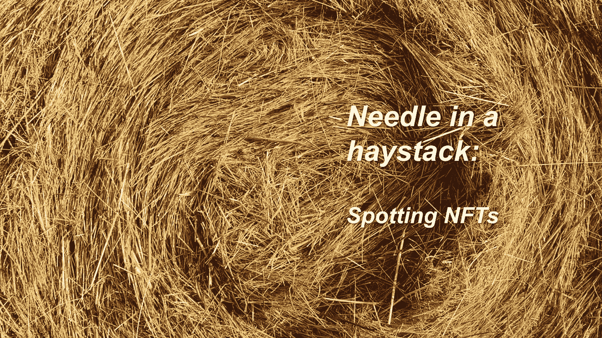
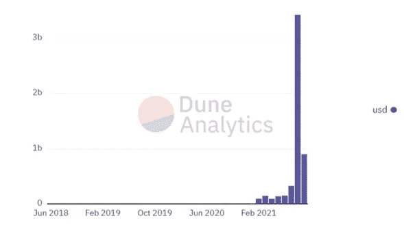
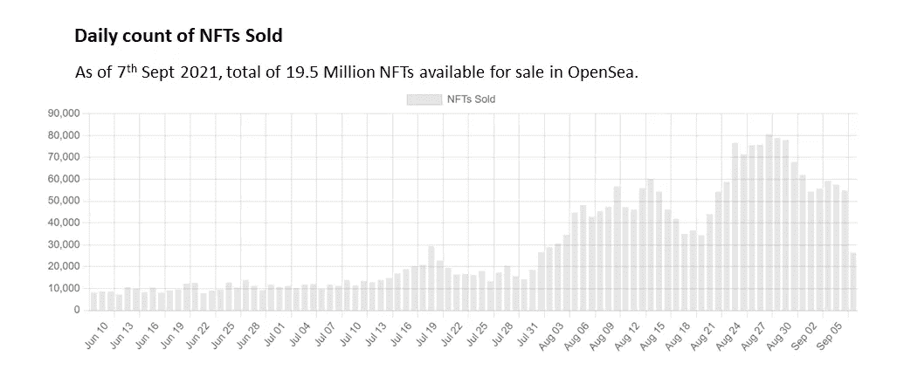
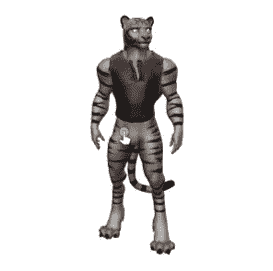
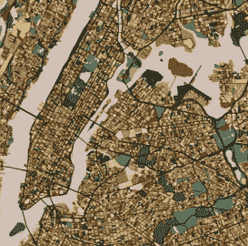

# 大海捞针:发现 NFT

> 原文：<https://medium.com/coinmonks/needle-in-a-haystack-spotting-nfts-792ea7e3739a?source=collection_archive---------6----------------------->

CryptoKitties 于 2017 年发布，是最早的 NFTs 实验之一。它们是使小猫外表随机化的代码的输出，也是小猫后代的输入。这证明了 NFT 市场的可行性。

今天，投资者在数字艺术上花费了数千万美元。你会熟悉稀缺资产和资源往往具有价值的观点。可证明的稀缺性、不变性和可编程性只是 NFT 产生价值的几个方面。

根据 Dune Analytics 的数据，最大的不可伪造代币市场 OpenSea 在 8 月份的交易额达到 34 亿美元，是 7 月份的 10 倍多。

NFTs 是一个快速增长的市场。数据显示了对不可伪造代币前所未有的兴趣——为什么？因为人类是[追求地位的](https://www.nytimes.com/2021/08/12/technology/penguin-nft-club.html?)生物，总是在寻找新的方法来提升自己的地位。

NFTs 的主要优势是代表和验证区块链中唯一资产的所有权。记录不能被修改 NFTs 的这种独一无二的性质允许资产被认为是有价值的。《50 英尺区块链的攻击》的作者戴维·杰拉德表示，他认为 NFTs 是在购买“[官方收藏品](https://www.bbc.com/news/technology-56371912)”，类似于交易卡。

# #发现 NFT:

随着数百万 NFT 的流通和每周数百个新 NFT 项目的启动，很难发现好的 NFT 项目，或者很容易忽视最好的 NFT 项目。这是一个被低估的项目的汇编，但我相信有强大的基础(基于社区支持，开发者(或创造者)对产品和艺术的持续关注)。

# 第一名 TigerGuild

许多非功能性交易都是一个更大机会的一部分:元宇宙。正如始于 20 世纪 90 年代的书籍和电影中的概念，元宇宙是我们物理世界的虚拟替代物，可能是下一个版本的互联网。脸书首席执行官马克·扎克伯格最近表示，这家社交网络将转向成为一家“元宇宙公司”。

多年来，技术专家一直在预测“元宇宙”的崛起，这是一个在线数字世界，用户将拥有独立于离线自我的身份。3D NFTs 可以被视为采用下一代互联网的一步到位。

与常规的 NFT 收藏品不同，3D 收藏品允许一定程度的交互性，因为它可以放在任何共享的 3D 空间中，包括虚拟和增强现实应用程序、游戏、动画和电影。TigerGuild 是对这个 3D NFT 空间的押注。

**创作 3D 艺术需要大量的技巧:**3D 作品增加了深度和真实感，这在 2D 工作时是非常难以捕捉的，Tiger Guild 的开发人员为实现这一效果做了令人惊叹的工作。

每只老虎的 3D NFT 都是由超过 350 种属性/特征的混合物通过算法生成的，这使得每个 minter 都可以收到一个完全独特的 3D 老虎模型。这一壮举是通过老虎协会团队开发的罕见算法实现的。

# #2 阿尔托市

今天，艺术家们将[的想法和方法](https://www.artnews.com/list/art-in-america/features/generative-art-and-nfts-1234586572/itzel-yard-afro-netrunner/)从创造性编码的悠久传统带到了 NFTs 领域，这看起来很合适。用代码制作的艺术品正在用代码制作的交易所交易。虽然画廊可能会担心如何出售软件、印刷品或其他东西等生成性作品，但 NFTs 的词汇提供了一个简单的解决方案:收藏家不购买系统，而是购买一个代表它的令牌。

奥拓城是对这种“数字艺术形式”的押注。奥拓城是以太坊区块链上 [15 900 个生成艺术](https://altocity.io/gallery)NFT 的集合。每一个 NFT 都以艺术的形式代表了世界上一个城市的地图。

这个项目的艺术部分花了整整两年多一点的时间。这是第一个 NFT 项目，附带一套将向 NFT 所有者出售并支付版税的实物产品。

这一独特的概念围绕着这样一个理念，即 NFT 收藏家可以感受到与品牌更深层次的联系，这将转化为更高的客户忠诚度。

# #3 足球狗

虽然从金融角度来看，一件收藏品没有内在价值，但鉴于买家对该物品的个人感觉，它可能有一些内在价值，这就是为什么对任何临时收藏家来说，第一条规则是购买你真正喜欢的东西。

为什么我喜欢足球狗——与大多数 NFT 项目不同的是，[足球狗](https://www.soccerdogeclub.com/)的创作者并没有复制 BAYC 来采用激光眼或金色皮毛或任何其他种类的 BAYC 特征——这是一个完整的独特系列。足球总督俱乐部于 2021 年 7 月由区块链联邦理工学院的算法生成的 10，000 个独特的 NFT 集合而成。

# #摘要:

元宇宙爱好者认为，我们的数字身份最终将变得和我们的离线自我一样有意义——他们预测，我们将把 NFT 放在我们的虚拟缩放背景中，而不是把艺术放在我们家的墙上。

随着数以百万计的 NFT 在流通，每月有数百个新的 NFT 项目推出，要找到一个好的 NFT 已经变得不可能了。这就像大海捞针。作者试图揭示一些被低估的 NFT 项目，这些项目具有强大的基础(基于社区支持、开发者(或创造者)对产品和艺术的持续关注)。

PS:虽然从金融角度来看，收藏品没有内在价值，但考虑到买家对该物品的个人感受，它可能有一些内在价值，这就是为什么任何休闲收藏家的第一条规则是购买你真正喜欢的东西。

> 加入 [Coinmonks 电报频道](https://t.me/coincodecap)，了解加密交易和投资

## 另外，阅读

*   [尤霍德勒 vs 科恩洛安 vs 霍德诺特](/coinmonks/youhodler-vs-coinloan-vs-hodlnaut-b1050acde55a) | [隐蝠 vs 哈斯博特](https://blog.coincodecap.com/cryptohopper-vs-haasbot)
*   [币安 vs 北海巨妖](https://blog.coincodecap.com/binance-vs-kraken) | [美元成本平均交易机器人](https://blog.coincodecap.com/pionex-dca-bot)
*   [如何在印度购买比特币？](/coinmonks/buy-bitcoin-in-india-feb50ddfef94) | [WazirX 审核](/coinmonks/wazirx-review-5c811b074f5b) | [BitMEX 审核](https://blog.coincodecap.com/bitmex-review)
*   [比特币主根](https://blog.coincodecap.com/bitcoin-taproot) | [Bitso 评论](https://blog.coincodecap.com/bitso-review) | [排名前 6 的比特币信用卡](/coinmonks/bitcoin-credit-card-bc8ab6f377c6)
*   [双子座 vs 比特币基地](https://blog.coincodecap.com/gemini-vs-coinbase) | [比特币基地 vs 北海巨妖](https://blog.coincodecap.com/kraken-vs-coinbase) | [硬币罐 vs 硬币点](https://blog.coincodecap.com/coinspot-vs-coinjar)
*   [印度密码交易所](/coinmonks/bitcoin-exchange-in-india-7f1fe79715c9) | [比特币储蓄账户](/coinmonks/bitcoin-savings-account-e65b13f92451) | [Paxful 审核](/coinmonks/paxful-review-4daf2354ab70)
*   [杠杆令牌](/coinmonks/leveraged-token-3f5257808b22) | [最佳加密交易所](/coinmonks/crypto-exchange-dd2f9d6f3769) | [AscendEX 评论](/coinmonks/ascendex-review-53e829cf75fa)
*   [Godex.io 审核](/coinmonks/godex-io-review-7366086519fb) | [邀请审核](/coinmonks/invity-review-70f3030c0502) | [BitForex 审核](https://blog.coincodecap.com/bitforex-review) | [HitBTC 审核](/coinmonks/hitbtc-review-c5143c5d53c2)
*   [Crypto.com 费用](/coinmonks/binance-fees-8588ec17965) | [僵尸密码审查](/coinmonks/botcrypto-review-2021-build-your-own-trading-bot-coincodecap-6b8332d736c7) | [替代品](https://blog.coincodecap.com/crypto-com-alternatives)
*   [有哪些交易信号？](https://blog.coincodecap.com/trading-signal) | [Bitstamp vs 比特币基地](https://blog.coincodecap.com/bitstamp-coinbase) | [买索拉纳](https://blog.coincodecap.com/buy-solana)
*   [ProfitFarmers 回顾](https://blog.coincodecap.com/profitfarmers-review) | [如何使用 Cornix Trading Bot](https://blog.coincodecap.com/cornix-trading-bot)
*   [MXC 交易所评论](/coinmonks/mxc-exchange-review-3af0ec1cba8c) | [Pionex vs 币安](https://blog.coincodecap.com/pionex-vs-binance) | [Pionex 套利机器人](https://blog.coincodecap.com/pionex-arbitrage-bot)
*   [我的密码交易经验](/coinmonks/my-experience-with-crypto-copy-trading-d6feb2ce3ac5) | [《比特币基地评论》](/coinmonks/coinbase-review-6ef4e0f56064)
*   [CoinFLEX 评论](https://blog.coincodecap.com/coinflex-review) | [AEX 交易所评论](https://blog.coincodecap.com/aex-exchange-review) | [UPbit 评论](https://blog.coincodecap.com/upbit-review)
*   [AscendEx 保证金交易](https://blog.coincodecap.com/ascendex-margin-trading) | [Bitfinex 赌注](https://blog.coincodecap.com/bitfinex-staking) | [bitFlyer 评论](https://blog.coincodecap.com/bitflyer-review)
*   [麻雀交换评论](https://blog.coincodecap.com/sparrow-exchange-review) | [纳什交换评论](https://blog.coincodecap.com/nash-exchange-review)
*   [加密货币储蓄账户](/coinmonks/cryptocurrency-savings-accounts-be3bc0feffbf) | [赌注加密](https://blog.coincodecap.com/staking-crypto) | [加密交易机器人](https://blog.coincodecap.com/best-crypto-trading-bots)
*   [BigONE 交易所评论](/coinmonks/bigone-exchange-review-64705d85a1d4) | [CEX。IO 审查](https://blog.coincodecap.com/cex-io-review) | [交换区审查](/coinmonks/swapzone-review-crypto-exchange-data-aggregator-e0ad78e55ed7)
*   [最佳比特币保证金交易](/coinmonks/bitcoin-margin-trading-exchange-bcbfcbf7b8e3) | [比特币保证金交易](https://blog.coincodecap.com/bityard-margin-trading)
*   [加密保证金交易交易所](/coinmonks/crypto-margin-trading-exchanges-428b1f7ad108) | [赚取比特币](/coinmonks/earn-bitcoin-6e8bd3c592d9) | [Mudrex 投资](https://blog.coincodecap.com/mudrex-invest-review-the-best-way-to-invest-in-crypto)
*   [WazirX vs CoinDCX vs bit bns](/coinmonks/wazirx-vs-coindcx-vs-bitbns-149f4f19a2f1)|[block fi vs coin loan vs Nexo](/coinmonks/blockfi-vs-coinloan-vs-nexo-cb624635230d)
*   [BlockFi 信用卡](https://blog.coincodecap.com/blockfi-credit-card) | [如何在币安购买比特币](https://blog.coincodecap.com/buy-bitcoin-binance)
*   [火币交易机器人](https://blog.coincodecap.com/huobi-trading-bot) | [如何购买 ADA](https://blog.coincodecap.com/buy-ada-cardano) | [Geco？一次回顾](https://blog.coincodecap.com/geco-one-review)
*   [加密副本交易平台](/coinmonks/top-10-crypto-copy-trading-platforms-for-beginners-d0c37c7d698c) | [五大 BlockFi 替代方案](https://blog.coincodecap.com/blockfi-alternatives)
*   [CoinLoan 审核](https://blog.coincodecap.com/coinloan-review)|[Crypto.com 审核](/coinmonks/crypto-com-review-f143dca1f74c) | [火币保证金交易](/coinmonks/huobi-margin-trading-b3b06cdc1519)
*   [Bybit vs 币安](https://blog.coincodecap.com/bybit-binance-moonxbt)|[stealth x 回顾](/coinmonks/stealthex-review-396c67309988) | [Probit 回顾](https://blog.coincodecap.com/probit-review)
*   [顶级付费加密货币和区块链课程](https://blog.coincodecap.com/blockchain-courses)
*   [在美国如何使用 BitMEX？](https://blog.coincodecap.com/use-bitmex-in-usa) | [BitMEX 评论](https://blog.coincodecap.com/bitmex-review)
*   [最佳免费加密信号](https://blog.coincodecap.com/free-crypto-signals) | [YoBit 评论](/coinmonks/yobit-review-175464162c62) | [Bitbns 评论](/coinmonks/bitbns-review-38256a07e161)
*   [OKEx 评论](/coinmonks/okex-review-6b369304110f) | [Kucoin 交易机器人](/coinmonks/kucoin-trading-bot-automate-your-trades-8cf0ca2138e0) | [期货交易机器人](/coinmonks/futures-trading-bots-5a282ccee3f5)
*   [AscendEx Staking](https://blog.coincodecap.com/ascendex-staking)|[Bot Ocean Review](https://blog.coincodecap.com/bot-ocean-review)|[最佳比特币钱包](https://blog.coincodecap.com/bitcoin-wallets-india)
*   [霍比审核](https://blog.coincodecap.com/huobi-review) | [OKEx 保证金交易](https://blog.coincodecap.com/okex-margin-trading) | [期货交易](https://blog.coincodecap.com/futures-trading)
*   [比特币基地赌注](https://blog.coincodecap.com/coinbase-staking) | [热点评论](/coinmonks/hotbit-review-cd5bec41dafb) | [库币评论](https://blog.coincodecap.com/kucoin-review)