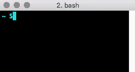
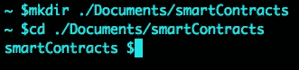
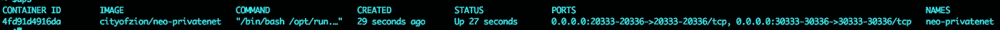
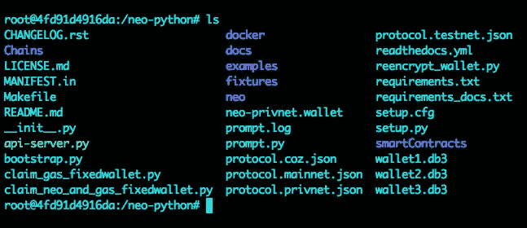
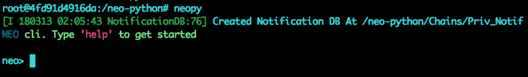
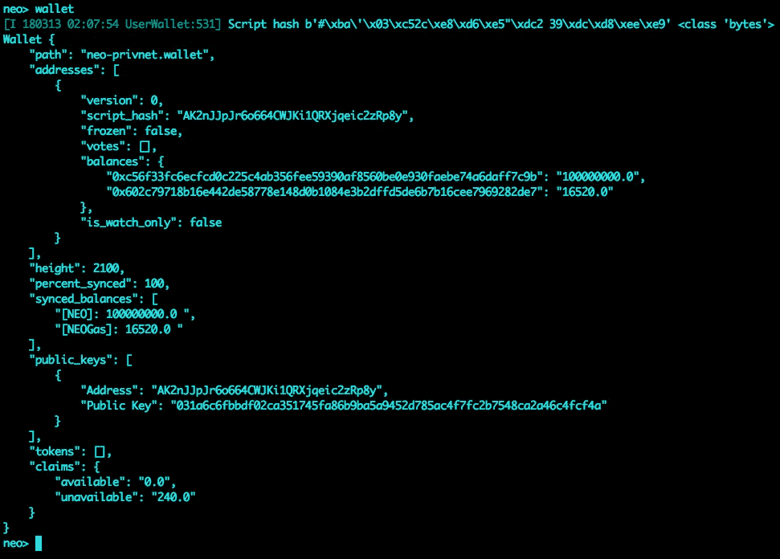
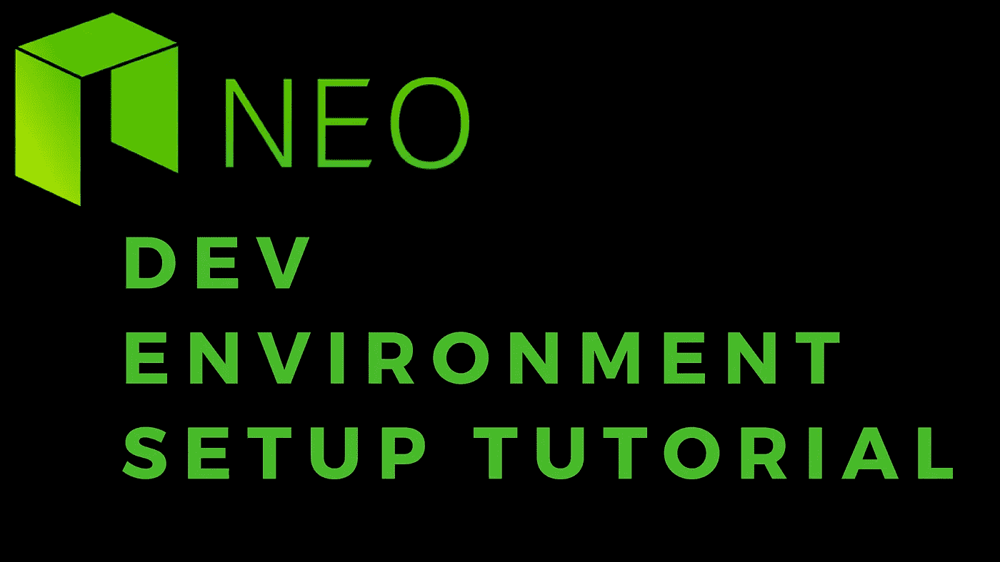

# NEO 开发环境设置教程

> 原文：<https://medium.com/coinmonks/neo-dev-environment-setup-tutorial-e495f5364ada?source=collection_archive---------0----------------------->

这是一个关于在 PC、Mac 或 Linux 上使用 Docker 和 neo-python v0.5.3 (python v3.6)启动 NEO 私有网络的快速教程，无需在本地安装 python。

# 安装 Docker

*   麦克·OSX
*   [Windows PC](https://store.docker.com/editions/community/docker-ce-desktop-windows)
*   [其他](https://store.docker.com/search?type=edition&offering=community)

# 为智能合同代码创建文件夹

打开终端:



*非常重要*:导航到或创建一个文件夹来保存您的智能合约代码。我们将链接此文件夹，与 docker 容器共享，以便您可以从容器中访问您的智能合同文件。

例如:



# 启动 docker 容器

我们将使用[新私有网络](https://hub.docker.com/r/cityofzion/neo-privatenet/)。它包含 neo 专用网络实例，其中 NEO/GAS 已在钱包中。

运行命令:

```
docker run -d --name neo-privatenet -p 20333-20336:20333-20336/tcp -p 30333-30336:30333-30336/tcp -v "$(pwd)":/neo-python/smartContracts cityofzion/neo-privatenet
```

检查以确保容器正在运行:

```
docker ps
```



通过运行以下命令将 SSH 导入 docker 容器:

```
docker exec -it neo-privatenet /bin/bash
```

您现在应该位于 docker 映像内的 neo-python 目录中，并且应该看到 smartContracts 文件夹。它链接到您主机上的本地目录。



预先做好的钱包也要有:`neo-privnet.wallet`

使用完整的命令进入 neo-python 提示符。

```
python3 prompt.py -p
```

或者已经有一个 bash 脚本快捷方式:

```
neopy
```



您现在应该在 neo 命令行提示符下。这将是你与你的 neo 私人网络互动的地方。

打开预先做好的钱包

```
open wallet neo-privnet.wallet
```

输入钱包密码

```
coz
```

重建钱包

```
wallet rebuild
```

检查钱包余额

```
wallet
```



钱包应该有 100m NEO 和 16k 左右的汽油

恭喜你。您现在已经正式设置好了，并且已经迈出了开始编写您自己的 dapps 和智能合同的第一步！

> [直接在您的收件箱中获得最佳软件交易](https://coincodecap.com/?utm_source=coinmonks)

[](https://coincodecap.com/?utm_source=coinmonks)

如果你觉得这个教程有帮助，请在:

```
NEO/GAS/NEP5 tokens: AR8rRBxgWw5siKsp1dUmfTLy6QQTjcqoqBETH/ERC20 tokens: 0x575970777095575fDd12d9cD3B105b41D8DD1344NANO/XRB: xrb_3rpmim57tqbrb8hhjfzm1x5uk135yhmgqoj7j7wsufpo53e3ad5k93ggy1cdLTC: M8nZ7FwJXSMAkAfiGmTKjbB7MWpdwsp52dBTC: 3LcA1ztxFjghexRNWPyGXA59VFU3gF4PTzBCH: 1LXLiF7SjWGday6gm61hzbYHKbSAMevwXo
```

