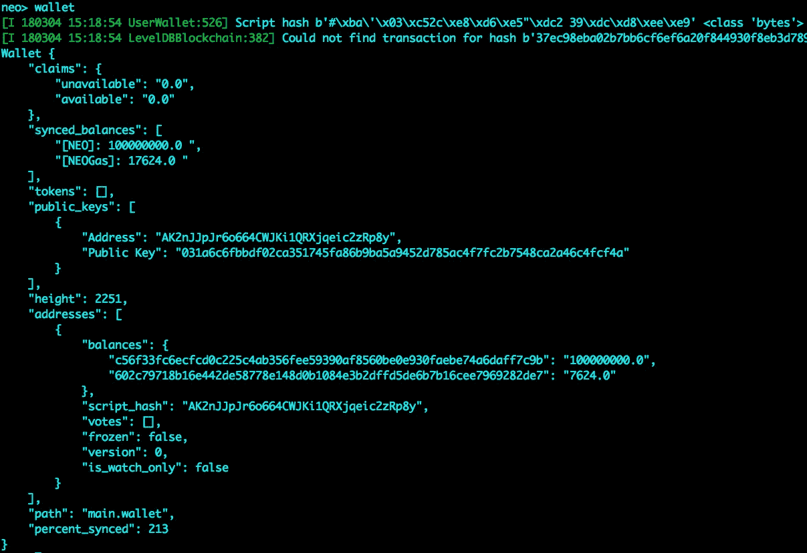
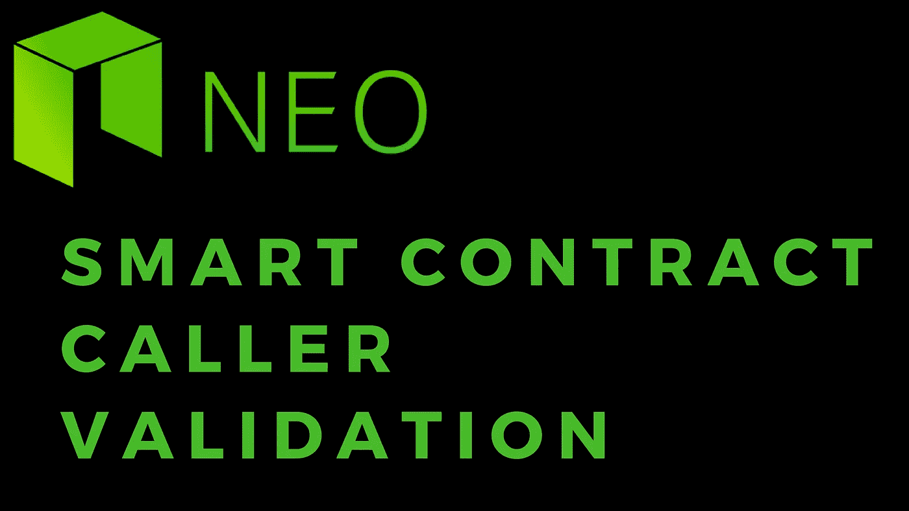

# NEO 智能合同:呼叫者验证

> 原文：<https://medium.com/coinmonks/neo-smart-contract-caller-validation-58d99f21232a?source=collection_archive---------6----------------------->

在许多情况下，如果不是所有情况，您可能想要验证调用您的契约代码的地址是否真的是他们所说的那个人。

幸运的是，我们提供了以下验证方法:

```
boa.blockchain.vm.Neo.Runtime.CheckWitness
```

该方法接受单个参数，该参数表示您希望根据用于调用协定代码的地址进行验证的地址。

所提供的输入值可以是以下任何一种格式，可用于识别调用者地址:

```
#\xba\'\x03\xc52c\xe8\xd6\xe5"\xdc2 39\xdc\xd8\xee\xe9AK2nJJpJr6o664CWJKi1QRXjqeic2zRp8y031a6c6fbbdf02ca351745fa86b9ba5a9452d785ac4f7fc2b7548ca2a46c4fcf4a
```

运行以下命令时，这些都可以在 neo-python cli 中找到:

```
wallet
```



为了测试这一点，我们可以使用以下示例合同代码:

```
from boa.blockchain.vm.Neo.Runtime import CheckWitnessdef Main(caller): isCaller = CheckWitness(caller) if isCaller:
        return True return False
```

这将简单地验证为 ***调用者*** 提供的输入是否与用于调用契约的地址相匹配。

> [在您的收件箱中直接获得最佳软件交易](https://coincodecap.com/?utm_source=coinmonks)

[](https://coincodecap.com/?utm_source=coinmonks)

在我们的 neo-python cli 中，我们可以使用下面的任何查询，通过我们的[构建&测试方法](https://youtu.be/L0al2gttTEs)对此进行测试。

地址:

```
build smartContracts/callerValidation.py test 07 01 False False AK2nJJpJr6o664CWJKi1QRXjqeic2zRp8y
```

公钥:

```
build smartContracts/callerValidation.py test 07 01 False False 031a6c6fbbdf02ca351745fa86b9ba5a9452d785ac4f7fc2b7548ca2a46c4fcf4a
```

地址的脚本哈希:

```
build smartContracts/callerValidation.py test 07 01 False False #\xba\'\x03\xc52c\xe8\xd6\xe5"\xdc2 39\xdc\xd8\xee\xe9
```

如果您运行的是为专用网络提供的主 wallet，那么运行这些应该都会得到 true。如果您正在运行自己的实例或从另一个 wallet 调用，只需从 ***wallet*** 命令的结果中复制所需的值。如果您使用不是您的钱包的值运行测试执行，执行将返回 ***False*** 。例如:

```
build smartContracts/callerValidation.py test 07 01 False False BF3nJJpJr6o664CWJKi1QRXjqeic2zRaaa
```

有关更深入的示例，请参考 [Hasty Ogre 名称服务合同代码](https://github.com/nickfujita/hasty-ogre-name-service/blob/master/smartContract/hons-ico.py)。

如果你觉得这个教程有帮助，请在:

```
NEO/GAS/NEP5 tokens: AR8rRBxgWw5siKsp1dUmfTLy6QQTjcqoqBETH/ERC20 tokens: 0x575970777095575fDd12d9cD3B105b41D8DD1344NANO/XRB: xrb_3rpmim57tqbrb8hhjfzm1x5uk135yhmgqoj7j7wsufpo53e3ad5k93ggy1cdLTC: M8nZ7FwJXSMAkAfiGmTKjbB7MWpdwsp52dBTC: 3LcA1ztxFjghexRNWPyGXA59VFU3gF4PTzBCH: 1LXLiF7SjWGday6gm61hzbYHKbSAMevwXo
```

