# Neo 智能合同开发—第 1 部分

> 原文：<https://medium.com/coinmonks/neo-smart-contract-development-part-1-8da56e991521?source=collection_archive---------11----------------------->

## 先决条件和建议

[**使用 Coinmonks 作业门户**查找加密作业](https://coinmonks.com/)

[***捐于造币僧侣***](/coinmonks/monks-need-your-help-7440418d67ec)

**Click to find blockchain Jobs**

# 目的

本练习的目的是帮助您确保您的 Windows 环境与本文档中描述的 10 项活动相兼容(如果您的环境不兼容，还可以节省您大量的时间)。

# 目标、非目标和假设

本活动的目标是向您介绍成功执行 Windows 快速入门指南中剩余活动的最低要求和建议前提条件。NET 开发人员。

# 原则

*   提供可靠的文档:及时、准确、直观、完整
*   尽可能节省一个人的时间

# 司机

*   缺乏现有的一套简明易懂的文档

# 先决条件和建议

基本的硬件和软件前提是您有一台计算机(PC 或 laptap ),它具有:

*   微软 Windows 10 64 位 Pro，企业和教育版操作系统(1607 周年更新，Build 14393 或更高版本)

> Docker for Windows 的当前版本运行于 64 位 Windows 10 Pro、企业和教育版(1607 周年更新，Build 14393 或更高版本)。[ [码头工人](https://docs.docker.com/docker-for-windows/install/)

*   Windows 10 家庭版无法使用，因为它不包含 Hyper-V 功能，因此无法安装/启用 Hyper-V 服务，并且 NEO Docker 容器无法用于部署和测试 NEO 智能合同。Hyper-V 服务是安装 Docker 的先决条件。

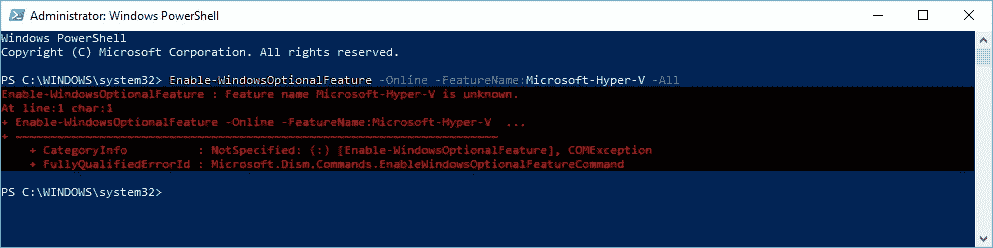

Figure 0.1\. Windows 10 Home edition doesn’t include the Hyper-V feature

**注意**:如果您想要使用全新的 Windows 10 企业版(评估—构建 201712)环境(并且您正在物理计算机上运行 Hyper-V 服务)，请考虑下载并运行“Windows 10 开发环境”虚拟机映像。If 可用于以下虚拟机管理程序:VMWare、Hyper-V、VirtualBox 和 Parallels。结帐[https://developer . Microsoft . com/en-us/windows/downloads/virtual-machines](https://developer.microsoft.com/en-us/windows/downloads/virtual-machines)。

*   安装的最新 Windows 更新
*   8GB 内存(最好是 16GM 或更大，因为您需要安装并启用 Hyper-V 功能和服务)
*   50GB 的可用磁盘空间(最好是 100GB，因为您最终会将多份 NEO 区块链文件下载到您的计算机上)
*   出于性能原因，SSD(固态硬盘)优于传统硬盘(HDD ),但这不是必需的

本文档中的活动已通过以下配置进行了测试:

*   Windows 10 Pro edition Levnovo 笔记本电脑，32GB 内存，500GB 固态硬盘+ 500GB 硬盘，英特尔 i7 处理器，BIOS 中支持虚拟化技术
*   安装成功
*   Windows 10 企业版(评估版—内部版本 201712)虚拟机(如上所述)，2GB 内存
*   只测试了 Docker 安装，但没有成功。并非所有必需的 Hyper-V 服务都可供 Docker 正常启动。
*   Visual Studio 安装需要一个密钥(虚拟机没有提供评估密钥)
*   Windows 10 家庭版惠普笔记本电脑，8GB 内存，1TB 硬盘，英特尔 i5 处理器，BIOS 中支持虚拟化技术
*   安装失败，因为 Windows 10 家庭版不包括 Hyper-V 功能，因此无法安装/启用该服务，并且 NEO Docker 容器无法用于部署和测试 NEO smart contracts。

# 创建您的 NEO 工作文件夹

此文件夹将用于您所有的 NEO 开发工作。在这个文件夹中，您可以下载和构建各种 NEO 开发工具，也可以选择自己的 NEO 解决方案。

1.  在 Windows 资源管理器/文件管理器中，或者使用命令提示符或 Powershell，创建您的本地“NEO”文件夹:

`C:\NEO`

这是推荐的文件夹名称，但您也可以选择其他文件夹。

**注意:**NEO 项目中使用的一些路径名可能会很长。

# 在您的 Windows 10 电脑上安装 Hyper-V 服务

2.通过启动 Windows 任务管理器并选择`Performance`选项卡，检查计算机 BIOS 中的虚拟化技术设置；然后选择`CPU`。

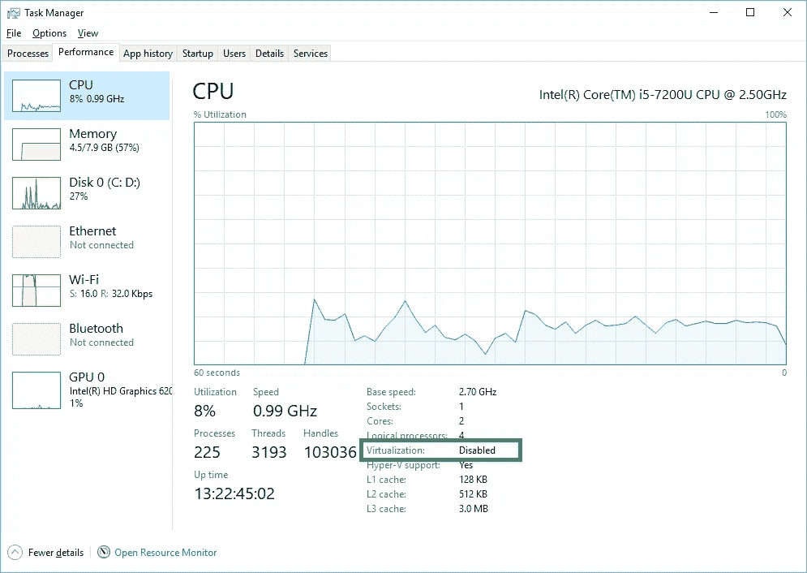

Figure 0.2\. Task Manager: Inspect the BIOS Virtualization Technology Setting (Disabled)

3.在任务管理器中，如果`Virtualization`设置被禁用，需要关闭电脑电源；然后重启它——按`F10`进入 BIOS 设置实用程序(类似下图)。将`Virtualization Technology`设置改为`Enabled`；保存并退出 BIOS 设置实用程序。重启你的电脑。

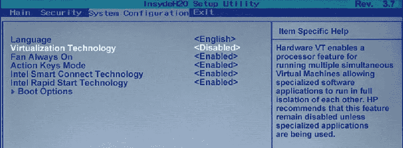

Figure 0.3\. BIOS Setup Utility: Virtualization Technology Setting (change to Enabled; then save and reboot)

4.若要验证计算机 BIOS 中的虚拟化技术设置是否已启用，请登录到计算机并再次启动 Windows 任务管理器。选择`Performance`选项卡；然后选择`CPU`。`Virtualization`现在应该是`Enabled`。

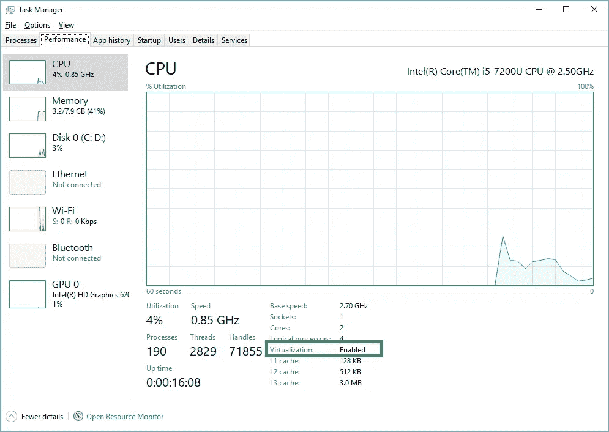

Figure 0.4\. Task Manager: Verify the BIOS Virtualization Technology Setting (Enabled)

5.若要安装 Hyper-V 服务，请单击 Windows“开始”菜单并键入“打开或关闭 Windows 功能”。向下滚动，直到找到 Hyper-V 并选择它(复选框中应该会出现一个复选标记)。如果 Hyper-V 框已经选中，则 Hyper-V 服务已经安装，您* *不必*更改此设置。

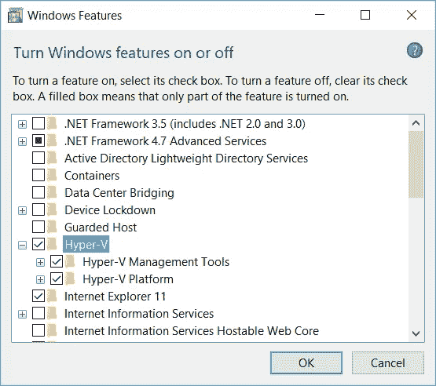

Figure 0.5\. Windows Features: Turn Windows Features on or off

如果你在列表中根本看不到 Hyper-V 功能，很可能是因为你在电脑上运行的是 Windows 10 家庭版。找到一台装有 Windows 10 Pro、Enterprise 或 Academic edition 的计算机，或者将计算机上的操作系统升级到 Windows 10 的这些版本之一。

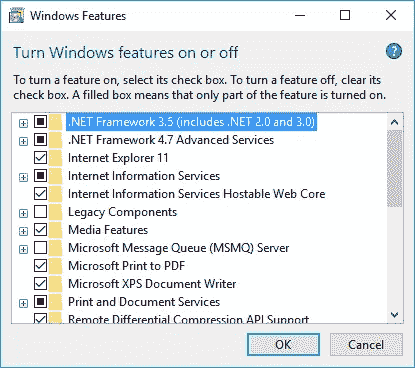

Figure 0.6\. Windows Features: Windows 10 Home edition doesn’t include the Hyper-V feature

如果你坚持尝试继续，你最终会在活动 6——下载、安装和测试 Docker 平台——中遇到这个阻塞问题。当你领先时，现在就停下来。

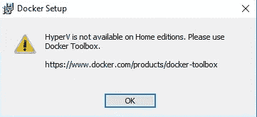

Figure 0.7\. Windows Features: HyperV is not available in Home editions

选择 Hyper-V 功能并单击确定后，将显示以下页面。重新启动计算机以完成 Hyper-V 服务的安装。

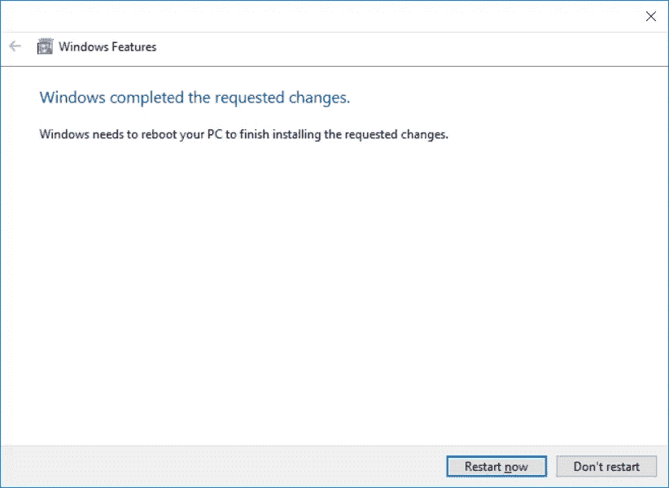

Figure 0.8\. Windows Features: Restarting your computer

7.要验证 Hyper-V 服务是否正在运行，请单击 Windows“开始”菜单并输入“services.msc”。您应该会在服务控制面板中看到许多 Hyper-V 服务。

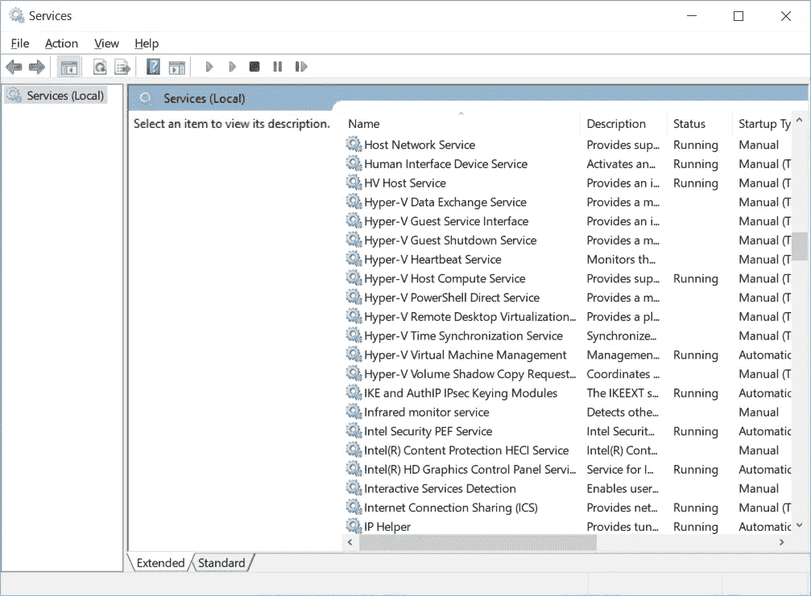

Figure 0.9\. Services Control Panel: Hyper-V Services

8.同样，点击 Windows 开始菜单，输入`hyper-v manager`。点击出现的`Hyper-V Manager`应用程序。选择您的计算机名。

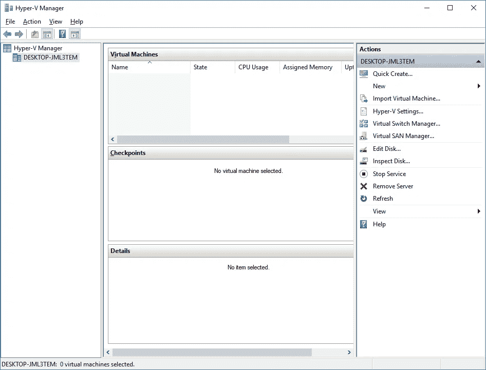

Figure 0.10\. Hyper-V Manager

9.这就完成了 Hyper-V 服务的安装和测试。

# 下载并安装 Microsoft。NET 4.7 开发人员包

的。NET 4.7 开发包是能够在 NEO 开发工具集中构建一些组件所必需的。如果您忽略了这一步，Visual Studio 将会中断并在需要时提示安装这个开发包。

10.下载。NET 4.7 Dev Pack 首发 [**这里**](https://support.microsoft.com/en-ca/help/3186612/the-net-framework-4-7-developer-pack-and-language-packs) **。**

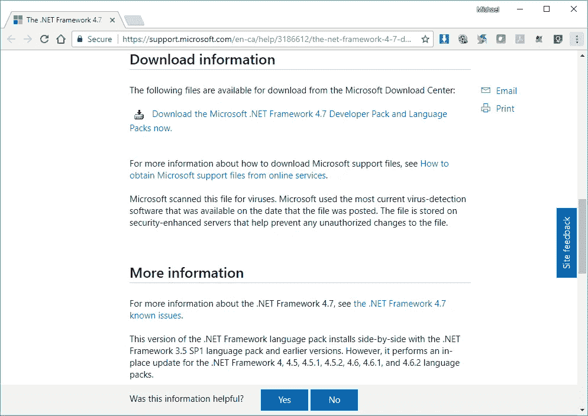

Figure 0.11\. Microsoft Knowlege Base: The .NET Framework 4.7 Developer Pack and Language Packs

11.这将把你带到开发包的微软下载站点:[https://www.microsoft.com/en-us/download/details.aspx?id=55168](https://www.microsoft.com/en-us/download/details.aspx?id=55168) 。向下滚动并单击下载按钮，下载安装程序可执行文件。

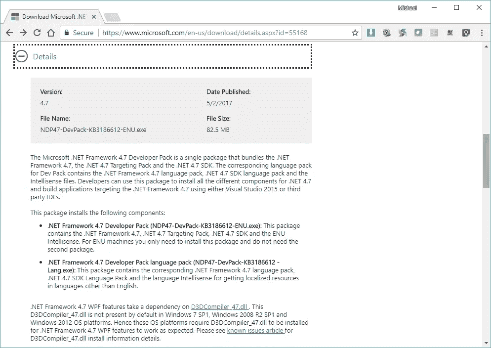

Figure 0.12\. Microsoft Downloads site: Microsoft .NET Framework 4.7 Developer Pack and Language Packs for Windows 7 SP1, Windows 8.1, Windows 10 Anniversary Update, Windows Server 2008 R2 SP1, Windows Server 2012, Windows Server 2012 R2 and Windows Server 2016

12.转到你电脑上的下载文件夹，双击`NDP47-DevPack-KB3186612-ENU.exe`可执行文件。

13.单击“确定”以管理员身份运行安装过程。

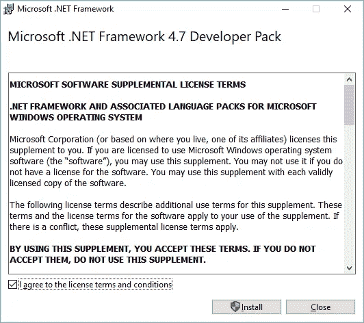

Figure 0.13\. .NET 4.7 Dev Pack EULA

14.安装过程将开始。

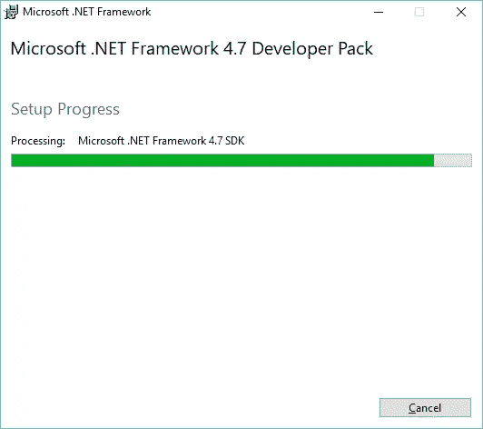

Figure 0.14\. .NET 4.7 Dev Pack Installation

15.安装完成后，将显示以下页面。

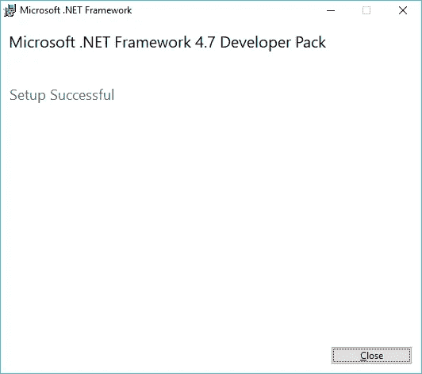

Figure 0.15\. .NET 4.7 Dev Pack Installation Complete