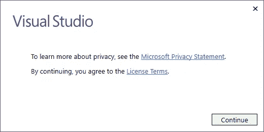

# Neo 智能合同开发—第 2 部分

> 原文：<https://medium.com/coinmonks/neo-smart-contract-development-part-2-3abe22e140b8?source=collection_archive---------15----------------------->

## 下载并安装 Visual Studio 2017 社区版集成开发环境(IDE)

**归属—** 这个系列是 [Michael Herman(多伦多)](https://github.com/mwherman2000)从他的 [Git 资源库](https://github.com/mwherman2000/neo-dotnetquickstart)转载的作品。所有的掌声和赞扬都归于他。

# 目的

如果您尚未安装 Visual Studio 2017 的现有版本，本活动旨在下载、安装和执行 Visual Studio 2017 Community Edition 的基本配置。

# 目标、非目标和假设

*   请确保您安装了 Visual Studio 2017 的有效且正确配置的版本

任何附加的 Visual Studio 自定义步骤将在后续活动中描述。

Visual Studio 2017 将与 Visual Studio 以前的版本/版本并行安装，而不会影响它们(除了减少您的可用磁盘空间)。这包括 Visual Studio 2015 和 Visual Studio 代码等。

# 原则

*   提供可靠的文档:及时、准确、直观、完整
*   尽可能节省一个人的时间
*   尽可能使用开源软件

# 司机

*   NEO 中的需求。NET 开发人员社区拥有简明易懂的文档，使人们能够在尽可能短的时间内快速开发 NEO 智能合同

# 下载并安装 Visual Studio 2017 社区版集成开发环境(IDE)

有两种情况:

*   场景 1 —您没有安装任何版本的 Visual Studio 2017
*   场景 2 —您已经安装了 Visual Studio 2017 的现有版本

如果场景 1 适用于您，您需要执行场景 1 中的任务，然后跳过场景 2。

如果只有场景 2 适用于您，您可以跳过场景 1 中的任务，只执行场景 2 中的任务。

此外，在计算机上安装 Visual Studio 代码非常有用。Visual Studio 代码的安装和配置记录在场景 3 中，是可选的，但建议使用。

> *Visual Studio Code 是一个重新定义和优化的代码编辑器，用于构建和调试现代 web 和云应用程序。Visual Studio 代码是免费的，可以在您最喜欢的平台上获得——Linux、Mac OSX 和 Windows。【*[*vs code*](https://code.visualstudio.com/)*】*

# 场景 1 —您没有安装任何版本的 Visual Studio 2017

1.  从以下任一网站下载 Visual Studio 2017 安装程序:

*   [通用 Visual Studio 下载站点(所有版本)](https://www.visualstudio.com/downloads/)([https://www.visualstudio.com/downloads/](https://www.visualstudio.com/downloads/))

Figure 1.1\. Generic Visual Studio downloads site (all editions)

*   [Visual Studio 社区版具体下载站点](https://www.visualstudio.com/vs/community/)([https://www.visualstudio.com/vs/community/](https://www.visualstudio.com/vs/community/))。

Figure 1.2\. Visual Studio Community Edition specific download site

2.在下载文件夹中，双击`vs_community.exe`安装程序可执行文件。

3.接受 Visual Studio EULA。

Figure 1.3\. Accept the Visual Studio EULA

4.选择您希望用于解决方案的传统前端、中间层和后端组件的工作负载(选项)。

Figure 1.4\. Visual Studio Installer: Workloads

5.重要说明:选择`.NET Core cross-platform development`工具集，启用所有 NEO 开发工具的编译。

Figure 1.5\. Visual Studio Installer: Toolsets

6.点击`Modify`完成安装。

7.安装完成。

Figure 1.6\. Installation complete

8.测试安装。从 Windows“开始”菜单中，键入“visual studio”。从列表中选择 Visual Studio 应用程序。在短暂的延迟之后，Visual Studio 应该会启动，看起来像下面这样。

Figure 1.7\. Test the installation

# 场景 2 —您安装了 Visual Studio 2017 的现有版本

如果您安装了 Visual Studio 2017 的现有版本，请确认已经安装了所需的工作负载和工具集。

9.启动 Visual Studio 2017

Figure 1.8\. Visual Studio 2017

10.在 Visual Studio 工具栏中，选择`Tools > Get Tools and Features...`。Visual Studio 安装程序将启动。

Figure 1.9\. Visual Studio Installer

11.继续执行场景 1 中的任务 4(如上)—您没有安装任何版本的 Visual Studio 2017，请完成剩余的任务。

# 场景 3 —(可选)安装和配置 Visual Studio 代码

12.从以下任一位置下载 Visual Studio 代码安装程序:

*   [通用 Visual Studio 下载站点(所有版本)](https://www.visualstudio.com/downloads/)([https://www.visualstudio.com/downloads/](https://www.visualstudio.com/downloads/))

Figure 1.10\. Generic Visual Studio downloads site (all editions)

*   [Visual Studio 代码具体下载站点](https://code.visualstudio.com/)([https://code.visualstudio.com](https://code.visualstudio.com/))。

Figure 1.11\. Visual Studio Code specific download site

13.在你的下载文件夹中，双击`VSCodeSetup-x64-1.20.0.exe`安装程序可执行文件。

14.按照默认安装说明完成安装。

15.测试安装。从 Windows“开始”菜单中，键入“visual studio 代码”。从列表中选择 Visual Studio 代码应用程序。

本活动的任务已经完成。继续进行[活动 2——下载并解包 NEO 开发工具项目(来源)](https://github.com/mwherman2000/neo-dotnetquickstart/blob/master/EN-us/02-downloadneodevtoolsrc.md)。

# 参考

*   [ [VSCODE](https://code.visualstudio.com/) ]微软，微软 Visual Studio 代码网站