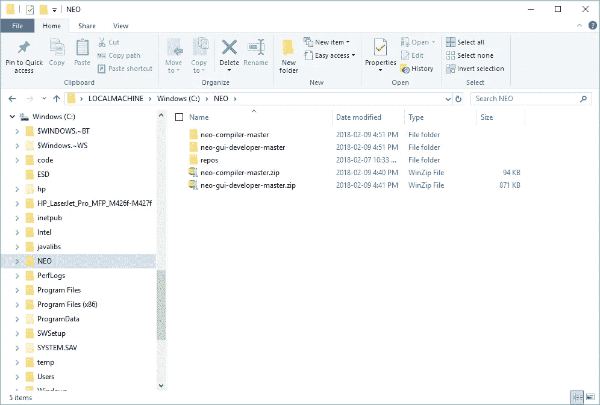

# Neo 智能合同开发—第 3 部分

> 原文：<https://medium.com/coinmonks/neo-smart-contract-development-part-3-5215f3d05a99?source=collection_archive---------14----------------------->

## 下载并解包 NEO 开发工具项目(来源)

**归属—** 这个系列是[迈克尔·赫尔曼(多伦多)](https://github.com/mwherman2000)从他的 [Git 资源库](https://github.com/mwherman2000/neo-dotnetquickstart)中再版的作品。所有的掌声和赞扬都归于他。

# 目的

本练习的目的是在 Visual Studio 安装完成时下载 NEO 开发人员工具源项目。

# 目标、非目标和假设

*   在继续下一组活动之前，请确保您已经下载并安装了所有内容
*   确保你能在尽可能短的时间内起床跑步

# 原则

*   提供可靠的文档:及时、准确、直观、完整
*   尽可能节省一个人的时间
*   尽可能使用开源软件

# 司机

*   NEO 中的需求。NET 开发人员社区拥有简明易懂的文档，使人们能够在尽可能短的时间内快速开发 NEO 智能合同

# 下载并解压缩 NEO 开发人员工具源

在第 2 部分—下载并安装 Visual Studio 2017 Community Edition 集成开发环境(IDE)即将完成，请继续下载并解压缩以下两个 NEO 项目，以帮助您节省时间。

注意:您可以选择`git clone`两个项目中的每一个，而不是下载源文件。我让你决定。我只是想让事情变得简单

# 下载并解压 Neon NEO MSIL 传输编译器

1.  参观位于 https://github.com/neo-project/neo-compiler[的 Neon NEO transcompiler GitHub 项目。](https://github.com/neo-project/neo-compiler)

Figure 2.1\. Neon NEO Transcompiler GitHub Project

2.点击`Clone or download`，然后选择`Download ZIP`，将项目源代码的当前版本档案下载到您的本地 NEO 文件夹(即`C:\NEO`或您在活动 0 -前提条件和建议中创建的备用文件夹)。

**注意**:您可能需要手动将 ZIP 存档文件从下载文件夹复制或移动到本地 NEO 文件夹。

Figure 2.2\. Neon NEO Transcompiler Source Download

3.解压存档文件，将源文件保存到子文件夹中(例如默认为`C:\NEO\neo-compiler-master`)。

# 下载并解压缩 Neo-Gui 开发人员节点/钱包

4.参观位于 https://github.com/CityOfZion/neo-gui-developer 的 Neon NEO transcompiler GitHub 项目。

Figure 2.3\. Neo-Gui-Developer Node/Wallet GitHub Project

5.点击`Clone or download`然后选择`Download ZIP`将项目源代码的当前版本的档案下载到您的本地 NEO 文件夹(即`C:\NEO`或您在活动 0 -前提条件和建议中创建的备用文件夹)。

**注意:**您可能需要手动将 ZIP 存档文件从下载文件夹复制或移动到本地 NEO 文件夹。

Figure 2.4\. Neo-Gui-Developer Node/Wallet Source Download

6.解压存档文件，将源文件保存到一个子文件夹中(如默认`C:\NEO\neo-gui-developer-master`)。

7.你的本地 NEO 文件夹应该如下所示(没有`repos`子文件夹)。

Figure 2.4\. Local NEO Folder (e.g. C:\NEO)

# 参考

*   来自 https://github.com/neo-project/neo-compiler[的](https://github.com/neo-project/neo-compiler) [Neon NEO MSIL Transcompiler](https://github.com/neo-project/neo-compiler) 。
*   【NEON】NEO 项目，[hNeo-Gui-Developer Node/Wallet](https://github.com/CityOfZion/neo-gui-developer)来自[hhttps://github . com/city of Zion/NEO-Gui-Developer](https://github.com/CityOfZion/neo-gui-developer)。