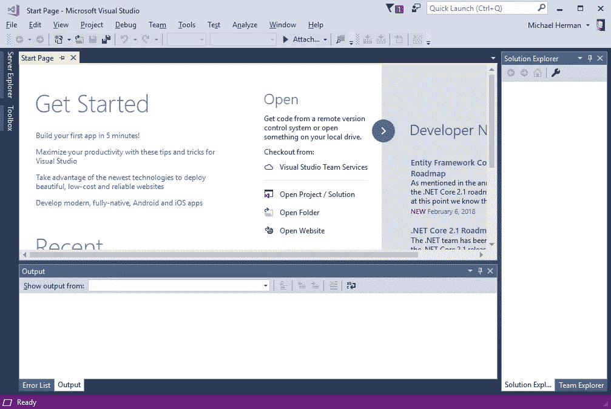

# Neo 智能合同开发-第 4 部分

> 原文：<https://medium.com/coinmonks/neo-smart-contract-development-part-4-65036f923f1d?source=collection_archive---------16----------------------->

## 安装 NeoContractPlugin Visual Studio 扩展

**署名—** 这个系列是[迈克尔·赫尔曼(多伦多)](https://github.com/mwherman2000)从他的 [Git 资源库](https://github.com/mwherman2000/neo-dotnetquickstart)中再版的作品。所有的掌声和赞扬都归于他。

# 目的

本活动的目的是将 NeoContractPlugin 扩展安装到 Visual Studio 中。

# 目标、非目标和假设

*   确保您有一个工作正常且配置正确的 Visual Studio 2017 版本，并在 Visual Studio 中安装了 NeoContractPlugin

# 原则

*   提供可靠的文档:及时、准确、直观和完整
*   尽可能节省一个人的时间
*   尽可能使用开源软件

# 司机

*   NEO 中的需求。NET 开发人员社区拥有简明易懂的文档，使人们能够在尽可能短的时间内快速开发 NEO 智能合同

# 安装 NeoContractPlugin Visual Studio 扩展

1.  启动 Visual Studio

Figure 4.1\. Visual Studio Home Screen

2.在`Tools`菜单上，选择`Extensions and Updates...`显示以下页面。选择`Online`；然后在搜索框中输入 NEO。将显示一个类似如下的列表。

Figure 4.2\. Search for NeoContractPlugin extension

3.在 NeoContractPlugin 扩展的右边，点击`Download`。

Figure 4.3\. Download NeoContractPlugin extension

4.以下消息将显示在页面底部的状态区域。这表明 Visual Studio 已安排在您退出 Visual Studio 后在后台进行安装。点击页面上的`Close`。

Figure 4.4\. NeoContractPlugin installation will be scheduled

5.点击`Red X`关闭 Visual Studio。一两分钟后，将显示以下页面，指示扩展的安装已经开始。点击`Modify`。

Figure 4.5\. NeoContractPlugin extension install confirmation

6.将继续安装扩展。

Figure 4.6\. NeoContractPlugin extension installation progress

7.扩展安装完成后，将显示以下页面。

Figure 4.7\. NeoContractPlugin extension installation complete

# 测试 NeoContractPlugin Visual Studio 扩展

*   在 NEO C# transcompiler 生成并配置完成之前，不能在 Visual Studio 中测试 NeoContractPlugin 扩展。这将在下一个活动中描述。NeoContractPlugin Visual Studio 扩展将在该活动接近尾声时进行测试。

本活动的任务已经完成。继续进行[活动 5——构建和测试 NEO 开发工具项目(来自源代码)](https://github.com/mwherman2000/neo-dotnetquickstart/blob/master/EN-us/05-buildneodevtools.md)。

# 参考

*   来自 https://github.com/neo-project/neo-devpack-dotnet[的](https://github.com/neo-project/neo-devpack-dotnet) [NEO 开发包](https://github.com/neo-project/neo-devpack-dotnet)