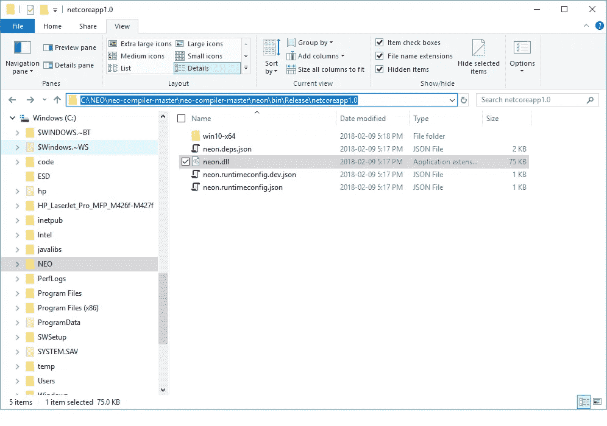

# Neo 智能合同开发-第 5 部分

> 原文：<https://medium.com/coinmonks/neo-smart-contract-development-part-5-33ff3d7ba358?source=collection_archive---------7----------------------->

## 构建和测试 NEO 开发工具项目(来源)

**署名—** 这个系列是[迈克尔·赫尔曼(多伦多)](https://github.com/mwherman2000)从他的 [Git 资源库](https://github.com/mwherman2000/neo-dotnetquickstart)中转载的作品。所有的掌声和赞扬都归于他。

# 目的

本活动的目的是利用在前一活动中下载和解包的资源来构建 NEO 开发人员工具。

# 目标、非目标和假设

*   确保您有一套正常工作且配置正确的 NEO 开发人员工具，用于在 Visual Studio 中使用 C#编程语言创建和构建智能合约

# 原则

*   提供可靠的文档:及时、准确、直观和完整
*   尽可能节省一个人的时间
*   尽可能使用开源软件

# 司机

*   NEO 中的需求。NET 开发人员社区拥有简明易懂的文档，使人们能够在尽可能短的时间内快速开发 NEO 智能合同

# 构建和测试 NEO 开发工具项目(来源)

# 建立霓虹灯新 MSIL 传输编译器

1.  在 Visual Studio 中打开 neo-compiler 项目，方法是双击在“活动 2 -下载并解包 neo 开发人员工具项目”中创建的`C:\NEO\neo-compiler-master\neo-compiler-master`文件夹中的`neo-compiler.sln`(源代码)。


Figure 5.1\. Open `neo-compiler.sln` in Visual Studio 2017

2.取消勾选消息`Ask me for every project in this solution`并点击`OK`。


Figure 5.2\. Visual Studio: Uncheck the message `Ask me for every project in this solution` and click `OK`

3.Visual Studio 将打开，项目显示在解决方案资源管理器的右侧。


Figure 5.3\. Visual Studio: Solution Explorer

4.右键单击靠近解决方案资源管理器顶部的解决方案名称`neo-compiler`,并选择 Rebuild Solution。第一次这样做时，会发生几件事；例如，除了编译源代码以创建 NEO 编译器集之外，还将下载和刷新引用的 Nuget 包。


Figure 5.4\. Visual Studio: Rebuild Solution

5.重建解决方案完成。


Figure 5.5\. Rebuild Solution completes

6.在解决方案资源管理器中右键单击项目名称`neon`,并选择 Publish。

**注意**:这是整个快速启动流程中最麻烦的一组任务。请仔细遵循这些手动解决方法。


Figure 5.6\. `neon` Project: Publish...

7.下面的发布页将出现在 Visual Studio 中。选择左侧的`Publish`(非连接服务)。点击`Publish`按钮继续(使用默认设置)。


Figure 5.7\. `neon` Project: Publish to Folder

8.当您看到“发布失败”时，这就是问题所在。点击`OK`关闭该对话框。


Figure 5.8\. `neon` Project: Published failed

9.在屏幕底部的输出窗格中，将下拉菜单“Show output from:”从 Build 更改为`Build Order`。请注意关于缺少 neon.dll 的突出显示的错误消息。它没有丢失——它在不同的目录中，需要手动复制到 Visual Studio 期望找到该 DLL 的位置。


Figure 5.9\. `neon` Project: neon.dll is missing (but not really)

10.打开 Windows 资源管理器并导航到文件夹`C:\NEO\neo-compiler-master\neo-compiler-master\neon\bin\Release\netcoreapp1.0`。我们需要将`neon.dll`从这个文件夹复制到 Visual Studio 期望找到它的文件夹中。



Figure 5.10\. `neon` Project folder: `C:\NEO\neo-compiler-master\neo-compiler-master\neon\bin\Release\netcoreapp1.0`

11.右击`neon.dll`并选择`Copy`。


Figure 5.11\. `neon` Project folder: Copy `neon.dll` to the clipboard

12.在 Windows Explorer 中，导航至`C:\NEO\neo-compiler-master\neo-compiler-master\neon\obj\Release\netcoreapp1.0`。在文件列表中右击并选择`Paste`将`neon.dll`的副本粘贴到该文件夹中。

**注意**:这是 obj/Release/netcoreapp1.0 文件夹路径。


Figure 5.12\. `neon` Project folder: `C:\NEO\neo-compiler-master\neo-compiler-master\neon\obj\Release\netcoreapp1.0`

13.回到 Visual Studio，单击`Publish`按钮再次发布`neon`项目文件(使用默认设置)。


Figure 5.13\. `neon` Project: Republish the Project

14.这一次，发布成功完成。


Figure 5.14\. `neon` Project: Publish Succeeded

15.`neon`项目文件已经发布到`C:\NEO\neo-compiler-master\neo-compiler-master\neon\bin\Release\PublishOutput`。

**注意**:记住这条路径，因为在下一组任务中，我们需要注意 Windows `Path`搜索路径环境变量。


Figure 5.15\. `neon` Project: PublishOutout Folder

至此，`neo-compiler`项目已经建成并发布。剩下的任务是:

*   配置 Windows `Path`搜索环境变量，以及
*   测试`neon` transcompiler 在 Visual Studio NEO 智能合约项目中能否正常工作。

16.要配置`Path`环境变量，从 Windows 开始菜单，输入“系统”并选择系统控制面板应用程序。在左窗格中，点击`Advanced system settings`显示`System Properties`对话框。


Figure 5.16\. Control Panel: System Properties

17.在`System Properties`对话框中，点击`Environment Variables...`显示`Environment Variables`对话框。注意系统变量部分中的`Path`环境变量。选择`Path`并锁定`Edit...`。


Figure 5.17\. Control Panel: System Properties: Environment Variables

17.点击`New`将 PublishOutput 路径添加到`Path`环境变量中的当前文件夹列表中。使用`C:\NEO\neo-compiler-master\neo-compiler-master\neon\bin\Release\PublishOutput`作为新路径的值。点击`OK`两次，关闭 2 个环境变量对话框，返回系统控制面板应用。


Figure 5.18\. Control Panel: System Properties: `Path` Environment Variable

# 测试 Neon NEO MSIL 传输编译器

19.我们一步一步来。首先，打开一个新的 Windows 命令提示符。输入`Path`并按回车键检查`Path`环境变量的当前值。您应该能够在列表中找到 PublishOutput 路径(更靠近列表的末尾，但不一定是列表的最后一个元素)。


Figure 5.19\. Command Prompt: `Path` Environment Variable

20.打开 Visual Studio 2017 创建一个新的 NEO 智能合约项目。


Figure 5.20\. Visual Studio 2017

21.选择`File` > `New` > `Project...`打开新建项目对话框。选择`Visual C#`。选择`NeoContract`。单击`OK`关闭此对话框，并在 Visual Studio 中创建新的 NeoContract 解决方案和项目。


Figure 5.21\. Visual Studio: Create a New NeoContract Project

21.Visual Studio 可能需要几分钟时间来创建 NeoContract 项目。


Figure 5.22\. Visual Studio: Creating the NeoContract Project

23.右键单击 NeoContract 项目文件夹并选择`Build`。请注意“输出”面板的“构建”部分中突出显示的消息。这两条消息表明 Visual Studio 能够创建 NEO 虚拟机字节代码文件以及应用程序二进制接口(ABI)文件(JSON 格式)。

**注意:**如果你没有看到这两条信息，最有可能的情况是:

*   `neon.dll`未正确发布。回到本练习的任务 6。
*   环境变量`Path`设置不正确。回到本练习的任务 16。
*   在设置`Path`环境变量之前，您已经打开了 Visual Studio。关闭 Visual Studio，然后返回任务 20。


Figure 5.23\. Visual Studio: Building the NeoContract Project

# 构建新的 Gui 开发人员节点/钱包

25.在 Visual Studio 中打开 neo-compiler 项目，方法是双击在“活动 2 -下载并解压缩 neo 开发人员工具项目”中创建的`C:\NEO\neo-gui-developer-master\neo-gui-developer-master`文件夹中的`neo-gui.sln`(源代码)。


Figure 5.24\. Open `neo-gui.sln` in Visual Studio 2017

26.取消勾选消息`Ask me for every project in this solution`并点击`OK`。


Figure 5.25\. Uncheck the message `Ask me for every project in this solution` and click `OK`

27.Visual Studio 将打开，项目显示在解决方案资源管理器的右侧。


Figure 5.26\. Visual Studio: Solution Explorer

28.(可选)如果您愿意对 Windows C#进行代码更改。NET Webforms 应用程序，导航到`UI`文件夹中的`Mainform.cs`源文件。右击该文件，选择`View Code`。向下滚动到 MainForm()构造方法。在构造函数的末尾，添加突出显示的单行代码:

```
this.Text - "neo-gui-dev - " + Settings.Default.DataDirectoryPath;
```

键入`ctrl+s`保存对该源文件的更改。这一行代码在应用程序名称旁边的标题栏中显示区块链数据库文件夹的名称。当您使用多组 JSON 配置文件时，这是一个有用的实践(稍后将详细介绍)。


Figure 5.27\. Optional source changes

# 测试新 Gui 开发人员节点/钱包

28.仍然在打开了`neo-gui.sln`解决方案的 Visual Studio 中(开发者版本)，单击`Start`用 Visual Studio 调试器运行`neo-gui`。


Figure 5.28\. `neo-gui`: Start with Visual Studio Debugger

29.如果这是您第一次使用 NEO 项目，系统可能会提示您将根证书安装到 Windows 证书存储中。点击`Yes`。


Figure 5.29\. Accept NEO Root Certificate

30.`neo-gui`(开发人员版本)应用程序应会打开，并开始与 NEO testnet 网络同步。您应该会看到右下角的块数随着时间的推移而增加，并且绿色进度条开始显示。点击钱包>退出，关闭新图形用户界面开发者节点/钱包应用。


Figure 5.30\. `neo-gui` (Developer Version) App

# 参考

*   来自 http://docs.neo.org/en-us/sc/tutorial.html[的](http://docs.neo.org/en-us/sc/tutorial.html) [NEO 智能合同教程](http://docs.neo.org/en-us/sc/tutorial.html)
*   NEONCOMPILER] NEO 项目，[来自 https://github.com/neo-project/neo-compiler](https://github.com/neo-project/neo-compiler)[的 Neon NEO MSIL Transcompiler](https://github.com/neo-project/neo-compiler) 。
*   来自[hhttps://github . com/city of Zion/NEO-Gui-Developer](https://github.com/CityOfZion/neo-gui-developer)。