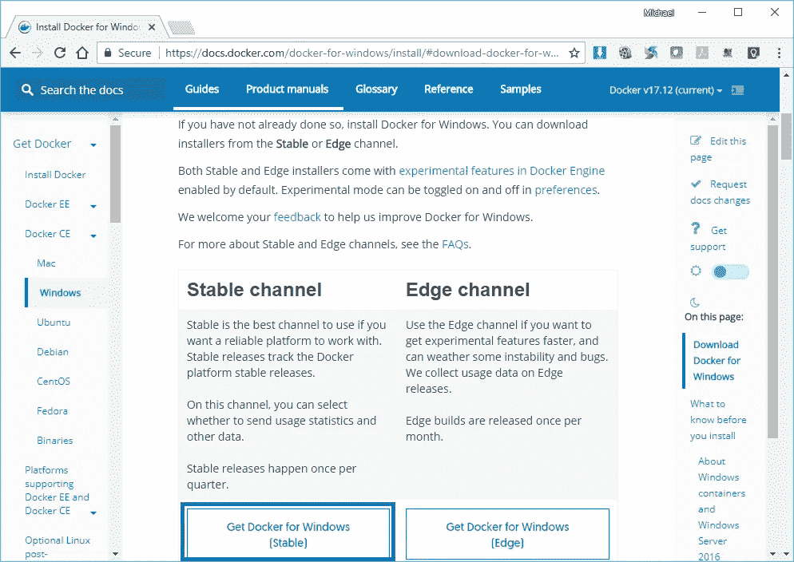
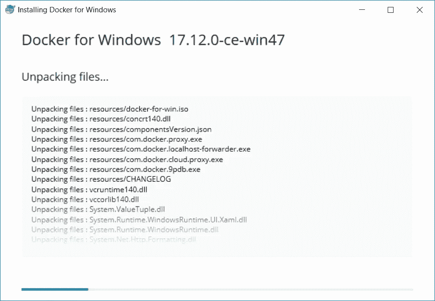
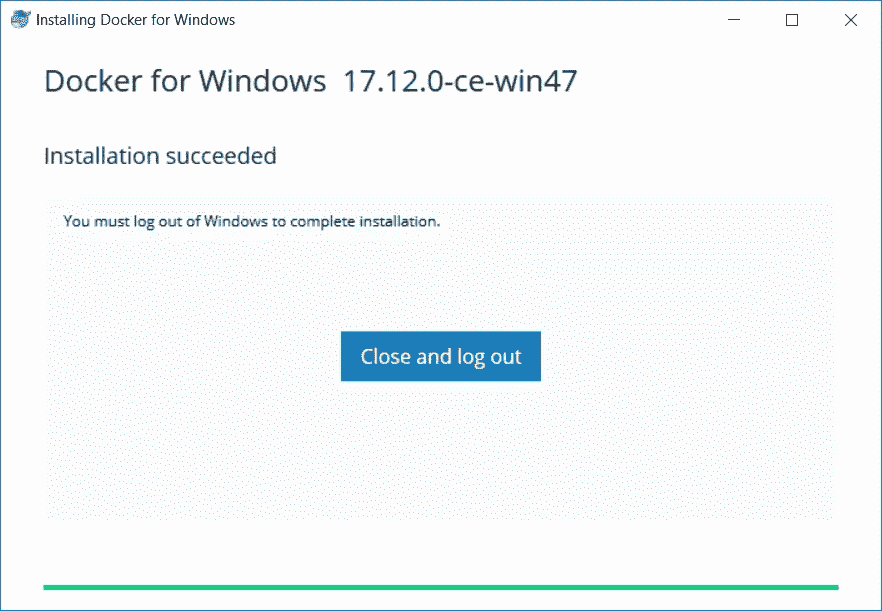
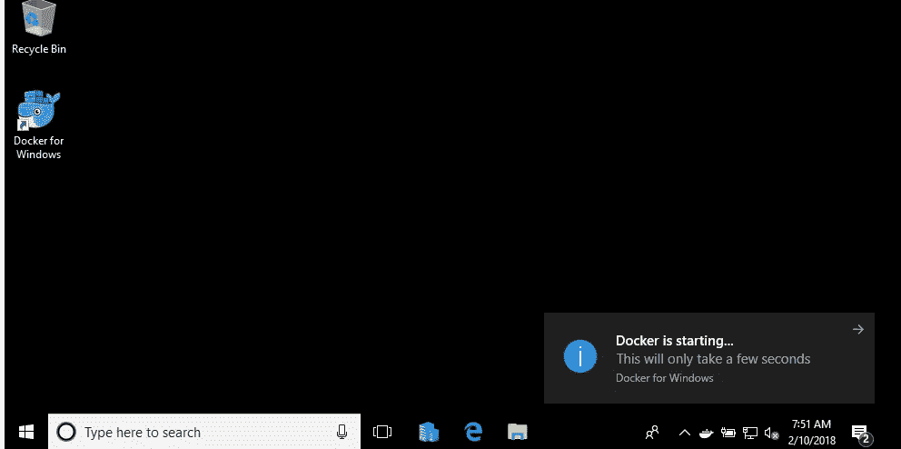
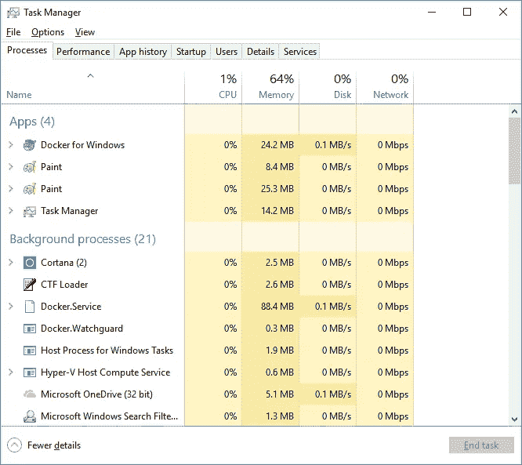
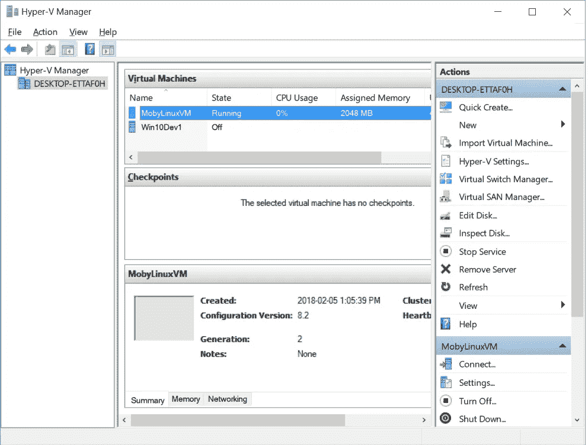
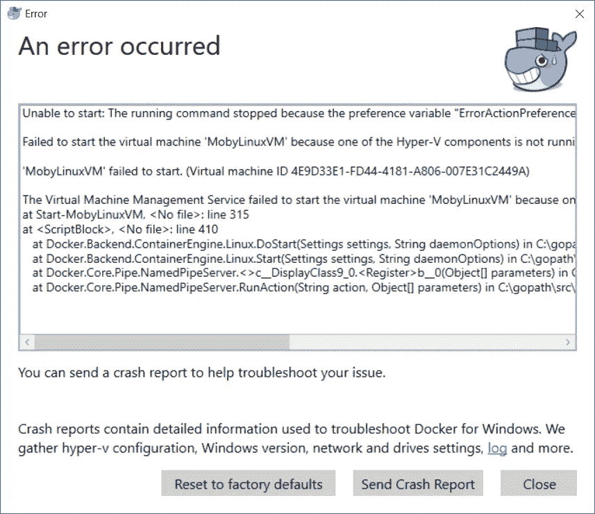
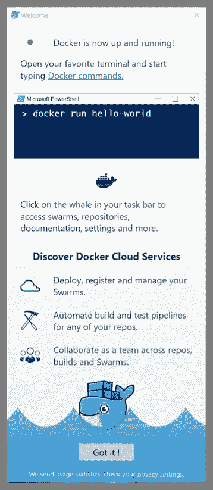
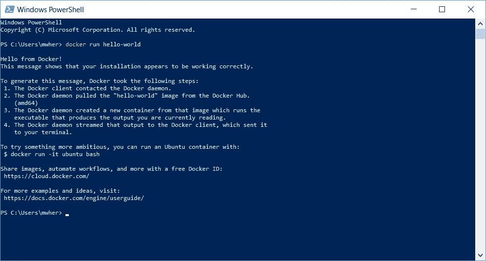

# Neo 智能合同开发-第 6 部分

> 原文：<https://medium.com/coinmonks/neo-smart-contract-development-part-6-89468833a281?source=collection_archive---------17----------------------->

## 下载、安装和测试 Docker 平台

**署名—** 这个系列是 [Michael Herman(多伦多)](https://github.com/mwherman2000)从他的 [Git 资源库](https://github.com/mwherman2000/neo-dotnetquickstart)中转载的作品。所有的掌声和赞扬都归于他。

# 目的

本练习的目的是下载、安装和测试 Docker 容器平台，进而支持本地 NEO 专用网络(NEO privatenet)的运行。

# 目标、非目标和假设

*   确保您有一套正常工作且配置正确的 NEO 开发人员工具，用于在 Visual Studio 中使用 C#编程语言创建和构建智能合约

# 原则

*   提供可靠的文档:及时、准确、直观和完整
*   尽可能节省一个人的时间
*   尽可能使用开源软件

# 司机

*   NEO 中的需求。NET 开发人员社区拥有简明易懂的文档，使人们能够在尽可能短的时间内快速开发 NEO 智能合同

# 下载并安装 Docker 平台

1.  从 [Docker for Windows 下载网站](https://docs.docker.com/docker-for-windows/install/)下载 Docker for Windows(稳定版)安装程序

Figure 6.1\. Docker for Windows download site: Stable version

2.在下载文件夹中，双击`Docker for Windows Installer.exe`可执行文件。

3.安装将开始。

Figure 6.2\. Docker Installation

4.安装完成后，将要求您注销并重新登录到您的计算机。(可能会要求您重新启动计算机。)

Figure 6.3\. Installation Completes

5.当你登录到你的电脑后，Docker 将会启动。如果 Docker 通知没有出现，你可以加倍显示桌面上的`Docker for Windows`图标。

Figure 6.4\. Docker is Starting

**注意**:显示在 Windows 任务栏右侧的 Docker“whale”图标。

# 测试 Docker 平台

6.在 Windows 任务管理器中，您应该看到 Docker 进程正在运行

Figure 6.5\. Windows Task Manager: Docker Processes

7.在 Hyper-V 管理器中，您应该看到`MobyLinuxVM`已经安装并正在运行。

Figure 6.6\. Hyper-V Manager: MobyLinuxVM Virtual Machine is Running

8.**注意:**如果您运行的不是有效版本的 Windows 10 或者没有正确安装 Hyper-V 服务，Docker 可能会显示一条与此类似的消息。咨询 Windows 网站的[Docker](https://docs.docker.com/docker-for-windows/install/)以获得更多帮助。

Figure 6.7\. Potential Docker for Windows Issues

9.通过启动 Windows Powershell 来测试 Docker 本身。从 Windows“开始”菜单中，键入“powershell”。从列表中选择 Windows Powershell 应用程序。

Figure 6.8\. Docker Basic Testing

10.在 Powershell 控制台中，输入`docker run hello-world`(并按回车键)。

Figure 6.9\. Docker Run Hello-World

11.Docker 容器平台的安装和测试已经完成。

本活动的任务已经完成。继续进行[活动 7 —下载、安装和测试 NEO privatenet Docker 容器](https://github.com/mwherman2000/neo-dotnetquickstart/blob/master/EN-us/07-installneoprivatenetcontainer.md)。

# 参考

*   【DOCKER】docker.com，[从【https://docs.docker.com/docker-for-windows/install/】T4](https://docs.docker.com/docker-for-windows/install/)([https://docs.docker.com/docker-for-windows/install/](https://docs.docker.com/docker-for-windows/install/))安装 Docker for Windows

# 其他好资源

*   【neopython Tutorial】Nick Fujita， [NEO 智能合约教程:helloWorld (Python)](https://steemit.com/neo/@z0yo/neo-smart-contracts-tutorial-helloworld) 来自[https://steemit . com/NEO/@ z0yo/NEO-Smart-Contracts-Tutorial-hello world](https://steemit.com/neo/@z0yo/neo-smart-contracts-tutorial-helloworld)
*   【NEOPYTHONTUTORIALVIDEO】Nick Fujita， [NEO 智能合约教程— Hello World (Python)](https://www.youtube.com/watch?v=9Ha_5RdOQrA) 来自[https://www.youtube.com/watch?v=9Ha_5RdOQrA](https://www.youtube.com/watch?v=9Ha_5RdOQrA)