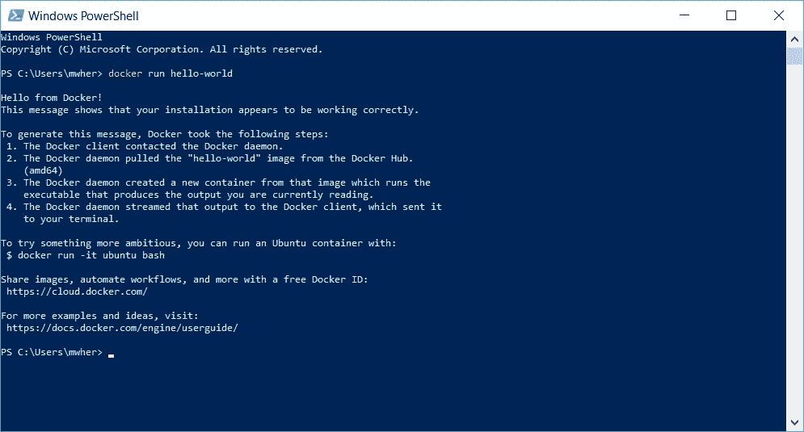
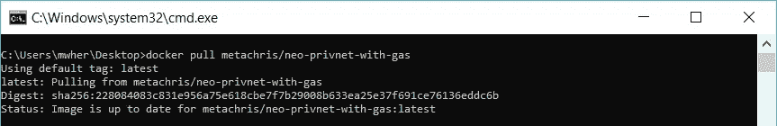
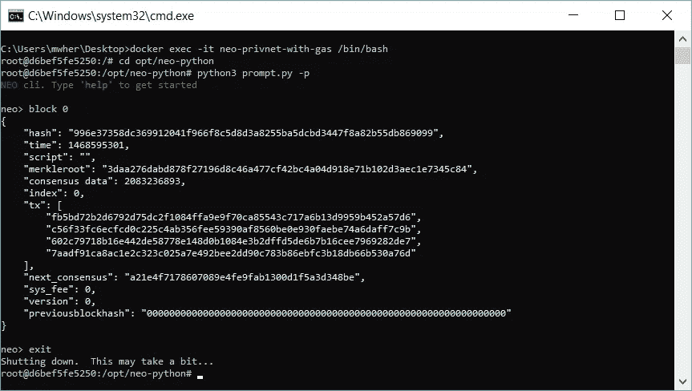

# Neo 智能合同开发-第 7 部分

> 原文：<https://medium.com/coinmonks/neo-smart-contract-development-part-7-14a590f76c7?source=collection_archive---------12----------------------->

## 下载、安装和测试 NEO privatenet Docker 容器

**署名—** 这个系列是[迈克尔·赫曼(多伦多)](https://github.com/mwherman2000)从他的 [Git 资源库](https://github.com/mwherman2000/neo-dotnetquickstart)转载的作品。所有的掌声和赞扬都归于他。

# 目的

本活动的目的是使用之前活动中安装的 Docker 平台下载、安装和测试 NEO 专用网络(privatenet) Docker 容器，以确保我们能够构建 NEO 智能合同并将其部署到 privatenet。

# 目标、非目标和假设

*   确保您有一套正常工作且配置正确的 NEO 开发人员工具，用于在 Visual Studio 中使用 C#编程语言创建和构建智能合约

# 原则

*   提供可靠的文档:及时、准确、直观和完整
*   尽可能节省一个人的时间
*   尽可能使用开源软件

# 司机

*   NEO 中的需求。NET 开发人员社区拥有简明易懂的文档，使人们能够在尽可能短的时间内快速开发 NEO 智能合同

# 下载并安装 NEO privatenet Docker 容器

1.  为了确保 Docker 已经安装并运行，启动 Powershell 控制台并输入`docker run hello-world`(并按 enter)。



Figure 7.1\. Docker Run Hello-World

2.要下载并运行 NEO Docker 容器，请运行以下脚本:

```
docker pull metachris/neo-privnet-with-gas
docker run -d --name neo-privnet-with-gas -p 20333-20336:20333-20336/tcp -p 30333-30336:30333-30336/tcp metachris/neo-privnet-with-gas
pause
```

脚本:NEO Docker 下载/安装/运行([)。/scripts/neodeckerinstall . bat . txt](https://github.com/mwherman2000/neo-dotnetquickstart/blob/master/EN-us/scripts/neodockerinstall.bat.txt)

该脚本产生以下输出:



Figure 7.2\. NEO Docker Download/Install/Run

# 测试 NEO privatenet Docker 容器

3.要测试 NEO Docker 容器，请运行以下脚本:

```
REM cd opt/neo-python
REM python3 prompt.py -p
REM block 0
docker exec -it neo-privnet-with-gas /bin/bash
pause
```

脚本:NEO Docker Python CLI/Shell ( [)。/scripts/neodecrpshell . bat . txt](https://github.com/mwherman2000/neo-dotnetquickstart/blob/master/EN-us/scripts/neodockerpshell.bat.txt)

4.上面的脚本将为 NEO 容器打开一个 bash 控制台。在 Bash 控制台中执行以下命令来启动 NEO Python CLI:

```
cd opt/neo-python
python3 prompt.py -p
```

5.上述命令将启动 NEO Python CLI。执行以下命令以验证 NEO 容器(和 NEO 节点)是否正常工作:

```
block 0
exit
```

最后 3 个任务总共产生以下输出:



Figure 7.3\. NEO Docker Test

本活动的任务已经完成。继续进行[活动 8 —创建并编译 HelloWorld 智能合约样本](https://github.com/mwherman2000/neo-dotnetquickstart/blob/master/EN-us/08-createcompilesmartcontract.md)。

# 附加注释

要让客户端应用程序访问您刚刚创建的 NEO privatenet，您的 NEO 应用程序需要用以下 JSON 文件的内容替换 2 个 JSON 配置文件:

*   config.json: ( [)。/json/config.neodocker.json](https://github.com/mwherman2000/neo-dotnetquickstart/blob/master/EN-us/json/config.neodocker.json)
*   protocol.json: ( [)。/JSON/protocol . neo docker . JSON](https://github.com/mwherman2000/neo-dotnetquickstart/blob/master/EN-us/json/protocol.neodocker.json)

要从现有 NEO 网络切换到此 privatenet，请确保您:

*   删除旧的区块链数据库文件夹
*   删除旧的`peers.dat`文件
*   开始 neo-gui.exe
*   重新索引您的数据库

# 脚本库

*   NEO Docker 下载/安装/运行([)。/scripts/neodeckerinstall . bat . txt](https://github.com/mwherman2000/neo-dotnetquickstart/blob/master/EN-us/scripts/neodockerinstall.bat.txt)
*   新对接器停止/移除([)。/scripts/neodecruninstall . bat . txt](https://github.com/mwherman2000/neo-dotnetquickstart/blob/master/EN-us/scripts/neodockeruninstall.bat.txt)
*   NEO Docker 启动([)。/scripts/neodockerstart . bat . txt](https://github.com/mwherman2000/neo-dotnetquickstart/blob/master/EN-us/scripts/neodockerstart.bat.txt)
*   新停靠站([)。/scripts/neodockerstop . bat . txt](https://github.com/mwherman2000/neo-dotnetquickstart/blob/master/EN-us/scripts/neodockerstop.bat.txt)
*   新对接器重启([)。/scripts/neodockerrestart . bat . txt](https://github.com/mwherman2000/neo-dotnetquickstart/blob/master/EN-us/scripts/neodockerrestart.bat.txt)
*   新对接复位([)。/scripts/neodockerreset . bat . txt](https://github.com/mwherman2000/neo-dotnetquickstart/blob/master/EN-us/scripts/neodockerreset.bat.txt)
*   NEO Docker Python CLI/Shell ( [)。/scripts/neodecrpshell . bat . txt](https://github.com/mwherman2000/neo-dotnetquickstart/blob/master/EN-us/scripts/neodockerpshell.bat.txt)

# 参考

*   【DOCKER】docker.com，[从【https://docs.docker.com/docker-for-windows/install/】T2](https://docs.docker.com/docker-for-windows/install/)([https://docs.docker.com/docker-for-windows/install/](https://docs.docker.com/docker-for-windows/install/))安装 Docker for Windows
*   [[https://hub.docker.com/r/metachris/neo-privnet-with-gas/](https://hub.docker.com/r/metachris/neo-privnet-with-gas/)][https://hub . docker . com/r/metachris/neo-priv net-with-gas/()](https://hub.docker.com/r/metachris/neo-privnet-with-gas/())
*   【新码头 2】锡安城项目，[锡安城/新私人码头](https://github.com/CityOfZion/neo-privatenet-docker)来自[https://github.com/CityOfZion/neo-privatenet-docker](https://github.com/CityOfZion/neo-privatenet-docker)
*   克里斯·哈尔，[如何运行近地天体区块链的私人网络](/proof-of-working/how-to-run-a-private-network-of-the-neo-blockchain-d83004557359)来自[https://medium . com/proof-of-work/How-to-run-a-private-network-of-the-NEO-区块链-d83004557359](/proof-of-working/how-to-run-a-private-network-of-the-neo-blockchain-d83004557359)