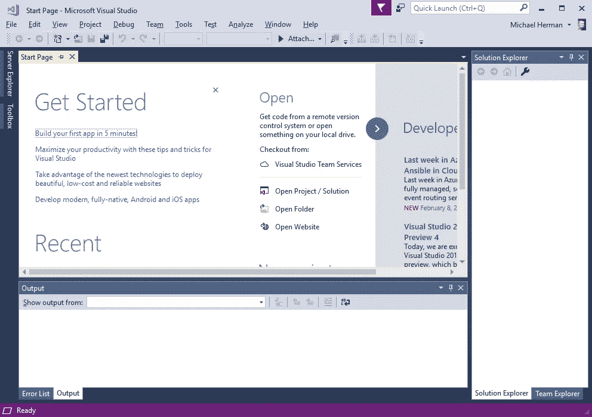
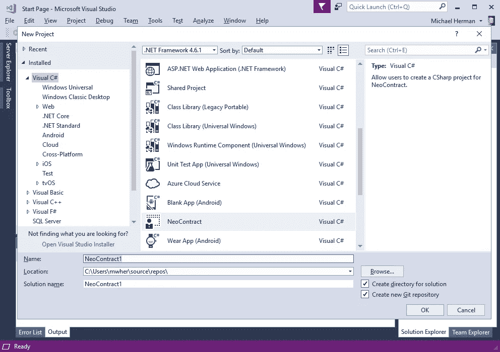

# Neo 智能合同开发—第 8 部分

> 原文：<https://medium.com/coinmonks/neo-smart-contract-development-part-8-ce0a7165d48f?source=collection_archive---------13----------------------->

## 创建并编译 HelloWorld 智能合约示例

**归属—** 这个系列是 [Michael Herman(多伦多)](https://github.com/mwherman2000)从他的 [Git 库](https://github.com/mwherman2000/neo-dotnetquickstart)中再版的作品。所有的掌声和赞扬都归于他。

# 目的

本练习的目的是创建并编译 Hello World C#智能合约示例的变体，以创建 NEO VM 字节代码文件(。avm 字节代码文件)。已编译的智能合约将在下一个活动中进行部署和测试。

# 目标、非目标和假设

*   确保您有一套正常工作且配置正确的 NEO 开发人员工具，用于在 Visual Studio 中使用 C#编程语言创建和构建智能合约
*   非目标:了解智能合同开发。目标是简单地让一个样本智能合同工作。关于创建智能联系人的更多高级文档将在[mwherman 2000/neo-windocs](https://github.com/mwherman2000/neo-windocs/tree/master/windocs)项目的其他地方提供。
*   非目标:学习 C#编程。互联网上有很多这方面的资源(例如[绝对初学者的 C#基础](https://mva.microsoft.com/en-us/training-courses/c-fundamentals-for-absolute-beginners-16169?l=Lvld4EQIC_2706218949)

# 原则

*   提供可靠的文档:及时、准确、直观和完整
*   尽可能节省一个人的时间
*   尽可能使用开源软件

# 司机

*   NEO 中的需求。NET 开发人员社区拥有简明易懂的文档，使人们能够在尽可能短的时间内快速开发 NEO 智能合同

# 创建并编译 HelloWorld 智能合约示例

1.  打开 Visual Studio 2017 创建一个新的 NEO 智能合约项目。



Figure 8.1\. Visual Studio 2017

2.选择`File` > `New` > `Project...`打开新建项目对话框。选择`Visual C#`。选择`NeoContract`。单击`OK`关闭此对话框，并在 Visual Studio 中创建新的 NeoContract 解决方案和项目。



Figure 8.2\. Visual Studio: Create a New NeoContract Project

3.Visual Studio 可能需要几分钟时间来创建 NeoContract 项目。


Figure 8.3\. Visual Studio: Creating the NeoContract Project

4.一旦 Visual Studio 创建了项目，它将类似于下面的内容。右键单击 NeoContract 项目文件夹并选择`Build`。请注意“输出”面板的“构建”部分中突出显示的消息。这两条消息表明 Visual Studio 能够创建 NEO 虚拟机字节代码文件以及应用程序二进制接口(ABI)文件(JSON 格式)。


Figure 8.4\. Visual Studio: Building the NeoContract Project

5.从这里用下面的 C#代码替换类`Contract1`hello world 2 . cs。

```
public class HelloWorld : SmartContract
{
    public static int Main(int value)
    {
        Storage.Put(Storage.CurrentContext, "Hello", "World");

        return value * 100;
    }
}
```

6.右击 NeoContract 项目文件夹并选择`Build`。请注意“输出”面板的“构建”部分中突出显示的消息。这两条消息表明 Visual Studio 能够创建 NEO 虚拟机字节代码文件以及应用程序二进制接口(ABI)文件(JSON 格式)。


Figure 8.5\. Hello World: Building the NeoContract Project

**参考文献**

*   neo-csharpcoe， [NEO 区块链快速入门指南。来自](https://github.com/mwherman2000/neo-dotnetquickstart/blob/master/README.md)[的. NET 开发者](https://github.com/mwherman2000/neo-dotnetquickstart/blob/master/README.md)https://github . com/mwherman 2000/neo-dotnetquickstart/blob/master/readme . MD