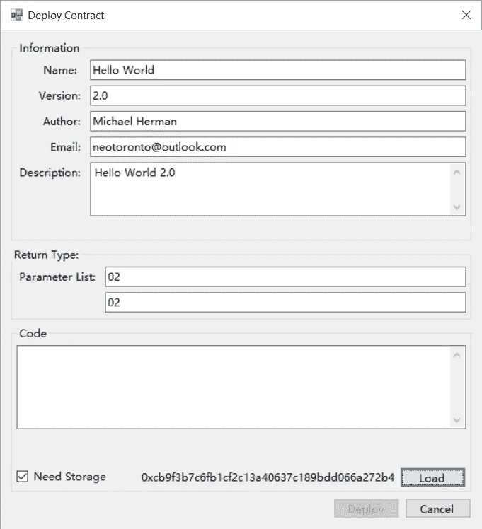

# Neo 智能合同开发-第 9 部分

> 原文：<https://medium.com/coinmonks/neo-smart-contract-development-part-9-5c36b765014d?source=collection_archive---------4----------------------->

## 部署和测试 HelloWorld 智能合约

[](https://cryptofi.co/)

**Create Crypto Invoices**

[**Cryptofi —创建加密发票，跟踪您的加密支付**](https://cryptofi.co/)

[**使用 Coinmonks 作业门户**](https://coinmonks.com/) 查找加密作业

[***捐投投僧***](/coinmonks/monks-need-your-help-7440418d67ec)

[](https://coinmonks.com)

**Click to find blockchain Jobs**

# 目的

本活动的目的是使用部署和测试在上一个活动中创建的 HelloWorld 智能合约。它使用在之前的活动中构建的新 gui 开发工具。本练习还使用了 NEO Docker 容器，该容器也是在之前的练习中安装和配置的。

# 目标、非目标和假设

*   确保您有一套正常工作且配置正确的 NEO 开发人员工具，用于在 Visual Studio 中使用 C#编程语言创建和构建智能合约

# 原则

*   提供可靠的文档:及时、准确、直观、完整
*   尽可能节省一个人的时间
*   尽可能使用开源软件

# 司机

*   NEO 中的需求。NET 开发人员社区拥有简明易懂的文档，使人们能够在尽可能短的时间内快速开发 NEO 智能合同

# 启动(重置)NEO privatenet Docker 容器

1.  通过打开 PowerShell 并运行以下命令来启动 NEO privatenet Docker 容器:

```
docker container list
docker stop neo-privnet-with-gas
docker container list
docker rm neo-privnet-with-gas
docker container list
docker run -d --name neo-privnet-with-gas -p 20333-20336:20333-20336/tcp -p 30333-30336:30333-30336/tcp metachris/neo-privnet-with-gas
docker container list
pause
```

脚本:NEO Docker 重置([)。/scripts/neodockerreset . bat . txt](https://github.com/mwherman2000/neo-dotnetquickstart/blob/master/EN-us/scripts/neodockerreset.bat.txt)

该脚本产生以下输出:


Figure 9.1\. NEO Docker Reset

# 测试 NEO privatenet Docker 容器

2.要测试 NEO Docker 容器，请运行以下脚本:

```
REM cd opt/neo-python
REM python3 prompt.py -p
REM block 0
docker exec -it neo-privnet-with-gas /bin/bash
pause
```

脚本:NEO Docker Python CLI/Shell ( [)。/scripts/neodecrpshell . bat . txt](https://github.com/mwherman2000/neo-dotnetquickstart/blob/master/EN-us/scripts/neodockerpshell.bat.txt)

当 bash shell 启动时，输入以下命令:

```
cd opt/neo-python
python3 prompt.py -p
block 0
```

# 配置`neo-gui (developer)`以使用 NEO privatenet Docker 容器

3.打开 Windows 资源管理器，导航到`C:\NEO\neo-gui-developer\neo-gui\bin`，右键单击`Debug`文件夹并删除它(以及文件夹中的所有内容)。


Figure 9.2\. C:\NEO\neo-gui-developer\neo-gui\bin

4.导航至`C:\NEO\neo-gui-developer`。


Figure 9.3\. C:\NEO\neo-gui-developer

5.双击`neo-gui.sln`在 Visual Studio 中打开`neo-gui-developer`项目。


Figure 9.4\. Visual Studio: neo-gui project

6.在 Visual Studio 中，用`config.neodocker.json`的内容替换`config.json`的内容。


Figure 9.5\. Visual Studio: config.json

**注意**:如果`config.neodocker.json`不是你项目的一部分，你可以从[这里](https://github.com/mwherman2000/neo-dotnetquickstart/blob/master/EN-us/json/config.neodocker.json) ( [)下载。/JSON/config . neo docker . JSON](https://github.com/mwherman2000/neo-dotnetquickstart/blob/master/EN-us/json/config.neodocker.json))并放在`C:\NEO\neo-gui-developer\neo-gui`文件夹中。在 Visual Studio 中右击`neo-gui`项目文件夹，选择`Add` > `Existing Item...` > `*.*`。选择`config.neodocker.json`并点击`Add`。

7.同样，用`protocol.neodocker.json`的内容替换`protocol.json`的内容。


Figure 9.6\. Visual Studio: protocol.json

**注意**:如果`protocol.neodocker.json`不是你项目的一部分，你可以从[这里](https://github.com/mwherman2000/neo-dotnetquickstart/blob/master/EN-us/json/protocol.neodocker.json) ( [)下载。/JSON/protocol . neo docker . JSON](https://github.com/mwherman2000/neo-dotnetquickstart/blob/master/EN-us/json/protocl.neodocker.json))并将其放在`C:\NEO\neo-gui-developer\neo-gui`文件夹中。在 Visual Studio 中右击`neo-gui`项目文件夹，选择`Add` > `Existing Item...` > `*.*`。选择`protocol.neodocker.json`并点击`Add`。

8.在 Visual Studio 中，点击`Start`重建并启动`neo-gui`。它应该开始与 NEO privatenet Docker 容器同步。


Figure 9.7\. neo-gui: Running against the NEO privatenet Docker container

**注**:如果您在活动 5——构建和测试近地天体开发工具项目(来自源代码)中更改了可选代码，您将在标题栏中看到您的近地天体区块链文件夹的名称(例如 DockerChainTestNet)。

# 创建新的发展钱包

9.从`neo-gui`菜单栏中，点击`Wallet` > `New Wallet Database...`。


Figure 9.8\. `neo-gui`: `Wallet` > `New Wallet Database...`

10.但是会出现下面的`New Wallet`对话框。点击`browse`。


Figure 9.9\. `neo-gui`: `New Wallet` dialog

11.选择要创建钱包的文件夹，输入钱包数据库的文件名，然后点击`Save`。


Figure 9.10\. `neo-gui`: Wallet Location

**注意**:把这些想象成临时的开发钱包，你每次重置 NEO privatenet Docker 容器时都需要重新创建。不需要备份它们。

**注意**:一个好的建议是将出现在`neo-gui`标题栏中的区块链数据库文件夹的名称(假设您在活动 5 中修改了源代码)包含在您的 wallet 文件的名称中。

**注意**:`neo-gui-developer`项目仅使用`.db3`格式文件(SQLLite 数据库文件)创建钱包数据库。其他版本的`neo-gui`使用 JSON 文件。请注意不同之处。

12。输入密码保护你的钱包。通过在第二个字段中重新输入来确认您的密码。


Figure 9.11\. `neo-gui`: Wallet Password

13.您的钱包创建完成。已经创建了一个默认帐户地址。

**注意**:每次创建新的钱包，这个地址都会不一样。


Figure 9.12\. `neo-gui`: Wallet Created

# 从 NEO privatenet Docker 容器中导入现有的开发人员帐户

14.为了获得一些 NEO/Gas，在 NEO private Docker 容器中配置了一个预配置的开发人员帐户。要导入该帐户，右键单击新创建的帐户，然后选择`Import` > `Import from WIF...`。


Figure 9.13\. `neo-gui`: `Import` > `Import from WIF...`

15.将显示以下`Import Private Key`对话框。输入 NEO Docker 容器文档[ [NEODOCKER1](https://hub.docker.com/r/metachris/neo-privnet-with-gas/#Wallet) ]中提供的 WIF 密钥，然后单击`OK`。

```
WIF key: KxDgvEKzgSBPPfuVfw67oPQBSjidEiqTHURKSDL1R7yGaGYAeYnr
```


Figure 9.14\. `neo-gui`: `Import Private Key`

16.结果应该是您已经在地址创建了以下第二个帐户:

```
Address: AK2nJJpJr6o664CWJKi1QRXjqeic2zRp8y
```

**注意:**您可能需要选择`Wallet` > `Rebuild Index`，以便非零 NEO/Gas 出现在新账户地址旁边。


Figure 9.15\. `neo-gui`: Second Address with NEO/Gas

# 部署您的智能合约(HelloWorld 1.0)

1.  打开 Visual Studio 2017 创建一个新的 NEO 智能合约项目。


Figure 9.16\. Visual Studio 2017

18.选择`File` > `New` > `Project...`打开新建项目对话框。选择`Visual C#`。选择`NeoContract`。单击`OK`关闭此对话框，并在 Visual Studio 中创建新的 NeoContract 解决方案和项目。


Figure 9.17\. Visual Studio: Create a New NeoContract Project

**注意**:如果您已经创建了以前的 NeoContract 项目，您的项目可能会被称为`NeoContract2`、`NeoContract3`，或者您选择的任何项目名称。记住项目名称和路径，因为您将需要在本练习的后面找到 AVM 文件。

19.Visual Studio 可能需要几分钟时间来创建 NeoContract 项目。


Figure 9.18\. Visual Studio: Creating the NeoContract Project

20.右键单击 NeoContract 项目文件夹并选择`Build`。请注意“输出”面板的“构建”部分中突出显示的消息。这两条消息表明 Visual Studio 能够创建 NEO 虚拟机字节代码文件以及应用程序二进制接口(ABI)文件(JSON 格式)。

**注意:**如果您没有看到这两条消息，最有可能的情况是:

*   没有正确出版。回到本练习的任务 6。
*   环境变量`Path`设置不正确。回到本练习的任务 16。
*   在设置`Path`环境变量之前，您已经打开了 Visual Studio。关闭 Visual Studio，然后返回任务 20。


Figure 9.19\. Visual Studio: Building the NeoContract Project

# 部署您的第一份智能合同

21.从`neo-gui`菜单栏中选择`Advanced` > `Deploy Contract...`显示`Deploy Contact`对话框。


Figure 9.20\. `neo-gui`: Deploy Contract Dialog Box

22.在`Deploy Contract`对话框中输入以下信息。

*   在`Information`部分，为每个字段输入适当的内容。这些字段不得为空。
*   在`Return Type`部分，将这些字段留空(对于这个特定的智能合同)。
*   点击`Need Storage`复选框，显示复选标记。
*   点击`Load`到你的 Visual Studio 项目创建的 AVM 文件(例如`C:\NEO\repos\NeoContract1\NeoContract1\bin\Debug\NeoContract1.avm`)。。

23.以上信息完成后，点击`Deploy Contract`对话框上的`Deploy`，完成`neo-gui`为您的合同部署虚拟机字节码的准备步骤。

脚本哈希将显示在脚本哈希对话框中。点击`copy`将脚本哈希放到剪贴板上。


Figure 9.21\. `neo-gui`: Script Hash

**注意**:脚本散列是从你的 AVM 读入的 VM 字节码的散列。avm)字节码文件。这与你加载 AVM 文件后出现在`Deploy Contract`对话框底部的脚本哈希值相同。

**注意**:如果您忘记点击`copy`将脚本散列的副本保存到剪贴板，您可以通过重新选择`Advanced` > `Deploy Contract...`显示`Deploy Contact`对话框并重新加载您的 AVM 文件来检索脚本散列值。脚本散列将出现在`Deploy Contract`对话框的底部附近。如果您需要的只是脚本散列，那么您不需要完成信息或返回类型部分中的字段。这次点击`Cancel`而不是部署。

**注意**:如果您没有更改智能合约的代码(因此，由 Visual Studio/neon 创建的 AVM 文件将是相同的)，它将具有相同的脚本哈希值。`neo-gui`不会在每次部署智能合约时创建新的脚本哈希值。仅当智能合约的代码发生更改时，它才会计算新的哈希值。

24.在上一个任务中复制脚本哈希后，立即点击脚本哈希对话框上的`close`显示以下`Invoke Contract`对话框。

点击`Test`然后点击`Invoke`。通过这两个动作，您的智能合约将被部署到 NEO privatenet。


Figure 9.22\. `neo-gui`: Invoke Contract Dialog Box

25.当`Transaction successful`对话框出现时，点击`close`。不需要复制事务哈希(TXID)。


Figure 9.23\. `neo-gui`: Transaction Successful Dialog Box

26.在`neo-gui`中，点击`Transaction History`选项卡，查看 NEO privaenet 上已执行的交易列表。

**注意**:第一笔交易处于未确认状态；这还没有得到区块链节点的证实。


Figure 9.24\. `neo-gui`: Transaction History

26.您需要等待，直到“未确认”状态变为一个数字(例如 1)。在这种情况下，已经过了一段时间，3 个区块已经确认了您最近的交易。

**注意**:然后您可以点击事件日志选项卡，查看您的智能合约是否调用了`Runtime.Notify()`或`Runtime.Log()`向 NEO 事件日志发布消息。


Figure 9.24\. `neo-gui`: Transaction History

# 调用您的第一个智能合同

27.从`neo-gui`菜单栏选择`Advanced` > `Invoke Contract...`显示`Invoke Contact`对话框。

将部署任务中的脚本散列粘贴到`ScriptHash`字段中。如果部署成功，表格上的其余字段应填入您在`Deploy Contract`对话框中输入的值。

**注意**:如果字段为空，返回任务 21 并重新开始。特别注意任务 23 中的说明。


Figure 9.25\. `neo-gui`: Invoke Contract Dialog Box

28.点击`Test`调用您的合同。


Figure 9.26\. `neo-gui`: Invoke Contract Dialog Box: Test

29.结果(返回值)将出现在对话框底部的文本框中。

**注意**:你可能要点击它两次。


Figure 9.27\. `neo-gui`: Invoke Contract Dialog Box: Results

30.回到`neo-gui`账户标签，你会发现你的 NEO/Gas 已经减少。

**注** : 490 气用于调配合同。1 Gas 用于调用一个事务。


Figure 9.28\. `neo-gui` Account Tab

# 创建您的第二个智能合同(HelloWorld 2.0)

31.按照前面任务中设置的模式创建一个新的 NeonContract 项目(例如，NeoContract2)。

**注意**:如果您已经创建了以前的 NeoContract 项目，您的项目可能会被称为`NeoContract3`、`NeoContract4`或您选择的任何项目名称。记住项目名称和路径，因为您将需要在本练习的后面找到 AVM 文件。

32.对默认智能合约进行一些更改:

*   将`Main()`改为接受一个名为`value`的单一整数参数。
*   在`Main()`的末尾增加一条`return value * 100;`语句。


Figure 9.29\. HelloWorld 2.0 Smart Contract

您的代码不应类似于以下内容:

```
using System;
using System.Numerics;
using Neo.SmartContract.Framework;
using Neo.SmartContract.Framework.Services.Neo;

namespace NeoContract2
{
    public class HelloWorld : SmartContract
    {
        public static int Main(int value)
        {
            Storage.Put(Storage.CurrentContext, "Hello", "World!");

            return value * 100;
        }
    }
}
```

代码 9.1: HelloWorld 2.0

# 部署您的第二份智能合同

33.按照前面任务中设置的模式部署 HelloWorld 2.0 智能契约。填写“部署合同”对话框中的字段。

**注**:在`Deploy Contract`对话框的`Return Type`部分，需要提供一串 2 位数的代码，表示数据类型:

*   入站参数
*   返回值

参数和返回值的数据类型代码可在下表中找到。


9.1: NEO Smart Contract Parameter/Return Types [[NEOPARMTYPES](http://docs.neo.org/en-us/sc/tutorial/Parameter.html)]

对于 HelloWorld 2.0，需要为单个整数入站参数和整数返回值指定`02`和`02`。



Figure 9.30\. HelloWorld 2.0: Deploy Contract

34.加载 HelloWorld 2.0 的 AVM 文件，点击`Deploy Contract`对话框上的`Deploy`。


Figure 9.31\. HelloWorld 2.0: Load Contract

35.复制脚本哈希值，点击`Script Hash`对话框上的`close`。


Figure 9.32\. HelloWorld 2.0: Script Hash

36.要完成部署，单击`Test`，然后在`Invoke Contract`对话框中单击`Invoke`。


Figure 9.33\. HelloWorld 2.0: Complete Deployment

37.部署完成。点击`close`。


Figure 9.34\. HelloWorld 2.0: Deployment Complete

# 调用您的第二个智能合同

38.在`Invoke Contract`对话框右侧的`Contract Parameters`部分，点击`Integer=(null)`显示`Parameter Editor`对话框。进入`123`，点击`Add`。


Figure 9.35\. HelloWorld 2.0: Parameters

39.点击`Test`调用您的智能合约。结果(返回值)将出现在对话框底部的文本框中。


Figure 9.36\. HelloWorld 2.0: Test

40.要查看您已经部署的合同列表，从`neo-gui`菜单栏选择`Advanced` > `List Contracts`显示`Smart Contract Monitor`对话框。


Figure 9.37\. `neo-gui`: Smart Contract Monitor

# 脚本库

*   NEO Docker 下载/安装/运行([)。/scripts/neodeckerinstall . bat . txt](https://github.com/mwherman2000/neo-dotnetquickstart/blob/master/EN-us/scripts/neodockerinstall.bat.txt)
*   新对接器停止/移除([)。/scripts/neodecruninstall . bat . txt](https://github.com/mwherman2000/neo-dotnetquickstart/blob/master/EN-us/scripts/neodockeruninstall.bat.txt)
*   NEO Docker 启动([)。/scripts/neodockerstart . bat . txt](https://github.com/mwherman2000/neo-dotnetquickstart/blob/master/EN-us/scripts/neodockerstart.bat.txt))
*   新停靠站([)。/scripts/neodockerstop . bat . txt](https://github.com/mwherman2000/neo-dotnetquickstart/blob/master/EN-us/scripts/neodockerstop.bat.txt)
*   NEO Docker 重启([)。/scripts/neodockerrestart . bat . txt](https://github.com/mwherman2000/neo-dotnetquickstart/blob/master/EN-us/scripts/neodockerrestart.bat.txt)
*   NEO Docker 重置([)。/scripts/neodockerreset . bat . txt](https://github.com/mwherman2000/neo-dotnetquickstart/blob/master/EN-us/scripts/neodockerreset.bat.txt)
*   NEO Docker Python CLI/Shell ( [)。/scripts/neodecrpshell . bat . txt](https://github.com/mwherman2000/neo-dotnetquickstart/blob/master/EN-us/scripts/neodockerpshell.bat.txt)

# 参考

*   【快速入门】neo-csharpcoe， [NEO 区块链快速入门指南。来自](https://github.com/mwherman2000/neo-dotnetquickstart/blob/master/README.md)[的. NET 开发者](https://github.com/mwherman2000/neo-dotnetquickstart/blob/master/README.md)https://github . com/mwherman 2000/neo-dotnetquickstart/blob/master/readme . MD
*   来自[[https://hub.docker.com/r/metachris/neo-privnet-with-gas/](https://hub.docker.com/r/metachris/neo-privnet-with-gas/)][https://hub . docker . com/r/metachris/neo-priv net-with-gas/()](https://hub.docker.com/r/metachris/neo-privnet-with-gas/())
*   [NEOPARMTYPES] Neo 项目，[智能合同参数和返回值](http://docs.neo.org/en-us/sc/tutorial/Parameter.html)来自[http://docs.neo.org/en-us/sc/tutorial/Parameter.html](http://docs.neo.org/en-us/sc/tutorial/Parameter.html)

# 其他好资源

*   【neopython Tutorial】Nick Fujita， [NEO 智能合约教程:helloWorld (Python)](https://steemit.com/neo/@z0yo/neo-smart-contracts-tutorial-helloworld) 来自[https://steemit . com/NEO/@ z0yo/NEO-Smart-Contracts-Tutorial-hello world](https://steemit.com/neo/@z0yo/neo-smart-contracts-tutorial-helloworld)
*   【NEOPYTHONTUTORIALVIDEO】Nick Fujita， [NEO 智能合约教程——Hello World(Python)](https://www.youtube.com/watch?v=9Ha_5RdOQrA)来自[https://www.youtube.com/watch?v=9Ha_5RdOQrA](https://www.youtube.com/watch?v=9Ha_5RdOQrA)
*   迈克尔·赫尔曼。[拉动请求#38 将](https://github.com/CityOfZion/neo-gui-developer/pull/38) `[config.neodocker.json](https://github.com/CityOfZion/neo-gui-developer/pull/38)` [和](https://github.com/CityOfZion/neo-gui-developer/pull/38) `[protocol.neodocker.json](https://github.com/CityOfZion/neo-gui-developer/pull/38)` [文件从](https://github.com/CityOfZion/neo-gui-developer/pull/38)[https://github.com/CityOfZion/neo-gui-developer/pull/38](https://github.com/CityOfZion/neo-gui-developer/pull/38)添加到 `[neo-gui-developer](https://github.com/CityOfZion/neo-gui-developer/pull/38)` [项目](https://github.com/CityOfZion/neo-gui-developer/pull/38)