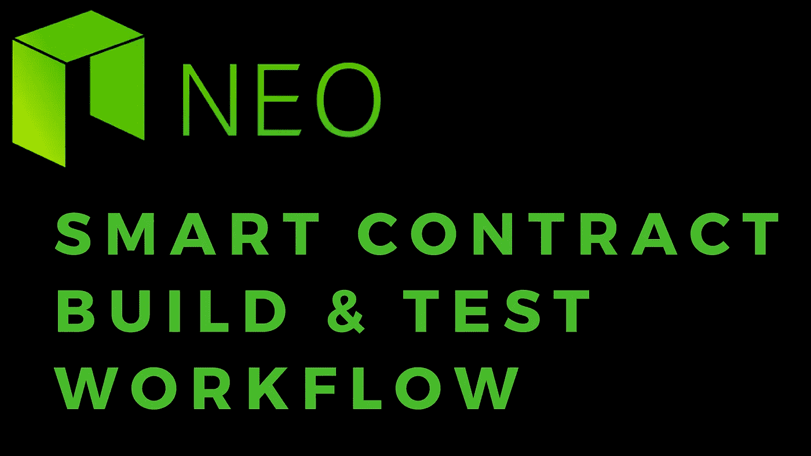

# NEO 智能合同:构建和测试

> 原文：<https://medium.com/coinmonks/neo-smart-contracts-build-test-fe83ae42a285?source=collection_archive---------5----------------------->

这是 hello world 教程帖子的后续帖子，将介绍如何在导入之前快速构建和测试智能合约代码。

如果你还没有浏览 hello world 和 dev 环境设置教程，我建议你在继续这篇文章之前快速浏览一下。

[Hello World 智能合约教程](/@nickfujita/neo-smart-contracts-tutorial-helloworld-13ecc19b31fe)

[开发环境设置教程](/@nickfujita/neo-dev-environment-setup-tutorial-e495f5364ada)

在 hello world 教程中，我们讨论了如何单独构建和导入合同文件的步骤。当您将合同代码构建到一个合理的水平，并且想要在您的私有网络上测试它时，这个练习是有用的。然而，有一种更快的方法来测试您的合同代码，甚至不需要导入它！

在 neo-python cli 中有一个命令`build`。我们在 hello world 教程中调用它是为了将我们的`py`文件编译成一个`avm`文件，其结构如下:

```
build path/to/file.py
```

好消息是这个`build`命令还带有额外的参数，它结合了契约`import`和`testinvoke`。

```
build {path/to/file.py} test {input_types} {return_type} {needs_storage} {needs_dynamic_invoke} {test_param} ...
```

正如您所看到的，它看起来非常熟悉`contract import`命令，但是也允许您将所有参数附加到命令的末尾来运行您的测试。例如:

```
build smartContracts/helloWorld.py test "" 01 False False
```

请注意，该命令引用了。`py`文件，而不是`.avm`文件。这是因为它将在同一个命令中执行新`.avm`的编译和测试调用。

让我们来看一个稍微有趣一点的字符串连接契约。

```
from boa.builtins import concatdef Main(initialString, args): result = initialString for word in args: if result == None: result = word else: result = concat(result,' ') result = concat(result,word) print(result) return result
```

这个契约有两个参数，一个初始字符串和一个数组。它遍历数组中的每一项，并将每个值与初始字符串连接起来。这就变成了返回值。为了运行它，我们可以使用以下命令:

```
build smartContracts/concat.py test 0710 07 False False sunshine ['hello','world','things','otherthings']
```

输入有两个参数，一个是 String 类型的，用`07`表示，另一个是 Array 类型的，用`10`表示，返回的类型是 String，用`07`表示。有关数据类型到字节映射的完整列表，请参见 NEO 官方文档。

[NEO 智能合约:参数类型](http://docs.neo.org/en-us/sc/tutorial/Parameter.html)

既然我们知道了如何使用 build 命令和 test invoke，我们现在可以快速迭代开发和测试新代码，而不必在每一步都导入契约代码！

> [在您的收件箱中直接获得最佳软件交易](https://coincodecap.com/?utm_source=coinmonks)

[](https://coincodecap.com/?utm_source=coinmonks)

如果你觉得这个教程有帮助，请在:

```
NEO/GAS/NEP5 tokens: AR8rRBxgWw5siKsp1dUmfTLy6QQTjcqoqBETH/ERC20 tokens: 0x575970777095575fDd12d9cD3B105b41D8DD1344NANO/XRB: xrb_3rpmim57tqbrb8hhjfzm1x5uk135yhmgqoj7j7wsufpo53e3ad5k93ggy1cdLTC: M8nZ7FwJXSMAkAfiGmTKjbB7MWpdwsp52dBTC: 3LcA1ztxFjghexRNWPyGXA59VFU3gF4PTzBCH: 1LXLiF7SjWGday6gm61hzbYHKbSAMevwXo
```

