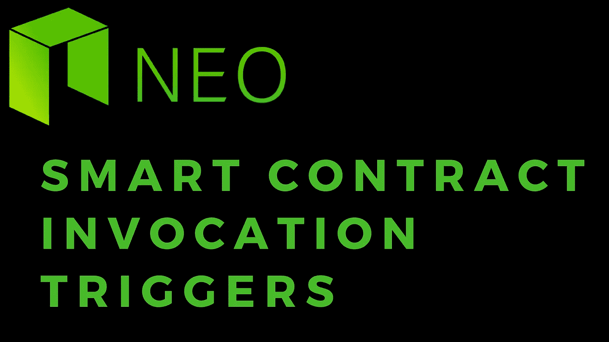

# NEO 智能合约:调用触发器

> 原文：<https://medium.com/coinmonks/neo-smart-contracts-invocation-triggers-490f945902e1?source=collection_archive---------1----------------------->

您知道直接调用事务并不是运行契约代码的唯一场景吗？

在它的一般用法中，可以直接调用您的智能合约代码，传递您在初始导入时指定的类型的输入参数。这构成了与持有 NEP5 令牌或合约存储中的托管资产数据的合约往来的大部分呼叫。但是，当创建交易以将 NEO 或 GAS 等资产转移到合同地址或从合同地址转移出时，您的合同代码也会被调用。

在发送或接收合同地址的资产时调用合同代码，可让您的合同能够自行管理其 NEO 和 GAS 资产。例如，如果您的合同允许用户用 NEO 交换您的 NEP5 令牌，则 NEO 会存入合同地址。这可以通过直接调用具有适当参数的合同并将 NEO 附加到交易来完成；或者通过执行 NEO 到合同地址的资产转移。在后一种情况下，您将希望契约代码能够处理 NEO 的用户存款，并以与直接契约调用类似的流程对其进行处理。

> [在您的收件箱中直接获得最佳软件交易](https://coincodecap.com/?utm_source=coinmonks)

[](https://coincodecap.com/?utm_source=coinmonks)

此外，一旦资产开始在合同地址中积累，您将需要一种方法来直接管理这些资金。因此，当代表合同地址执行发送事务时，我们希望能够根据具体情况批准或不批准这些撤销。

为了在您的契约代码中处理这一点，neo-python 提供了方法:

```
boa.blockchain.vm.Neo.Runtime.GetTrigger
```

***GetTrigger*** 是一个函数，在执行时返回契约是作为 ***应用*** 还是用于 ***验证*** 被调用。我们还提供了以下常量来帮助我们进行验证:

```
boa.interop.Neo.TriggerType.Application
boa.interop.Neo.TriggerType.Verification
```

## GetTrigger() ==应用程序

智能契约代码的执行是直接调用的，我们可以预期我们指定的类型的输入参数会出现。在这种情况下，我们应该期望利用这些输入值来确定契约的结果状态及其输出。

## GetTrigger() ==验证

正在执行合同代码以提供是否应该允许涉及合同地址所拥有的资产的交易成功的验证。在这种情况下，我们最终应该拥有返回 True 或 False 值的逻辑。返回 ***真*** 将验证事务将允许它成功执行。返回 ***False*** 将拒绝交易，转账不会发生。

# 用法示例

在下面的例子中，我们将模拟一个契约，其中我们有用于 ***应用*** 和 ***验证*** 触发器的处理程序。在验证触发器处理程序中，我们将只接受由合同所有者执行的交易，而在应用程序触发器中，如果提供了正确的输入密码，我们将返回一条特殊的秘密消息。

```
from boa.interop.Neo.Runtime import GetTrigger, CheckWitnessfrom boa.interop.Neo.TriggerType import Application, Verificationdef Main(password): trigger = GetTrigger() if trigger == Verification:
        return handleVerification() elif trigger == Application:
        return handleApplication(password) return Falsedef handleVerification(): owner = 'AK2nJJpJr6o664CWJKi1QRXjqeic2zRp8y' is_owner = CheckWitness(owner) if is_owner:
        return True return Falsedef handleApplication(password): if password == 'elephant':
        return 'banana' return False
```

## 处理验证

在我们处理一个 ***验证*** 触发器的情况下，如果创建发送或接收事务的地址是我们硬编码到合同代码中的所有者，我们将只返回 True。所有其他地址，试图发送或提取资产到或从这个帐户将有他们的交易被拒绝。

## handle 应用程序

在我们正在处理一个 ***应用*** 触发器的 cast 中，我们将期待一个密码作为输入。当且仅当提供的密码是 ***大象*** 时，会返回秘密消息 ***香蕉*** 。如果没有提供正确的密码，我们将简单地返回 ***假*** 。

有关更深入的示例，请参考 [Hasty Ogre 名称服务合同代码](https://github.com/nickfujita/hasty-ogre-name-service/blob/master/smartContract/hons-ico.py)。

如果你觉得这个教程有帮助，请在:

```
NEO/GAS/NEP5 tokens: AR8rRBxgWw5siKsp1dUmfTLy6QQTjcqoqBETH/ERC20 tokens: 0x575970777095575fDd12d9cD3B105b41D8DD1344NANO/XRB: xrb_3rpmim57tqbrb8hhjfzm1x5uk135yhmgqoj7j7wsufpo53e3ad5k93ggy1cdLTC: M8nZ7FwJXSMAkAfiGmTKjbB7MWpdwsp52dBTC: 3LcA1ztxFjghexRNWPyGXA59VFU3gF4PTzBCH: 1LXLiF7SjWGday6gm61hzbYHKbSAMevwXo
```

