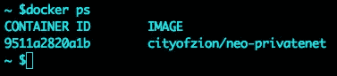
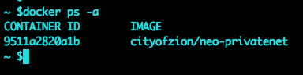
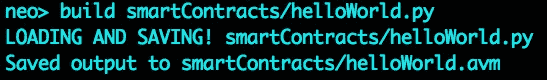
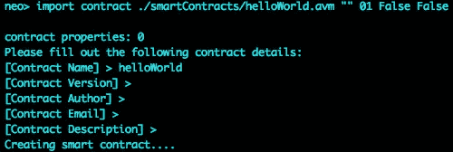
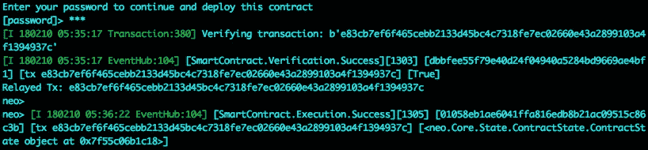
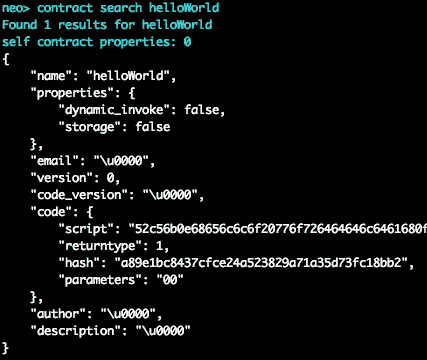
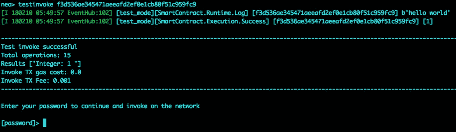
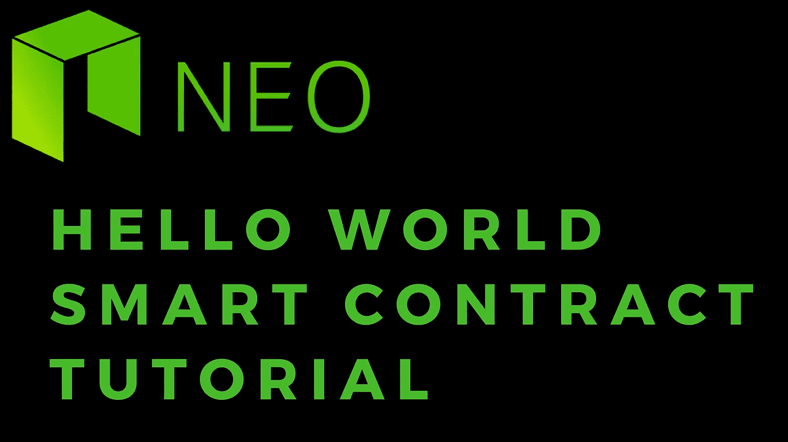

# NEO 智能合约教程:helloWorld

> 原文：<https://medium.com/coinmonks/neo-smart-contracts-tutorial-helloworld-13ecc19b31fe?source=collection_archive---------0----------------------->

这是一个关于在 NEO 上创建、部署和运行您的第一个智能合同的教程。

如果你还没有在一个带有 gas 的 docker 容器中设置你的开发环境和一个私有的 neo 网络，请在继续之前先运行这个教程。

[快速设置:NEO 专用网络](/@nickfujita/neo-dev-environment-setup-tutorial-e495f5364ada)

# 启动 docker 容器

如果您已经在终端上启动并运行了 docker 实例，请跳过这一步。

检查您的 neo privnet docker 容器是否正在运行

```
docker ps
```



如果容器没有运行


但是你已经创造了它。检查容器 id，并启动容器。

```
docker ps -a
```



复制`CONTAINER ID`并运行

```
docker start CONTAINER_ID
```

SSH 到 docker 容器中

```
docker exec -it neo-privatenet /bin/bash
```

# 撰写您的第一份智能合同

*   打开您最喜欢的文本编辑器
*   创建一个新文件，并将其保存到您在安装教程中创建的目录中(在标记为“非常重要”的步骤中)。这是与 docker 映像共享的文件夹。因此它允许您从 docker 容器中访问主机上的文件。
*   在这个文件中，我们将创建一个非常简单的函数，记录一个字符串并返回一个布尔值

```
def Main(): print("hello world"); return True
```

[这段代码也可以在这里找到。](https://github.com/nickfujita/neo-smart-contracts/blob/master/intro/01-helloWorld.py)

*   保存文件

# 编译 python 智能合约文件

回到装载了 docker 容器 SSH 会话的终端，假设您仍然在`neo-python`目录中，打开 neo cli

```
np-prompt -p -vconfig sc-events on
```

或者

```
neopy
```

运行编译命令

```
build smartContracts/helloWorld.py
```

注意:这也假设你已经创建了名为`smartContracts`的共享文件夹，如[安装教程中所述。](https://steemit.com/neo/@z0yo/quick-setup-neo-private-net-w-gas.)如果不是，请将文件夹名称更改为您指定的名称。

现在您应该在您的`smartContracts`文件夹中有一个编译好的`helloWorld.avm`，正如成功确认消息中所指示的。



# 导入合同

用 NEO/GAS 打开您的钱包

```
open wallet neo-privnet.wallet
```

输入钱包密码

```
coz
```

使用以下命令导入智能合约

```
import contract CONTRACT_FILE INPUT_TYPES OUTPUT_TYPES NEEDS_STORAGE NEEDS_DYNAMIC_INVOKE
```

我将在以后的文章中讨论这些选项，但是目前，我们的命令应该类似于下面这样

```
import contract ./smartContracts/helloWorld.avm "" 01 False False
```

然后会提示您填写此合同的详细信息。现在只需输入一个名字，其余的留空。



输入钱包密码(`coz`)确认部署该合同，并等待部署成功的反馈信息。



# 援引合同

确认合同已部署

```
contract search CONTRACT_NAME
```

在我们的情况下

```
contract search helloWorld
```



复制合同哈希值。在这种情况下是`a89e1bc8437cfce24a523829a71a35d73fc18bb2`，但在您的情况下会有所不同。

在合同上运行一个`testinvoke`

```
testinvoke CONTRACT_HASH
```



正如您所看到的，测试调用是成功的，有一个日志记录了我们的字符串“hello world”，以及结果“1”(相当于`True`)

点击返回，而不是输入钱包密码，因为这样做将实际运行合同，并将交易过帐到新区块链。

恭喜你。您已经编写、部署并运行了与 NEO 的第一份智能合同！

> [在您的收件箱中直接获得最佳软件交易](https://coincodecap.com/?utm_source=coinmonks)

[](https://coincodecap.com/?utm_source=coinmonks)

如果你觉得这个教程有帮助，请在:

```
NEO/GAS/NEP5 tokens: AR8rRBxgWw5siKsp1dUmfTLy6QQTjcqoqBETH/ERC20 tokens: 0x575970777095575fDd12d9cD3B105b41D8DD1344NANO/XRB: xrb_3rpmim57tqbrb8hhjfzm1x5uk135yhmgqoj7j7wsufpo53e3ad5k93ggy1cdLTC: M8nZ7FwJXSMAkAfiGmTKjbB7MWpdwsp52dBTC: 3LcA1ztxFjghexRNWPyGXA59VFU3gF4PTzBCH: 1LXLiF7SjWGday6gm61hzbYHKbSAMevwXo
```

