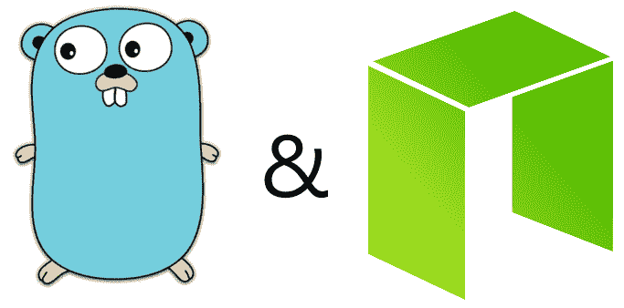
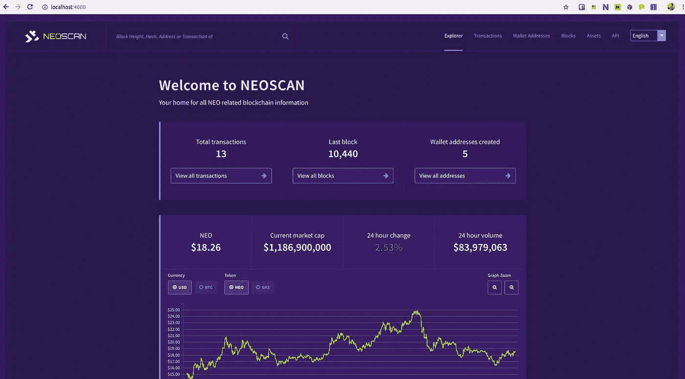
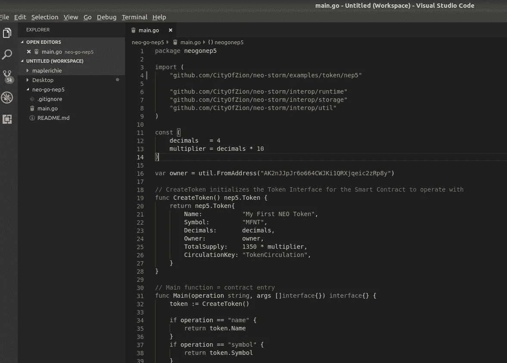
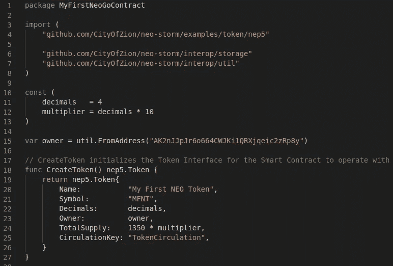

# 使用 Go 在 NEO 的私人网络上发布 NEP-5 令牌的分步指南

> 原文：<https://medium.com/coinmonks/neo-token-contract-nep-5-in-go-f6b0102c59ee?source=collection_archive---------0----------------------->



Gopher and NEO

这是一个关于设置使用 Go 开发 NEO 智能契约和 NEO DApps 的环境的教程。如果不知道什么是 NEO，智能合约，DApps，可以参考:
[什么是 NEO，什么是 GAS？](https://hackernoon.com/what-is-neo-and-what-is-gas-5b9828a1aa65) — [区块骑士](https://hackernoon.com/@coinrepeater)
[NEO 智能契约介绍](http://docs.neo.org/en-us/sc/introduction.html)
[什么是 NEO DApps？](https://www.neonbeginner.com/2018/04/22/what-is-neo-dapps-a-brief-introduction/)

*额外阅读*
[NEO 智能经济](https://neo.org/)——[NEO DApps](http://ndapp.org/)
[NEO 适合初学者](https://www.neonbeginner.com/)——[NEO 今日新闻](https://neonewstoday.com/)——[NEO fans](http://neofans.org/)
[牛逼 NEO](https://github.com/CityOfZion/awesome-neo)

# **简介**

**开发语言**

在 NEO 的智能合同平台上开发的一个优势是它支持广泛的开发语言。

NEO 推荐 C#，虽然它也支持 Python、Java、Go、Ruby，将来还会支持 Kotlin、C/C++、JavaScript 等。

尽管它支持多种语言，但你会发现大多数现有项目都是使用 C#、Python、Java 完成的，更少的是在 Go 上。因此，我将尝试记录一个简单的教程，参考[锡安城的资源](https://neonewstoday.com/development/city-of-zion-launches-neo-storm-v1-0-0-a-smart-contract-framework-for-neo-written-in-go/)，希望吸引 Go 开发者尝试一下(双关语)！

**对于地鼠**

不管你是第一次还是有经验的开发者，总是鼓励你从私有网络或测试网络开始你的旅程。

**为什么？**

因为在主网上部署一个 [NEP-5](https://github.com/neo-project/proposals/blob/master/nep-5.mediawiki) 令牌会让你被 [490 气](http://docs.neo.org/en-us/sc/systemfees.html)打回去。

在撰写本文时(2018 年 9 月 15 日)，汽油代币的市场价格为 5.80 美元，总计 2842 美元，对于任何初创公司来说，这仍然是一笔相当大的账单。

但是，当天然气价格达到历史最高水平时，它是每令牌 95.87 美元，并且仅通过智能合同部署，它就会在您的预算中留下 47，000 美元的缺口！

因此，总是鼓励您从专用网或测试网开始您的旅程，并且只有在准备好之后才在主网上部署。

**要求**

对于本教程，所需的开发环境如下:
1。操作系统— [Ubuntu 桌面](https://www.ubuntu.com/download/desktop) 18.04.1 LTS

2.Git CLI — [Git](https://git-scm.com/downloads)

3.语言— [围棋编程语言](https://golang.org/doc/install)

4.Go 依赖管理工具— [Dep](https://github.com/golang/dep)

5.Docker—[Docker CE](https://docs.docker.com/install/)&[Docker Compose](https://docs.docker.com/compose/install/)

6.编辑— [Visual Studio 代码](https://code.visualstudio.com/download)，[扩展:Go](https://code.visualstudio.com/docs/editor/extension-gallery)

**使用的其他近地天体资源**

1.  Go Smart 合同框架— [新风暴](https://github.com/CityOfZion/neo-storm)
2.  Python 和 neo-scan 图像中预先构建的 neo-priv net-with-gas—[neo-scan-docker](https://github.com/slipo/neo-scan-docker)

**重要说明:**结果可能因 NEO 编译器和节点版本而异

本质上，有几种方式来运行 PrivateNet，比如使用 [neo-go](https://github.com/CityOfZion/neo-go) 或 [neo-privatenet-docker](https://github.com/CityOfZion/neo-privatenet-docker) 。然而，在本教程中，我们将通过[滑动到](https://github.com/slipo)来坚持[新扫描列表](https://github.com/slipo/neo-scan-docker)。neo-scan-docker 是基于 [neo-python](https://github.com/CityOfZion/neo-python) 构建的，因此它将携带一些“python”组件。此外，它还附带了[新扫描](https://github.com/CityOfZion/neo-scan)的用户界面，允许您分析智能合同部署事务。

*安装方法可能会因您的操作系统而有所不同。请参考以上链接了解更多信息。

# 设置您的环境

**首先，让我们用**[**NEO-scan-docker**](https://github.com/slipo/neo-scan-docker)**设置您的 NEO Privatenet。**
1。检查您的 Git、Docker 和 Docker 作曲是否到位。

```
richie@Redbuntu:~/Desktop$ sudo git --version
git version 2.17.1
richie@Redbuntu:~/Desktop$ sudo docker -v
Docker version 18.06.1-ce, build e68fc7a
richie@Redbuntu:~/Desktop$ sudo docker-compose -v
docker-compose version 1.22.0, build f46880fe
```

2.克隆[slip 到](https://github.com/slipo)的[new-scan-docker](https://github.com/slipo/neo-scan-docker)并加载带有`docker-compose`的 Docker 图像。下载图片可能需要一段时间，所以请耐心等待`done`状态出现。

```
richie@Redbuntu:~/Desktop$ git clone [https://github.com/slipo/neo-scan-docker.git](https://github.com/slipo/neo-scan-docker.git)
Cloning into 'neo-scan-docker'...
remote: Counting objects: 27, done.
remote: Total 27 (delta 0), reused 0 (delta 0), pack-reused 27
Unpacking objects: 100% (27/27), done.
richie@Redbuntu:~/Desktop$ cd neo-scan-docker/
richie@Redbuntu:~/Desktop/neo-scan-docker$ sudo docker-compose up
Starting neo-scan-docker_postgresql_1 ... done
Starting neo-privnet                  ... done
Starting neo-scan                     ... done
Attaching to neo-scan-docker_postgresql_1, neo-privnet, neo-scan
```

3.将`127.0.0.1 neo-privnet`添加到您的主机文件中。请注意，主机文件的位置可能因不同的操作系统而异。

```
Unix/Linux/macOS - /etc/hosts
Windows          - C:\Windows\System32\Drivers\etc\hosts
```

4.将`[http://localhost:4000/](http://localhost:4000/)`加载到您的网络浏览器中，您会看到[通过](https://github.com/CityOfZion/neo-scan)[锡安城](https://cityofzion.io/)重新扫描的网络界面。



5.点击`Wallet Addresses`按钮，您会看到一个装有预装 NEO 和 GAS 代币的钱包地址。我们将将其用于智能合同部署。更多信息请参见[新隐私](https://hub.docker.com/r/cityofzion/neo-privatenet/)。

```
You can use the keypair with the initial NEO and GAS by importing the WIF key.Private/WIF key: KxDgvEKzgSBPPfuVfw67oPQBSjidEiqTHURKSDL1R7yGaGYAeYnr
Address: AK2nJJpJr6o664CWJKi1QRXjqeic2zRp8y
Script hash (for use with CheckWitness): b'#\xba\'\x03\xc52c\xe8\xd6\xe5"\xdc2 39\xdc\xd8\xee\xe9'
```

有了这个，你的近地天体隐私和近地天体扫描设置就完成了！

**接下来，让我们设置您的** [**新风暴**](https://github.com/CityOfZion/neo-storm) **。**

1.将下列`go version`、`dep version`、`echo $GOPATH`输入您的终端，确保 Go、Dep、GOPATH 就位。

```
richie@Redbuntu:~$ go version
go version go1.10.1 linux/amd64
richie@Redbuntu:~$ dep version
dep:
 version     : devel
 build date  : 
 git hash    : 
 go version  : go1.8.3
 go compiler : gc
 platform    : linux/amd64
richie@Redbuntu:~$ echo $GOPATH
/home/richie/go
```

2.用`go get`获得[新风暴](https://github.com/CityOfZion/neo-storm)，用`dep`取回依赖，用`make install`安装。**忽略警告信息*

```
richie@Redbuntu:~$ go get -u github.com/CityOfZion/neo-storm
package github.com/CityOfZion/neo-storm: no Go files in /home/richie/go/src/github.com/CityOfZion/neo-storm
richie@Redbuntu:~$ cd $GOPATH/src/github.com/CityOfZion/neo-storm
richie@Redbuntu:~/go/src/github.com/CityOfZion/neo-storm$ sudo dep ensure -update
dep: WARNING: Unknown field in manifest: prune
richie@Redbuntu:~/go/src/github.com/CityOfZion/neo-storm$ sudo make install
installing project dependencies
dep: WARNING: Unknown field in manifest: prune
installing neo-storm framework
done installing, happy coding!
```

3.现在`neo-storm`已经安装成功，你应该可以测试了。

```
richie@Redbuntu:~/go/src/github.com/CityOfZion/neo-storm$ neo-storm
NAME:
   neo-storm - Neo smart contract framework for the Go programming languageUSAGE:
   neo-storm [global options] command [command options] [arguments...]VERSION:
   0.0.0COMMANDS:
     compile     compile a smart contract to an .avm file
     testinvoke  testinvoke a smart contract against a remote NEO RPC node
     init        initialize a new smart-contract in a directory with boiler plate code
     help, h     Shows a list of commands or help for one commandGLOBAL OPTIONS:
   --help, -h     show help
   --version, -v  print the version
```

4."完成安装，快乐编码！"—让我们试一试我们的第一份智能合同！

```
richie@Redbuntu:~/Desktop$ cd ~/Desktop
richie@Redbuntu:~/Desktop$ neo-storm init -n NeoStormTest
Successfully initialized smart contract [NeoStormTest]
richie@Redbuntu:~/Desktop$ cd NeoStormTest/
richie@Redbuntu:~/Desktop/NeoStormTest$ ls
main.go
richie@Redbuntu:~/Desktop/NeoStormTest$ cat main.go
package NeoStormTestimport "github.com/CityOfZion/neo-storm/interop/runtime"func Main(op string, args []interface{}) {
    runtime.Notify("Hello world!")
```

# 颁发您的 NEP-5 令牌合同

1.  要在近地天体上发行 NEP-5 令牌，我们必须遵守其[令牌标准](https://github.com/neo-project/proposals/blob/master/nep-5.mediawiki)。* *更高级的 nep 5 . 1，在这里可以参照*[](https://github.com/neonexchange/neo-ico-template)**——这样可以让令牌在*[*NEX*](https://neonexchange.org/)*上列出。**

```
*NEP-5 Token Standard
Methods
-totalSupply()
-name()
-symbol()
-decimals()
-balanceOf(account)
-transfer(from, to, amount)
Events
-transfer(from, to, amount)NEP-5(.1) by NEX
Methods
-totalSupply()
-name()
-symbol()
-decimals()
-balanceOf(ctx, account)
-transfer(ctx, from, to, amount, callingScriptHash)
-transferFrom(ctx, from, to, amount)
-approve(ctx, owner, spender, amount, callingScriptHash)
-allowance(ctx, owner, spender)*
```

*2.您可以在—[https://github.com/maplerichie/neo-go-nep5](https://github.com/maplerichie/neo-go-nep5)处分叉/克隆我的存储库，而不是重写令牌合同*

```
*richie@Redbuntu:~/Desktop$ git clone [https://github.com/maplerichie/neo-go-nep5](https://github.com/maplerichie/neo-go-nep5) MyFirstNeoGoContract*
```

*3.启动您的代码编辑器(我使用 Visual Studio 代码)，并将`~/Desktop/MyFirstNeoGoContract`添加到您的工作空间中。也有来自[的`neo-storm`示例文件夹的示例，http://github . com/city of Zion/neo-storm/tree/master/examples/token](https://github.com/CityOfZion/neo-storm/tree/master/examples/token)*

**

*[https://github.com/maplerichie/neo-go-nep5](https://github.com/maplerichie/neo-go-nep5)*

*4.编辑`package`并玩弄 NEP-5 属性，如`decimals, multiplier, owner Address, Name, Symbol, TotalSupply`。*

***包**:包应改为`package MyFirstNeoGoContract`与文件夹名称相同*

***小数**:设置代币使用的小数位数或代币的可除数。
例如:
NEO 的十进制是`0`，这使得它成为一个不可分的令牌。因此，不可能以小数形式传送或接收 NEO，必须以整数形式传送或接收。然而，小数只有在交易所才有可能，因为它们创造了自己的十进制系统来促进交易标准。*

***乘数**:当**小数**和**总供给**相乘时，得出数值。输入格式为`10^decimals`
例如:
如果`decimals = 6`，乘数 valeue 应为`10^6`，那么`multiplier = 1000000`。*

*这是你的代币发行者的地址。这里我们将使用新私有网络地址`AK2nJJpJr6o664CWJKi1QRXjqeic2zRp8y`*

***名称**:字符串形式的 NEP-5 令牌名称*

***符号**:你的 NEP-5 令牌符号。它通常是 3 个字符长，但不是必须的。*

*这是你的总代币供应量。设定最大供应量可能会防止通货膨胀。*

**

*5.更改参数并确保符合 NEP-5 令牌标准。然后，使用`neo-storm`继续编译 Go Smart 合同*

```
*richie@Redbuntu:~/Desktop/MyFirstNeoGoContract$ neo-storm compile -i main.go -o main.avm*
```

*6.您将在当前目录中看到`main.avm`。目前，`neo-storm`没有对 NEP-5 令牌标准进行检查。根据我的经验，如果遗漏了`owner Address`，就会显示错误。*

*7.我们现在可以将 NEP-5 部署到私人码头。为此，我们首先需要获得 Privatenet Docker ID，然后从主机位置复制`main.avm`并将其粘贴到 Privatenet Docker 映像上，最后将其附加到正在运行的 Docker 上。*

```
*richie@Redbuntu:~/Desktop/MyFirstNeoGoContract$ sudo docker ps
CONTAINER ID        IMAGE                       COMMAND                  CREATED             STATUS              PORTS                                                                        NAMES
69c60667835b        slipoh/neo-scan             "/bin/sh -c 'sleep 3…"   6 hours ago         Up About a minute   0.0.0.0:4000->4000/tcp                                                       neo-scan
88b358cdd8ff        cityofzion/neo-privatenet   "/bin/bash /opt/run.…"   6 hours ago         Up About a minute   0.0.0.0:20333-20336->20333-20336/tcp, 0.0.0.0:30333-30336->30333-30336/tcp   neo-privnet
ab96dc398c62        postgres:10.1               "docker-entrypoint.s…"   6 hours ago         Up About a minute   0.0.0.0:5432->5432/tcp                                                       neo-scan-docker_postgresql_1
richie@Redbuntu:~/Desktop/MyFirstNeoGoContract$ sudo docker cp main.avm 88b358cdd8ff:/neo-python
richie@Redbuntu:~/Desktop/MyFirstNeoGoContract$ sudo docker exec -it 88b358cdd8ff /bin/bash* Consensus nodes are running in screen sessions, check 'screen -ls'
* neo-python is installed in /neo-python, with a neo-privnet.wallet file in place
* You can use the alias 'neopy' in the shell to start neo-python's prompt.py with privnet settings
* Please report issues to [https://github.com/CityOfZion/neo-privatenet-docker](https://github.com/CityOfZion/neo-privatenet-docker)*
```

*8.在 Docker 上，导航到`neo-python-cli`并用密码`coz`解锁钱包。*

```
*root@88b358cdd8ff:/neo-python# neopy
Privatenet useragent '/NEO:2.7.6/', nonce: 513759764
[I 180914 10:34:09 LevelDBBlockchain:114] Created Blockchain DB at /root/.neopython/Chains/privnet 
[I 180914 10:34:09 NotificationDB:73] Created Notification DB At /root/.neopython/Chains/privnet_notif 
NEO cli. Type 'help' to get startedneo> open wallet neo-privnet.wallet
[password]> ***
Opened wallet at neo-privnet.wallet*
```

*9.在部署契约`main.avm`之前，我们先通过`neo-scan`看看钱包余额。*

```
*neo> wallet
[I 180914 11:01:22 UserWallet:538] Script hash b'#\xba\'\x03\xc52c\xe8\xd6\xe5"\xdc2 39\xdc\xd8\xee\xe9' <class 'bytes'>
Used 0.357 Gas 
Used 0.357 Gas 
Wallet {
    "path": "neo-privnet.wallet",
    "addresses": [
        {
            "version": 0,
            "script_hash": "AK2nJJpJr6o664CWJKi1QRXjqeic2zRp8y",
            "frozen": false,
            "votes": [],
            "balances": {
                "0xc56f33fc6ecfcd0c225c4ab356fee59390af8560be0e930faebe74a6daff7c9b": "100000000.0",
                "0x602c79718b16e442de58778e148d0b1084e3b2dffd5de6b7b16cee7969282de7": "74589.9996"
            },
            "is_watch_only": false,
            "tokens": [
                "[a3640dd3c560c75528e5f861da5da98958d0d713] NXT2 : 2500000.00000000"
            ]
        }
    ],
    "height": 10294,
    "percent_synced": 100,
    "synced_balances": [
        "[NEO]: 100000000.0 ",
        "[NEOGas]: 74589.9996 ",
        "[NXT2]: 2500000 "
    ],
    "public_keys": [
        {
            "Address": "AK2nJJpJr6o664CWJKi1QRXjqeic2zRp8y",
            "Public Key": "031a6c6fbbdf02ca351745fa86b9ba5a9452d785ac4f7fc2b7548ca2a46c4fcf4a"
        }
    ],
    "tokens": [
        {
            "name": "NEX Template V2",
            "symbol": "NXT2",
            "decimals": 8,
            "script_hash": "0xa3640dd3c560c75528e5f861da5da98958d0d713",
            "contract_address": "AHao29nmHmJ82Fsj1qDgqtDc2rtQ8u2n2b"
        }
    ],
    "claims": {
        "available": "0.0",
        "unavailable": "7730.0"
    }
}*
```

*10.它看起来可以部署了！同样，钱包的密码是`coz`。*

```
*neo> import contract main.avm 0710 05 True False 
contract properties: 1
Please fill out the following contract details:
[Contract Name] > MyFirstNEOToken
[Contract Version] > 1.0
[Contract Author] > Richie
[Contract Email] > [babierichie@hotmail.com](mailto:babierichie@hotmail.com)
[Contract Description] > First NEO Token
Creating smart contract....
                 Name: MyFirstNEOToken 
              Version: 1.0
               Author: Richie 
                Email: [babierichie@hotmail.com](mailto:babierichie@hotmail.com) 
          Description: First NEO Token 
        Needs Storage: True 
 Needs Dynamic Invoke: False 
{
    "hash": "0x4e9b87c96158a8e2cc4b74794f727b38947e9862",
    "script": "...",
    "parameters": "0710",
    "returntype": "05"
}
Used 500.0 Gas-------------------------------------------------------------------------------------------------------------------------------------
Test deploy invoke successful
Total operations executed: 11 
Results:
[<neo.Core.State.ContractState.ContractState object at 0x7f79b510d278>]
Deploy Invoke TX GAS cost: 490.0 
Deploy Invoke TX Fee: 0.0 
-------------------------------------------------------------------------------------------------------------------------------------Enter your password to continue and deploy this contract
[password]> ***
[I 180914 11:03:33 Transaction:613] Verifying transaction: b'9d63e8977edb6448b7d9efa93e0ff0258324ab3b530d3848def4b29dd6569114'
Relayed Tx: 9d63e8977edb6448b7d9efa93e0ff0258324ab3b530d3848def4b29dd6569114*
```

*11.使用提供的哈希验证交易。**注意**:哈希在你的机器上会有所不同。*

```
*neo> tx 9d63e8977edb6448b7d9efa93e0ff0258324ab3b530d3848def4b29dd6569114
{
    "txid": "0x9d63e8977edb6448b7d9efa93e0ff0258324ab3b530d3848def4b29dd6569114",
    "type": "InvocationTransaction",
    "version": 1,
    "attributes": [],
    "vout": [
        {
            "n": 0,
            "asset": "0x602c79718b16e442de58778e148d0b1084e3b2dffd5de6b7b16cee7969282de7",
            "value": "25493.9997",
            "address": "AK2nJJpJr6o664CWJKi1QRXjqeic2zRp8y"
        }
    ],
    "vin": [
        {
            "txid": "475a091ccaa6330320a29884f5f8796a260bdba91352dd409d16787b37d8be26",
            "vout": 0
        }
    ],
    "sys_fee": "4.9e-06",
    "net_fee": "489.9999951",
    "scripts": [
        {
            "invocation": "40510fa6630ef581108057ebe967cd306522466a32eaf068cf3717da1e640b866246c013033e3c878ebf9247a5a3500178b21b126b3af63ed07a86b0d2c4f34c89",
            "verification": "21031a6c6fbbdf02ca351745fa86b9ba5a9452d785ac4f7fc2b7548ca2a46c4fcf4aac"
        }
    ],
    "script": "...",
    "gas": 49000000000,
    "height": 10302,
    "unspents": [
        {
            "n": 0,
            "asset": "0x602c79718b16e442de58778e148d0b1084e3b2dffd5de6b7b16cee7969282de7",
            "value": "25493.9997",
            "address": "AK2nJJpJr6o664CWJKi1QRXjqeic2zRp8y"
        }
    ]
}*
```

*12.交易显示后，再次检查钱包余额。在第 9 步，我们的气体平衡是 74589.9996，现在，气体平衡是 74099.9996。因此，490 天然气已用于合同部署！*

```
*neo> wallet
[I 180914 11:18:38 UserWallet:538] Script hash b'#\xba\'\x03\xc52c\xe8\xd6\xe5"\xdc2 39\xdc\xd8\xee\xe9' <class 'bytes'>
Used 0.357 Gas 
Used 0.357 Gas 
Wallet {
    "path": "neo-privnet.wallet",
    "addresses": [
        {
            "version": 0,
            "script_hash": "AK2nJJpJr6o664CWJKi1QRXjqeic2zRp8y",
            "frozen": false,
            "votes": [],
            "balances": {
                "0xc56f33fc6ecfcd0c225c4ab356fee59390af8560be0e930faebe74a6daff7c9b": "100000000.0",
                "0x602c79718b16e442de58778e148d0b1084e3b2dffd5de6b7b16cee7969282de7": "74099.9995"
            },
            "is_watch_only": false,
            "tokens": [
                "[a3640dd3c560c75528e5f861da5da98958d0d713] NXT2 : 2500000.00000000"
            ]
        }
    ],
    "height": 10348,
    "percent_synced": 100,
    "synced_balances": [
        "[NEO]: 100000000.0 ",
        "[NEOGas]: 48605.9999 ",
        "[NXT2]: 2500000 "
    ],
    "public_keys": [
        {
            "Address": "AK2nJJpJr6o664CWJKi1QRXjqeic2zRp8y",
            "Public Key": "031a6c6fbbdf02ca351745fa86b9ba5a9452d785ac4f7fc2b7548ca2a46c4fcf4a"
        }
    ],
    "tokens": [
        {
            "name": "NEX Template V2",
            "symbol": "NXT2",
            "decimals": 8,
            "script_hash": "0xa3640dd3c560c75528e5f861da5da98958d0d713",
            "contract_address": "AHao29nmHmJ82Fsj1qDgqtDc2rtQ8u2n2b"
        }
    ],
    "claims": {
        "available": "0.0",
        "unavailable": "8652.0"
    }
}*
```

*我们还可以查看已部署的合同。*

```
*neo> contract search My
Found 1 results for My{
    "version": 0,
    "code": {
        "hash": "0x4e9b87c96158a8e2cc4b74794f727b38947e9862",
        "script": "...",
        "parameters": "0710",
        "returntype": 5
    },
    "name": "MyFirstNEOToken",
    "code_version": "1.0",
    "author": "Richie",
    "email": "[babierichie@hotmail.com](mailto:babierichie@hotmail.com)",
    "description": "First NEO Token",
    "properties": {
        "storage": true,
        "dynamic_invoke": false
    }
}*
```

*13.最后，我们可以尝试使用钱包的密码`coz`调用带有契约散列的令牌。*

```
*neo> testinvoke 0x4e9b87c96158a8e2cc4b74794f727b38947e9862 deploy []*
```

*这就对了。您现在已经成功地在您的 NEO 专用网上发布了您自己的 NEP-5 令牌！*

# *教程结束*

*希望这个教程简单到足以让地鼠遵循，并希望任何围棋开发者将 [NEO 的不和](https://discord.io/neo)一起参与它的开发。你绝对应该试一试！！*

*如果你真的需要我的帮助，:D，打[不和谐](https://discordapp.com/) `LikKee.Richie#5647`找我*

# *作者*

*[Richie Chong](https://linkedin.com/in/likkeerichie/) ，马来西亚
[NEOMY 社区](https://www.facebook.com/NEOMYCommunity/)成员*

***校对**
[马来西亚伦弘](/@hong.aaron)*

> *[直接在您的收件箱中获得最佳软件交易](https://coincodecap.com/?utm_source=coinmonks)*

*[](https://coincodecap.com/?utm_source=coinmonks)*