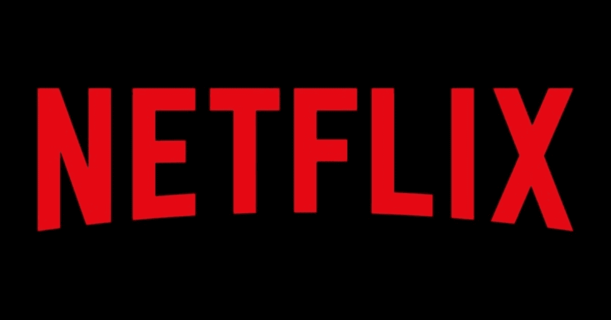
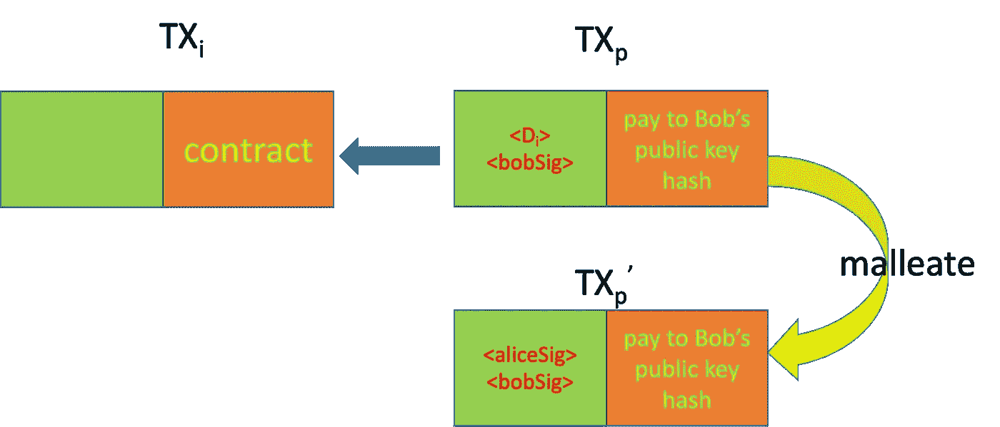

# 比特币支付渠道上的网飞

> 原文：<https://medium.com/coinmonks/netflix-over-bitcoin-payment-channels-ec55b3c242da?source=collection_archive---------1----------------------->

## 延展性是一个特性，而不是一个缺陷

我们展示了一种基于支付渠道的经济高效的方式来按需提供电影流和其他类型的服务。

# 可锻性

在比特币的背景下，[延展性](https://wiki.bitcoinsv.io/index.php/Transaction_Malleability)意味着修改交易而不使其无效的能力。有两个级别:

*   脚本级别:签名不包括解锁脚本，因此修改它不会改变签名的有效性
*   事务级: [SIGHASH 标志](https://wiki.bitcoinsv.io/index.php/SIGHASH_flags)可用于控制哪些输入/输出被签名。

我们在这里关注脚本级的可伸缩性。

# 流动

假设 Alice 想从 Bob 那里购买电影流。

电影被分成多个小块: *D₀，D₁，D₂，…，Dn* 。爱丽丝和鲍勃创建了一个所谓的[支付通道](https://wiki.bitcoinsv.io/index.php/Payment_Channels)来交换离线信息。鲍勃和爱丽丝分享了默克尔树的叶子(下面的 *H₀* 到 *H₇* )。爱丽丝可以通过计算其根哈希( *T₀* )来验证其保真度，并将其与给定电影的已知哈希进行比较。

Figure 1: A Merkle Tree

爱丽丝创建了一系列交易: *TX₁，TX₂，…，TXn* 。它将硬币锁定在下面的智能合约中，由输入中引用的她的 UTXOs 提供资金。

Figure 2: Transactions with Scripts Shown²

[Contract Netflix](https://github.com/sCrypt-Inc/boilerplate/tree/master/contracts/netflix.scrypt)

解锁硬币有两种选择:

1.  Bob 签名并提供正确的数据块，即当第 12 行的为假时*中的条件*
2.  如果第 12 行的为真，则当*中的条件成立时，爱丽丝和鲍勃都签名*

每次爱丽丝收到 *Dᵢ* ， *TXᵢ* 更新只有两个变化:

1.  *Hᵢ* :上面契约中的哈希更新为下一个块的哈希
2.  输出数量增加 100 satoshis，以支付额外的大块。

注意爱丽丝需要再次签名。下图显示了 Alice 和 Bob 之间的交流，从通道的打开到关闭。

Payment Channel⁴

## 通道关闭

在任何时候，Alice 或 Bob 都可以单方面或联合停止流式传输。如果爱丽丝停止支付，鲍勃将停止流；反之亦然。没有人能作弊。

2**-方式** : Bob 发送 *TXp* ，支付交易，给 Alice。艾丽丝**通过用她的签名**替换 Dᵢ来扩展 **，如图 2 所示。请注意，新交易 *TXp'* 仍然有效，并且仍然可以使用选项 2 而不是选项 1 来解锁旧合同。Bob 更喜欢以这种方式关闭通道，因为:**

*   节省了交易费用。一般来说，每个块都比签名大得多(平均只有 [72 字节](https://b10c.me/blog/006-evolution-of-the-bitcoin-signature-length/))。在极端的情况下，使用 [OP_PUSHDATA4](https://wiki.bitcoinsv.io/index.php/Pushdata_Opcodes) 的 4GB 数据块被修剪，导致巨大的~ ***60，000，000 倍*** 减少。
*   数据块是私有且敏感的。Bob 不想让链上的电影块暴露给每个人观看。

1

只有两个交易在这个链上结束。之后可以安全地丢弃所有中间事务。

## 讨论

与网飞等现有付费流媒体网站相比，这种基于支付渠道的流媒体具有显著优势:

*   现收现付:只为观看的部分付费
*   由于比特币的微支付能力，交易成本低
*   不需要注册。

为了更加实际，必须采取额外的措施来防止 Alice 在渠道外加倍花费资金交易(在 *TXᵢ* 中引用的 UTXOs)，并广播陈旧的交易(例如，当我们已经在 *TX₉* 时广播 *TX₁* )。更多详情请参考 patent⁴。

此外，Bob 可以使用[这种技术](https://xiaohuiliu.medium.com/access-blockchain-data-from-bitcoin-smart-contracts-part-4-94dd34ce697d)迭代地仅共享下一个块及其 Merkle 证明，以避免在开始时一次共享所有树叶。

# 摘要

我们使用流媒体电影只是作为一个例子。将这种方法扩展到“流式传输”其他类型的数据/服务是相当简单的，例如 Wifi、公用事业(水和电)、租赁(汽车和房子)。许多现收现付服务可以通过这种方式方便地提供。

# 承认

这篇文章是基于中国专利 WO2020240297A1⁴.

[1]我们假设电影的 Merkle roots 可以从 IMDB 和网飞这样的可信第三方公开获得。

[2]为简洁起见，未显示事务的某些部分，如变更输出。

[3]从技术上讲，爱丽丝可以通过在鲍勃完成一大块后不给他钱来作弊。但是这在实践中不是问题，因为它的价值很低。

[4]中国专利 [WO2020240297A1](https://patents.google.com/patent/WO2020240297A1) :包含在区块链中的交易的可延展性

> 加入 Coinmonks [电报频道](https://t.me/coincodecap)和 [Youtube 频道](https://www.youtube.com/c/coinmonks/videos)了解加密交易和投资

## 另外，阅读

*   [7 大最佳零费用密码交易平台](https://blog.coincodecap.com/zero-fee-crypto-exchanges)
*   [分散交易所](https://blog.coincodecap.com/what-are-decentralized-exchanges) | [比特 FIP](https://blog.coincodecap.com/bitbns-fip) | [Pionex 评论](https://blog.coincodecap.com/pionex-review-exchange-with-crypto-trading-bot)
*   [用信用卡购买密码的 10 个最佳地点](https://blog.coincodecap.com/buy-crypto-with-credit-card)
*   [OKEx 回顾](/coinmonks/okex-review-6b369304110f) | [Kucoin 交易机器人](/coinmonks/kucoin-trading-bot-automate-your-trades-8cf0ca2138e0) | [期货交易机器人](/coinmonks/futures-trading-bots-5a282ccee3f5)
*   [AscendEx Staking](https://blog.coincodecap.com/ascendex-staking)|[Bot Ocean Review](https://blog.coincodecap.com/bot-ocean-review)|[最佳比特币钱包](https://blog.coincodecap.com/bitcoin-wallets-india)