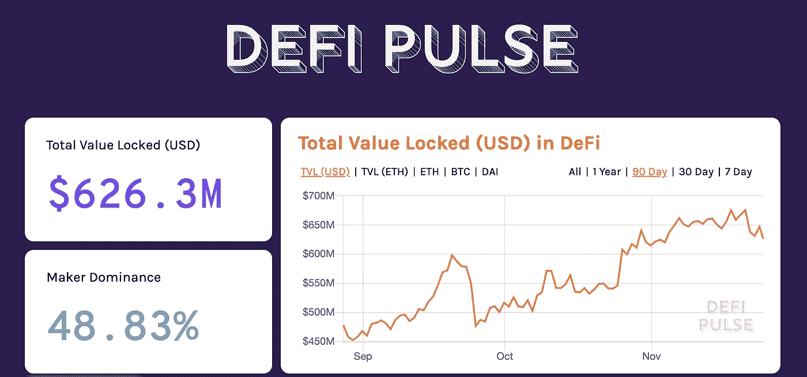

# 开放金融世界中的网络效应

> 原文：<https://medium.com/coinmonks/network-effects-in-an-open-financial-world-edc53a2c10e?source=collection_archive---------2----------------------->

**由** [***伊万·马丁内斯***](https://medium.com/u/39a5a5c67439?source=post_page-----edc53a2c10e--------------------------------)

比特币作为一种设计相当简单的网络，非常适合作为价值储存手段。这很难控制，它的主要价值是它的稀缺和保持这种严格稀缺的能力，无论当前全球地缘政治气候如何。然而，以太坊有一个完全不同的货币政策，允许它更加灵活，调整安全资金，并允许更多的创新性变化作为以太坊改进提案提交，如 [EIP-1559](/@eric.conner/fixing-the-ethereum-fee-market-eip-1559-9109f1c1814b) 。

阅读完整文章 [***此处***](/coinmonks/network-effects-in-an-open-financial-world-251152b9467d) ***。***

***由*** [***伊万马丁内斯***](https://medium.com/u/39a5a5c67439?source=post_page-----edc53a2c10e--------------------------------) ***组成。*** *跟着他上* [*推特*](https://twitter.com/0xkiwi_)

> [直接在您的收件箱中获得最佳软件交易](https://coincodecap.com/?utm_source=coinmonks)

