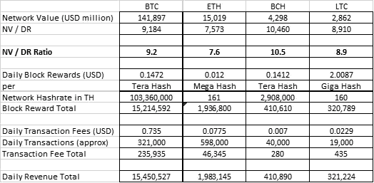

# 网络价值是矿工日收入的倍数:NV / DR 比率

> 原文：<https://medium.com/coinmonks/network-value-as-a-multiple-of-miners-daily-revenue-nv-dr-ratio-bf54d35af7fc?source=collection_archive---------1----------------------->

Photo by Modern Affliction from unsplash.com [https://unsplash.com/photos/zBSw4u2CJ2Q](https://unsplash.com/photos/zBSw4u2CJ2Q)

有了像比特币的工作证明这样的算法，矿工们就可以从他们的活动中获得硬币。而他们的活动是资本支出(设备)、能源(运行设备的电力)和一般费用；他们的主要收入是块奖励和网费(促成交易)。

对于采用 POW 算法的加密货币，可以根据以美元计价的原生加密货币的奖励和费用，以及在收益计算时以美元计价的加密货币的价格，来计算以美元计价的开采收益。

出于实用目的，我将在本文中使用 bitinfocharts.com-https://bitinfocharts . com/comparison/bit coin-Mining _ Profitability . html # 1y 提供的采矿盈利能力。在本文中，我将把盈利能力、采矿盈利能力和采矿回报作为同义词使用。我有一个定义问题，因为利润指的是收入减去成本，但 bitinfocharts.com 利用它挖掘利润的方式更符合收入指标，而不是盈利能力指标。

我将使用的方法如下:

1.参考 bitinfochart.com 报告的每哈希采矿盈利率。

2.通过使用网络的 total hashrate 将该数字转换为网络的总回报。

3.在可能的情况下，将网络交易费用加到(2)中。

4.(2)和(3)一起将为该加密货币的矿工(运营商)带来每日收入。

5.计算网络价值/每日收入比率(NV / DR)。

6.对于不具备采矿盈利能力的加密货币，将根据可用性使用网络费用和其他相关数据。

7.比较本文中研究的加密货币的 NV / DR 比率。

至于 NV / DR 比，越低越好。然而，在未来活动的预期中，具有高未来增长潜力的网络可能具有更高的 NV / DR 比率。这与股票的挂钩比率是一致的，股票的价格/收益是根据预期的收益增长来调整的。

更重要的是，NV / DR 不应是一个绝对参考值，即没有中立或正确的基数。然而，它提供了不同加密货币之间有价值的比较比率。也应该调查一下，看有没有什么历史意义。

最后，对于 Ripple 这种没有挖矿奖励的加密货币，我会用网费作为参考。虽然这本质上不反映网络验证器的回报，但它模拟了网络的当前状态，就好像它是以给定的指标为利润而运营的一样。本质上，我假设 Ripple 和其他非 POW 加密货币最有可能具有非常高的 NV / DR 比率，这将强调不同于 POW 加密货币的经济模型。因此，这种矿工免费加密货币(除非有效的经济激励模型到位)依赖于运营它的母公司的支持和/或生存能力。

结果表如下:

虽然上面没有列出，但 XRP 每天有大约 100 万笔交易，每笔交易消耗 0.003 XRP。这相当于每天 600 美元。然而，由于没有整体奖励(请注意，XRP 是一个预先挖掘的共识网络)，我发现，如果没有母公司的系统性好处和支持，很难确定运营这个网络的好处。自然，这种有限的收费、非奖励系统的 NV / DR 比率将远远高于上述比率。

**观察:**

比特币的 hashrate 是最接近的竞争对手的 30 多倍。鉴于其历史和网络动态，比特币本身已经成为一种标准。

除了 BTC 和瑞士联邦理工学院之外，每日交易费的产生并不是一个有意义的回报。

鉴于 BTC 的 NV / DR 比率为 9.2 倍(通过将上表中的 NV / DR 除以 1000 计算)，BCH 似乎略贵，而 ETH 似乎略便宜。然而，围绕这一指标的差异不够显著。

我强烈建议使用这种方法来计算每种加密货币的历史数据。

> [在您的收件箱中直接获得最佳软件交易](https://coincodecap.com/?utm_source=coinmonks)

卷

