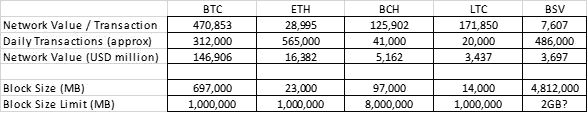
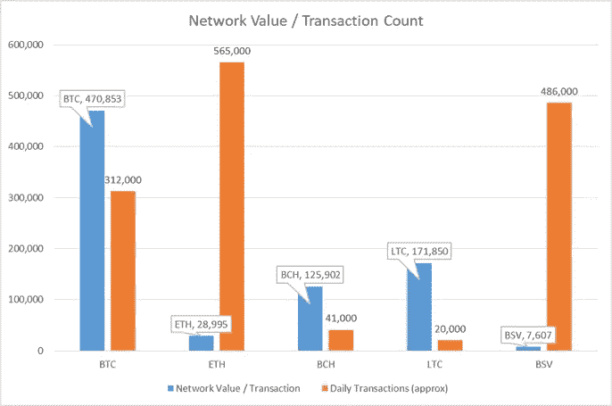
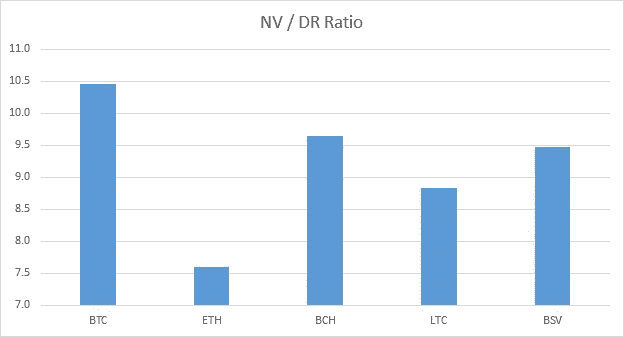

# 每笔交易的网络价值

> 原文：<https://medium.com/coinmonks/network-value-per-transaction-e5987ea3d0e3?source=collection_archive---------1----------------------->

Riccardo Annandale from unsplash.com [https://unsplash.com/photos/7e2pe9wjL9M](https://unsplash.com/photos/7e2pe9wjL9M)

加密货币区块链以块的形式传递信息，这些块的最大大小根据其内部代码来设定。给定块大小、链的总大小及其验证方法，挖掘者和节点操作者可以具有不同的偏好。然而，用最简单的术语来说，每个算法、每个程序、每个加密货币本质上都发送、接收和记录信息。因此，为了发送、接收和存储货币，每种加密货币都具有基本能力。

> [发现并回顾最佳加密软件](https://coincodecap.com)

假设这种观点是正确的，在一切都相同的情况下，用户应该选择交易费用最低的加密货币。然而，没有什么是平等的，因为不同的加密货币具有不同的验证周期，并且具有非常不同的哈希，它们的漏洞也不相似。

尽管如此，我认为剔除交易价值，只比较网络价值/日常交易，看看它是如何在不同的加密货币中分布的，会很有趣。我不认为这是一个可靠的价值指标。然而，就像网络价值/每日回报(NV / DR)比率一样，我在这里引入了，它可以是一个比较指标。

以下是由 www.bitinfocharts.com 的[数据集提供的图片:](http://www.bitinfocharts.com)

作为一个图表:

与 NV / DR 比率(下面是我今天更新的)不同，不同加密货币之间有很大的差异。观察结果如下:

BTC 的每笔交易价值 470，800 美元——感觉有点贵。

在低端，每笔 BSV 交易的价值为 7600 美元，但人们非常担心 BSV 的交易数字被夸大了。

ETH 的每笔交易价值较低，为 28，990 美元，这可能是因为它相对频繁地使用较低价值的智能合同。然而，与 BTC 16 倍的差距表明，要么 ETH 被低估，要么 BTC 被高估。

BCH 和 LTC 的交易量约为 BTC 的 1/3，但它们的总交易量在 20，000 到 40，000 之间，这表明它们的使用率非常有限。因此，这种差异可以归因于有限的采用。

总之，我越来越感觉到，加密货币网络的价值高于其当前和/或未来几年的使用需求。当我在 2019 年 2 月写道加密货币市场潜在的积极动态时[，我指出了积极的网络动态。这些因素的改善有限或没有改善，但 BTC 的价格回升幅度超过了 100%。投资者作为价值储存手段(又称数字黄金)的兴趣似乎是价格动态的主要驱动力。由于每个人心情都很好，让我指出，情绪的任何变化都可能使 BTC 的价格轻松降至 6000 美元(在这一点上，矿商的利润被压缩)。这可能会扩展到 2017 年初至 2019 年低点之间的价格范围-3000 美元-4000 美元范围。在这样的水平上，网络将生存下来，成本压力将保持价格，因为核心加密货币持有者很可能会留在这里。然而，如果对减半的乐观情绪持续下去，这可能是随之而来的修正。另一方面，如果价格设法下降，重新测试 6000 +的成本基础，有些波动；那么一个更稳定的价格底部可能会实现。有待时间去证明..](/coinmonks/in-defense-of-the-bitcoin-network-better-news-and-worse-prices-is-a-good-signal-bde5ba479eb)

*附录— NV/DR 今日更新:*

> [在您的收件箱中直接获得最佳软件交易](https://coincodecap.com/?utm_source=coinmonks)

