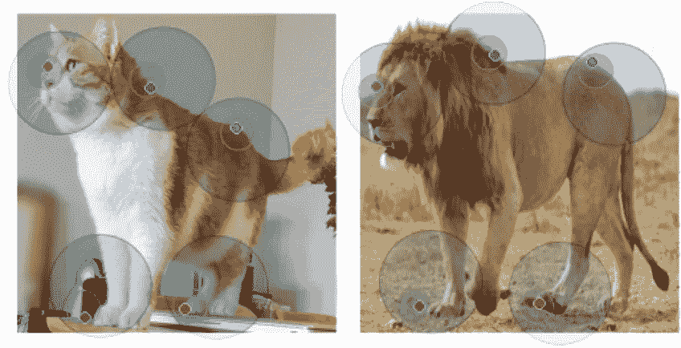
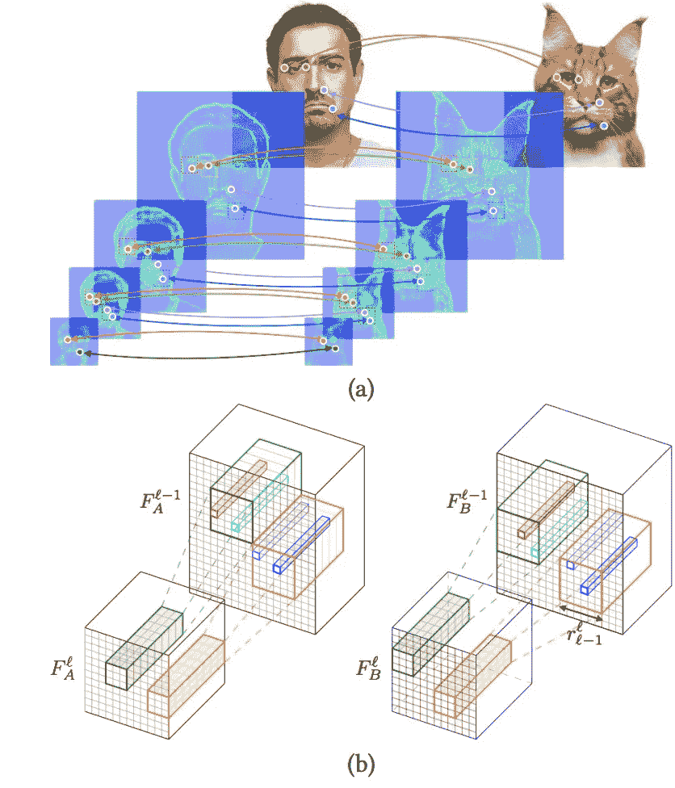
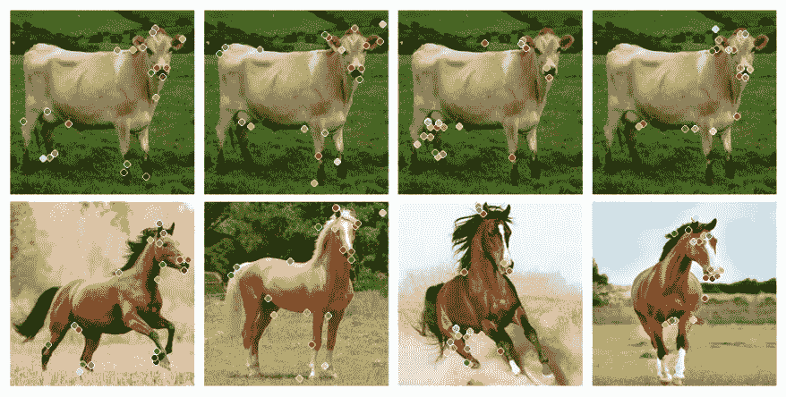
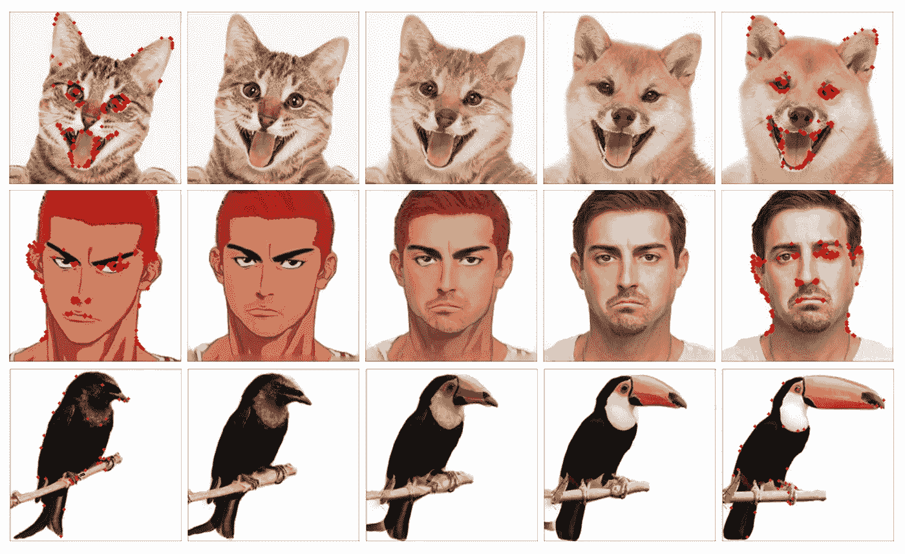

# 神经最佳伙伴:一个技术解释

> 原文：<https://medium.com/coinmonks/neural-best-buddies-a-technical-explanation-31aed143498e?source=collection_archive---------6----------------------->

TL；在这篇文章中，我对“神经最好的伙伴:稀疏的跨领域通信”这篇论文给出了一个技术性的解释

人类可以识别和映射不同对象之间相似的几何和语义特征。例如，给定两只大象的图像，我们(和我们的同规格)可以将代表大象 1 的躯干的点映射到代表大象 2 的躯干的点。

A correspondence mapping points from a cat to a lion.¹

更复杂的问题是**跨域**对应。给定一对来自不同类别的物体的图像(例如家猫和狮子)，我们是否可以检测和映射代表重要语义或几何特征(即耳朵、嘴、眼睛等)的点。)?

因此，本文的作者试图创建一个实现跨领域通信的计算模型。

**高层总结:**

深度预训练网络从成对图像中提取有用的等级信息。在层级中的每一层中(从最后到第一)，每个神经元被分配一个来自其他层级的最佳伙伴，一个来自其他图像的相同区域和层中的神经元共享特征空间中的相似点。这些神经元占据的空间然后被传播到前一层，通过高于某个任意基线的激活幅度进行过滤。

对每一层重复该过程，直到到达原始输入图像。基于该递归最佳伙伴反向支持过程检索的点对通过 KNN 技术过滤，并基于所有层的激活总值排名。与其他最先进的技术相比，这些配对显示出高的对应准确度。

(a) In each level of the network, strong activated neural best buddies are highlighted. (b) A feature mapping from one convolutional layer to its associated receptive field in the previous layer. Only salient regions passing a threshold activation are selected from the previous layer.¹

**底层细节**

1.  深度神经网络

深度卷积神经网络可以从位置和外观不变的图像中提取有意义的语义信息。在这篇论文中，作者使用了 **VGG-19** ，这是一个在 ImageNet(一个复杂图像的大型数据库——计算机视觉中所有网络进行比较的标准)上预先训练的 19 层网络。网络的每一层都从前一层获取输入，应用**卷积、池化、**和 **relu** 变换，然后将输出发送到下一层。因此，每一层的输出是特征空间的唯一表示。深度神经网络可以被表示为梯形金字塔，其中输入图像在底部，并且每个渐进层改变并且(可能)压缩特征空间。

2.对应稀疏度

一对图像通过 VGG 卷积神经网络输入，通过前向传播，基于每层的激活(又名。输出)。在层次结构的前几层中，网络识别边、线和其他基本的低级特征。在最后几层，网络开始识别类级定义特征(如耳朵、眼睛、鼻子等。)

网络通过显示对应于输出的单元的高激活来“识别”特征。因此，早期层中具有高激活的单元对应于边缘/线，而后期层中具有高激活的单元对应于类别级特征。从搜索空间中过滤掉低于阈值的所有激活，以便只识别显著的特征，并且使得输出确实是稀疏的。否则，显著的噪声会扭曲结果。

3.神经类型转移

区域是特征空间中语义上重要的部分，由于分类信息的不同，对于两幅图像来说，区域将是根本不同的。需要共同的局部外观来消除由背景产生的噪声。因此，基于与图像对相关联的特征空间的融合，通过风格转移来变换所有特征空间。

4.神经最好的伙伴

**神经最好的伙伴**是显示密切对应的成对神经元。神经最佳伙伴由距离度量来确定，该距离度量基于所选神经元对的邻居的幅度。如果相邻的神经元表现出高度的相似性，那么神经元本身应该表现出与其对应部分的高度相关性。

在卷积网络中，层 k 中的神经元与层 k-1 中的 m×m 神经元网格相关，其中 m 由网络的架构和 k 确定。该网格被称为神经元的感受域。一旦确定了克服稀疏阈值的神经最佳伙伴，它们的感受野对应于层 k-1 中的新区域。

5.算法总结

两幅 RGB 图像被输入神经网络。从正向传播中提取来自每一层的激活。在最后一层，区域被定义为包含整个特征空间。

然后，对于每个区域:

*   使用样式转移变换区域 1 和相应的区域 2
*   为每个区域计算神经最佳伙伴对
*   基于激活幅度的滤波器对
*   找到前一层中每一对对应的感受野来划分新区域

继续，直到到达输入层。

在第一层(输入图像)中计算的最佳伙伴被平均排列和分布，以在这两个图像之间创建鲁棒的精确对应。

**评价**

该方法具有非常高的精确度。这里有一些比较神经最佳伙伴技术和跨领域通信中其他最先进算法的可视化。

Source: Neural Best Buddies¹

**应用**

神经最佳伙伴的一个可能应用是图像变形。问题是这样的:给定两幅显示语义相似的对象的图像，可以开发一个中间状态吗？下面，我们看到这样一个例子。已经为最左边和最右边的图像确定了对应关系，因此可以在它们之间形成变形。

The image on the far-left and the image on the far-right are inputs into the algorithm created in the paper. The intermediate states are formed by merging the two images together based on the salient points detected by the algorithm.¹

神经最佳伙伴:稀疏跨域通信