# 从无到有的神经网络——肿瘤诊断

> 原文：<https://medium.com/coinmonks/neural-network-from-scratch-tumour-diagnosis-354abbcb2f3b?source=collection_archive---------2----------------------->

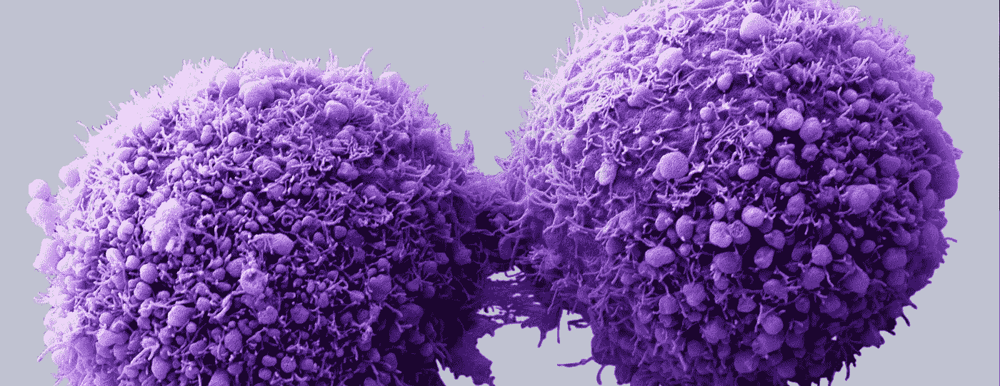

image was taken from [http://nerdreactor.com/wp-content/uploads/2015/11/cancercells.jpg](http://nerdreactor.com/wp-content/uploads/2015/11/cancercells.jpg)

# 介绍

这篇文章是写来说明如何从头开始建立一个简单的 2 层神经网络！我已经想这么做很久了，因为我注意到当我学习神经网络时，我倾向于直接跳到很酷的东西。

使用像 tensorflow 和 keras 这样的优秀库，可以让你快速轻松地用神经网络构建非常酷的项目，这很棒。然而，我注意到我对神经网络的理解有很大的差距，我意识到我对正在发生的事情没有一个坚实的基础。

这个项目在真正理解神经网络的低级概念方面是一个很好的练习，我希望其他人也会发现它很有用。任何反馈或建设性的批评将不胜感激。

# 该项目

在这个项目中，我们将试图诊断乳腺癌中发现的肿瘤是恶性的还是良性的。这将使用乳腺癌威斯康星州数据集发现[这里](https://www.kaggle.com/uciml/breast-cancer-wisconsin-data)。

这是一个相对较小的数据集，有 569 个条目。这些数据点包含了我们将要学习的 30 个特征和一个恶性“M”或良性“B”的二元分类。像所有的 ML 模型一样，这个项目分为两个部分，数据准备和模型的建立。

通过在 FloydHub 上运行这个项目作为模板，您可以很快跟上本教程。只需点击下面的按钮，一切都已经设置好了，准备开始！

如果您想了解如何开始使用 FloydHub 在云上构建自己的模型，请查看我以前的文章:

 [## 在云上构建你的第一个神经网络

### 在这篇文章中，我将带你通过如何轻松地建立一个图像分类器，可以区分 10…

medium.com](/@donaljohn/building-your-first-neural-network-on-the-cloud-ffb9fcfef945) 

# 数据准备

所有的 ML 项目都是不同的。即使我们使用相同的模型，使用的数据也很少相同。同样值得注意的是，好的数据比好的模型更重要。就像营养学一样，不健康的饮食是不可能战胜运动的。如果你把不好的食物放进你的身体，你会看到不好的结果。在 ML 中，如果你输入的是错误的数据，你的模型有多神奇和复杂并不重要。正因为如此，关注我们的数据准备阶段是很重要的。这种笔记本只是进行非常基本的数据准备，但 Kaggle contributer Kaan Can 有一个非常全面的教程，涵盖了数据科学的所有必要技能，并有一整节关于清理数据。教程可以在[这里找到](https://www.kaggle.com/kanncaa1/data-sciencetutorial-for-beginners)

现在来看实际的代码！我们需要做的第一件事是导入任何库，比如 pandas，然后加载我们的数据集。

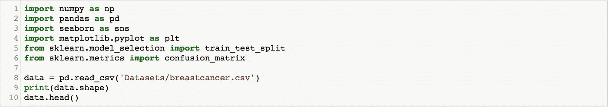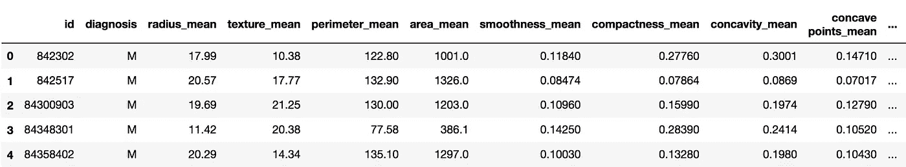

正如您在数据集快照中看到的，我们有 569 列 33 行。快速浏览一下我们的数据，我们可以发现我们并不需要所有的数据。最后一列只是空数据，所以我们要做的第一件事是删除它。

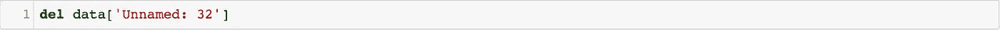

下一步是分离我们的特征数据和目标。特征是我们要依次学习的数据，目标是诊断，无论肿瘤是否恶性。

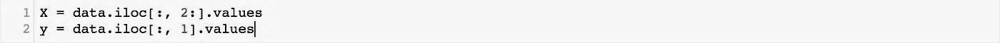

如果我们查看我们的目标标签，它们被表示为“M”或“B”。现在，这使得数据对人类来说很容易读取，但对机器来说解释这一点实际上更难。为了使我们的标签对机器更友好，我们将把标签改为 1 或 0。因为我很懒，所以我将使用 sklearn libaray 来快速完成这项工作

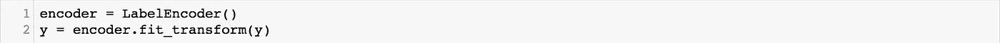

我们接下来要看的是拆分我们的数据。每当我们训练我们的模型时，我们需要将我们的数据分成两组，一组训练集和一组测试集。为了做到这一点，我们从整个数据集中随机抽样，并以大约 70:30 的比例分割数据，但这可能因项目而异。

你可能会想“好吧，我们没有太多的数据，为什么我们不用我们所有的数据来训练我们的模型，并充分利用我们所拥有的呢？”这是个好问题。原因是我们不希望我们的模型过度适应训练数据。

过度拟合意味着我们的模型在理解和预测训练数据方面变得非常好，并且可以具有非常高的训练精度。但是，模型只学习了训练数据，没有学习如何概括。因此，当我们引入一些新数据时，模型的表现会很差。这就像你在备考的时候，却只研究了过去的考卷。你已经非常擅长回答这些特定的问题，但是当你被问到在过去的试卷中没有出现的问题时，你无法回答，因为你没有真正了解这个话题。

为了确定这种情况是否发生在我们的模型上，我们总是在数据的子部分上训练模型，然后在数据集的另一部分上测试模型，以确保它正确学习。

另外，对数据进行随机采样也很重要，否则您可能会得到包含高度相关数据的数据集，从而影响您的结果。

我们需要完成的最后一项任务叫做特征缩放。目前，我们的数据看起来不错，如果你是科学家或医生，这很有意义，但还记得我们之前谈到的机器理解人类可读的值有多困难吗？虽然数据有意义，但我们可以转换数据，使所有值都在同一范围内。这使得我们的网络训练速度更快。

我们将使用 sklearns StandardScaler 函数来实现这一点。这个函数将把我们数据中的每个变量转换成平均值为 0，标准差为 1。

# 构建网络

所以现在我们终于清理了我们的数据，我们准备好进入好的东西！神经网络是机器学习的一个令人兴奋的领域，在过去的几年里发展迅速。然而，它们也可能相当复杂，涉及大量的数学知识。这个笔记本将说明网络的建立和背后的理论，但不会涉及太多低级数学的细节。想了解更多数学方面的信息，请查看 3 个蓝色 1 个棕色很好[视频](https://www.youtube.com/watch?v=aircAruvnKk)

下面是完整的项目代码。代码运行并显示结果后，笔记本会解释每一部分。

# 什么是神经网络？

顾名思义，神经网络是根据我们大脑的结构设计的。电信号通过我们大脑中连接在一起的多层神经元发送，最终形成我们大脑可以理解并采取行动的输出。就像我们的大脑架构一样，我们的网络有几层由感知器节点(神经元)组成。

这些节点中的每一个都只保存一个数字。然后，这些节点的编号乘以连接它们到下一层的权重。数据被输入到网络的第一层，数据集中的每个特征都有一个节点。这些输入通过网络的每一层，并应用层权重。输入通过整个网络后，我们只剩下输出。在这种情况下，我们有一个为 1 或 0(恶性或良性)的输出节点。这个过程被称为正向传递。下一步是向后传球。这是学习实际发生的地方。我们发现我们的网络对结果的预测有多准确。然后，我们通过层向后移动，并更新层的权重，以改进我们的预测。被认为更重要的节点将最终具有更高的权重值。

# 积木

以上是对神经网络的简要描述。现在我们要看看如何建立它。我认为实现一个神经网络的方法是将它分成几个逻辑部分或构建块。这些措施如下:

1.  网络初始化
2.  前进传球
3.  反向传递(反向传播)
4.  更新权重
5.  测试和评估

# 1 —初始化

我们需要做的第一件事是初始化我们的网络。这里，我们将确定网络的结构，包括每层(输入、隐藏和输出)的节点数、学习速率、时期数和每层的初始随机权重。

## 输入节点

这是我们数据集中每个条目的特征数量，在本例中为 30。

## 隐藏节点

这是我们隐藏层的节点数。对于这个项目，我使用了 12 个隐藏节点。这是我通过试验不同的值而决定的一个任意的数字。

## 输出节点

这就是我们的网络将会有多少输出。在这种情况下，我们正在进行二元分类，因此我们的网络可以是 0 或 1。因此，我们将只使用 1 个节点。如果我们构建一个超过两种类型的分类器(比如对不同类型的动物进行分类)，我们将会有几个输出节点。

## 学习率

学习率决定了我们在回传过程中调整权重的程度。高数值会让我们的网络快速进步，但是随着学习的进行，我们可能会过多地调整我们的权重，从而增加而不是减少误差。低学习率将逐渐学习，并能够更好地概括，但需要更长的时间来收敛，并需要更多的训练时期。建议开始时学习速率不要太高或太低，然后你可以根据网络的需要调整学习速率。对于这个例子，我决定学习率为 0.1，这通常是一个很好的起点。

## 纪元

历元的数量决定了我们在数据集上训练网络的次数。

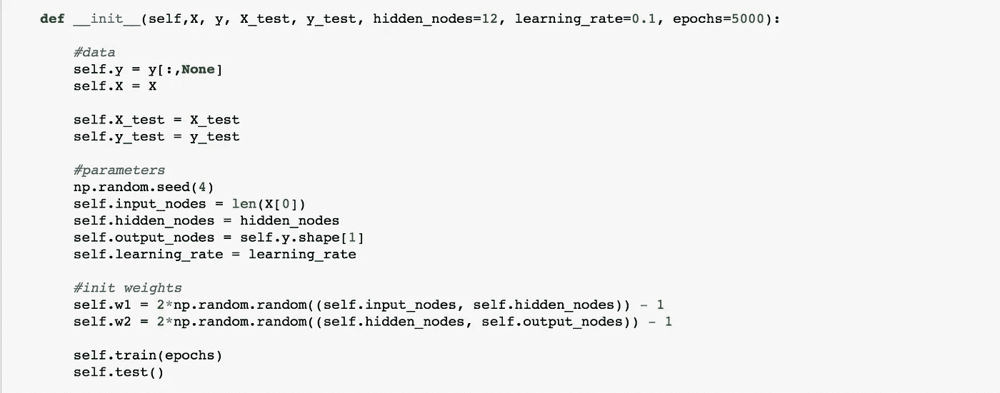

# 2-向前传球

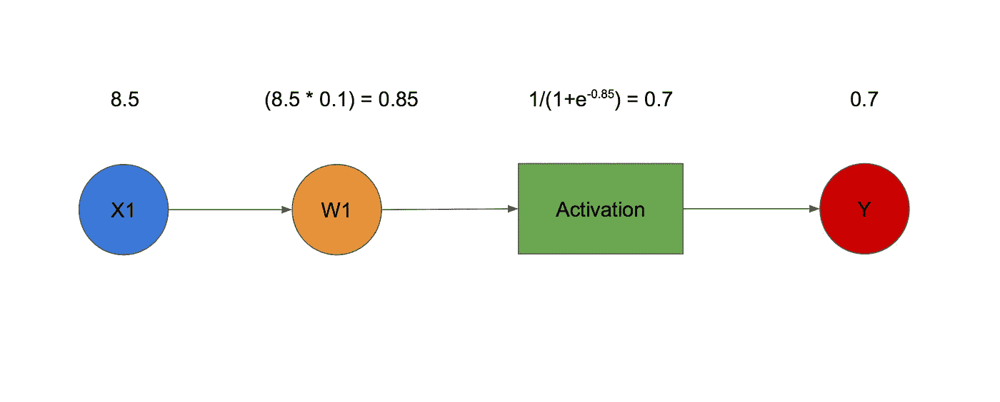

Example of simple forward propagation through a single layer

如前所述，正向传递是我们网络的预测部分。我们通过网络的各层输入信息，并在过程中应用不同的权重。这最终留给我们一个预言。正向传递的步骤如下:

## 1.获取输入

该层的输入是前一层的输出，或者在输入层的情况下，它只是训练数据。

## 2.应用层权重

现在，我们通过获得输入和层权重的点积(相乘)来应用权重。

## 3.激活功能

一旦我们将权重应用于输入，我们就应用我们的激活函数。在这个项目中，我们使用了 sigmoid 激活函数。它接收一个数字，并将其转换为 0 到 1 之间的值。这个函数适合我们的需要，我们正在寻找一个二进制输出，肿瘤是恶性的还是良性的。对于有更多类的分类问题，你可以使用不同的激活函数，比如 softmax。

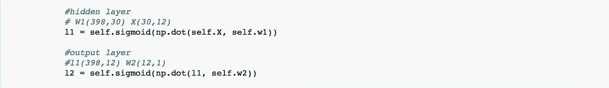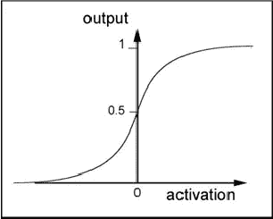

Diagram of the sigmoid activation function. Image can be found here [Binary-sigmoid-activation-function-The-limited-numeric-response-range-together-with-the.png](https://www.researchgate.net/profile/Kemal_Turan/publication/268407779/figure/fig1/AS:295453842264068@1447453093485/Binary-sigmoid-activation-function-The-limited-numeric-response-range-together-with-the.png)

# 3-向后传球

向后传递是我们的网络实际学习的部分，这被称为通过梯度下降的反向传播。这里，我们将预测值与实际值进行比较。然后，我们通过我们的网络向后移动，并更新我们的层的权重，以改善我们的预测。网络的逆向传递有两个关键步骤。

## 1.找出网络的错误

首先我们计算我们的预测有多远。这是通过从真实值中减去我们的预测值来完成的

## 2.计算每一层的误差

现在我们知道了网络的误差，我们需要找出每一层的误差。我们通过将前一层的误差乘以当前层的导数来实现这一点。

最后一层(本例中为第 2 层)将使用网络错误，因为没有前一层。使用如下所示的 sigmoid 质数函数计算当前层的导数。下一层使用前一层误差的点积和前一层的权重作为误差。这再次乘以当前层的 sigmoid 质数

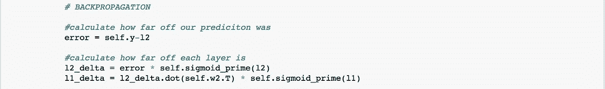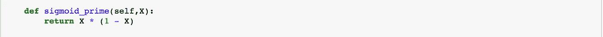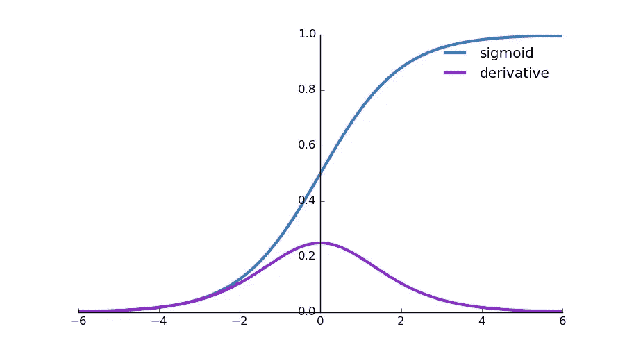

Diagram displaying the sigmoid function and its derivative. Image can be found here [https://i.stack.imgur.com/QdlcW.jpg](https://i.stack.imgur.com/QdlcW.jpg)

# 4-更新权重

一旦我们完成了网络的反向传递，我们需要相应地更新我们的权重。对于每一层重量，我们需要执行以下步骤。

## 1.计算图层权重的增加量

对于每层权重，我们需要计算添加到权重的调整。这是通过获得前一层的点积和我们在回传阶段发现的当前层的误差来实现的。然后，我们用学习率乘以点积。

## 2.将调整添加到当前层权重

这听起来很简单。只需将我们刚刚计算出的调整量添加到权重中。

对于一些计算，我们需要使用值的转置。t)这只是为了使两个矩阵能够正确相乘。这需要一些矩阵数学知识，不在本文讨论范围之内。要了解更多，请查看由[可汗学院](https://www.khanacademy.org/math/linear-algebra/matrix-transformations#composition-of-transformations)编写的这个伟大的教程系列。

恭喜你，你已经为你的神经网络建立了核心模型！剩下唯一要做的就是测试我们网络的准确性。

最后，这里是完整的训练方法。

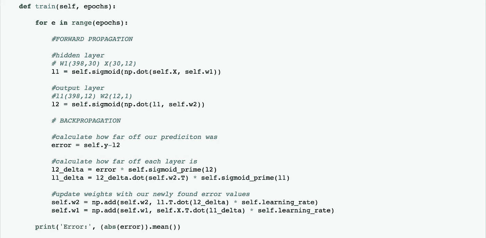

# 5 —测试和评估

我们在这里所做的是重新创建向前传球，以测试我们的模型工作得有多好，除了这里我们使用我们的测试数据而不是我们的训练数据。我们还记录了我们做出了多少正确的预测，以及做出的预测列表。

对于每个预测，我们都会将其与实际目标进行比较，看看我们的模型是否正确，更新我们的统计变量。

然后，我们将模型的精度打印到终端上。

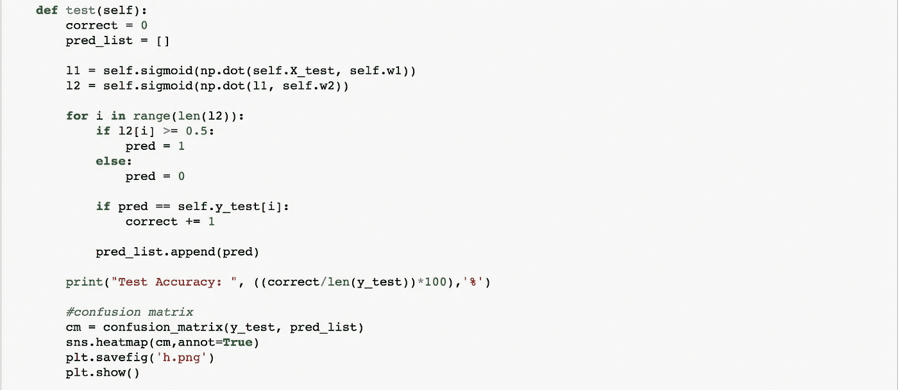

# 结论

我希望这篇文章能够帮助其他人更好地学习和理解神经网络。关于这个主题还有很多内容没有在这里讨论。这个项目只是看了一个深度神经网络的非常基本的实现。写完这本笔记本后，我觉得我对神经网络实际上是如何工作的有了更好的理解。当我使用 tensorflow 之类的库转到更复杂的模型时，这将是一个很大的帮助。

完整的代码和笔记本可以在我的 [github](https://github.com/djbyrne/Neural-Network-From-Scratch-Tumour-Diagnosis) 上找到。

 [## DJ Byrne/神经网络-从头开始-肿瘤-诊断

### 神经网络-从零开始-肿瘤-诊断-这本书讲述了如何建立一个神经网络只使用…

github.com](https://github.com/djbyrne/Neural-Network-From-Scratch-Tumour-Diagnosis) 

尝试使用这段代码，看看会得到什么结果。更好的是，尝试使用不同的数据集重新创建这个项目。尝试并找出如何准备数据，也许可以添加更多的隐藏层来提高模型的性能。如果你想要一些灵感，去 [Kaggle](https://www.kaggle.com) 看看一些很酷的数据集。

下面我列出了几个很棒的资源以及我从中学习到的代码和教程的参考资料。

# 参考

数据预处理[https://www . ka ggle . com/the brownviking 20/intro-to-keras-with-breast-cancer-Data-ann](https://www.kaggle.com/thebrownviking20/intro-to-keras-with-breast-cancer-data-ann)

使用 Numpy 的基本神经网络[https://www . ka ggle . com/ancientaxe/simple-Neural-Network-from scratch-in-python](https://www.kaggle.com/ancientaxe/simple-neural-network-from-scratch-in-python)

# 其他资源

11 行 Python 中的一个神经网络[https://iamtrask.github.io/2015/07/12/basic-python-network/](https://iamtrask.github.io/2015/07/12/basic-python-network/)

西拉杰·拉瓦尔的频道[https://www.youtube.com/channel/UCWN3xxRkmTPmbKwht9FuE5A](https://www.youtube.com/channel/UCWN3xxRkmTPmbKwht9FuE5A)

但是是什么*是神经网络呢？|第 1 章深度学习[https://www.youtube.com/watch?v=aircAruvnKk](https://www.youtube.com/watch?v=aircAruvnKk)*