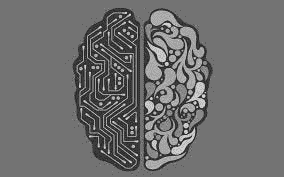
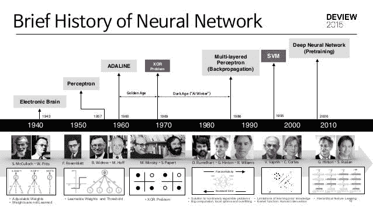
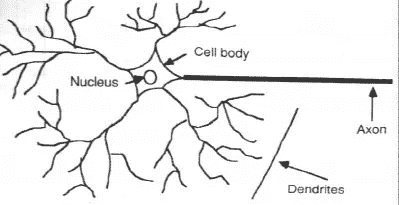
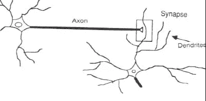
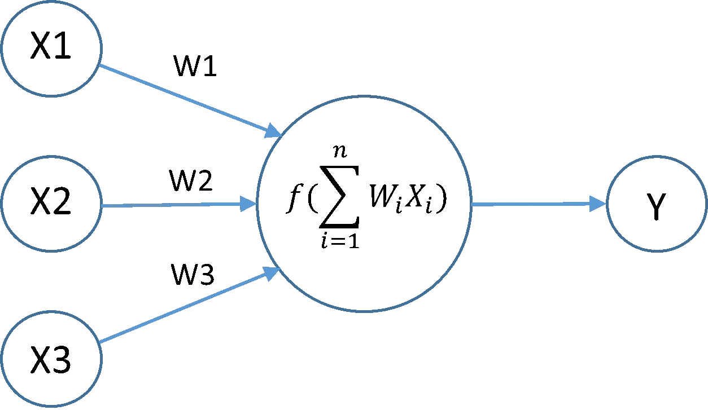
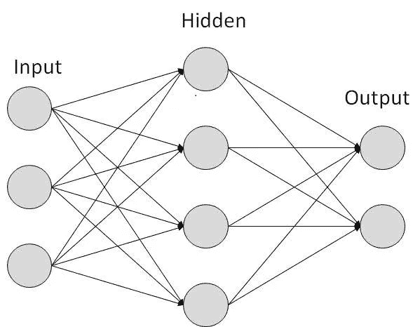

# 神经网络

> 原文：<https://medium.com/coinmonks/neural-networks-bb11fb9a8266?source=collection_archive---------4----------------------->

## 神经网络导论

Artificial Neural Networks

神经网络是最新的构建模块，也是目前用于机器学习的主要高级“深度学习”之一，但这些是什么？？这些模块将涵盖这个主题。

所以第一个问题，

# **什么是神经网络？**

这是一个受我们人类大脑启发的计算机系统。它的工作方式与我们人类大脑和神经系统的工作方式相同。它被称为“**人工神经网络(ANN)”。**

人工神经网络(ANN)是一种信息处理范式，其灵感来自于生物神经系统(如大脑)处理信息的方式。它由大量高度互联的处理元件(神经元)组成，这些元件协调工作以解决特定的问题。让我们先来看看**神经网络**的概念是如何被发现的一些历史。

# 神经网络的历史

神经网络模拟似乎是最近的发展。然而，这个领域是在计算机出现之前建立的，并且至少经历了一次重大挫折和几个时代。

沃伦麦卡洛克和沃尔特皮茨(1943)创建了一个基于数学和算法的神经网络计算模型，称为阈值逻辑。这个模型为神经网络研究分成两种方法铺平了道路。一种方法专注于大脑中的生物过程，而另一种方法专注于神经网络在人工智能中的应用。这张图片展示了这个模型如何为神经网络进入最现代的应用铺平了道路。

为了更好地理解人工神经网络，首先我们需要理解它们所基于的东西，那就是我们人类大脑的工作。

# 人脑是如何学习的？

A neuron

关于大脑如何训练自己处理信息还有很多未知，因此理论层出不穷。在人类大脑中，一个典型的神经元通过一系列称为*树突*的精细结构收集来自其他神经元的信号。神经元通过被称为*轴突*的细长支架发出电活动尖峰，轴突分裂成数千个分支。

Synapse

在每个分支的末端，一个叫做*突触*的结构将轴突的活动转化为抑制或刺激轴突活动的电效应，再转化为抑制或刺激相连神经元活动的电效应。当神经元接收到与其抑制性输入相比足够大的兴奋性输入时，它会沿着轴突发出一个电活动尖峰。学习是通过改变突触的有效性来实现的，因此一个神经元对另一个神经元的影响也随之改变。

现在让我们看看人工神经网络是如何工作的。

## 安是如何学习的？

人工神经网络由许多结构类似于生物神经元的人工神经元组成。每个连接都类似于人脑的突触，因此它可以将信号从一个神经元传输到另一个神经元。

Basic Explanatory Digaram

一旦神经元接收到信号，它就对其进行处理，并向与之相连的人工神经元发出信号。

这里显示的是一个具有 3 层的基本神经网络模型。一旦接收到输入，首先由第一层使用数学计算和我们指定的计算进行处理，之后结果被发送到隐藏层，隐藏层进一步处理它，最后我们在输出节点上接收最终结果。这是一个基本神经网络的工作方式。

因此，对于要学习的神经网络，我们需要提供大量输入及其标签(即输出)，然后通过网络不断传递输入(带标签)，这被称为**训练神经网络模型。**

目前使用的神经网络最基本的应用是**图像识别，**其中大量标记的图像通过模型，以便它可以预测何时看到它接受训练的特定事物的看不见的图像。

最好的例子就是由**谷歌大脑**科学家训练的模型，它能够仅仅通过看到大量**猫狗 YouTube 视频来识别猫狗。最棒的是，这位模特在接受训练之前甚至不知道什么是猫或狗！！太棒了，不是吗！**

这就是关于神经网络的介绍。如果你喜欢我写的东西，请为我的博客鼓掌，如果你想要更多这样的精彩内容，请关注我。