# Python 中使用张量流的神经风格转换

> 原文：<https://medium.com/coinmonks/neural-style-transfer-using-tensorflow-in-python-499b39084827?source=collection_archive---------6----------------------->

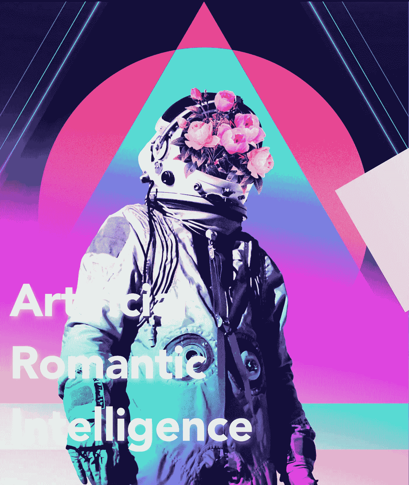

Credits to Magdiel Lopez

在当代高科技世界中，深度学习被以不同的方式用于实现特定主题中的特定目标。世界各地的工程师和开发人员将人工智能算法用于维护、网络安全、数学解决方案、客户服务等。

图像识别和分类并不是一件难事，这要归功于世界级的算法，如 **Inception** 或 **ResNet** are。但今天，我要讨论的算法需要更少的处理器能力，但能够在良好的数据传播和预处理的情况下给你惊人的结果。
**Tensorflow** 用几种技术实现让我们能够合成具有特定风格的普通图片。

让我们从依赖关系开始。
你们中的一些人可能没有安装所有需要的依赖项，所以，为了确保一切顺利，我将从零开始。

# 又及:我是 mac 用户，所以我要在 CPU 上重新训练神经网络。

我已经使用过这个项目几次，所以为了确保我从一开始就向您展示了一切，我将在虚拟环境中完成所有工作(因为我已经在前面安装了所有的依赖项)。

我要从安装 pip，homebrew，tensorflow，opencv 开始。但是，在我安装它们之后，我将向您展示如何使用这些命令来完成同样的操作。这很简单，即使你是初学者。

# 要求:

**Pip:**sudo easy _ install Pip
**Brew:**Pip 安装家酿
**Tensorflow:** pip 安装 tensor flow
**OpenCV:**Pip 安装 opencv-python

(在拒绝访问的情况下，请使用“sudo”命令使用管理权限。示例: **sudo pip 安装自制软件**

安装完依赖项后，让我们通过命令
**pip freeze** 检查环境

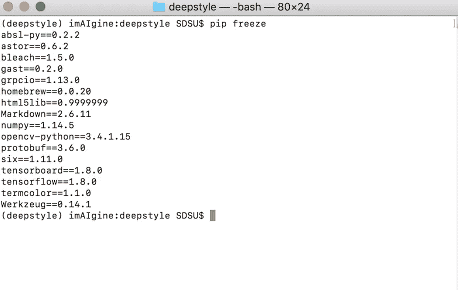

去某个地方，例如在桌面上，创建一个新文件夹，让我们称之为 deepstyle。使用命令进入目录:
**CD Desktop/deep style**

# 克隆到存储库中

安装完所有的依赖项后，您已经创建了新的目录，让我们在 github 上使用以下命令从[https://github.com/cysmith/neural-style-tf.git](https://github.com/cysmith/neural-style-tf.git)克隆 deepstyle 库:

**git 克隆**https://github.com/cysmith/neural-style-tf.git

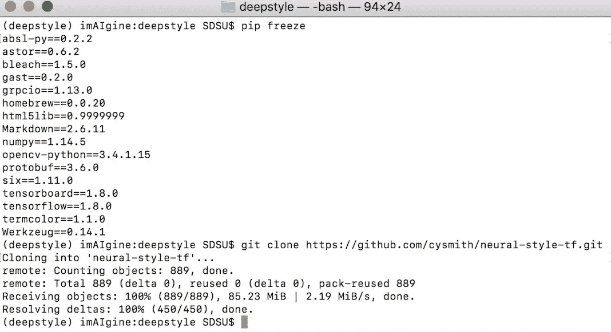

如果一切进展顺利，那就没问题。克隆到资源库后，让我们进入它的目录:
**cd neural-style-tf**

# 预训练模型

下一步是下载预先训练好的模型。我们将把一个图像合成到另一个图像中，正如你所知道的，两个图像对于 AI 来说是不够的数据。让我们继续链接:[http://www.vlfeat.org/matconvnet/pretrained/](http://www.vlfeat.org/matconvnet/pretrained/)

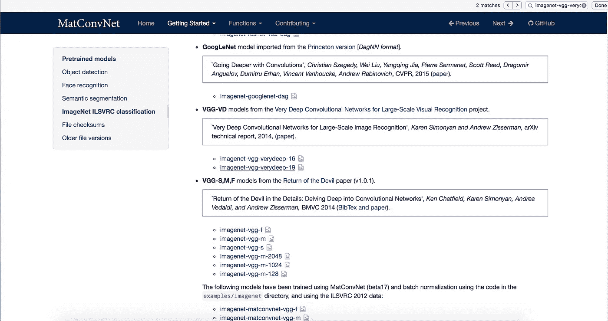

我们应该搜索 **imagenet VGG-19** 预训练模型(imagenet-vgg-verydeep-19)的重量。下载就是了。它的大小是 534.9Mb，所以可能需要一段时间。下载文件后，只需将它移动到项目目录(neural-style-tf 文件夹)中，如下所示。

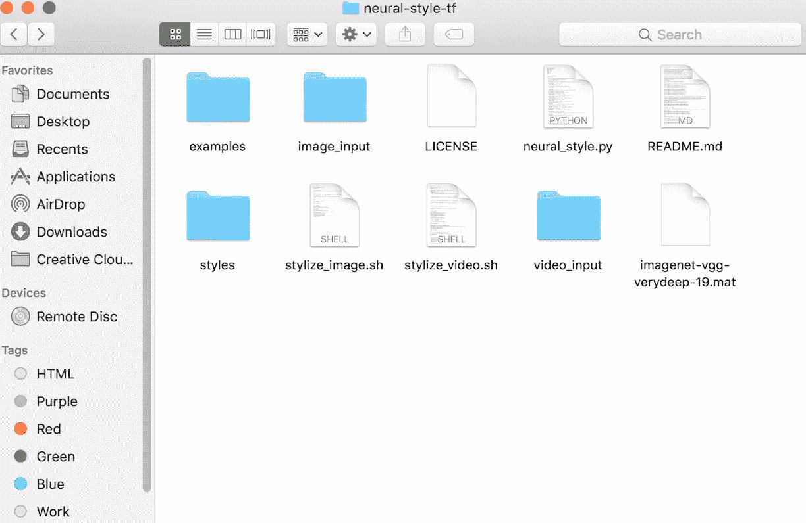

**Name of the file is imagenet-vgg-verydeep-19.mat**

# 输入和样式图像

做完这一切，我们就快完成了。现在，我们需要两幅图像来从其中一幅中提取样式，并将其实现到另一幅中。让我们以一种浪漫的方式保持下去，想象一下:如果**玛格达·艾森哈特**(**水银**之母)和**亨利·艾伦**(**闪电侠**之父)相遇会怎样？
你猜对了，我们来合成一下**闪光**和**水银**的图像。

我将使用闪光灯作为一种风格，并将其实现为水银图像。一个建议是:尽可能使用准确的面部图像。如果你用的是 CPU 甚至更多，它就没那么强大了，神经网络会发现很难合成它们。因此，可能会有一些不准确之处。

我搜索并下载了他们的照片，我将在下一张照片中展示给你们看:

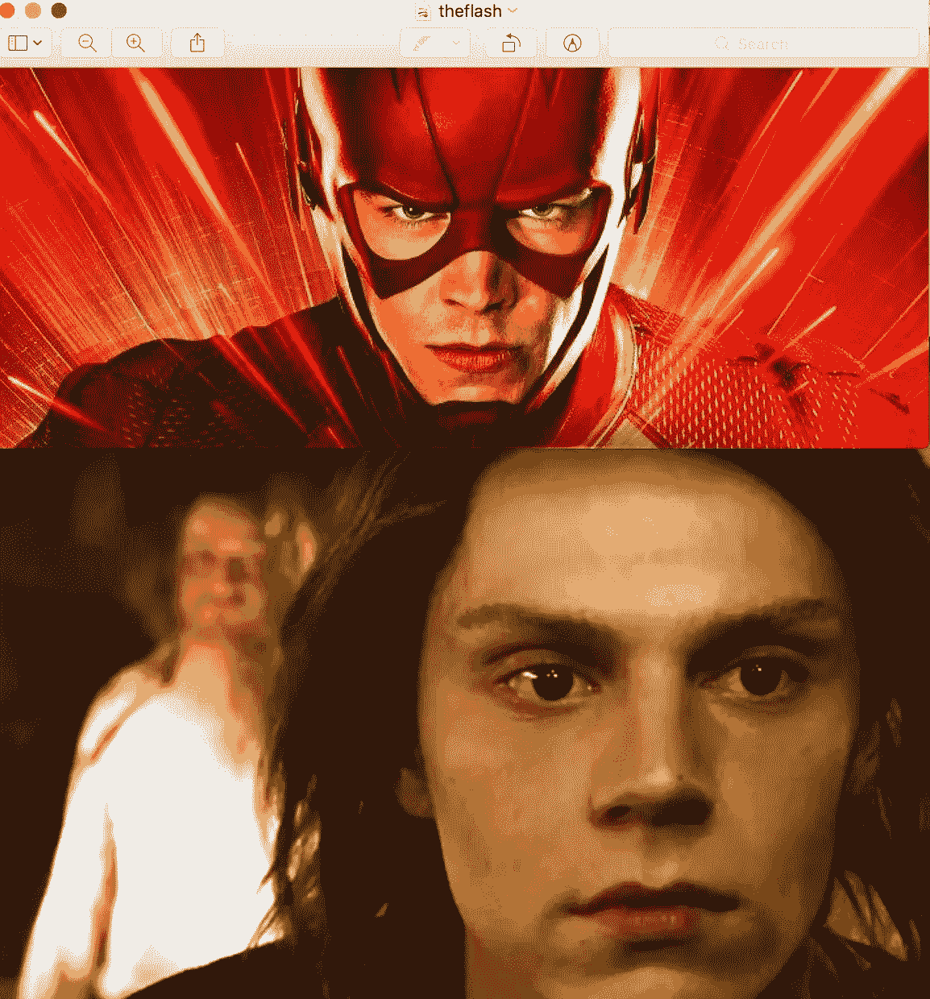

Sources: SharkAttack.com & Bustle.com

将下载的图像复制到项目目录。
您正在用于输入图像的图像应被复制到名为**“图像输入”**的文件夹中

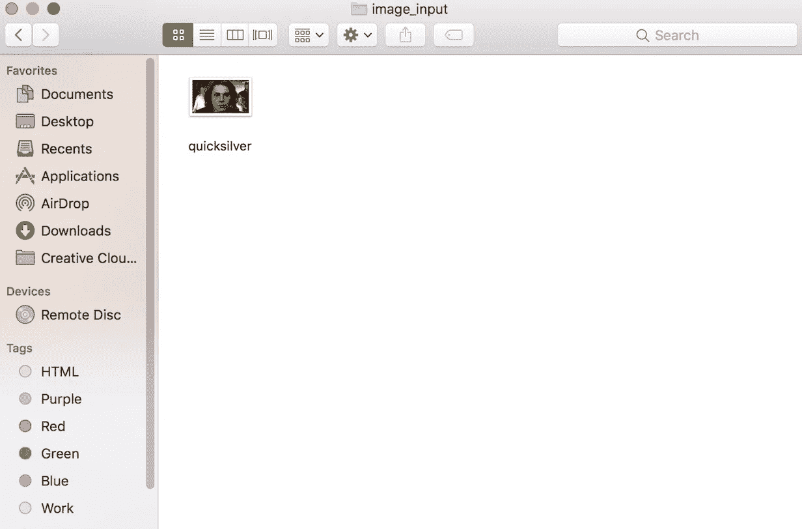

输入的图像应该被复制到名为**“样式”的文件夹中。**

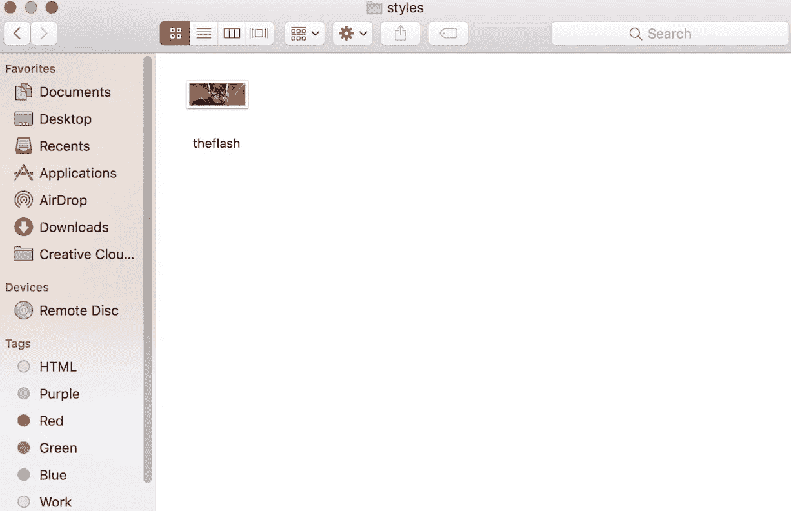

# 培训(再培训)

我们都准备好了。让我们进入终端并运行以下命令:
确保您在 **neural-style-tf** 目录中。

**bash stylate _ image . sh。/image_input/quicksilver.png。/styles/theflash.png**

*该命令代表:bash stylize_image.sh。/ <输入图像目录> / <输入图像名称>。/ <样式图像目录> / <样式图像名称>*

按下回车键，它会问你是否已经安装了所需的依赖项，只需按下键盘上的“y”按钮，然后按下回车键。

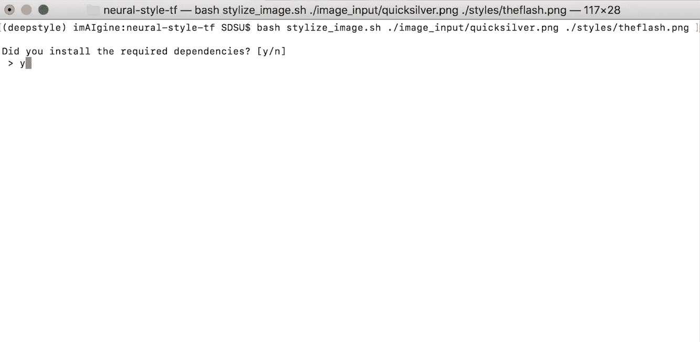

之后，它会问你要 **CUDA** 启用的 GPU，但正如我上面提到的，我是 mac 用户，所以我会按“n”键。

如果出了问题，不要害怕。这只是因为您没有安装所有必需的依赖项。在我的例子中，它是 **scipy** 库。
继续使用命令: **pip install <库名>** 在我的例子中: **pip install scipy**

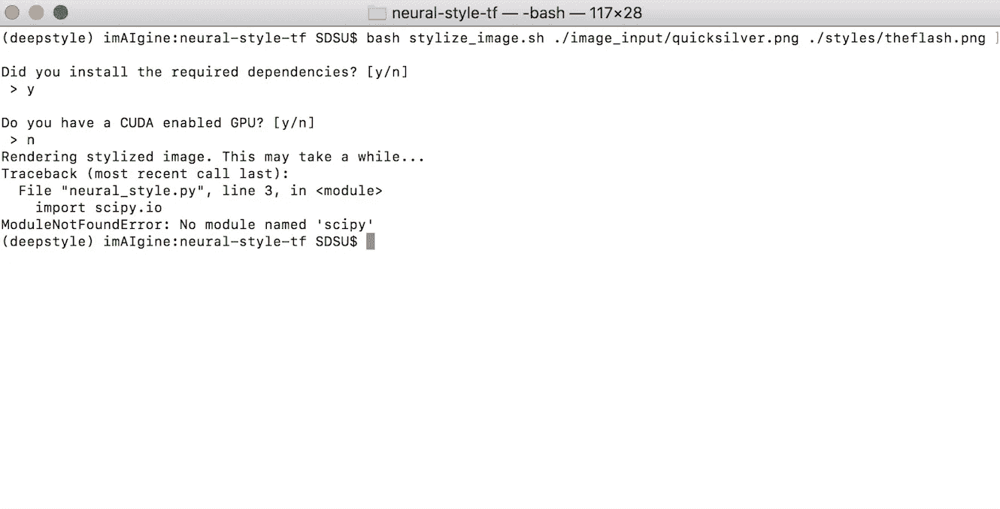

安装完所需的库后，只需使用上面我向您展示的相同命令:

**bash stylize_image.sh。/image_input/quicksilver.png。/styles/theflash.png**

神奇的事情发生了:

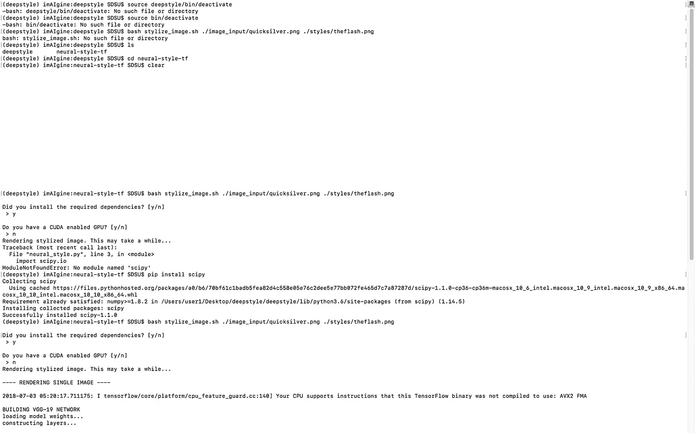

The model is being re-trained on your input images

这个过程不需要太长时间。有关迭代次数和图像精度的详细信息将出现在终端窗口中，如下所示:

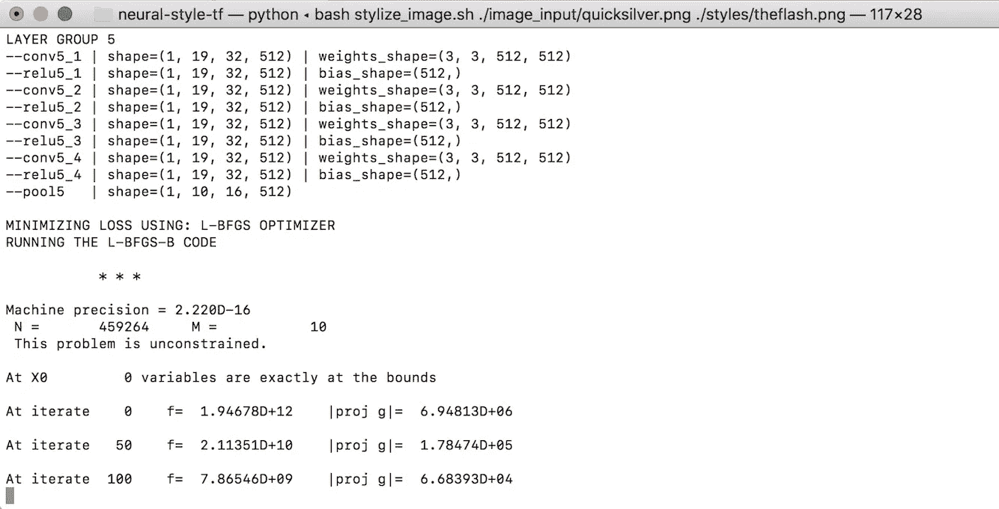

神经网络需要 **1000 次迭代**来合成图像。只是等待一些时间。对于我的**配备 **2.2GHz i7 处理器**和 **16GB RAM** 的 MacBook Pro** 来说，“一些时间”大约是 **47.62306 分钟**。

# 结果呢

该过程完成后，您将看到精度细节和经过的时间:

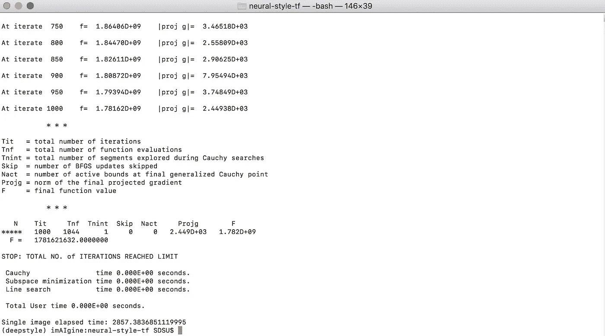

The process is done.

开始了。让我们转到 **image_output** 目录并检查 **result** 文件夹。在这里，我们将看到一些文件，包括预处理的图像和元数据。

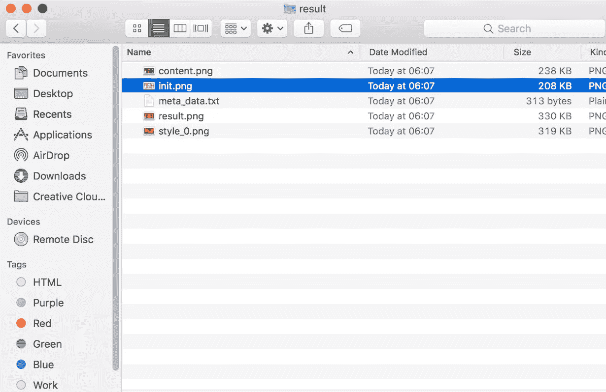

这里我们所需要的就是 result.png。

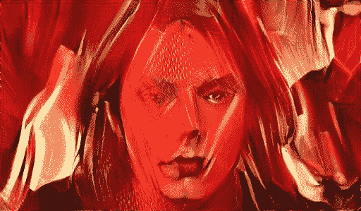

正如我们所看到的，flash 图像的样式已经实现到我们的输入图像中。

它没有令人惊讶的准确性，但算法完成了它的工作:它把风格从一个图像转移到另一个。

你可以用这个神经网络把世界级画家的风格转换成某些人的形象，也许是你的，而且效果相当好。

# *最后:*

如果你觉得读这篇文章很有趣，就点击喜欢并欣赏我的作品

下面我想听听你的反馈和问题！