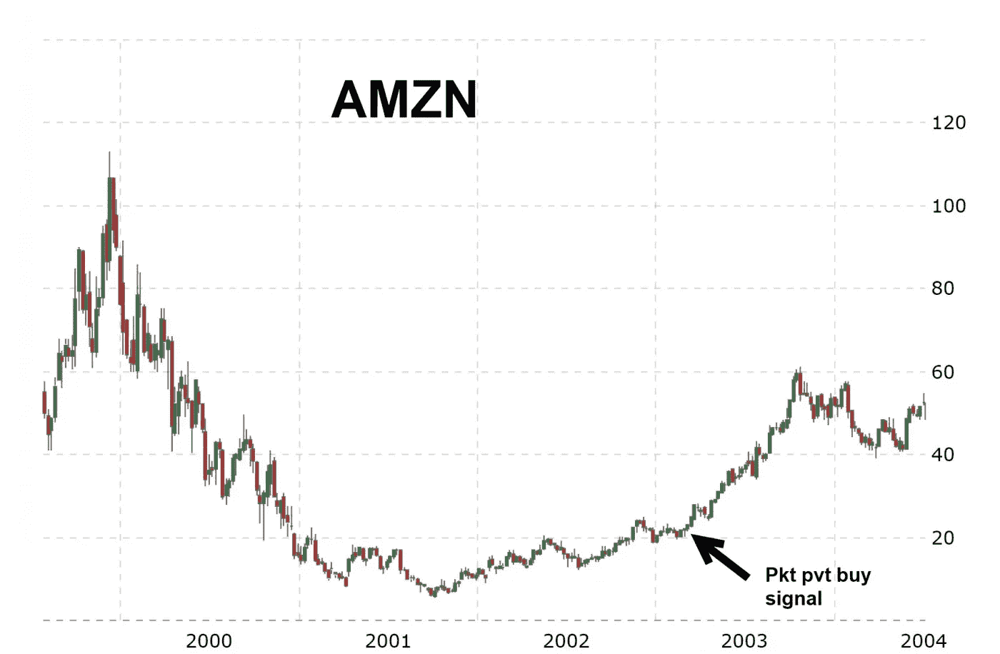

# 永远不要让好的危机白白浪费

> 原文：<https://medium.com/coinmonks/never-let-a-good-crisis-go-to-waste-86b90fde9d40?source=collection_archive---------4----------------------->

## 由[汉斯数字接入](https://hansedigitalaccess.com)的克利斯·凯驰博士、KJA 数字资产投资和[自私投资的美德](http://www.selfishinvesting.com/)

**(R)演进不会集中**

## 人类的创新总是胜过恐惧

这表明，迄今为止，人类的智慧、创造力和创新在所有情况下都超越了恐惧。在每次危机中，某些行业集团都会受到严重超卖的冲击，因此成为深度便宜货。所有的危机都朝着好的方向发展。也就是说，尽管市场总是会复苏，但即使你在高点买入，也可能需要数年时间才能实现盈亏平衡。这也是为什么买入并持有并不安全的另一个原因。

相反，找到那些由于其尖端技术或创新服务而有可能跑赢大盘的股票是值得的。使用技术指标来计算进场和出场的时间。我有一句话。当谈到寻找下一只具有巨大上涨潜力的股票时，只有当基本面和技术面都显示这种潜在上涨时才买入。只在技术面卖出。价格会显示你是对还是错，所以要注意你的止损！你随时可以重新获得这个职位。

## **关注哪里**

前 20%的股票和 ETF 留下了许多潜在未来领导者的线索。抵制市场下跌趋势的股票是强大的迹象。当市场的压力消失时，这些股票通常会像螺旋弹簧一样上涨。最终，黄金和比特币都可能成为这样的候选者。下图中的蓝线是标准普尔 500，而金线是金色。你可以看到在 2008 年，包括黄金在内的所有东西都遭到了抛售。但到了 2008 年 11 月，与仍处于整体下跌趋势的标准普尔 500 相比，黄金开始横向交易。正如我在上一次网络研讨会上指出的，最近的迹象表明比特币已经率先反弹。它是否能保持反弹当然是个问题，因为另一波恐慌性抛售很可能会推动包括比特币和黄金在内的所有资产走低，原因将在本文后面提到。

另一个关注点是表现最差的 20%的股票。如此糟糕的表现使人们能够确定哪些行业集团和股票已经严重超卖，可能会带来巨大的上涨空间。尽管如此，随着任何重大转变，一些行业集团可能不会回来或停滞不前，因此买家要小心。这需要大量的研究和上下文分析来区分小麦和谷壳。

## **没有人知道未来**

当传奇人物威廉·奥尼尔在采访中被问到市场的未来时，他的回答总是一样的。“我怎么会知道？”关键是每天都有新的信息。聪明的交易者和投资者吸收数据，然后采取相应的行动。这是一种实时方法。预测会有很大的误差。那些把自己的名声押在预测上的人，往往会发现自己在心理上与这种预测结下了不解之缘。因此，如果一个人做出预测，他应该随时准备改变自己的观点。价格决定了这种行为。如果你的止损点到了，你可能错了。如果在风险/回报仍然有利的情况下，出现了第二个或多个进场点，就转向下一个机会或返回。一生一次的交易往往每隔几周就来一次，尤其是在市场低点附近。保持敏捷，对所有可能性保持开放。

## **变化是唯一不变的**

谈到市场，唯一不变的是变化。量化宽松，或称 QE，是引入市场的一系列重大变化之一，这些变化摧毁了许多曾经具有预测价值的变量。因此，对于少数成功的投资者来说，能够及时调整投资策略一直是至关重要的。

如果我们分析一个世纪的数据，我们会发现所有的危机都是在主要的平均指数触底然后走高之后，这就带来了重大的买入机会。

**一些例子:**

## **2008 年至 2009 年——暴跌、反弹、再测试、新高**

2008 年，QE 拯救了市场，因此 2009 年是十年多牛市的开始，也是股市表现最好的一年。黄金在几个月内第一次达到新高。该公司市值损失了约 1/3，但相对于市值损失了大约一半或更多的大多数其它行业集团而言，这是一个强劲的迹象。汽车租赁公司起死回生，因为它们的分拆价值，也就是说，仅仅是它们汽车车队的价值，就远远超过了它们的股价低点。其他团体紧随其后。但试图确定底部是一个愚蠢的游戏。最好是监控一系列行业团体，包括领先和落后的，以了解市场何时形成主要底部。以纳斯达克 100 指数为例，它在 2008 年 11 月触底，然后在 2009 年 3 月再次测试低点。然后就出发去比赛了。标准普尔 500 指数对之前的低点进行了底切，然后大幅走高。排名前 20%和后 20%的一些股票飙升。口袋枢轴和可购买的跳空上涨数量众多，以及削弱&集会的形成，使人们能够快速接触到新生的牛市。

**新牛市起因:**量化宽松(QE1)拉开了“QE 时代”的序幕。

https://all star arts . com/u-s-stock-market-bottomed-2008-03-2009/提供

## **1962 年——崩盘、反弹、再测试、新高**

这场熊市首先是由 1962 年春天约翰·肯尼迪总统与钢铁公司的对峙引起的，然后是 10 月份的古巴导弹危机。

**新的牛市源于:**两个问题都解决了。经济刺激刺激了增长。

(https://www . investing . com/analysis/how-the-recent-stock-market-crash-is-like-1987-200371419)

## **1987 年——崩盘、反弹、再测试、新高**

这次崩盘是由多种因素造成的，包括加息时机不当。遵循投资组合保险策略以及投资者恐慌的计算机程序驱动的交易模型刺激了崩盘。那时候没有贸易限制。此外，还有一份收购税法案，在崩盘前几天寄出，以观察这项措施会得到怎样的反应。一些人认为，在一个已经出现了某种跌倒的完美风暴的环境中，这是压垮骆驼的最后一根稻草。

**新的牛市源于:**崩盘后，交易限制和熔断机制到位，以防止此类事件再次发生。在 1987 年 10 月 20 日的一份声明中，美联储主席艾伦·格林斯潘说:“美联储，与其作为国家中央银行的职责一致，今天申明其准备作为流动性的来源，以支持经济和金融体系。”在幕后，美联储鼓励银行继续按照通常的条件放贷。美联储对黑色星期一的回应开启了一个新时代，投资者对美联储平息严重市场低迷的能力充满信心。与以前的许多金融危机不同，由于美联储通过宽松的货币政策提供任何所需的流动性，黑色星期一引起的大幅损失并没有导致经济衰退或银行危机。前美联储副主席唐纳德·科恩(Donald Kohn)表示，“与以往的金融危机不同，1987 年股市下跌与存款挤兑或银行业的任何其他问题无关。”

(来自[https://www . investing . com/analysis/how-the-recent-stock-market-crash-is-like-1987-200371419](https://www.investing.com/analysis/how-the-recent-stock-market-crash-is-just-like-1987-200371419))

## **1998 年——崩盘、反弹、再测试、新高**

这只熊是由“亚洲传染病”带来的。熊市结束后，1998 年末表现最好的股票率先创出新高。这包括 YHOO、易趣和 AMZN。EBAY 留下了一个重要线索，它拥有先发优势，但在 1998 年熊市期间上市。它立即失去了超过 1/3 的价值，但当市场的重量消失时，它创造了一个 U 型转弯模式。几天之内，该公司股价创出新高，令其 IPO 价格黯然失色。我打电话给比尔·奥尼尔，告诉他这是你的买点。当然，我在我管理的机构账户里买了相当多的头寸。

**新的牛市源于:**危机的遏制。美联储也有宽松的货币政策，为被视为潜在灾难的 2000 年做准备。1999 年，宽松的货币政策创造了最强劲的牛市行情之一，催生了互联网泡沫。

(由[提供 https://www . investing . com/analysis/how-the-recent-stock-market-crash-is-like-1987-200371419](https://www.investing.com/analysis/how-the-recent-stock-market-crash-is-just-like-1987-200371419))

([https://www . macro trends . net/stokes/charts/EBAY/EBAY/stock-price-history](https://www.macrotrends.net/stocks/charts/EBAY/ebay/stock-price-history))

## **2011 年——暴跌、反弹、再测试、新高**

这种平均下跌约 20%的侥幸熊市是在第二轮量化宽松(即 QE2)结束时出现的。美联储别无选择，只能让 QE 复职，这就是后来众所周知的“扭曲行动”。

*   QE2:2010 年 11 月至 2011 年 6 月。
*   扭曲行动:2011 年 9 月。

**新牛市起因:**操作扭曲

(来自[https://www . investing . com/analysis/how-the-recent-stock-market-crash-is-like-1987-200371419](https://www.investing.com/analysis/how-the-recent-stock-market-crash-is-just-like-1987-200371419))

## **2000 至 2002 年**

互联网泡沫后，市场走低。事实证明，2000 年没有问题，因此宽松的货币政策不得不取消。此外，由于网络公司处于泡沫之中，大多数都有不完善的商业模式，泡沫破裂了。由于没有宽松的货币政策，2001 年经济衰退。这延长了股市的调整。市场直到 2003 年初才复苏，因为 2001-2002 年间许多互联网公司(Webvan、Exodus Communications 和 Pets.com)破产。会计丑闻的爆发(安达信、阿德尔菲亚、安然和世通)也是一个因素，投资者信心受损。2001 年 9 月 11 日的袭击也在很大程度上导致了股票市场的低迷，因为投资者对恐怖主义影响美国经济的前景变得不确定。

【2003 年初的新牛市源于:宽松货币，即低利率。

([https://www . macro trends . net/2015/fed-funds-rate-historical-chart](https://www.macrotrends.net/2015/fed-funds-rate-historical-chart))

大多数较弱的网络公司也已经被淘汰。这使得实力最强的公司(EBAY、AMZN、YHOO 等)能够在低利率环境下茁壮成长。2003 年 3 月，它们都发出了强烈的买入信号，因为它们的表现超过了市场平均水平。

([https://www . macro trends . net/2324/sp-500-historical-chart-data](https://www.macrotrends.net/2324/sp-500-historical-chart-data)

([https://www . macro trends . net/stokes/charts/AMZN/Amazon/stock-price-history](https://www.macrotrends.net/stocks/charts/AMZN/amazon/stock-price-history))

## **1929 年**

罗斯福在 1933-1939 年通过新政实施的瘫痪政策延长了大萧条，尽管 1932-1937 年主要平均指数大幅反弹，导致大萧条。从 1929 年 10 月开始，道琼斯工业指数从最高点到最低点下跌了 90%，在 1932 年 6 月触底，之后有记录以来最强劲的上涨，在 1932 年低点的 3 个月内上涨了约 100%，然后在回调后，在 1933 年又上涨了 100%。

([https://new world economics . com/the-federal-reserve-in-the-30-2-interest-rates/](https://newworldeconomics.com/the-federal-reserve-in-the-1930s-2-interest-rates/))

当时，银行贷款更加严格，至少不是隔夜贷款。大多数隔夜贷款是贷给经纪人的保证金贷款。在 1930 年之前的那些日子里，保证金很高，因为它不受监管，人们在股票上使用高达 10 倍的杠杆。

在下面的图表中，由于英镑在 1931 年 9 月贬值，贴现率在 1931 年底跳升。那时，英镑是世界上首要的金本位国际货币。它在世界各地引发了动荡，包括数十次“回声”贬值，因为英镑也是首要的储备货币。这引起了又一波恐慌性抛售。但从上面的图表中可以看出，利率很快回落，这一次降至 0%或接近 0%，利率保持不变，除了 1934 年初市场出现回调，然后又很快回落至接近 0%的水平，直到 1937 年初美联储收紧政策，导致利率暴跌-50.2%。

([https://new world economics . com/the-federal-reserve-in-the-30-2-interest-rates/](https://newworldeconomics.com/the-federal-reserve-in-the-1930s-2-interest-rates/))

**新的牛市始于 1932 年 6 月，原因是:**超级宽松的货币政策。从 1932 年年中到 1937 年初，0%或接近 0%的短期国库券利率等低利率不仅将股市拉出了跌势，而且道琼斯工业指数和标准普尔 500 指数也迎来了历史上最强劲的市场反弹。

## **1973 年至 1974 年**

1973 年的石油禁运导致价格暴涨，经济瘫痪。一场深度衰退由此产生，如下图的阴影部分所示。

([https://www . macro trends . net/2015/fed-funds-rate-historical-chart](https://www.macrotrends.net/2015/fed-funds-rate-historical-chart))

【1974 年末开始的新一轮牛市源于:多次降息，即宽松的货币政策。

([https://www.macrotrends.net/1320/nasdaq-historical-chart](https://www.macrotrends.net/1320/nasdaq-historical-chart))

## **2020**

特朗普总统和全球央行一直在提供创纪录水平的刺激，甚至超过了上世纪 30 年代的水平。我不认为熊市会持续很长时间，尽管主要股指大幅回调超过 50%并不令人意外。也就是说，轻松赚钱从未如此简单。减税、低油价、各种经济激励措施以及直升机撒钱都有可能将衰退的持续时间和深度最小化。换句话说，尽管一切都变得越来越糟糕，但主要平均指数可能会比我们想象的更快找到低点，即使是很深的低点。“在街上有血的时候买”一直适用，现在仍然适用。

第一次恐慌性抛售浪潮是由于冠状病毒病例的指数上升。第二波恐慌性抛售很可能是由于封锁、隔离和供应链中断对经济造成的巨大损失。第三波恐慌性抛售可能是因为随着天气转暖，感染率没有稳定下来。由于这种病毒是全新的，哈佛医学院冠状病毒资源中心表示，“目前，我们不知道天气转暖后新冠肺炎的传播是否会减少。”[https://www . NIH . gov/news-events/news-releases/new-coronavirus-stable-hours-surfaces](https://www.nih.gov/news-events/news-releases/new-coronavirus-stable-hours-surfaces)

目前，金矿、贵金属、比特币、酒店、航空公司和物流公司应该被关注潜在的进场点，但只有在主要均线找到底部后。这可能还需要几个月的时间，因为经济停滞可能会引发衰退，很容易将主要平均指数推低至历史高点的 50%或更多。也就是说，市场是向前看的，讨厌不确定性，所以一旦未来几周的更多数据能够消除大部分不确定性，这很可能代表市场的一个主要底部。由于今天的信息传播比 20 世纪 30 年代甚至 21 世纪初快得多，底部可能会来得更早，尽管由于进一步的恐慌性抛售，它可能会大幅下跌。

对全球经济造成的损害继续被大大低估。纽约帝国指数和德国 ZEW 指数双双创造历史，跌幅甚至远远超出了修正后的预期。到目前为止，酒店的业务已经下降了 53%。经济学家正准备迎接一生一次的失业救济人数激增。高盛预计索赔 225 万，但特朗普对中小企业的激励措施可能会减少这一数字。

虽然[美联储的布拉德说](https://www.reuters.com/article/us-health-coronavirus-fed-bullard/feds-bullard-coronavirus-shutdown-not-a-recession-but-an-investment-in-survival-idUSKBN2190FT)经济活动的冠状病毒关闭不是衰退，而是对生存的投资，但他说，这本质上是一项 4 万亿美元的大规模投资，以防止事情变得更糟，而不是应该有助于经济增长的投资。这样的资本冲击将进一步降低菲亚特的价值，因此黄金、股票和比特币应该会受益。

## **我们会陷入衰退吗？**

极有可能。问题在于它的严重性(长度和深度)。正如我们从上面众多的关键例子中所看到的，宽松的货币政策总是拯救然后启动经济。大多数熊市都是“崩溃、反弹、重新测试、新高”类型的短暂、剧烈的冲击。为数不多的持续熊市是由于银行贷款限制(1930 年-)和当时世界储备货币贬值(1931 年)或石油禁运(1973 年)或从 9/11 (2001 年)到会计丑闻(2000-2002 年)的一系列外部事件，当然还有花了几年时间才平复的互联网泡沫破裂(2001-2002 年)。不过，在这三种情况下，低利率都是帮助股市找到主要底部的关键。

请记住，股市可以下跌 20%或更多，但不会出现衰退。这种情况发生在 1962 年(-28%)、1987 年(-33.5%)、1998 年(-21%)和 2011 年(-20%)。大规模刺激措施可能刺激增长，从而缓冲或至少缩短衰退的持续时间，即使它是基于上文讨论的任何额外恐慌性抛售浪潮的剧烈恐慌冲击。

自 20 世纪 20 年代以来，购买美国股票的 3 年平均名义回报率下降了 x%:

下降 60% = 57%

下降 70% = 87%

下降 80% = 172%

下降 90% = 240%

将继续监测情况。敬请关注。

**(͡:B ͜ʖ ͡:B)**

由[的克利斯·凯驰博士、汉斯数字接入](https://hansedigitalaccess.com)、KJA 数字资产投资和[自私投资的美德](http://www.selfishinvesting.com/)

> [直接在您的收件箱中获得最佳软件交易](https://coincodecap.com/?utm_source=coinmonks)

