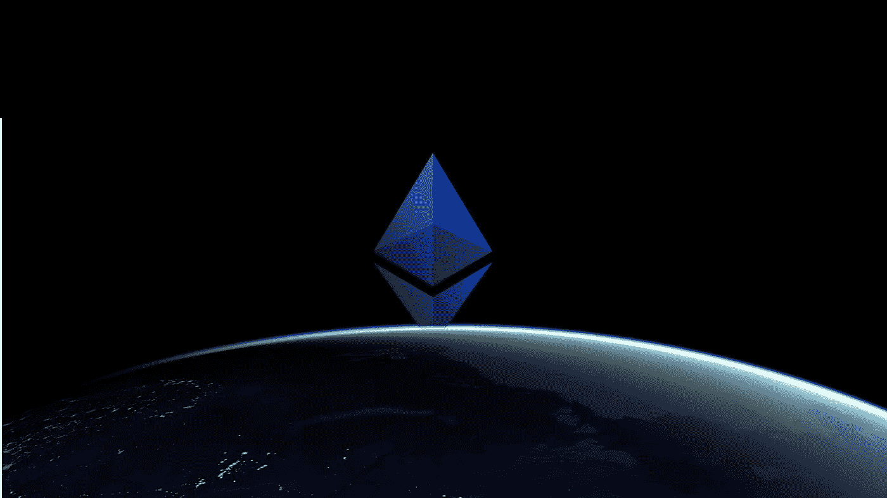
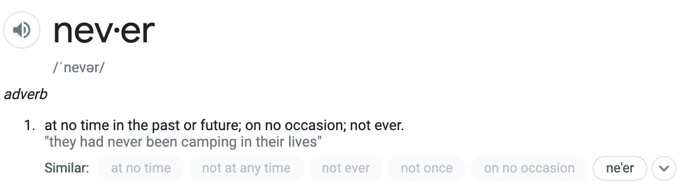
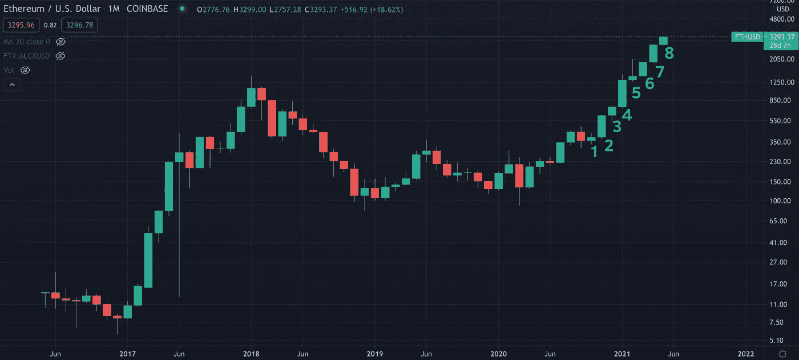
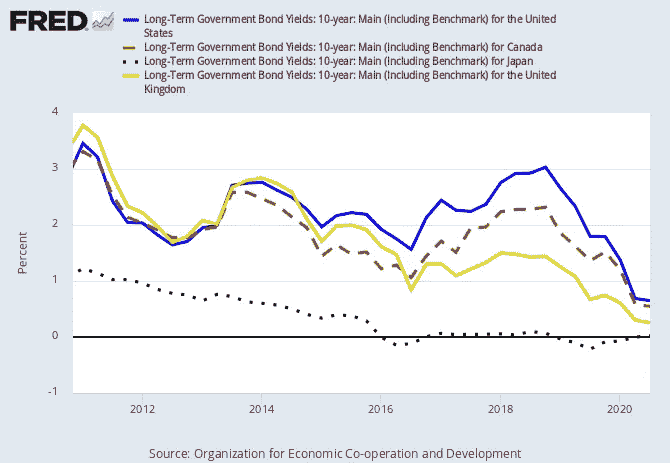
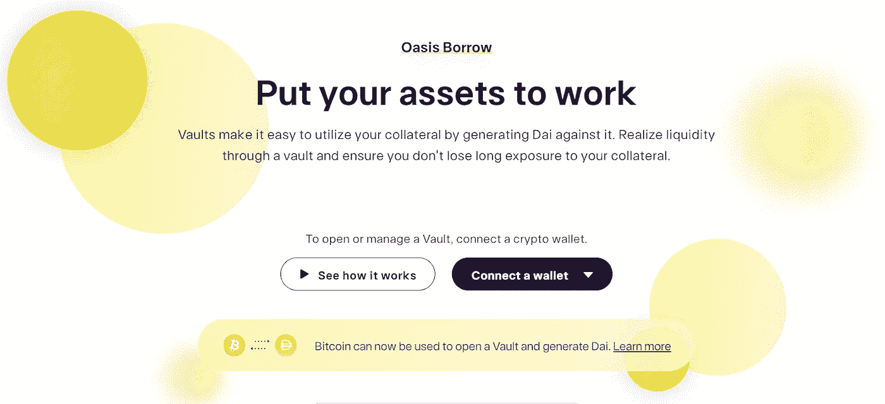
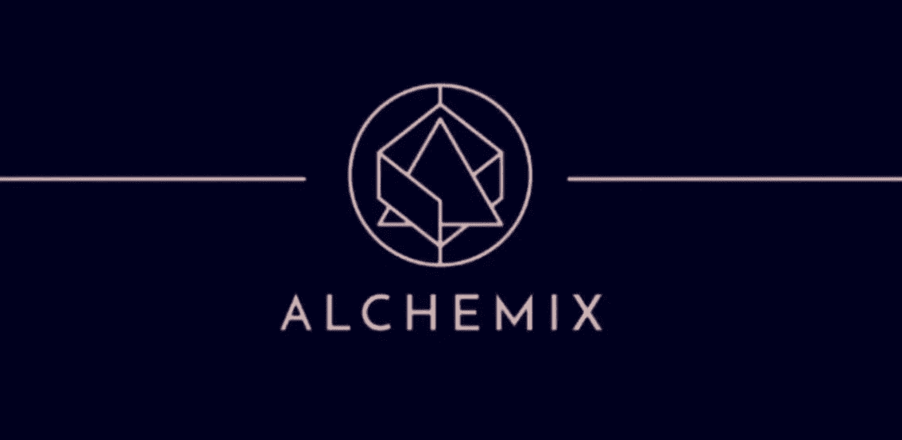

# 永远不要出售 ETH

> 原文：<https://medium.com/coinmonks/never-sell-eth-a9b2789d1725?source=collection_archive---------1----------------------->

## 加入网络债券和抵押贷款的#neversell 团伙

和往常一样，这篇文章是为教育目的而写的。这既不构成财务建议，也不构成交易建议。过去的表现并不代表未来的结果。

*不要投资超过你能承受的损失。这不是财务建议；总是自己做研究:)*

我从来不卖我的衣服。

我觉得每当我这么说的时候，人们都用奇怪的眼神看着我。

"你说*从不*销售是什么意思？"

和其他人一样的定义:

Source: Google

**两个原因:**

1.  我相信以太坊的未来愿景
2.  通过互联网债券和抵押贷款，我可以随时获得现金，而无需出售

# 以太坊的愿景

## 今天的用法

我已经写了太多关于以太坊和它的原生硬币以太的文章——谈论它的**效用是目前最有用的加密货币******。****

**你可以用以太做很多事情，这个理由足以让你永远不卖以太——仅仅是因为你需要它来参与 DeFi 和其他 Web3 应用。**

**我需要将 ETH 用作 gas，以便为我在以太坊上的交易提供动力，这样我就可以管理我的 DeFi 应用程序、购买 NFT、注册一个[分散用户名](/coinmonks/decentralized-identity-starts-with-owning-your-name-3fbfca9d8ff)等等。**

**卖 ETH 就像卖汽油，当你需要它来为你的汽车提供动力。**

## **未来状态使用**

**缩小来看，以太坊作为世界超级计算机仍有很大的发展空间:一个无许可的开放平台，可以建造任何东西。**

**[无银行的大卫·霍夫曼](https://twitter.com/TrustlessState)说得比我好:**

> **以太坊是数字经济的结算层…我说过一段时间，以太坊在多大程度上是货币，是以太坊在多大程度上是经济的函数…**
> 
> **我预计全球经济将成为以太坊经济的同义词…随着以太坊成为规范经济，以太坊将成为价值资产的规范商店。**

**以太坊将开启互联网的下一波浪潮，即 Web3，在 web 3 中，不仅仅是信息，整个经济——以及货币和价值的转移——都是数字原生的。**

**因此，以太网将成为推动这一新互联网的资产。**

**这就好比如果今天的互联网有一个符号化的表示——所有交织的网络、光缆、电力等的组合。每个人都需要有这个令牌才能使用互联网。**

**你不想持有那笔资产吗？**

## **无法把握市场时机**

**我已经认识到我不是一个优秀的交易者——这意味着我不能阅读蜡烛图和指标，也不能准确预测一项资产是上涨还是下跌。**

**有一个统计数据显示，90%的日内交易者亏损，虽然我还没有评估我是否属于净亏损交易者，但我肯定要么比我只有 HODL 的时候赚得少，要么从时间和情绪的角度来看，通过日内交易，我用更多的投资赚了同样多的钱。**

**我确实开始认同一句古老的格言:市场中的时间胜过市场时机。**

**我不会快速买卖 ETH，而是会继续持有它——通过定期买入，慢慢积累更多。**

**这样一来，我就腾出了看行情的时间和心力，让自己去做其他的事情(比如写博文 lol)。**

****

**Source: Bankless**

**日复一日，瑞士联邦理工学院看起来上下波动很大，但放大来看，瑞士联邦理工学院实际上结束了连续 8 个月的上涨——这是我试图把握市场时机时从未意识到的。**

**如果市场崩溃，我会继续持有，在此期间我会积累更多的 ETH。这就是我对以太坊愿景的高度信念，以太坊将成为新互联网的基础部分。**

> **我肯定要么赚的钱比我刚做 HODL 交易时少，要么**从时间和情绪的角度看，我通过日内交易用更多的投资赚了同样多的钱。****

# **无需出售即可获得现金**

**我卖 ETH 的唯一原因是我需要现金去做别的事情。**

**这可能是以美元计价的 IRL(或我生活的任何地方)，也可能是另一种我认为有更好投资回报的硬币/股票。**

**我甚至犹豫是否考虑第二桶金，因为我坚信 ETH 是你可以持有的最佳风险调整资产。**

**关于需要美元的第一桶金，我可以探索两个选项来获得美元*而不出售我的 ETH* :**

1.  **互联网债券(即赌注)**
2.  **抵押贷款**

## **互联网债券/赌注**

**[利益证明](https://www.coindesk.com/proof-of-stake)是加密中广泛采用的共识机制——用于 Tezos、Cardano、Cosmos 以及即将推出的以太坊 2.0 等链中。**

**从高层次来看，利益证明(PoS)使用金钱来保护网络，并允许在区块链上达成有效交易的协议，而工作证明(PoW)——比特币和以太坊目前使用的共识机制——利用计算能力和电力作为保护网络的手段。**

**将以太坊从 PoW 转换到 PoS 的一个影响是，交易费(即以 ETH 计价的天然气费)不再由矿工支付，而是由验证者支付，验证者“下注”他们的 ETH 股份以确保网络安全。**

**不像 PoW 现在有很高的资本支出来开始一个采矿操作，PoS 允许任何人实质上“赌注”他们的 ETH 来参与共识。**

**更简单的方法是将你持有的 ETH 委托给已建立的验证机构，这些验证机构将与你分享他们的交易费用(即收入)。**

****这样做的结果是，你从所持的瑞士联邦储蓄银行股份中获得了一个利率——当然是以瑞士联邦储蓄银行计价的。****

**一些模型预测，在 ETH2 开始阶段，押注 ETH 的年利率可能高达 25%，随着时间的推移，年回报率预计在 3-5%左右，这与主权国家国债的[接近零甚至负利率](https://email.mg2.substack.com/c/eJwlUduupSAM_Rp5wwiIlwceJpmc3zAVqjKHiwGM8e8H9w4NpdBFu1Y1FNxjetQZcyHvtpTnRBXwzg5LwUSujGmxRsmeSdlJYlRv2CQnYvOyJUQP1qmSLiTntTqrodgYXgBjXM7kUDCg3ADM2oPsJ6k1aoRZbFjXiDN-y8JlLAaNKgb3fD4mTh2lnLkRfxr-U-2-73Z1MfoV097q6Ovd22h1kIrVDt8j7zijXTVZg8uVBNTFm9pQyWAuNFXKmR41oCXSXOChH4jGUHMdXSH80v2yBhvxk1Mwjfh7JvT28hS2VAkSq15E13eSzYLzsWUtH_jYCWTbOHApNeDUTYLBNgMXg-bQ9J3feZuvtVbUv2_3JKl_1vtHHxD2WdaM_dXy81SlXKr3V7DlWTDA6tB8VS7fWX10X3YM-BIyCxTFBjYOkrFBiGH8qlrHIPqp42LmpNY2saKCKgca3CyE8h9GPKzV)形成鲜明对比。**

****

****和国债一样，押注以太坊本质上是“无风险”的。**这个年报酬率代表了 Web3 的无风险率——提供了一个评估参与风险和回报的基准，这意味着 DeFi apps 将提供比 ETH2 staking APR 更高的利率！**

**你不需要把你的 ETH 交给任何验证者，你只需要拿着你的 ETH“委托”并接受钱。缺点是在你可以再次移动你的 ETH 之前有一个冷静期，但是我没有计划出售它，所以它对我来说无所谓。**

****总而言之，你可以从现有的 ETH 资产中获得更多的 ETH。****

**但这意味着，如果我需要现金，我还是得卖掉我的 ETH，不是吗？**

**这是下一部分的切入点。**

## **抵押贷款**

**从我记事起，抵押贷款就已经出现在传统金融领域——个人通过提供另一种资产作为回报来“保护”他们的贷款。**

**例如，抵押贷款和汽车贷款被认为是有抵押的，因为贷款人(通常是银行)最终可以收回基础资产——房子和汽车——并出售它们以获得现金。**

**Crypto 有相同的概念，只是稍微修改了一下。除了抵押 IRL 资产，你还可以抵押你的密码并获得另一项资产作为回报——无论是另一枚硬币还是美元。**

****最棒的是，我不用为这笔贷款缴纳资本利得税，因为我还没有出售我的基础 ETH。****

**像 Maker、Compound 和 Aave 这样的 DeFi 应用程序是抵押贷款领域的领导者，它们都提供抵押 ETH 和接收美元的方法，然后可以提取到银行账户中支付账单。**

****

**Oasis is another lending app**

**抵押贷款的问题是你可能会被 T4 清算。**

**因为这些货币与美元的汇率波动，如果 ETH 的价值低于某个阈值，DeFi 协议将清算您的头寸，以收回其成本，这意味着他们将以美元出售您的抵押 ETH，并为此收取费用。**

**意味着你会损失很多钱。不理想。**

**为了应对这种情况，个人往往不得不密切关注其基础资产的价格，以确保他们不会被清算——这对许多人来说是非常恼人和不可持续的。**

**幸运的是，有两个新的 DeFi 应用程序可以解决这种清算的认知负担: [Alchemix](https://alchemix.fi/) 和 [FlashStake](https://flashstake.io/)**

****

**这两个 DeFi 应用程序本质上防止你被清算；他们通过提前给你收益做到这一点。**

**也就是说，如果你每年要获得 25%的 ETH，你可以提前借入这笔收益，而不是等到年底才获得这笔收益。**

**问题是，如果你不返还该收益，你将无法在收益累积期结束时收回抵押品。**

**因此，如果你赌掉两年的收益，你两年内都不能收回你的 ETH。**

**同样，当你是“永不卖”一伙的时候，这是完全没问题的。**

# **结束语**

**我认识到绝不出售 ETH 并不是对每个人都可行的策略。**

**人们需要现金来维持生活，人们喜欢退出策略，人们希望降低风险，人们喜欢日内交易。**

**有很多原因可以解释为什么#neversell 是一个愚蠢的想法，几年后我可能会收回自己的话。**

**我也认识到，将我收入的一大部分投入到像 crypto 这样的风险资产中，对我来说是一种特权。**

**但是希望我已经通过我的逻辑分析说服了一些人为什么我从来不卖。我们仍然处于潜在的改变世界的技术的早期。**

**如果你认为这篇博文值得你花 5 分钟来阅读，请在下面鼓掌(最多 50 次)或者与一个会从这篇内容中受益的朋友分享。非常感谢！**

## **另外，阅读**

*   **最好的[密码交易机器人](/coinmonks/crypto-trading-bot-c2ffce8acb2a) | [电网交易机器人](https://blog.coincodecap.com/grid-trading)**
*   **[加密复制交易平台](/coinmonks/top-10-crypto-copy-trading-platforms-for-beginners-d0c37c7d698c) | [五大 BlockFi 替代方案](https://blog.coincodecap.com/blockfi-alternatives)**
*   **[CoinLoan 点评](/coinmonks/coinloan-review-18128b9badc4)|[Crypto.com 点评](/coinmonks/crypto-com-review-f143dca1f74c) | [火币保证金交易](/coinmonks/huobi-margin-trading-b3b06cdc1519)**
*   **[尤霍德勒 vs 科恩洛 vs 霍德诺特](/coinmonks/youhodler-vs-coinloan-vs-hodlnaut-b1050acde55a) | [Cryptohopper vs 哈斯博特](https://blog.coincodecap.com/cryptohopper-vs-haasbot)**
*   **[杠杆代币](/coinmonks/leveraged-token-3f5257808b22) | [最佳密码交易所](/coinmonks/crypto-exchange-dd2f9d6f3769) | [Paxful 点评](/coinmonks/paxful-review-4daf2354ab70)**
*   **[如何在印度购买比特币？](/coinmonks/buy-bitcoin-in-india-feb50ddfef94) | [WazirX 评论](/coinmonks/wazirx-review-5c811b074f5b) | [BitMEX 评论](https://blog.coincodecap.com/bitmex-review)**
*   **[双子座 vs 比特币基地](https://blog.coincodecap.com/gemini-vs-coinbase) | [比特币基地 vs 北海巨妖](https://blog.coincodecap.com/kraken-vs-coinbase)|[coin jar vs coin spot](https://blog.coincodecap.com/coinspot-vs-coinjar)**
*   **[币安 vs 北海巨妖](https://blog.coincodecap.com/binance-vs-kraken) | [美元成本平均交易机器人](https://blog.coincodecap.com/pionex-dca-bot)**
*   **[印度比特币交易所](/coinmonks/bitcoin-exchange-in-india-7f1fe79715c9) | [比特币储蓄账户](/coinmonks/bitcoin-savings-account-e65b13f92451)**
*   **[币安费用](/coinmonks/binance-fees-8588ec17965) | [Botcrypto 审核](/coinmonks/botcrypto-review-2021-build-your-own-trading-bot-coincodecap-6b8332d736c7) | [Hotbit 审核](/coinmonks/hotbit-review-cd5bec41dafb) | [KuCoin 审核](https://blog.coincodecap.com/kucoin-review)**
*   **[我的加密副本交易经验](/coinmonks/my-experience-with-crypto-copy-trading-d6feb2ce3ac5) | [《比特币基地评论》](/coinmonks/coinbase-review-6ef4e0f56064)**
*   **[加密货币储蓄账户](/coinmonks/cryptocurrency-savings-accounts-be3bc0feffbf) | [YoBit 审查](/coinmonks/yobit-review-175464162c62) | [Bitbns 审查](/coinmonks/bitbns-review-38256a07e161)**
*   **[最佳比特币保证金交易](/coinmonks/bitcoin-margin-trading-exchange-bcbfcbf7b8e3) | [比特币保证金交易](https://blog.coincodecap.com/bityard-margin-trading)**
*   **[加密保证金交易交易所](/coinmonks/crypto-margin-trading-exchanges-428b1f7ad108) | [赚取比特币](/coinmonks/earn-bitcoin-6e8bd3c592d9) | [Mudrex 投资](https://blog.coincodecap.com/mudrex-invest-review-the-best-way-to-invest-in-crypto)**
*   **[BlockFi 信用卡](https://blog.coincodecap.com/blockfi-credit-card) | [如何在币安购买比特币](https://blog.coincodecap.com/buy-bitcoin-binance)**
*   **[顶级付费加密货币和区块链课程](https://blog.coincodecap.com/blockchain-courses) | [币安评论](/coinmonks/binance-review-ee10d3bf3b6e)**
*   **[MXC 交易所评论](/coinmonks/mxc-exchange-review-3af0ec1cba8c) | [Pionex vs 币安](https://blog.coincodecap.com/pionex-vs-binance) | [Pionex 套利机器人](https://blog.coincodecap.com/pionex-arbitrage-bot)**
*   **[在美国如何使用 BitMEX？](https://blog.coincodecap.com/use-bitmex-in-usa) | [BitMEX 点评](https://blog.coincodecap.com/bitmex-review) | [币安 vs Bittrex](https://blog.coincodecap.com/binance-vs-bittrex)**