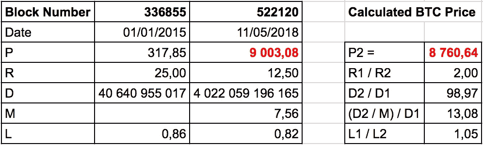

# 去中心化世界中加密资产公允价值计算和自然垄断的新方法

> 原文：<https://medium.com/coinmonks/new-approach-to-crypto-assets-fair-value-calculation-and-natural-monopolies-in-a-decentralized-71d2a1b00eca?source=collection_archive---------10----------------------->

*Sergey Kozlov，经济学博士，sergey@skozlov.com 基辅经济学院客座教授*

由于整个密码行业只有 9 年的历史，所以几乎没有关于密码学的基础研究。本文将尝试部分填补这一空白。

十多年前，作为论文答辩的一部分，我谈到了自然垄断的问题。在我看来，正是这一领域的科学研究可以帮助理解密码学赖以生存和工作的规律，通过这些规律，我理解了 2009 年 1 月诞生的新一类资产——加密资产，其中第一个就是比特币。

根据定义 ***自然垄断是指一个行业中的垄断，在该行业中，相对于市场规模而言，较高的基础设施成本和其他进入壁垒使行业中最大的供应商(通常是市场中的第一供应商)相对于潜在竞争者具有压倒性优势。这经常发生在资本成本占主导地位的行业，创造了相对于市场规模而言很大的规模经济；例子包括公用事业，如供水服务和电力(Perloff，J，2012。微观经济学，培生教育，英格兰，第 394 页。).***

简单地说，自然垄断是，例如，一条铁路，原因很简单，为现有的竞争对手建造 5 或 6 条铁路在经济上是无效率的。因此，第一条铁路也是最后一条。自然垄断理论回答了这样一个问题，即如何做到最大限度地减少垄断的负面影响，让竞争在一切条件具备的地方发挥作用。例如，就铁路而言，自然垄断只是铁路轨道，但使用这一基础设施的运输公司应该相互竞争。

通过将这种方法转移到加密资产市场，自然垄断可以被视为采矿基础设施，因为在单位时间内，通常，一个单位的采矿设备只允许开采一个加密资产。因此，市场上的第一种加密资产——比特币——事实上已经获得了垄断地位，这是因为主要以功耗表示的大量采矿设备是比特币采矿网络。显然，就规模而言，即使形成第二个这样的网络在经济上也是低效的，因此我们拥有市场上第一个加密资产的主导地位。

与自然垄断特征相似的第二个对象是已形成的密码资产交易市场基础设施。这种由证券交易所、交易所等组成的基础设施已经接收了用于交易的第一加密资产并将其与后来出现的所有其他加密资产联系在一起，将不会从创建与第一加密资产的可兑换程度相当的第二或第三加密资产中获得任何经济收益，相反，这将导致加密交易所的负面结果。因此，我们声明比特币作为与世界上所有其他加密资产交换的手段的自然垄断和主导地位。

总的来说，花费数十亿美元来创建和维护一个在属性上可以与比特币相媲美的加密挖掘基础设施是没有经济意义的。比特币还相当不错地扮演了加密资产市场中普遍等价物的角色，是新兴市场基础设施的自然垄断者。

由此可见，去杂货店购物显然不适合比特币，现有的 Visa 或 MasterCard 银行卡仍能较好地应对这一任务。对了，这些支付系统 Visa 和 MasterCard 也是自然垄断。

由此得出结论，一旦具有真正新属性的加密资产出现，它立即在由其形成的利基市场中获得主导地位。以太坊就是这种加密资产的一个很好的例子。与比特币的主要区别在于，以太坊允许你在以太坊区块链的基础上创建完全成熟的自有加密资产。由于在采矿过程中使用大量 RAM，以太坊不允许使用所谓的 ASICs 进行有效采矿，因此 GPU 被用作主要采矿设备。以太坊占据主导地位的另一个优势是 Solidity 智能合约语言的特殊性。如果开发智能合同的绝大多数程序员都学习了 Solidity，他们不太可能轻松掌握并继续用其他一些编程语言进行开发，给出类似或略好的结果。因此，在市值、容量和基础设施维护费用方面，比特币或以太坊等自然垄断的跟随者或模仿者将永远落后于先行者十倍或百倍。

***为了去中心化，比特币、以太坊等加密资产实际上垄断了加密世界。密码经济学的本质在行为上与自然垄断相似，因此由于上述原因，它不可避免地在每个新发现的应用领域中形成垄断者。***

在确定了影响加密资产的主要因素后，我们可以继续尝试估算加密资产的公允价值，为此我们以 zawy 12([https://github . com/monero-project/monero/issues/3766 # issue comment-387437584](https://github.com/monero-project/monero/issues/3766#issuecomment-387437584))的建议为基础。zawy12 方法的基础是对加密资产价格和开采成本(理想情况下是能源成本)之间关系的假设。该等式对 PoW(工作证明)挖掘算法有效:

**(1)P1 * R1/D1 * L1 = P2 * R2/(D2/M)* L2**

在哪里，

1 和 2 =时刻 1(现在)和 2(未来)；

P =每个加密资产单位的美元价格；

R =奖励，每块的加密资产单位；

D =粉末开采难度；

M =摩尔定律调整，代表采矿设备生产率(H/s)随时间的反映变化，计算为 2^n，其中 n 为生产率翻倍的周期数；

L =损失因子，等于由于私钥损失而损失的加密资产单元的估计量。系数 1 意味着 100%的加密资产单元可用，系数 0.75 意味着由于私钥丢失，每四个加密资产单元中就有一个不可用。

同样的等式可以改写得更简单:

**(2)P1 * R1/E1 * L1 = P2 * R2/E2 * L2**

在哪里，

E =采矿用电量，单位为 kW/h

现在，我们以一种允许我们估计公平加密资产未来价格的形式重写等式:

**(3)P2 = P1 * R1/R2 *(D2/M)/D1 * L1/L2**

决定未来加密资产价格的逻辑如下:

P1 =当前时刻的加密资产价格作为起点，最好采用该期间的平均价格，以排除投机性增长或下降的时刻；

R1 / R2 =分别反映了加密资产排放对其价格的影响，而随着时间的推移减少排放会导致加密资产价格的上升；

(D2 /米)/ D1 =复杂性增加，即挖掘能力的增加导致加密资产价格的增加，考虑到摩尔定律的调整；

L1 / L2 =随着时间的推移，越来越多的加密资产单位由于私钥丢失而丢失，以这种方式减少加密资产的发行会提高其价格。

值得一提的是，该等式给出了加密资产的合理价格估计，并且没有考虑投机成分，即所谓的泵和转储。最好是在很长一段时间内，当价格的随机波动自我平衡时，或者当价格在很长一段时间内相对稳定时，评估其正确性。

让我们试着在实践中应用这个公式来估算比特币的公允价值。以 2015 年 1 月 1 日这一加密资产的成本为例，它是 317.85 美元([https://coinmarketcap.com/currencies/bitcoin/](https://coinmarketcap.com/currencies/bitcoin/))，截至 2018 年 11 月 5 日为 9003.08 美元。现在，根据我们的公式，我们得到了截至 2018 年 11 月 5 日的估计加密资产价格。

研发数据取自 https://blockchain.info/[的工厂](https://blockchain.info/)

摩尔定律调整(M)是基于每 14 个月单位成本的设备容量翻一番来计算的。

丢失比特币数量的数据来自 Chainalysis 研究，其结果于 2017 年底发表(【http://fortune.com/2017/11/25/lost-bitcoins/】T4)。

据此，比特币的估计价值为 8760.64 美元，而实际价值为 9003.08 美元。因此，我们可以得出这样的结论:基于 PoW 挖掘算法的加密资产公允价值计算公式有权存在。此外，12 个月和 18 个月的摩尔定律调整(M)的变化给出了比特币在 6 到 12 千美元范围内的基本评估。因此，我们可以说，该加密资产的当前价格水平与其基本面评估相对应。同样，2017 年底高达 2 万美元的增长是对基本面评估的投机性偏离。

***在形成自然垄断的力量的影响下，密码学倾向于巩固加密资产——垄断者在竞争对手面前拥有压倒性的市场优势。这种优势以及资产价格的基础是服务于这种特定加密资产的挖掘能力。在 PoW 采矿算法中，采矿能源成本是形成加密资产公平价格的关键因素，而永久的采矿设备“军备竞赛”需要引入摩尔定律调整，以获得加密资产的公平价格和基本估值。***