# 新的去中心化财务栈，以太坊的替代品

> 原文：<https://medium.com/coinmonks/new-decentralised-finance-stacks-alternatives-to-ethereum-abe74ecf53f9?source=collection_archive---------1----------------------->

基于以太坊的 DeFi 应用已经积累了令人震惊的 500 亿美元总锁定价值(TVL)，但许多散户投资者被高昂的交易成本(“燃气费”)吓得不敢问津。以太坊的新替代品每天都在出现，但为了实现回报最大化，投资者需要将各种各样的投资组合在一起。

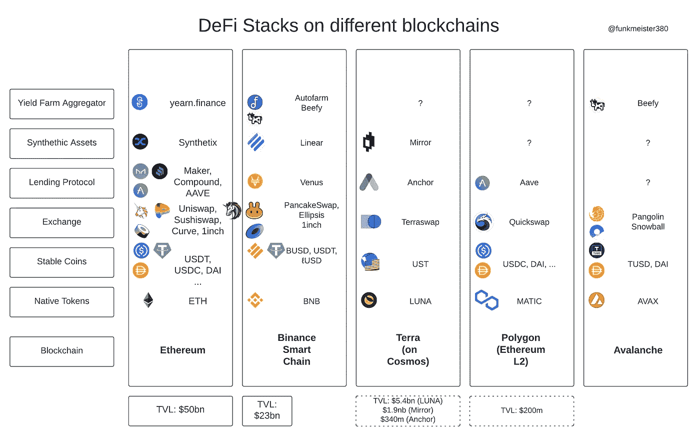

Updated with Beefy and Snowball 2021–04–08

# 区块链和原生令牌

区块链本身为顶层的分散式应用程序(dApps)提供了基础架构。占主导地位的区块链是以太坊，其本地以太令牌(ETH)。任何想要投资以太坊堆栈的用户都需要以太来支付交易(“gas”)。

这篇博文中讨论的所有替代方案都有一个本机令牌，至少对于交易成本来说是需要的。

# 稳定的硬币

稳定硬币在 DeFi 堆栈中起着非常重要的作用，因为它们代表法定货币。许多投资者在日常工作中得到美元和其他法定货币的支付，或者可能想在大街上的商店里花掉他们的 DeFi 收益，需要良好的旧现金。

稳定的货币生活在加密的世界里，所以它们不完全是现金，但它们不会让投资者面临货币风险。它们不像所有其他加密货币那样不稳定。

流通中的美元有很多种不同的味道，其中有价美元占主导地位(USDT，日交易量为 1500 亿美元)。唉，其他货币还是不发达。例如，我所知道的唯一稳定的英镑硬币——true GBP——并没有在交易所广泛交易，也没有太多的指数流动性。领先的加密交易所币安曾一度支持 BGBP，但由于交易量不足而放弃了它。

欧元稳定货币的交易也少之又少，亚洲货币在加密生态系统中才刚刚开始崭露头角。

# 分散式交易所

DeFi 的一个关键要素是以不信任、不许可的方式进行交易的能力。在以太坊中，占主导地位的指标是 Uniswap、Sushiswap 和 Curve。它们允许用户用一种资产(如 USDT)交换另一种资产(如瑞士联邦理工学院)。1inch 扮演着集合者的角色，通过一个或多个其他指数进行交易。

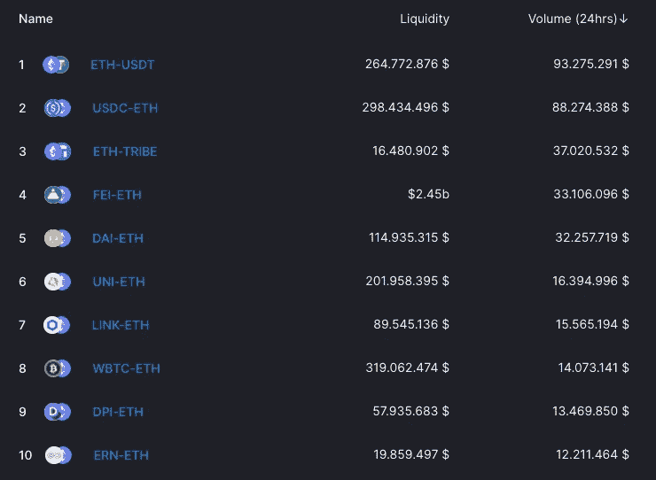

在撰写本文时，这是 Uniswap 上销量最高的 10 双鞋。今天总共有 165 对挂牌，至少都有一定的成交量。

新的货币(代币)一直在出现，通常它们的第一个交易场所是分散的交易所。任何人都可以开始发行代币，并提供一些初始流动性，允许投机发生。举个最近的例子，看看澳大利亚一个个体企业家发起的 [SAREN](https://info.uniswap.org/pair/0x4896938404e0af7b694076329013bf5973c01a93) 。他决定以 0.001 美元的价格“挂牌”他的令牌，8 天后，它的交易价格是 0.08 美元，是 80 倍。

新的代币经常随着狂热的投机交易而飙升到排行榜的顶端。有很多投资者和投机者追逐新项目的快速收益，有时还会获得可观的回报。显然，也有惨败，投资者得到“rekt”。

每笔交易都会产生一笔小额费用(0.2%至 1%)，这笔费用大部分支付给“流动性提供者”，即愿意承担一些交易损失风险以换取交易费用的投资者。这可能非常有利可图，这是与集中融资的一个主要区别，散户投资者无法轻易复制这种收入流。

uni WAP(V3)的新版本将使所有这些变得更加复杂。目前，本文中讨论的所有分散式交换或多或少都像 Uniswap 一样工作。(Curve 和 Ellipsis 使用不同的定价机制，更适合 stablecoins。)

# 贷款协议

债务是现代金融的基础，关于信用对现代金融体系的重要性，已经有整本书问世。存款(贷款)和借款的能力也是 DeFi 的核心。

在以太坊中，顶级的借出协议是 Compound、Aave 和 Maker。用户将数字资产(主要是稳定的货币和成熟的加密令牌)作为抵押品存放起来，既可以收取存款利息，也可以用抵押品借款并进行债务交易。

一个常见的用例是，一个投资者在比特币或以太网中积累了一定的财富，想在不出售 BTC 或以太网的情况下借点钱买车或买房。

与传统金融中的借贷不同，DeFi 用户可以不经任何人许可就进行借贷，利息支付精确到秒(从技术上讲，精确到整块)。通常没有锁定，也没有提前还贷或心血来潮提取存款的惩罚概念。

# 合成资产

合成资产是金融衍生品，旨在跟踪另一种资产的价格，如 BTC、美元或 TSLA。衍生品在传统金融中发挥着巨大的作用，有理由预计这一现象也将在 DeFi 中成为现实。以太坊上最大的提供商是 [Synthetix](https://stats.synthetix.io/) 。

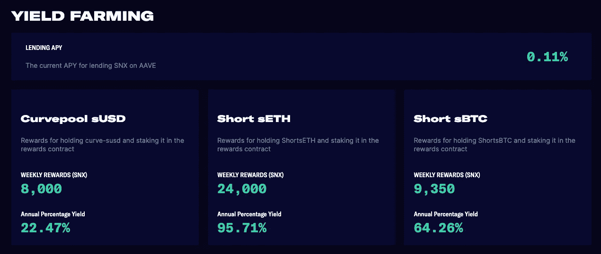

衍生品的一个重要用途是做空一项资产，即试图从一项资产即将下跌中获利。

另一个有用的合成工具是指数，它允许投资者将风险分散到指数中的所有资产上。

# 产量农场聚合器

一个相对较新的现象——收益农业，允许对投资资产收取收益(利息、回报)。集合器是一种协议/网站，允许投资者投资多种资产并从多种来源获得收益流，从而分散风险。

一个常见的收益率农场是让你存放一对流动性池(LP)令牌的农场，例如 ETH 和 USDC。通过“押注”你的代币，你的流动性变得更有粘性，类似于货币市场账户上的长期存款。(你仍然可以立即取出你的钱，但留在里面是一个很大的激励。)

以太坊中最著名的收益聚合器是 earning . finance。所有的收益聚合器都依赖于本文前面讨论的组件。因此，举例来说，一个农场可能会拿着你的 ETH，投资于收益率最高的借贷平台，如果收益率发生变化，每天都会发生变化。

# 币安智能连锁

币安智能链在很多方面都是以太坊的克隆。它是由大型中央加密交易所币安创建的。区块链的节点数量远低于以太坊，因此许多人将 BSC 称为“CeDeFi”，即集中式 DeFi。

币安智能链上的许多项目与以太坊上的项目非常相似，许多项目公开承认他们派生了相应的以太坊协议，并进行了一些小的修改。例如，[省略号](https://docs.ellipsis.finance/how-to-earn-eps)就是一个被认可的曲线分叉。奇怪的是，BSC 上的项目通常是匿名的，而以太坊上的项目在管理和团队方面非常开放和公开。

为了使用币安智能链，投资者可以使用与以太坊相同的钱包软件，例如 [Metamask](https://metamask.io/) ，但交易成本只是以太坊成本的一小部分，交易在几秒钟内完成，而不是几分钟。原生币为 [BNB](https://www.coingecko.com/en/coins/binance-coin) ，2021 年 4 月 7 日创历史新高。

因此，币安智能连锁吸引了许多散户投资者，他们受固定交易费用(“燃气”)的影响更大。在 BSC 上投资 1000 美元在 3 个不同的农场是完全可行的，而在以太坊的一个项目上投资 1000 美元是不可行的。

Pancakeswap，相当于 Uniswap，在 BSC 上的交易很活跃。不幸的是，该团队几周来未能修复数据同步问题，因此这里显示的是过时的数据。

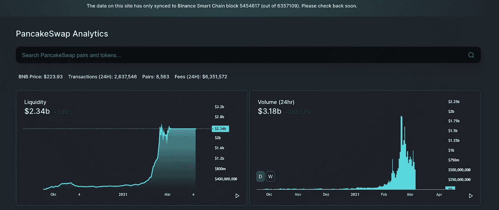

坦白地说，我对 PancakeSwap 侥幸逃脱感到困惑。根据最新的统计数据，他们的交易量为 5 亿美元，而 Uniswap 的交易量为 12 亿美元。根据这一[数据聚合器](https://defillama.com/protocols/dexes)的数据，目前 PancakeSwap 的流动性池价值为 66 亿美元，Uniswap 为 79 亿美元。

类似于 Compound 的一个借贷协议是 Venus。是 Compound 和 Aave 之后的#3(都以以太坊为主)。

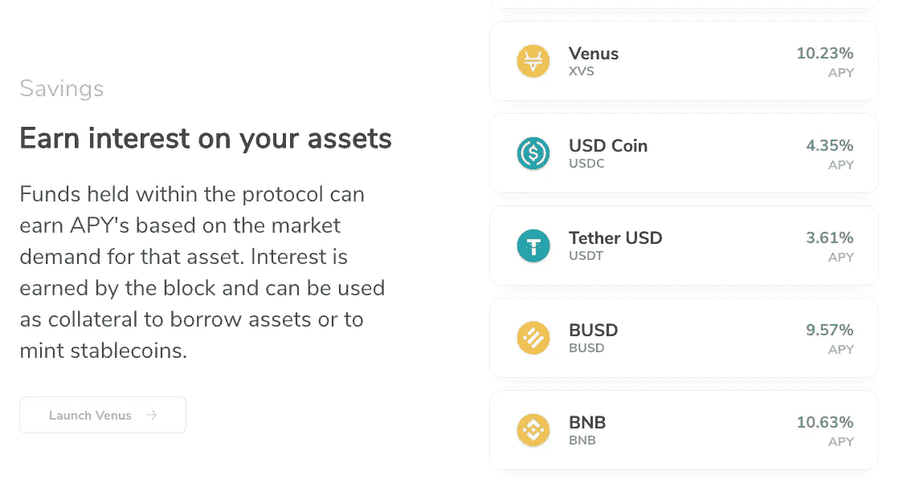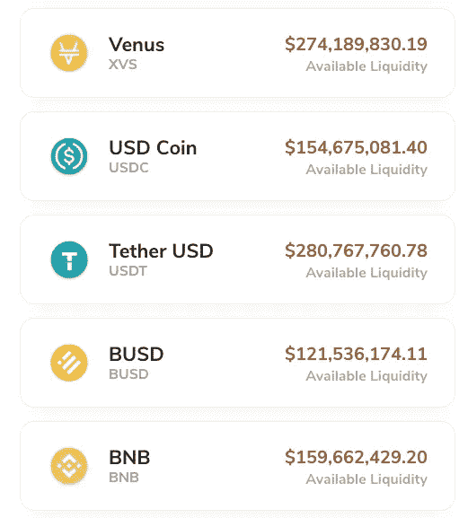

Liquidity on Venus

Venus 上的 stablecoins 存款利率目前低于 Aave。由于利率可能每分钟都在变化，这应该被视为一个数据点。

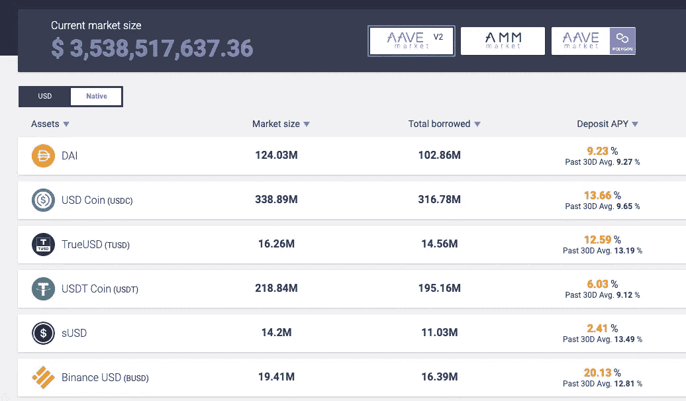

一些产量农场以他们自己的农场(“治理”)令牌支付利息，因此年度百分比产量(APYs)需要有所保留。例如，金星(XVS)的价格可能下跌，使得 XVS 的利息支付价值降低。

我在币安智能链上首选的收益聚合器是 [autofarm](https://autofarm.network/) 。不幸的是，autofarm 背后的开发者是匿名的。尽管如此，autofarm 已经累计锁定了 14 亿美元的总价值。

查看 USDC 农场的详细资料，我们看到农场本身的 APY 为 6%，通过每日复利略有改善，但大部分 APY 来自农场 token AUTO，当收获季节到来时，它可能值也可能值不了。

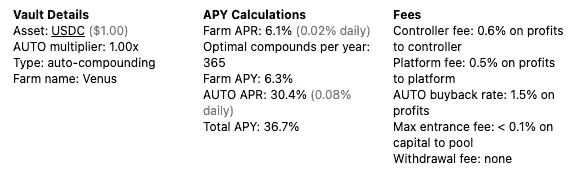

USDC vault on autofarm 2021–04–07

Autofarm 使用金星投资你的 USDC，出售 XVS 奖励，再投资，并铸造“免费”汽车奖励你。如果你想卖掉你的汽车，谁会向你买呢？答案是:对经营汽车农场感兴趣的人，正如你可能已经猜到的，汽车农场正在支付相当疯狂的收益。

鼓励投资者将他们的汽车投入这个农场，以保持价格上涨和流动性充足。

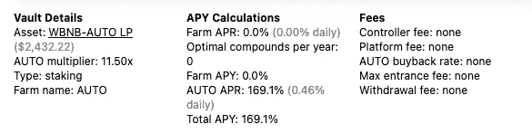

BNB/AUTO farm

WBNB 被“包裹”在 BNB，实际上和 BNB 一样。(像纸币或硬币中的 5，仍然是 5)

请注意，为了“下注”您的汽车，您还需要提供 BNB。换句话说，你获得了高收益，以补偿你失去一些 BNB 的风险，并获得更多潜在价值不那么高的汽车。(这叫无常失，很多文章别处都有。)

合成资产由 Linear 提供。与 Synthetix 类似，投资者需要让 LINA 持有ℓUSD 造币厂的股份，然后他们可以用这些股份交易其他“流动”资产。在线性平台中，你可以找到一个交易这些东西的交易所，一个借贷/抵押页面，在这里你可以抵押你的 LINA(抵押品)，并将资产发送到以太坊。(现在只有 LINA 住在以太坊上)

我对 LINA 最大的担心是有点固执的断言，即 1 ℓUSD = 1 美元，这在目前来说是不正确的。

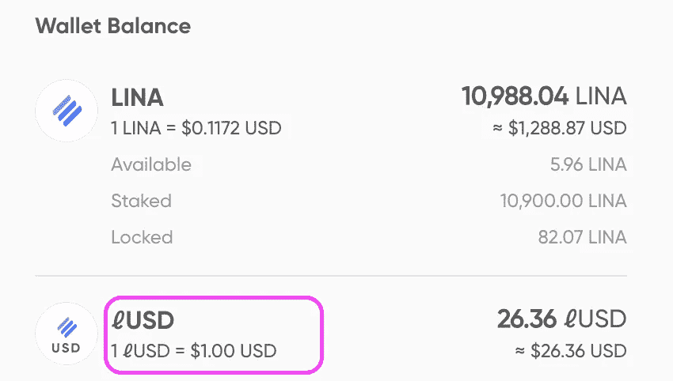

币安智能链条的概述到此结束，现在让我们看看小型链条有哪些替代产品。

# 土地

Terra 是建立在宇宙之上的区块链。就像以太坊的所有其他替代品一样，交易既快又便宜。有两个本地令牌:露娜和 UST。UST 是一种与美元挂钩的稳定货币，用于支付交易费用。月神可以用来铸造 UST。这类似于在合成纤维上用 SNX 制造 sUSD。Terra 也是我所知道的唯一一个提供亚洲 stablecoins 的平台。

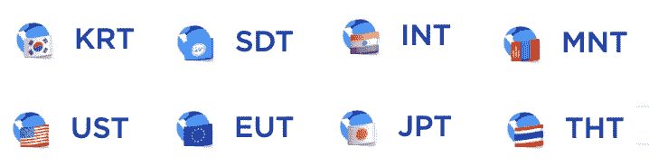

Stablecoins on Terra

我还没有找到可能使用特别提款权的联合国官员和秘密投资者之间的交集。显然，蒙古 stablecoins 为蒙古密码爱好者提供了无银行的银行服务。这是 Terra 说的:

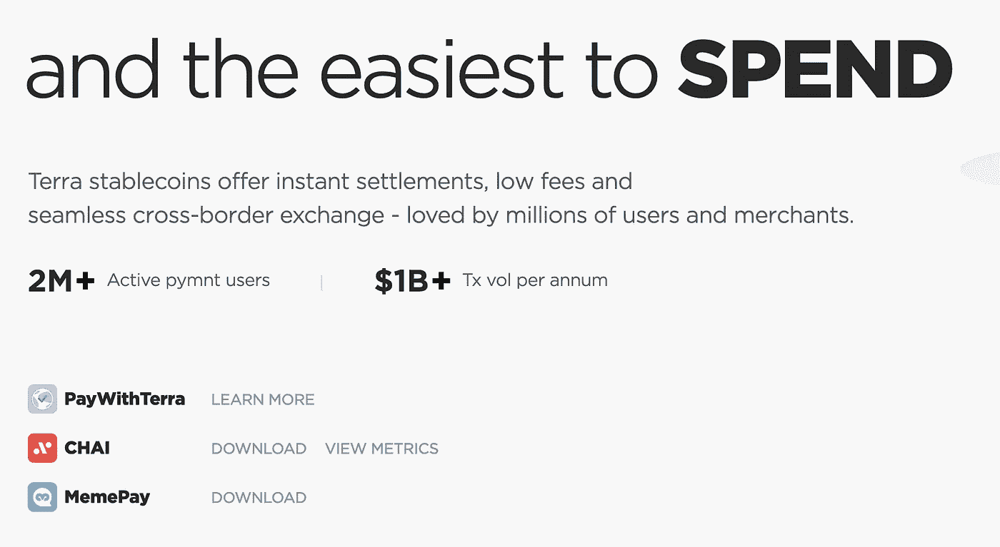

terra.money

Terra 的贷款协议是 Anchor(存款:1.62 亿美元)。目前，唯一接受的抵押品是原生令牌 LUNA。你可以借用 UST，然后用它来交换 terra 系统中的其他硬币。最有趣的是 Mirror 提供的合成资产。(镜像也提供以太坊上的 m 资产。)

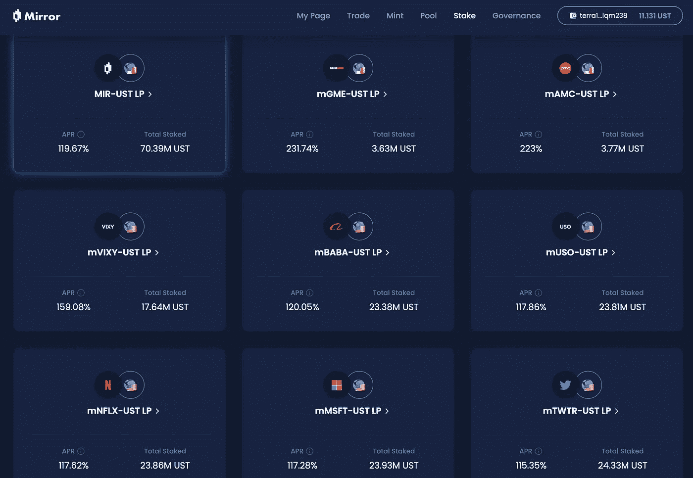

9 of the 22 Liquidity Pools, showing mAssets

Mirror 为投资者提供了全天候交易合成股票和指数(例如 VIXY)的能力，这种交易方式无需许可，也无需信任。由于许多科技股无论如何都不支付股息，交易这种合成资产提供了同样的效用。

14 个相同的群体可以在以太坊上交易，币安智能链上也有类似的数字。Terra 是本地镜像网络，流动性最高。根据谷歌金融(Google Finance)的数据，过去 24 小时内，传统证券交易所的交易量为 388 万股。terra 的市值为 2400 亿美元，这个数字很小，但作为一个绝对数字，却并非微不足道。一个更准确的分析可能还包括传统金融领域的网飞衍生品。

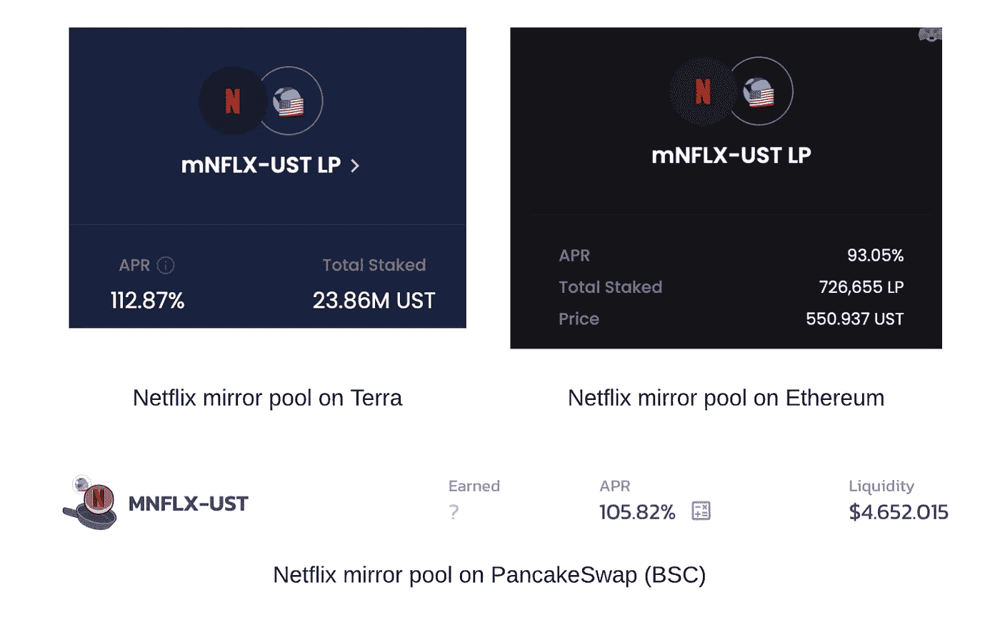

Comparing liquidity for mNFLX on different chains

Terra 似乎仍然缺少的是一个帮助投资者分配资金的收益率聚合器。

# 多边形

多边形是以太坊的第二层(L2)扩展。交易在多边形链上快速而便宜地完成，并且只在以太坊上被概要地记录。(简体。)

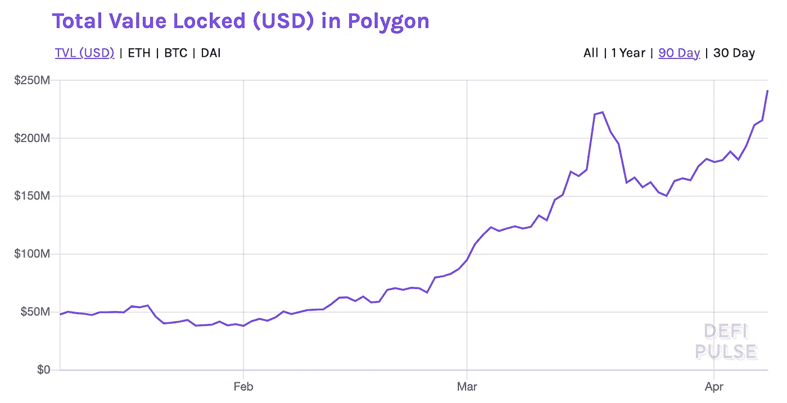

如今有近 2.5 亿美元被锁定在 Polygon 中，使用 Quickswap 感觉就像 Uniswap 或 PancakeSwap。同样，任何人都可以向资金池中添加流动性，并开始收取交易费用。根据 LP 分析聚合器( [LiquidityFolio](https://www.liquidityfolio.com/invite/c414de0a5fef458db809aabef069222e) )，超过 100%的 apy 是可用的:

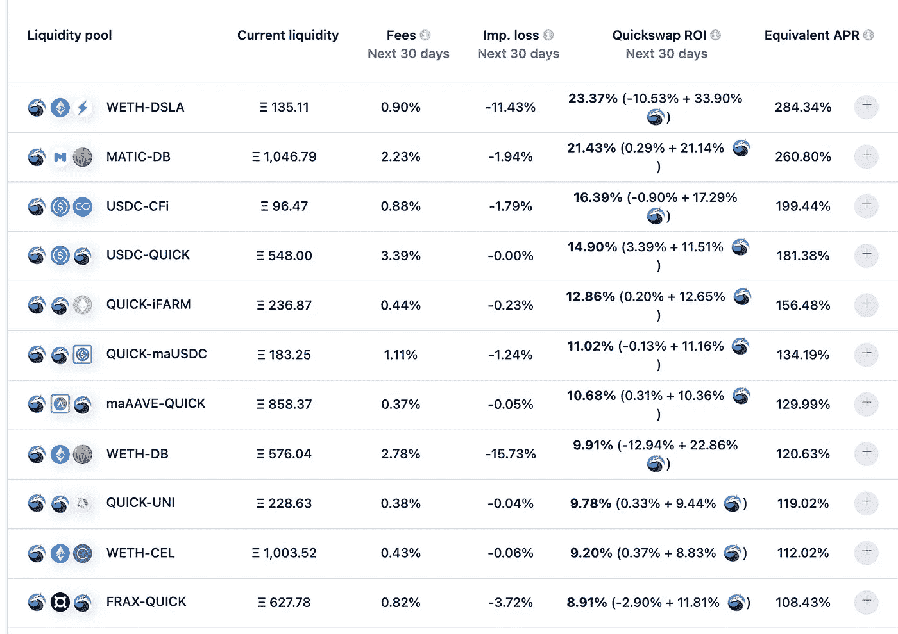

再次提醒读者，未来的 apy 通常是推测的，奖励以农场代币支付，例如 QUICK。

贷款协议 Aave 也已开始提供 Polygon，但仍处于早期阶段，你可以通过查看流动性来了解这一点。

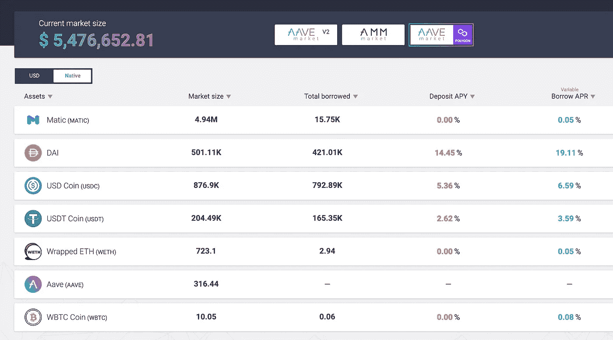

Polygon lending pools on Aave (2021–04–08)

看起来 Polygon 正在获得一些牵引力，但只有当我们看到像以太坊和币安智能链这样的完整的 DeFi 组件时，它才会起飞。

# 雪崩

Avalance 有自己的主网，就像 terra 一样，你得到的钱包地址不符合以太坊标准。本机令牌是 Avax。Avalance 网络使用不同的链(X，P，C ),这使得它比讨论的其他链稍微复杂一些。

快速浏览一下 Pangolin (DEX)的仪表盘，就可以发现交易量最大的资产。

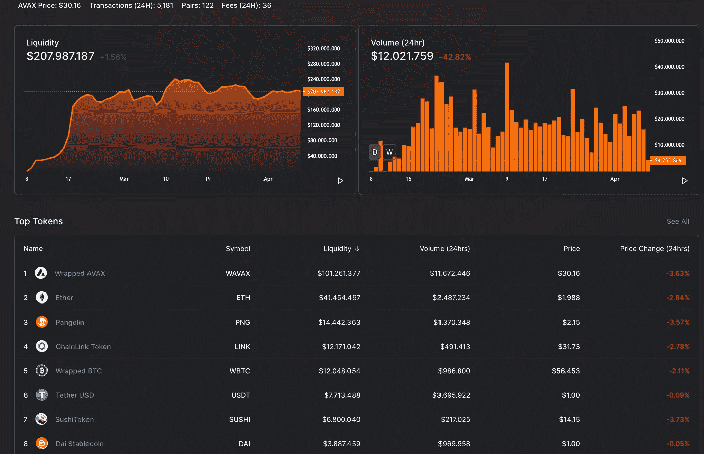

Dashboard with Stats for Pangolin (2021–04–08)

本地令牌 Avax 排在第一位，后面是 ETH。穿山甲的 PNG 治理令牌是#3。链环、WBTC 和寿司是以太坊 DeFi 空间的顶级代币，USDT 是顶级稳定币。以太坊(Ethereum)制造商的 stablecoin 戴名列第八。

交易最多的前 5 对给出了 Avalanche 上其他相关令牌的指示。

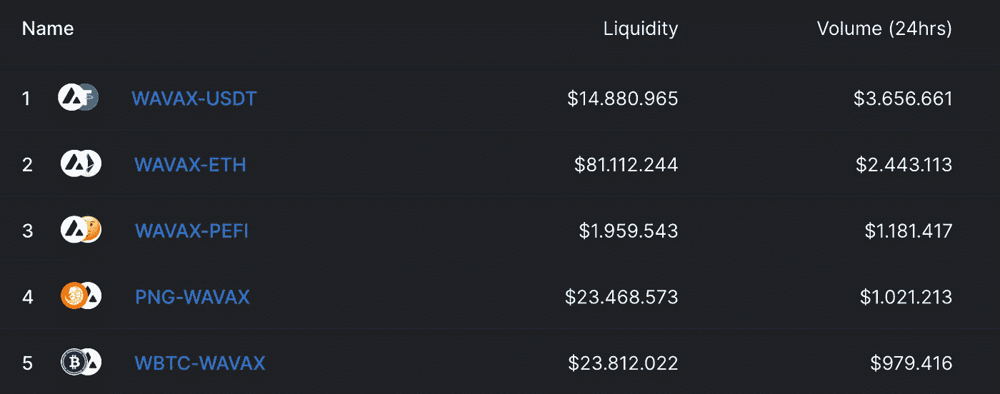

如上所述，一个尚未标识的令牌，PEFI，已经暂时征服了列表中的头把交椅。属于企鹅金融，前几天才在 [Coingecko](https://www.coingecko.com/en/coins/penguin-finance) 上市。

Sid note:雪崩在[红色代币](https://www.coingecko.com/en/categories/red)排行榜中排名第二，这似乎是 Coingecko 开的愚人节玩笑。

就像所有其他指数一样，很容易将一对代币添加到流动性池并开始赚取费用，尽管我找不到一个简单的概述页面来显示当前的 apy。穿山甲将自己定位为比其他指数更少商业，更多社区驱动。也许社区会给我指出合适的产量农业网页。

# 结论

DeFi 正在迅速发展，如今以太坊有几种替代方案。找到一个最适合你的，希望这篇博文能提供一些数据和论文。

# 注释和免责声明

1.  这不是投资建议(crypto 的每个人似乎都对 CYA 这么说)
2.  如果不做一些简化和省略，就不可能呈现这个作品。
3.  我是一个密码爱好者，我不从事该行业(也许有一天)
4.  这篇博客写于 2021 年 4 月。如果你在两周后读到这篇文章，情况可能已经发生了巨大的变化。在做重要决定之前，一定要做好自己的研究。

# 附录

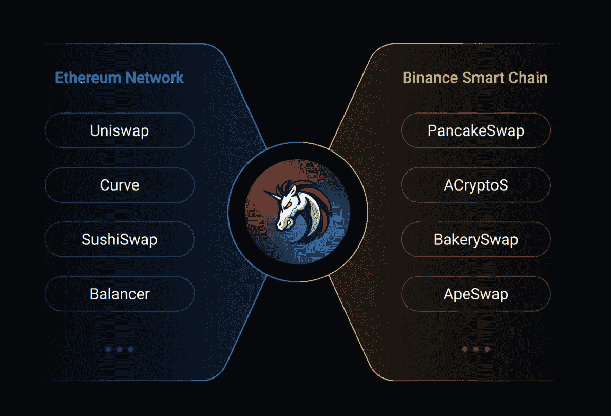

1Inch Exchange, one of the few players straddling Ethereum and BSC

对于加密领域的新手来说，对一些项目名称皱眉头是可以理解的！

# 我的一些消息来源

博文中也有可点击的链接。

 [## CoinGecko:加密货币价格和市值

### 获取加密货币价格、市场概况和分析，如加密市值、交易量等。

www.coingecko.com](https://www.coingecko.com/en)  [## 加密研究、数据和工具

### 借助专业级数据、工具和研究，在加密市场中获得优势。

梅萨里·io](https://messari.io/) 

> 加入 Coinmonks [Telegram group](https://t.me/joinchat/PmKOYQ9NNKZlZGNl) 学习加密交易和投资

## 另外，阅读

*   [什么是融资融券交易](https://blog.coincodecap.com/margin-trading) | [成本平均法](https://blog.coincodecap.com/dca)
*   最好的[加密交易机器人](/coinmonks/crypto-trading-bot-c2ffce8acb2a) | [网格交易机器人](https://blog.coincodecap.com/grid-trading)
*   [3 商业评论](/coinmonks/3commas-review-an-excellent-crypto-trading-bot-2020-1313a58bec92) | [Pionex 评论](/coinmonks/pionex-review-exchange-with-crypto-trading-bot-1e459d0191ea) | [Coinrule 评论](/coinmonks/coinrule-review-2021-a-beginner-friendly-crypto-trading-bot-daf0504848ba)
*   [AAX 交易所评论](/coinmonks/aax-exchange-review-2021-67c5ea09330c) | [德里比特评论](/coinmonks/deribit-review-options-fees-apis-and-testnet-2ca16c4bbdb2) | [FTX 交易所评论](/coinmonks/ftx-crypto-exchange-review-53664ac1198f)
*   [n 平均零点评审](/coinmonks/ngrave-zero-review-c465cf8307fc) | [Phemex 评审](/coinmonks/phemex-review-4cfba0b49e28) | [PrimeXBT 评审](/coinmonks/primexbt-review-88e0815be858)
*   [by bit Exchange Review](/coinmonks/bybit-exchange-review-dbd570019b71)|[bit yard Review](/coinmonks/bityard-review-7d104239be35)|[coin spot Review](https://blog.coincodecap.com/coinspot-review)
*   [3 commas vs crypto hopper](/coinmonks/3commas-vs-pionex-vs-cryptohopper-best-crypto-bot-6a98d2baa203)|[赚取秘密利息](/coinmonks/earn-crypto-interest-b10b810fdda3)
*   最好的比特币[硬件钱包](/coinmonks/the-best-cryptocurrency-hardware-wallets-of-2020-e28b1c124069?source=friends_link&sk=324dd9ff8556ab578d71e7ad7658ad7c) | [BitBox02 回顾](/coinmonks/bitbox02-review-your-swiss-bitcoin-hardware-wallet-c36c88fff29)
*   [莱杰 vs n rave](/coinmonks/ledger-vs-ngrave-zero-7e40f0c1d694)|[莱杰 nano s vs x](/coinmonks/ledger-nano-s-vs-x-battery-hardware-price-storage-59a6663fe3b0) | [币安评论](/coinmonks/binance-review-ee10d3bf3b6e)
*   [加密复制交易平台](/coinmonks/top-10-crypto-copy-trading-platforms-for-beginners-d0c37c7d698c) | [Coinmama 评论](/coinmonks/coinmama-review-ace5641bde6e)
*   [CoinLoan 评论](/coinmonks/coinloan-review-18128b9badc4) | [YouHodler 评论](/coinmonks/youhodler-4-easy-ways-to-make-money-98969b9689f2) | [BlockFi 评论](/coinmonks/blockfi-review-53096053c097)
*   最好的[加密税务软件](/coinmonks/best-crypto-tax-tool-for-my-money-72d4b430816b) | [硬币追踪评论](/coinmonks/cointracking-review-a-reliable-cryptocurrency-tax-software-5114e3eb5737)
*   最佳[密码借贷平台](/coinmonks/top-5-crypto-lending-platforms-in-2020-that-you-need-to-know-a1b675cec3fa) | [杠杆令牌](/coinmonks/leveraged-token-3f5257808b22)
*   [block fi vs Celsius](/coinmonks/blockfi-vs-celsius-vs-hodlnaut-8a1cc8c26630)|[Hodlnaut 审核](/coinmonks/hodlnaut-review-best-way-to-hodl-is-to-earn-interest-on-your-bitcoin-6658a8c19edf) | [KuCoin 审核](https://blog.coincodecap.com/kucoin-review)
*   [Bitsgap 审查](/coinmonks/bitsgap-review-a-crypto-trading-bot-that-makes-easy-money-a5d88a336df2) | [Quadency 审查](/coinmonks/quadency-review-a-crypto-trading-automation-platform-3068eaa374e1) | [Bitbns 审查](/coinmonks/bitbns-review-38256a07e161)
*   [埃利帕尔泰坦评论](/coinmonks/ellipal-titan-review-85e9071dd029) | [赛克斯斯通评论](/coinmonks/secux-stone-hardware-wallet-review-15-discount-coupon-2020-7577032faa6e)
*   [本地比特币评论](/coinmonks/localbitcoins-review-6cc001c6ed56) | [加密货币储蓄账户](https://blog.coincodecap.com/cryptocurrency-savings-accounts)
*   最佳[区块链分析](https://bitquery.io/blog/best-blockchain-analysis-tools-and-software)工具| [赚比特币](/coinmonks/earn-bitcoin-6e8bd3c592d9)
*   [加密套利](/coinmonks/crypto-arbitrage-guide-how-to-make-money-as-a-beginner-62bfe5c868f6)指南| [如何做空比特币](/coinmonks/how-to-short-bitcoin-568a2d0b4ae5)
*   最佳[加密制图工具](/coinmonks/what-are-the-best-charting-platforms-for-cryptocurrency-trading-85aade584d80) | [最佳加密交易所](/coinmonks/crypto-exchange-dd2f9d6f3769)
*   [如何在印度购买比特币？](/coinmonks/buy-bitcoin-in-india-feb50ddfef94) | [瓦济克斯评论](/coinmonks/wazirx-review-5c811b074f5b)
*   [印度比特币交易所](/coinmonks/bitcoin-exchange-in-india-7f1fe79715c9) | [比特币储蓄账户](/coinmonks/bitcoin-savings-account-e65b13f92451)
*   [CoinDCX 点评](/coinmonks/coindcx-review-8444db3621a2) | [加密保证金交易交易所](https://blog.coincodecap.com/crypto-margin-trading-exchanges)