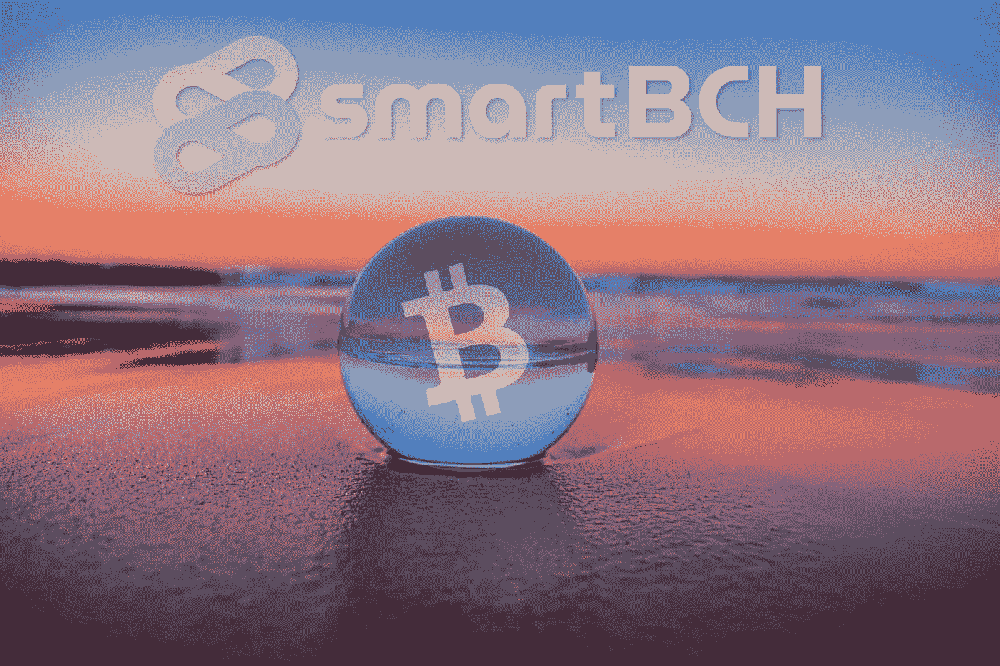

# 智能比特币现金的新境界

> 原文：<https://medium.com/coinmonks/new-horizons-for-bitcoin-cash-with-smartbch-3717192e2619?source=collection_archive---------7----------------------->

加密货币空间经常被扭曲，无数的项目正在努力在安全环境下的可扩展性和去中心化的所有冲突特征之间取得平衡。

作为一个新的网络，smartBCH 还为时尚早。

任何开始都是困难的，尤其是在竞争激烈的时候。随着时间的推移和成熟，smartBCH 网络将克服任何困难。

众所周知，分散式交易所(dex)起源于以太坊区块链。

第一种 DEX 方法类似于集中式交换。像 Etherdelta 和 fork delta 这样的 dex 只提供了一种简单的方法，在一个 ERC20 令牌上列出一个购买/销售订单，或者在一个分散的环境中完成现有的订单。

DeFi 是 2018 年某个时候出现的一个术语。然而，这并不像许多人认为的那样只是一个朗朗上口的术语。在 ICO 惨败后，加密社区对每个新术语都持怀疑态度。

然而，DeFi 和 dex 发展并达到了这种金融技术应有的受欢迎程度。

当然，smartBCH 不像其他网络那样被大肆宣传，但这不是短期承诺，相反，它是一个与比特币现金合作的项目，具有长期愿景。

# 随着时间的推移，智能将会实现

SmartBCH 有所增长，被适度采用，最终大玩家会加入。今天的竞争太激烈了，投资也太无知了。有一种特定的营销机器致力于“泵送”选定的加密货币，以满足该领域少数特定个人的目标和注意力。

今天有许多以太坊的复制品存在，它们都在竞争并被推销为下一个以太坊杀手。然而，从目前的前 20 名来看，不包括 BTC、瑞士联邦理工学院和 stablecoins，如果其他项目在 3-5 年后仍然存在，我会感到惊讶。

这种炒作不会像 2017 年的上一次那样持续下去。

我们今天看到了 Cardano、Polkadot、Luna、Avalance 和 Solana 的炒作，但 2017 年 Tron、EOS、XVG、IOTA 和许多其他公司也是如此。也许这些项目中的一些会成功，但仍然需要更多的时间。创新是重要的，然而，上述项目迄今为止收效甚微，不能被视为投资者的优先事项。

DeFi 在 2019-2020 年才开始爆发，当时第一批有趣的开发项目已经准备就绪，只吸引了一小部分人。以太坊当时并没有遭遇高额费用和网络拥塞，但只有少数人使用它。在某些时候，甚至 0.5 gwei 的交易也会在几分钟内被挖掘和广播。

自 2017 年以来，NFT 也在那里。这是第一次意识到以太坊的可扩展性问题。在 NFTs 的初始阶段，Cryptokitties 使以太坊网络崩溃。

NFT 油田花了几年时间才再次扩张。甚至在 2017 年牛市结束之前，人们就对 Crypto Kitties 失去了兴趣。

比特币现金目前在与 BTC 的交易中亏损。一个有趣的事实是，图表显示熊市持续了近两年。与此同时，与图表相反的是，比特币现金的使用正在快速增长。

SmartBCH 可以扭转这一趋势，但它需要时间，也需要在令牌化目的和效用上采取不同的方法。以太坊不仅仅是 ERC20 代币，各种项目后来都移植到他们的区块链 EOS，Tron，BNB 就是一些例子。有些项目是有远见的，即使有些后来失去了远见。

在很大程度上，比特币现金社区是以结果为导向的，并被大规模采用。当然，在解释 smartBCH 的优势方面，曝光和营销很重要，但这也需要专业的方法。

最大化采用努力和观察用户群增长的长期效果将最终增加需求。

2014 年至 2016 年期间，比特币社区处于一种可怕的状态。商家的采用正在增加，但与此同时，社区中不希望比特币扩大规模的那部分人对此感到沮丧。

如今，比特币现金的情况有了很大的不同，尽管 BTC 最大化主义者也一直在进行公关战，通常会吸引所有的注意力。

比特币现金需要一定的人群，它有几个质量最高的。它需要保持相关性，今天有许多帮助。如果 10%保持不变，那也很好，然而，我不认为任何人没有注意到这种潜力。

它需要更多的时间来说服市场，我们都在以这样或那样的方式尽自己的一份力量来确保其竞争力。关键是在困难时期不要气馁，以及在价格行动有利于比特币现金时保持脚踏实地。

Writing at the following websites: ● [ReadCash](https://read.cash/@Pantera) ● [NoiseCash](https://noise.cash/u/Pantera99) ● [Medium](/@panterabch) ● [Hive](https://hive.blog/@pantera1) ● [Steemit](https://steemit.com/@pantera1) ●[Vocal](https://vocal.media/authors/pantera) ● [Minds](https://www.minds.com/pantera99/) ● [Twitter](https://twitter.com/Panterabch) ● [LinkedIn](https://www.linkedin.com/in/panterabch/) ● [email](https://read.cash/@Pantera/localcryptos-p2p-exchange-is-now-offering-bitcoin-cash-trading-06637230#bad-link)

> **免责声明**:本内容发布的所有材料均用于娱乐和教育目的，并符合**公平使用准则**。无意侵犯版权。如果您是或代表本文所用材料的版权所有者，并且对所述材料的使用有疑问，请发送 [**电子邮件**](https://read.cash/@Pantera/cryptouknowns-battlegrounds-the-crypto-battle-royal-part-i-0ca762da#bad-link) 。

***支持内容创作者。***

如果你喜欢这个故事，就订阅吧！

*最初发布于*[*https://read . cash*](https://read.cash/@Pantera/new-horizons-for-bitcoin-cash-with-smartbch-68f8c5a0)*。*

> 加入 Coinmonks [电报频道](https://t.me/coincodecap)和 [Youtube 频道](https://www.youtube.com/c/coinmonks/videos)了解加密交易和投资

## 也阅读

 [## 杠杆代币[多头代币]终极指南

### 杠杆化令牌是具有杠杆化风险敞口的 ERC20 令牌，不考虑保证金、要求、管理…

medium.com](/coinmonks/leveraged-token-3f5257808b22)  [## 最佳加密交易所| 2021 年十大加密货币交易所

### 加密货币交易所的加密交易需要了解市场，这可以帮助你获得利润。之前…

blog.coincodecap.com](https://blog.coincodecap.com/crypto-exchange)  [## 2021 年最佳加密交换平台| CoinCodeCap

### 如果我们看看今天的场景，许多加密货币交换平台提供了广泛的功能和深度…

blog.coincodecap.com](https://blog.coincodecap.com/best-swap-platforms)  [## 2021 年最佳加密借贷平台| 6 大比特币借贷平台

### 获得比特币和其他加密货币的最佳贷款利率

medium.com](/coinmonks/top-5-crypto-lending-platforms-in-2020-that-you-need-to-know-a1b675cec3fa)  [## 2021 年最佳免费加密交易机器人

### 2021 年币安、比特币基地、库币和其他密码交易所的最佳密码交易机器人。四进制，位间隙…

medium.com](/coinmonks/crypto-trading-bot-c2ffce8acb2a)  [## 最佳 4 个加密交易信号电报通道

### 这是乏味的找到正确的加密交易信号提供商。因此，在本文中，我们将讨论最好的…

medium.com](/coinmonks/best-crypto-signals-telegram-5785cdbc4b2b)  [## 获取信号、交易机器人和套利

### 在本文中，我们将讨论 bits gap——一个满足您所有交易需求的一站式加密交易平台…

blog.coincodecap.com](https://blog.coincodecap.com/bitsgap-review)  [## 40 个最佳电报频道，用于加密、电影、表演和演讲| CoinCodeCap

### 随着我们周围无限的信息，我们很难筛选和了解有价值的信息。电报有…

blog.coincodecap.com](https://blog.coincodecap.com/best-telegram-channels)  [## 仙境提供了 83，412%的 APY 赌注:仙境是一个骗局吗？CoinCodeCap

### 仙境是雪崩网络的第一个基于时间令牌的分散储备货币协议。一篮子…

blog.coincodecap.com](https://blog.coincodecap.com/wonderland-offers-an-83412-apy-on-staking-is-wonderland-a-scam)  [## 天秤座货币——脸书的加密货币

### 自 2018 年马克·扎克伯格决定致力于改善区块链以来，关于天秤座货币的传言就一直存在…

blog.coincodecap.com](https://blog.coincodecap.com/libra-currency-a-cryptocurrency-by-facebook)