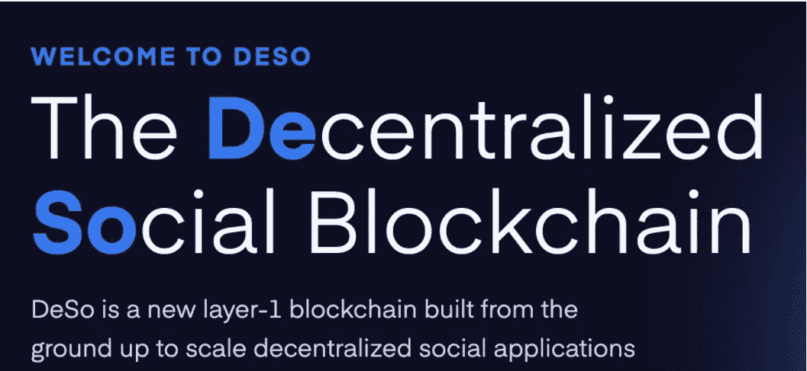

# 新社交网络探索:a16z 和红杉青睐 DeSo 怎么办？

> 原文：<https://medium.com/coinmonks/new-social-network-exploration-a16z-and-sequoia-favored-deso-what-to-do-93a5757cdbac?source=collection_archive---------3----------------------->

> 从架构上看，DeSO 就像是 Web 2.0 社交网络和区块链的结合体，而更令人期待的加密时代原生社交网络还没有出现。

# 人们对 Web 2.0 社交网络不满意

人们对 Web 2.0 时代的社交网络的不满，主要集中在这些社交网络的绝对统治地位造成的不平衡。由于互联网时代赢者通吃，胜出的社交网络拥有绝对的统治力，导致社交网络平台与第三方开发者和用户之间的关系完全失衡。
比如社交网络平台看到第三方开发者的项目发展良好，就会倾向于自己开发，支持内部项目的发展。最极端的情况是把第三方开发者的项目踢出去。由于这种不平衡，第三方开发者或基于平台的内容创作者获得的利益与平台不成比例。
另外，目前社交网络主导其推送算法。它会控制人的信息流，按照广告利益最大化来优化，不一定完全满足用户的需求或兴趣。同时平台有用户产生的数据，用户无法控制自己的数据。
总之，Web 2.0 时代的社交网络相对封闭且不平衡，人们追求的是一种开放的社交网络形式。这是下一代社交网络发展的驱动力。

> 订阅 [**Coinmonks Youtube 频道**](https://www.youtube.com/c/coinmonks/videos) 获取每日加密新闻。

# 人们对 Web 3.0 社交网络的探索从未停止

随着区块链的出现，从 BTC 的探索到德菲和 NFT 的逐渐发展，人们看到了基于区块链的新的可能性，带来了一些范式的改变，可以重塑一些传统行业。
关于社交网络的重构，开发者的探索从未停止。此前，block . one(EOS 的项目方)发起了“语音”项目，试图探索基于区块链的社交网络之路。目前没有取得重大进展。这只是一个案例，还有更多探索。
如今，DeSO 也开始进入这个赛道，并为此打造了 DeSO 区块链。会带来新的变化吗？

# 德索的社交网络区块链推出

DeSO 是一个专门为建立社交网络而推出的区块链，DeSO 社交网络就是建立在这个基础上的。
前几天 DeSO 推出，在加密界并没有引起太多关注。一个原因是，在这个阶段，它更多的是一种自上而下的模式。据其官网介绍，其支持者几乎都是顶级加密机构，包括 coinbase、a16z、polychain、parafi、潘迪拉、红杉、social capital 等但是，在早期，在加密领域，自底向上的模型往往更容易得到社区的关注。
德索区块链的创始人是纳德，原 basis 项目的创始人(原 basis 项目因监管原因被放弃。后来在 defi 的发展过程中，社会上有人自发发起了类似 basis 的项目)。

# 德索在做什么

如前所述，当前 Web 2.0 时代的社交网络数据是封闭的，这就导致了护城河的强大和垄断的局面，不利于开发者的创新和生态的进一步发展。开发者开始思考这样一个问题:有没有机会建立一个开放的社交网络生态？在这个社交网络中，根据它自身的开放性有多少，任何人都可以基于它的数据开发出符合用户需求的应用。而且，这样的开发不需要许可，也不用担心被砍掉。
这不仅是 DeSO 的需求，也是 Web 3.0 时代所有社交网络的需求。
为了建立一个数据开放的社交网络，DeSO 从建立区块链开始。当然，这也是因为目前区块链的可扩展性无法承受社交网络的高交互需求。
根据 DeSo 的介绍，其长期目标是建立一个开放的数据社交网络。它有一个独立的区块链平台，类似于比特币，但吞吐量更大，在节点和用户信息(个人数据、帖子、关注关系、奖励、NFT 等)上运行代码。)所有数据都存储在公共区块链上。任何用户都可以通过运行节点来发布内容。例如，ESPN 可以在 DeSo 上运行节点，为用户提供体育内容。第三方开发者在为用户提供内容的同时，可以根据用户自定义的用户界面和推送算法，向用户展示不同于当前社交网络的内容。
这里没有独一无二的垄断。因为数据是开放的，基于现有的数据，其他开发者可以随时建立新的社交网络，这将激活社交网络的竞争，打破数据护城河的垄断。
目前，基于自己的区块链，DeSO 构建的社交网络和传统社交网络一样，可以发帖、评论、喜欢、关注他人。它的主要区别在于它在区块链上运行，没有许可和开放性。此外，它还引入了 token economy，这是除了它自己的原生 token DeSO 之外最重要的，所以需要的是引入它的默认创建者 token。

# 德索的创造者令牌

在 DeSO 的默认系统下，每个用户都有自己的创建者令牌，这个令牌是在创建个人数据时自动生成的。价格会根据用户的购买而上涨，随着销售而下降。创造者令牌通过 DeSO 的原生令牌购买，DeSO 令牌总供应量约 1080 万。如果粉丝对某个创作者感兴趣，他们可以购买他们的代币。这相当于个人影响力的信物。DeSo 相当于个人社会化代币市场的建设。这必然会带来投机和泡沫。在 Mask 还没有正式进入 DeSo 的时候，他的个人令牌就已经流通了 315.4339(写蓝狐笔记的时候)。，总价值 376.6 万美元(用户购买马斯克代币后锁定的资金)，其个人市值达到 1129.9 万美元。

## 另外，阅读

*   [新加坡十大最佳加密交易所](https://blog.coincodecap.com/crypto-exchange-in-singapore) | [收购 AXS](https://blog.coincodecap.com/buy-axs-token)
*   [投资印度的最佳加密软件](https://blog.coincodecap.com/best-crypto-to-invest-in-india-in-2021) | [WazirX P2P](https://blog.coincodecap.com/wazirx-p2p)
*   [7 个最佳零费用加密交换平台](https://blog.coincodecap.com/zero-fee-crypto-exchanges)
*   [分散交易所](https://blog.coincodecap.com/what-are-decentralized-exchanges) | [比特 FIP](https://blog.coincodecap.com/bitbns-fip)
*   [用信用卡购买密码的 10 个最佳地点](https://blog.coincodecap.com/buy-crypto-with-credit-card)
*   [加拿大最佳加密交易机器人](https://blog.coincodecap.com/5-best-crypto-trading-bots-in-canada) | [Bybit vs 币安](https://blog.coincodecap.com/bybit-binance-moonxbt)
*   [用于 Huobi 的加密交易信号](https://blog.coincodecap.com/huobi-crypto-trading-signals) | [Swapzone 审查](/coinmonks/swapzone-review-crypto-exchange-data-aggregator-e0ad78e55ed7)
*   最佳[密码交易机器人](https://blog.coincodecap.com/best-crypto-trading-bots) | [购买索拉纳](https://blog.coincodecap.com/buy-solana) | [矩阵导出审查](https://blog.coincodecap.com/matrixport-review)
*   [Coldcard 评论](https://blog.coincodecap.com/coldcard-review) | [BOXtradEX 评论](https://blog.coincodecap.com/boxtradex-review)|[uni swap 指南](https://blog.coincodecap.com/uniswap)
*   [阿联酋 5 大最佳加密交易所](https://blog.coincodecap.com/best-crypto-exchanges-in-uae) | [SimpleSwap 评论](https://blog.coincodecap.com/simpleswap-review)
*   购买 Dogecoin 的 7 种最佳方式
*   [最佳期货交易信号](https://blog.coincodecap.com/futures-trading-signals) | [流动性交易所评论](https://blog.coincodecap.com/liquid-exchange-review)
*   [3 商业评论](/coinmonks/3commas-review-an-excellent-crypto-trading-bot-2020-1313a58bec92) | [Pionex 评论](https://blog.coincodecap.com/pionex-review-exchange-with-crypto-trading-bot) | [Coinrule 评论](/coinmonks/coinrule-review-2021-a-beginner-friendly-crypto-trading-bot-daf0504848ba)
*   [莱杰 vs n rave](/coinmonks/ledger-vs-ngrave-zero-7e40f0c1d694)|[莱杰 nano s vs x](/coinmonks/ledger-nano-s-vs-x-battery-hardware-price-storage-59a6663fe3b0) | [币安评论](/coinmonks/binance-review-ee10d3bf3b6e)
*   [Bybit Exchange 审查](/coinmonks/bybit-exchange-review-dbd570019b71) | [Bityard 审查](https://blog.coincodecap.com/bityard-reivew) | [CoinSpot 审查](https://blog.coincodecap.com/coinspot-review)
*   [3 commas vs Cryptohopper](/coinmonks/3commas-vs-pionex-vs-cryptohopper-best-crypto-bot-6a98d2baa203)|[赚取加密利息](/coinmonks/earn-crypto-interest-b10b810fdda3)
*   最好的比特币[硬件钱包](/coinmonks/hardware-wallets-dfa1211730c6) | [BitBox02 回顾](/coinmonks/bitbox02-review-your-swiss-bitcoin-hardware-wallet-c36c88fff29)
*   [block fi vs Celsius](/coinmonks/blockfi-vs-celsius-vs-hodlnaut-8a1cc8c26630)|[Hodlnaut 审核](/coinmonks/hodlnaut-review-best-way-to-hodl-is-to-earn-interest-on-your-bitcoin-6658a8c19edf) | [KuCoin 审核](https://blog.coincodecap.com/kucoin-review)
*   [Bitsgap 审查](/coinmonks/bitsgap-review-a-crypto-trading-bot-that-makes-easy-money-a5d88a336df2) | [Quadency 审查](/coinmonks/quadency-review-a-crypto-trading-automation-platform-3068eaa374e1) | [Bitbns 审查](/coinmonks/bitbns-review-38256a07e161)
*   [AscendEx 保证金交易](https://blog.coincodecap.com/ascendex-margin-trading) | [Bitfinex 赌注](https://blog.coincodecap.com/bitfinex-staking) | [bitFlyer 点评](https://blog.coincodecap.com/bitflyer-review)
*   [AscendEx Staking](https://blog.coincodecap.com/ascendex-staking)|[Bot Ocean Review](https://blog.coincodecap.com/bot-ocean-review)|[最佳比特币钱包](https://blog.coincodecap.com/bitcoin-wallets-india)
*   [Bitget 评论](https://blog.coincodecap.com/bitget-review)|[Gemini vs block fi](https://blog.coincodecap.com/gemini-vs-blockfi)|[OKEx 期货交易](https://blog.coincodecap.com/okex-futures-trading)
*   [美国最佳加密交易机器人](https://blog.coincodecap.com/crypto-trading-bots-in-the-us) | [经常性评论](https://blog.coincodecap.com/changelly-review)
*   [在印度利用加密套利赚取被动收入](https://blog.coincodecap.com/crypto-arbitrage-in-india)
*   [霍比评论](https://blog.coincodecap.com/huobi-review) | [OKEx 保证金交易](https://blog.coincodecap.com/okex-margin-trading) | [期货交易](https://blog.coincodecap.com/futures-trading)
*   [麻雀交换评论](https://blog.coincodecap.com/sparrow-exchange-review) | [纳什交换评论](https://blog.coincodecap.com/nash-exchange-review)