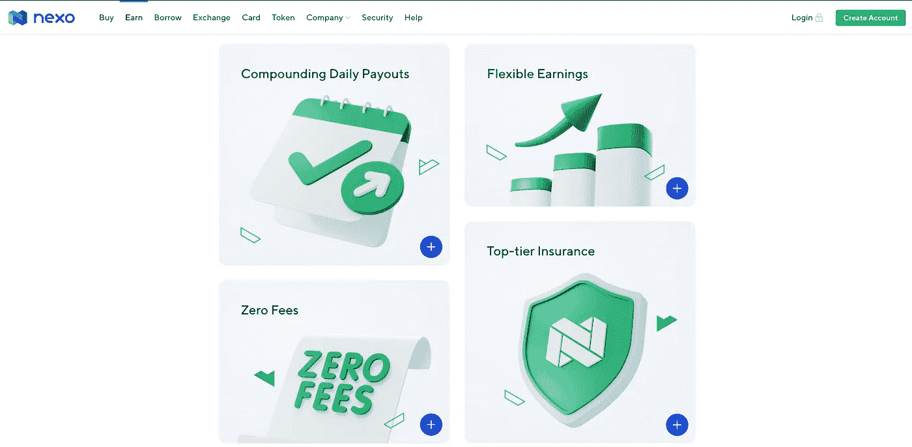

# Nexo 被动收入加密钱包

> 原文：<https://medium.com/coinmonks/nexo-passive-income-crypto-wallet-157a89622d61?source=collection_archive---------2----------------------->

Nexo is a crypto wallet where you can borrow against your own assets, earn passive income in the form of interest, cold storage “offline” wallet protection, and assets are heavily insured against loss.

如果你读过我的其他文章，你会知道我是 50-400% APR 的高产加密农场的大力支持者。那么，我为什么要把我的钱投资在年利率只有 5-12%的 Nexo 公司呢？让我告诉你为什么…

# “以实物支付”